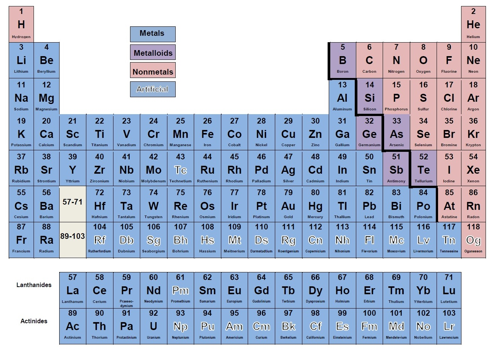

# Introduction to Metals and Non-metals

## Overview

Metals and non-metals are two main types of elements with very different properties. Metals are usually good conductors of electricity and heat because they have free-moving electrons. They can be hammered into sheets (malleability) or stretched into wires (ductility) and often have a shiny appearance. Most metals are solids at room temperature, like iron, copper, and gold, though mercury is an exception. Metals generally have high melting and boiling points and easily lose electrons to form positive ions (cations).

An alloy is a mixture of metal that has bulk metallic properties different from those of its constituent elements. Alloys can be formed by substituting one metal atom for another of similar size in the lattice (interstitial alloy) or by a combination of both.

Non-metals, on the other hand, are poor conductors of heat and electricity, are often brittle, and don't have a shiny appearance. They exist in different states, such as gases (like oxygen), solids (like carbon), and one liquid (bromine). Non-metals usually have lower melting and boiling points than metals.

**Metalloids** are elements that have properties between metals and non-metals. They are found along the staircase line on the periodic table. Understanding the differences between metals, non-metals, and metalloids helps explain their uses and behaviour in everyday life.

## Classification of Elements

### The 118 Chemical Elements

- There are **118 chemical elements** known at present
- Based on their properties, all these elements can be broadly divided into two main groups: **Metals and non-metals**

### Metals

- A **majority of the known elements are metals**
- All the metals are **solids**, except **mercury**, which is a liquid metal

### Non-metals

- Non-metals are **more abundant in nature than metals**
- For example:
  - **Oxygen and nitrogen** make up a large part of the atmosphere
  - **Carbon** is fundamental to life
- Non-metals exist in **all three states** at room temperature:
  - **Solid** (e.g., carbon, sulfur)
  - **Liquid** (e.g., bromine)
  - **Gas** (e.g., oxygen, nitrogen, chlorine)

## Position of Metals and Non-metals in the Periodic Table

### Location in the Periodic Table

- **Metals** are placed on the **left-hand side and in the centre** of the periodic table
- **Non-metals** are placed on the **right-hand side** of the periodic table
- **Hydrogen (H)** is an exception because it is a non-metal but is placed on the **left-hand side** of the periodic table

### Metalloids - The Middle Elements

- Metals and non-metals are separated from each other in the periodic table by a **zig-zag line**
- The elements along this zig-zag line show properties of both metals and non-metals
- These are called **metalloids** or **semi-metals**

**Examples of metalloids:**
- Boron (B)
- Silicon (Si)
- Germanium (Ge)
- Arsenic (As)
- Antimony (Sb)
- Tellurium (Te)
- Polonium (Po)

### Periodic Table Classification

*Figure: Position of metals, metalloids, and non-metals in the periodic table*

### Trends in Metallic Character

- In general, the **metallic character decreases** on going from left to right in the periodic table
- However, on going down the group, the **metallic character increases**
- The elements at the **extreme left** of the periodic table are **most metallic**
- Those on the **right** are **least metallic or non-metallic**

---

*Source: Cengage Chemistry Class 10, Pages 3-4*
