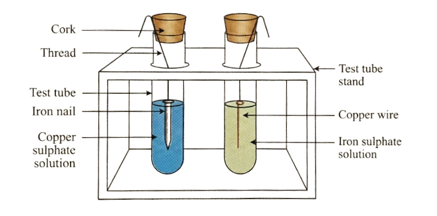

# Metals

## Table of Contents

- [Importance and Uses of Metals](#importance-and-uses-of-metals)
- [Occurrence of Metals in Nature](#occurrence-of-metals-in-nature)
- [Physical Properties of Metals](#physical-properties-of-metals)
  - [Physical State](#i-physical-state)
  - [Hardness](#ii-hardness)
  - [Malleability](#iii-malleability)
  - [Ductility](#iv-ductility)
  - [Electrical and Thermal Conductivity](#v-electrical-and-thermal-conductivity)
  - [Metallic Lustre](#vi-metallic-lustre)
  - [Density](#vii-density)
  - [Melting and Boiling Points](#viii-melting-and-boiling-points)
  - [Rigidity and Sonorosity](#ix-rigidity-and-sonorosity)
  - [Colour](#x-colour)
  - [Metallic Bond](#-insights-metallic-bond)
- [Chemical Properties of Metals](#22-chemical-properties-of-metals)
  - [Electropositive Nature](#electropositive-nature)
  - [Reaction with Oxygen](#a-reaction-with-oxygen)
  - [Reaction with Water](#b-reaction-with-water)
  - [Reaction with Acids](#c-reaction-of-metals-with-acids)
  - [Reaction with Salt Solutions](#d-reaction-of-metals-with-salt-solutions)
  - [Reaction with Metal Oxides](#e-reaction-of-metals-with-metal-oxides)
  - [Reaction with Chlorine](#f-reaction-of-metals-with-chlorine)
  - [Reaction with Hydrogen](#g-reaction-with-hydrogen)
- [Activity Series of Metals](#23-activity-series-of-metals)
- [Uses of Metals](#24-uses-of-metals)
- [Solved Examples](#-example-1)
- [Concept Application Exercise](#concept-application-exercise-1)

---

## Importance and Uses of Metals

Among all the elements, **metals are the most useful**. Most of the vessels and utensils are made up of aluminium, copper, brass, stainless steel, etc. Some of the metals, especially **iron**, are used to build tall dams, bridges, trains, and trucks, among other things.

### Strategic Metals

Metals such as **titanium, chromium, manganese and zirconium** have now become extremely important in strengthening the economy and defence of a country. They are widely used in:
- Nuclear energy projects
- Space projects
- Making jet engines
- High-quality steel

As a result of these factors, they have been recognized as **strategic metals**.

### Occurrence of Metals in Nature

Metals occur in nature in two ways:

| **In Free State** | **In Combined State** |
|-------------------|----------------------|
| Gold, platinum, silver, mercury, etc. | Sodium, calcium, potassium, aluminium, lead, copper, etc. |

**Insight:** 
- **Aluminium (Al)** is the most abundant metal and constitutes **8% of the earth's crust**
- **Iron (Fe)** is the second most abundant metal and constitutes about **5% of the earth's crust**

## Physical Properties of Metals

### (i) Physical State

- All metals (except **mercury**) are **solids** at room temperature
- **Gallium and caesium** have low melting points and occur as liquid above 30°C

### (ii) Hardness

- Most of the metals are **hard**, but not all metals are equally hard
- Metals such as iron, copper, aluminium, etc., are quite hard. They **cannot be cut with a knife**
- **Sodium and potassium** are common exceptions that are **soft and can be easily cut with a knife**

#### 🔬 Activity 1: Comparing Hardness of Different Metals

**Aim:** To compare the hardness of different metals

**Procedure:**
1. Take small pieces of iron, copper, aluminium, and magnesium
2. Try to cut these metals with a sharp knife and note down your observations
3. Hold a piece of sodium metal with a pair of tongs
   - (**Caution:** Always handle sodium metal with care)
4. Dry it by pressing between the folds of a filter paper
5. Put it on a watch-glass and try to cut it with a knife

**Observation:**
- (i) Iron, copper, aluminium and magnesium do not cut easily and the knife slides on the metal
- (ii) Sodium metal cuts easily with knife

**Conclusion:**
Metals are generally hard. The hardness varies from metal to metal.

### (iii) Malleability

- **Metals can be beaten with a hammer into very thin sheets without breaking**. This property of metals is called **malleability**
- **Gold and silver** are among the **best malleable metals**
- **Aluminium and copper** are also highly malleable metals
- All metals are not malleable

#### 🔬 Activity 2: Demonstrating Malleability

**Aim:** To demonstrate metals are malleable

**Procedure:**
1. Take pieces of iron, zinc, lead and copper
2. Place any one metal on a block of iron and strike it four or five times with a hammer
3. Repeat with other metals
4. Record the changes in the shape of these metals

**Observation:**
Some metals can be beaten into thin sheets and this property is called malleability.

### (iv) Ductility

- **Metals can be drawn (stretched) into thin wires**. This property of metals is called **ductility**
- **Gold and silver** are the **most ductile metals**. Copper, aluminium and tungsten are also very ductile, and therefore, these can be drawn into thin wires that are used in electrical wiring
- Metals like Na, K, Ca, etc., are not ductile, while metals like Sn, Pb, etc., are less ductile

### (v) Electrical and Thermal Conductivity

- Generally, **metals are good conductors of heat and electricity**. The ability of metals to allow electric current and heat to pass through them is called **electrical and thermal conductivity**, respectively
- **Silver** is the **best conductor of heat**. Copper and aluminium are next best conductors of heat, and therefore, they are used for making household utensils. **Lead** is the **poorest conductor of heat**. **Mercury** is a good conductor of heat
- Since silver is expensive, therefore, **copper and aluminium are commonly used for making electric wires**
- The electrical and thermal conductivities of metals are due to the **presence of free electrons in them**

#### 🔬 Activity 3: Metals are Good Conductors of Heat

**Aim:** To demonstrate metals are good conductors of heat and have high melting point

**Procedure:**
1. Take an aluminium or copper wire. Clamp this wire on a stand, as shown in figure
2. Fix a pin to the free end of the wire using wax
3. Heat the wire with a spirit lamp, candle or a burner near the place where it is clamped

*Figure: Experimental setup to demonstrate heat conductivity of metals*

**Observation:**
The pin attached to the wire falls down due to the melting of the wax, but the wire itself does not melt. This is because heat flows through the wire, causing it to expand and displace the pin, but the wire itself doesn't melt.

**Conclusion:**
Metals are good conductors of heat and have high melting point.

### (vi) Metallic Lustre

- The **shiny appearance of metals** is also known as **metallic lustre**. Most of the metals have metallic lustre, and they can be polished
- For example, gold, silver, and copper metals have metallic lustre
- When metal surface is exposed to environmental conditions, they undergo chemical reaction which results in loss of lustre and the process is called **corrosion**. Generally, metals regain their metallic lustre when their surface is brushed with either sandpaper or against some hard surface

### (vii) Density

- Most of the metals are **heavy and have high densities**. For example, the density of mercury metal is very high (13.6 g/cm³)
- The high density is due to the presence of **close packed structures** in which attractive forces exist between the atoms of metals
- However, **sodium, potassium, magnesium and aluminium have low densities**
- The densities of metals are generally proportional to their atomic masses
- **Osmium** has the **highest density** (22 g cm⁻³) among all elements

### (viii) Melting and Boiling Points

- Most of the metals (except sodium and potassium) have **high melting and boiling points** due to strong metallic bonds. For example, melting point of iron is 1538°C
- Among metals, **tungsten** has the **highest melting point** (3422°C) and **mercury** has the **lowest melting point** (−39°C)

### (ix) Rigidity and Sonorosity

- Most of the metals are **rigid**, and they have **high tensile strength**
- Most of the metals are **sonorous**, i.e., they **make a ringing sound when hit with an object**

### (x) Colour

- Usually **metals are white or silvery-grey in colour**
- But some metals have different colour for example, **gold is yellow** (yellow metal) and **copper is reddish brown**

---

### 💡 INSIGHTS: Metallic Bond

**Metallic bond** is a type of chemical bond which is formed by the electrostatic attractive force between conduction electrons (in the form of an electron cloud of delocalized electrons) and positively charged metal ions.

In a metal crystal, each atom in its crystal loses all its valence electrons. The electrons so obtained form an electron pool. The resulting positively charged metal ions are believed to be held together by the electron pool. The positively charged metal ions have a definite position in the crystal lattice of the metal. The valence electrons are not attached to any individual ions, they belong to the crystal as a whole and are free to move throughout the metal crystal.

*Figure: Metallic bonding showing metal ions (positive charges) and free electrons (sea of electrons)*

---

### ✍️ TEST YOURSELF

1. Give an example of a metal which:
   - (i) Is a liquid at room temperature
   - (ii) Is a poor conductor of heat
   - (iii) Can be easily cut with a knife

2. Define malleable and ductile

---

## 2.2 Chemical Properties of Metals

### Electropositive Nature

- In general, **metals are electropositive in nature**. They can lose one or more electrons present in the valence shell (subshells) of their atoms to form cations (positively charged ions). By doing so they achieve the electronic configuration of the nearest noble gas element

**General representation:**

\\[
\\text{M} \\longrightarrow \\text{M}^{n+} + ne^-
\\]
\\[
\\text{(Metal atom)}
\\]

**Example - Sodium:**

\\[
\\text{Na} \\longrightarrow \\text{Na}^{+} + e^-
\\]
\\[
\\text{(2, 8, 1)} \\quad \\text{(2, 8)}
\\]
\\[
\\text{(Sodium atom)} \\quad \\text{(Noble gas configuration of Neon)}
\\]

**Note:** **Caesium** is the **most electropositive element** known.

The different reactions of metals are discussed below:

---

## Chemical Reactions of Metals

### (A) Reaction with Oxygen

- Some metals react with oxygen quite **rapidly** at room temperature themselves; some react when heated while there are metals which react **only on prolonged heating**

**General Equation:**

\\[
\\text{Metal + Oxygen} \\longrightarrow \\text{Metal oxide (Basic in nature)}
\\]

Some examples of reaction of metals with oxygen are:

#### (i) Sodium and Potassium

**Sodium and potassium** react with oxygen at room temperature to form **basic oxides**.
- Na burns with **golden-yellow flame**
- K burns with a **pink-violet flame**

\\[
4\\text{Na} + \\text{O}_2 \\longrightarrow 2\\text{Na}_2\\text{O}
\\]

\\[
4\\text{K} + \\text{O}_2 \\longrightarrow 2\\text{K}_2\\text{O}
\\]

#### (ii) Magnesium

Magnesium does not combine with oxygen at room temperature. But when heated, it burns in oxygen with a **dazzling white light** and produces magnesium oxide.

\\[
2\\text{Mg} + \\text{O}_2 \\longrightarrow 2\\text{MgO}
\\]

Since magnesium reacts with oxygen less readily than sodium, **magnesium is less reactive than sodium**.

#### (iii) Zinc

Zinc reacts with oxygen only when **strongly heated** to form zinc oxide.

\\[
2\\text{Zn} + \\text{O}_2 \\longrightarrow 2\\text{ZnO}
\\]

Since zinc reacts with oxygen less readily than magnesium, **zinc is less reactive than magnesium**.

#### (iv) Copper

Copper does not react with oxygen, even with strong heating. It, however, reacts very slowly on prolonged heating, forming **cupric oxide**.

\\[
2\\text{Cu} + \\text{O}_2 \\longrightarrow 2\\text{CuO}
\\]

Since copper reacts with oxygen much less readily than zinc, **copper is less reactive than zinc**.

**Therefore, order of reactivity is:**

\\[
\\text{sodium} > \\text{magnesium} > \\text{zinc} > \\text{iron} > \\text{copper}
\\]

#### (v) Gold and Silver

**Ag and Au** do not react with O₂ even at high temperature.

---

#### Nature of Metal Oxides

- **Metal oxides** are generally **insoluble in water** but oxides of group 1 and 2 elements dissolve in water to form **alkalis (hydroxides)** and are hence called **basic oxides**

- Some metal oxides, such as **aluminium oxide, zinc oxide** show both **acidic as well as basic behaviour**. Such metal oxides which react with both acids as well as bases to produce salts and water are known as **amphoteric oxides**

Aluminium oxide reacts in the following manner with acids and bases:

\\[
\\text{Al}_2\\text{O}_3 + 6\\text{HCl} \\longrightarrow 2\\text{AlCl}_3 + 3\\text{H}_2\\text{O}
\\]

\\[
\\text{Al}_2\\text{O}_3 + 2\\text{NaOH} \\longrightarrow 2\\text{NaAlO}_2 + \\text{H}_2\\text{O}
\\]
\\[
\\text{(Sodium aluminate)}
\\]

---

### 💡 INSIGHTS: Anodizing

**Anodizing** is a process of forming a thick layer of oxide on a metal surface, making the metal more resistant to corrosion and wear and tear.

Aluminium develops a thin oxide layer when exposed to air. This aluminium oxide coat makes it resistant to further corrosion. The resistance can be improved further by making the oxide layer thicker. During anodizing, a clean aluminium article is made the anode and is electrolyzed with dilute sulphuric acid. The oxygen gas dyed at the anode reacts with aluminium to make a thicker protective oxide layer. This oxide layer can be dyed easily to give aluminium articles an attractive finish.

---

#### 🔬 Activity 4: Burning Magnesium Ribbon

**Aim:** To study the burning of magnesium ribbon in air to form oxide

**Procedure:**
1. Take a magnesium ribbon
2. Hold the magnesium ribbon with a pair of tongs and try to burn it over the flame
3. Collect the ashes formed in a China dish and dissolve them in hot water
4. Test the resultant solution with both red and blue litmus paper
5. Note down your observations

*Figure: Experimental setup for burning magnesium ribbon using tongs over a burner*

**Observation:**
Magnesium ribbon burns with a dazzling white light over the Bunsen burner. The ash collected when dissolved in water changed red litmus to blue.

**Conclusion:**
Most metal oxides produce basic solution when dissolved in water.

\\[
2\\text{Mg} + \\text{O}_2 \\longrightarrow 2\\text{MgO}
\\]

\\[
\\text{MgO} + \\text{H}_2\\text{O} \\longrightarrow \\text{Mg(OH)}_2
\\]

---

### (B) Reaction with Water

- Different metals react differently with water. Some metals react with water at ordinary temperature, some do only when heated, while some metals react with steam. In each case, **hydrogen gas is evolved**

Some examples of reaction of metals with water are:

#### (i) Sodium and Potassium - Most Reactive

**Metals such as sodium and potassium** react **violently** with water at ordinary temperature.

**General Equation (For more reactive metals):**

\\[
\\text{Metal + Water} \\longrightarrow \\text{Metal hydroxide + Hydrogen gas}
\\]

**Potassium:**

\\[
2\\text{K}(s) + 2\\text{H}_2\\text{O}(l) \\longrightarrow 2\\text{KOH}(aq) + \\text{H}_2(g)
\\]

**Sodium:**

\\[
2\\text{Na}(s) + 2\\text{H}_2\\text{O}(l) \\longrightarrow 2\\text{NaOH}(aq) + \\text{H}_2(g)
\\]

#### (ii) Calcium and Magnesium - Less Reactive

**Calcium** reacts with water **less violently** while **magnesium** reacts with water **only on heating**.

**Calcium:**

\\[
\\text{Ca}(s) + 2\\text{H}_2\\text{O}(l) \\longrightarrow \\text{Ca(OH)}_2(aq) + \\text{H}_2(g)
\\]

**Magnesium:**

\\[
\\text{Mg}(s) + 2\\text{H}_2\\text{O}(l) \\longrightarrow \\text{Mg(OH)}_2(aq) + \\text{H}_2(g)
\\]

---

### 💡 INSIGHTS: Sodium Reaction with Water

- **Freshly cut sodium** has a **metallic shine**. Within a few minutes, water vapour in the air causes a layer of sodium hydroxide to develop on the exposed surface
- The reaction is **strongly exothermic** and the piece of sodium melts (melting point of sodium = 98 °C)
- The heat transferred to the local environment ignites the hydrogen gas that is produced and the gas burns with a **bright flame**
- Therefore, **elemental sodium is stored in hexane** or a similar substance

**Why do Mg and Ca float?**
- Magnesium and calcium **float on surface of water** due to bubbles of H₂ gas stick on its surface

#### (iii) Iron, Aluminium, Zinc - React with Steam

**Metals such as iron, aluminium and zinc** do not react with cold water or hot water. They react with **steam**. When steam is passed over the heated metals, respective metal oxides and hydrogen gas are produced.

**General Equation (For less reactive metals):**

\\[
\\text{Metals + Water} \\longrightarrow \\text{Metal oxide + Hydrogen gas}
\\]

**Aluminium:**

\\[
2\\text{Al}(s) + 3\\text{H}_2\\text{O}(g) \\longrightarrow \\text{Al}_2\\text{O}_3(s) + 3\\text{H}_2(g)
\\]

**Zinc:**

\\[
\\text{Zn}(s) + 2\\text{H}_2\\text{O}(g) \\longrightarrow \\text{ZnO}(s) + \\text{H}_2(g)
\\]

**Iron:**

\\[
3\\text{Fe}(s) + 4\\text{H}_2\\text{O}(g) \\longrightarrow \\text{Fe}_3\\text{O}_4(s) + 4\\text{H}_2(g)
\\]

#### (iv) Copper, Mercury, Tin, Lead, Silver, Gold - No Reaction

**Metals such as copper, mercury and tin, lead, silver, gold** do not react with water either at ordinary temperature or at higher temperatures.

**Reactivity Order with Water:**

\\[
\\text{K} > \\text{Na} > \\text{Ca} > \\text{Mg} > \\text{Zn} > \\text{Fe} > \\text{Cu}
\\]

---

### (C) Reaction of Metals with Acids

- Metals usually react with acids to **displace hydrogen from acids**
- The **less reactive metals**, however, do not displace hydrogen from acids
- The rate of reaction between a metal and an acid **depends on the electropositivity of the metal**
- A **more electropositive metal** reacts with an acid **more rapidly** than does a less electropositive metal

**General Equation:**

\\[
\\text{Metal + Dilute mineral acid} \\longrightarrow \\text{Metal salt + hydrogen gas}
\\]

Some examples of reaction of metals with acids are:

#### (i) Sodium

Sodium reacts **vigorously** with dilute hydrochloric acid to form sodium chloride and hydrogen gas.

\\[
2\\text{Na} + 2\\text{HCl} \\longrightarrow 2\\text{NaCl} + \\text{H}_2
\\]

#### (ii) Magnesium

Magnesium reacts with dilute hydrochloric relatively quickly, but **much less than sodium**, to form magnesium chloride and hydrogen.

\\[
\\text{Mg} + 2\\text{HCl} \\longrightarrow \\text{MgCl}_2 + \\text{H}_2
\\]

This shows that **magnesium is less reactive than sodium**.

#### (iii) Zinc

Zinc reacts with dilute hydrochloric acid to produce zinc chloride and hydrogen, but the rate of this reaction is **slower than that of magnesium**. Hence, **zinc is less reactive than magnesium**.

\\[
\\text{Zn} + 2\\text{HCl} \\longrightarrow \\text{ZnCl}_2 + \\text{H}_2
\\]

#### (iv) Copper

Copper does **not react** with dilute hydrochloric acid.

\\[
\\text{Cu} + 2\\text{HCl} \\longrightarrow \\text{No reaction}
\\]

#### (v) Rate Depends on Nature of Acid

The rate of reaction of a metal with an acid also **depends on the nature of the acid**. Thus, **aluminium** reacts with dilute hydrochloric acid and dilute sulphuric acid at a reasonably fast rate. These acids are known as **strong acids**. On the other hand, aluminium reacts with **weak acids**, such as phosphoric acid, and acetic acid **very slowly**.

**With Hydrochloric acid (rapid):**

\\[
2\\text{Al} + 6\\text{HCl} \\longrightarrow 2\\text{AlCl}_3 + 3\\text{H}_2 \\text{ (rapid)}
\\]
\\[
\\text{Hydrochloric acid} \\quad \\text{Aluminium chloride}
\\]

**With Phosphoric acid (slow):**

\\[
2\\text{Al} + 2\\text{H}_3\\text{PO}_4 \\longrightarrow 2\\text{AlPO}_4 + 3\\text{H}_2 \\text{ (slow)}
\\]
\\[
\\text{Phosphoric acid} \\quad \\text{Aluminium phosphate}
\\]

**With Acetic acid (slow):**

\\[
2\\text{Al} + 6\\text{CH}_3\\text{COOH} \\longrightarrow 2\\text{Al(CH}_3\\text{COO)}_3 + 3\\text{H}_2 \\text{ (slow)}
\\]
\\[
\\text{Acetic acid} \\quad \\text{Aluminium acetate}
\\]

---

### Special Case: Reaction with Nitric Acid

**H₂ gas is not evolved** when a metal reacts with **nitric acid**. It is because HNO₃ is a **strong oxidizing agent**. It oxidizes H₂ produced in water, and itself gets reduced to any of the nitrogen oxide such as N₂O, NO, N₂O₃, N₂O₅.

---

### 💡 INSIGHTS: Aluminium Reaction with Dilute Acids

With aluminium, the reaction of dilute acids is **slow initially**, but afterwards it **becomes rapid** because initially a tough protective layer of aluminium oxide is present on the metal surface, which slows down the reaction. But afterwards, this layer is removed, and fresh metals react rapidly with dilute acids.

---

#### 🔬 Activity 5: Metals React Differently with Dilute HCl

**Aim:** To demonstrate different metals react differently with dilute hydrochloric acid

**Procedure:**
1. Collect metal samples of magnesium, zinc aluminium, iron and copper. If the samples are tarnished, rub them clean with sandpaper. **CAUTION:** Do not take sodium and potassium as they react vigorously even with cold water.
2. Put the samples separately in test tubes containing dilute hydrochloric acid
3. Suspend thermometers in the test tubes, so that their bulbs are dipped in the acid
4. Observe the rate of formation of bubbles carefully and note down your observations

**Observation:**
Rate of evolution of bubbles is not same in all the test tubes. The rate of formation of bubbles is the fastest in the case of magnesium. The reaction was also the most exothermic in this case. There is no evolution of bubbles in the test tube containing copper.

**Reactivity Order:**
The reactivity decreases in the order: **Mg > Al > Zn > Fe**

---

### 💡 INSIGHTS: Aqua-regia

**Aqua-regia** is a freshly prepared mixture of 1 part concentrated nitric acid and 3 parts concentrated hydrochloric acid. Thus, the ratio of conc. HNO₃ and conc. HCl in aqua-regia is **1 : 3**. Aqua-regia is a **highly corrosive, fuming liquid** (Corrosive means that it can cause corrosion).

Aqua-regia can **dissolve all metals**. For example, it can dissolve even **gold and platinum metals** (though concentrated nitric acid or concentrated hydrochloric acid alone cannot dissolve gold or platinum metals).

---

### (D) Reaction of Metals with Salt Solutions

- **More reactive metals** can **displace less reactive metals** from the aqueous solution of their salts. These reactions are known as **metal displacement reactions**

Some examples of metal displacement reactions are:

#### (i) Zinc Displaces Copper

When a strip of **zinc metal** is dipped into a solution of **copper sulphate**, the **blue colour** of the copper sulphate gradually disappears, and **metallic copper** is deposited on the strip of zinc.

\\[
\\text{Zn}(s) + \\text{CuSO}_4(aq) \\longrightarrow \\text{ZnSO}_4(aq) + \\text{Cu}(s)
\\]

*Figure: Before and After - Zinc strip in copper sulfate solution showing displacement reaction with copper deposit formation*

If we dip **gold or platinum** into a copper sulphate solution, **copper is not displaced**. This is because gold and platinum are **less electropositive (or less reactive)** than copper.

#### (ii) Iron Displaces Copper

When a piece of **iron** is dipped in a **copper sulphate solution**, the blue colour of the solution fades slowly, while a **red precipitate of copper** is deposited on the iron piece. Due to the formation of FeSO₄, the solution becomes **greenish**.

\\[
\\text{Fe}(s) + \\text{CuSO}_4(aq) \\longrightarrow \\text{FeSO}_4(aq) + \\text{Cu}(s)
\\]

---

#### 🔬 Activity 6: Iron is More Reactive than Copper

**Aim:** To demonstrate iron is more reactive than copper

**Procedure:**
1. Take a clean wire of copper and an iron nail
2. Put the copper wire in a solution of iron sulphate and the iron nail in a solution of copper sulphate taken in test tubes
3. Record your observations after 20 minutes

*Figure: Experimental setup showing copper wire in iron sulphate and iron nail in copper sulphate*

**Observation:**
Reaction occurs in the test tube containing iron nail dipped in CuSO₄ solution. The light blue colour of the copper sulphate solution turns green due to the formation of FeSO₄. Moreover, a brown deposit of copper takes place on iron nail.

\\[
\\text{Fe}(s) + \\text{CuSO}_4(aq) \\longrightarrow \\text{FeSO}_4(aq) + \\text{Cu}(s)
\\]

**Conclusion:**
Iron is more reactive than copper and displaces copper from copper sulphate solution. **In general, a more reactive metal displaces a less reactive metal from its salt solution.**

---

#### (iii) Copper Displaces Silver

When a strip of **copper** is dipped in a solution of **silver nitrate**, the colourless solution gradually turns **blue**. This is because copper, being more electropositive (or more reactive), **displaces silver** from silver nitrate. Silver, thus displaced, is deposited on a copper strip.

\\[
\\text{Cu}(s) + 2\\text{AgNO}_3(aq) \\longrightarrow \\text{Cu(NO}_3)_2(aq) + 2\\text{Ag}(s)
\\]

This reaction shows that **copper is more reactive than silver**.

---

### (E) Reaction of Metals with Metal Oxides

- A **more electropositive metal** can displace a **less electropositive metal** from its oxide
- For example, when **cupric oxide (CuO)** is heated with **magnesium powder**, magnesium oxide is formed, and copper is set free

\\[
\\text{CuO} + \\text{Mg} \\longrightarrow \\text{MgO} + \\text{Cu}
\\]

This is because **magnesium is more electropositive (or more reactive) than copper**.

---

### (F) Reaction of Metals with Chlorine

- Metals combine with chlorine to produce **ionic chlorides** of metals. Metal chlorides are usually solid and conduct electricity in solution or molten state

- In this reaction, the **metal atoms lose electrons** and become **positively charged ions**. On the other hand, **chlorine atoms receive electrons** and become **negatively charged ions (Cl⁻)**

- **Reactive metals** such as sodium and magnesium react with chlorine at room temperature whereas **less reactive metals** such as zinc and iron combine with chlorine on heating

\\[
2\\text{Na}(s) + \\text{Cl}_2(g) \\longrightarrow 2\\text{NaCl}(s)
\\]

\\[
\\text{Mg}(s) + \\text{Cl}_2(g) \\longrightarrow \\text{MgCl}_2(s)
\\]

\\[
\\text{Zn}(s) + \\text{Cl}_2(g) \\longrightarrow \\text{ZnCl}_2(s)
\\]

---

### (G) Reaction with Hydrogen

- **Not all metals** combine with hydrogen

- Some **reactive metals**, such as **lithium, sodium, potassium, and calcium**, react with hydrogen to **form the hydrides of metals**

\\[
2\\text{Li} + \\text{H}_2 \\longrightarrow 2\\text{LiH}
\\]

\\[
2\\text{Na} + \\text{H}_2 \\longrightarrow 2\\text{NaH}
\\]

\\[
\\text{Ca} + \\text{H}_2 \\longrightarrow \\text{CaH}_2
\\]

- These hydrides are **ionic compounds** in which hydrogen is present as a **hydride ion (H⁻)**

---

## 2.3 Activity Series of Metals

### Introduction to Reactivity Series

- The **reactivity of metals** differs from metal to metal. Some of the metals are **more reactive**, while others are **less reactive towards chemical reagents**

- Metals that can **lose electrons easily** and form positively charged ions are **more reactive**, and those that **cannot lose electrons easily are less reactive**

- Metals can be **arranged in the order of decreasing reactivity** in a series. This series is called the **activity or reactivity series of metals**. This series has been derived after studying many chemical reactions

- It should be noted that **metals above hydrogen** in activity series can **displace hydrogen from acids** but **metal below hydrogen cannot do so**

### The Activity Series

**Higher the metal in the series, greater is its tendency to form ions in solution.**

The series also shows which metal will displace the other in a solution. **Metals placed above will displace the metals placed below them.**

| **Metal** | **Symbols** | **Reactivity** |
|-----------|------------|----------------|
| **Lithium** | Li | |
| **Potassium** | K | |
| **Barium** | Ba | React vigorously with acidic solutions to give H₂ |
| **Sodium** | Na | |
| **Calcium** | Ca | |
| **Magnesium** | Mg | |
| **Aluminium** | Al | |
| **Zinc** | Zn | |
| **Chromium** | Cr | |
| **Iron** | Fe | React with acid to give H₂ |
| **Cadmium** | Cd | |
| **Cobalt** | Co | |
| **Nickel** | Ni | |
| **Tin** | Sn | |
| **Lead** | Pb | |
| **Hydrogen** | H | **↓ Reactivity decreases** |
| **Copper** | Cu | |
| **Mercury** | Hg | Do not react with acids to give H₂ |
| **Silver** | Ag | |
| **Gold** | Au | |
| **Platinum** | Pt | |

*Figure: Activity series of metals*

---

### 💡 INSIGHTS: Hydrogen in the Activity Series

- **Hydrogen, being a non-metal**, has been included in the activity series. It is because hydrogen, like metals, can part with its electron to form a positive ion or cation

- Metals at the **top of the activity series** are **very reactive** and therefore, they **do not occur free in nature**. The metals at the **bottom of the series** are **least reactive** and therefore, they **normally occur free in nature**

---

### ✍️ TEST YOURSELF

**3.** Copper vessels are generally cleaned with lemon or tamarind juice. Explain why these sour substances are effective in cleaning the vessels.

**4.** Samples of four metals A, B, C and D were taken and added to the following solution one by one. The results obtained have been tabulated as follows:

---

### Reactivity Table Exercise

The following table shows the results when four metals (A, B, C, D) are tested with different salt solutions:

| **Metal** | **Iron(II) sulphate** | **Copper(II) sulphate** | **Zinc sulphate** | **Silver nitrate** |
|-----------|----------------------|------------------------|-------------------|-------------------|
| **A** | No reaction | Displacement | | |
| **B** | Displacement | | No reaction | |
| **C** | No reaction | No reaction | No reaction | Displacement |
| **D** | No reaction | No reaction | No reaction | No reaction |

**Questions:**
1. Which is the most reactive metal?
2. What would you observe if B is added to a solution of copper(II) sulphate?
3. Arrange the metals A, B, C and D in the order of decreasing reactivity.

---

## 2.4 Uses of Metals

Metals have a wide variety of applications in daily life and industry:

**(i) Mercury**
- Used in thermometers, barometers, and to prepare amalgams

**(ii) Gold, Platinum and Silver**
- Used for making jewellery

**(iii) Zinc**
- Used for galvanizing iron to protect it from rusting
- Used for making alloys

**(iv) Platinum**
- Used to make electrodes and crucibles
- Also used in making jewellery

**(v) Iron**
- Used in making machines, heavy-duty parts, factory equipment, utensils, and for construction purposes

**(vi) Copper**
- Used in making electric wires, cables, utensils, boilers, calorimeters, coins, statues, electroplating, and in alloys

**(vii) Aluminium**
- Used in making electric wires, cables, utensils, wrapping materials, aeroplanes, ships, cars, buses, trains, and thermite process

**(viii) Biological Role**
- Some metals play an important role in the functioning of living systems in animals and human beings
- **Iron** is a constituent of haemoglobin in the blood which carries oxygen to various parts of the body
- **Copper and zinc** are constituents of enzymes
- **Sodium and potassium** take part in electrical activity in nerves and in the contraction of muscles

**(ix) Zinc**
- Used in making dry cells

**(x) Lead**
- Used in making automobile batteries, bullets, protective screens for X-rays, and sanitary fittings

---

### 📝 Example 1

**Question:** Name two metals which will displace hydrogen from dilute acids, and two metals which will not.

**Solution:**

Metals that are **more reactive than hydrogen** can displace hydrogen from dilute acids.

**Metals that will displace hydrogen from dilute acids:**
- **(i)** Zinc (Zn)
- **(ii)** Magnesium (Mg)

**Metals that will not displace hydrogen from dilute acids:**
- **(i)** Copper (Cu)
- **(ii)** Silver (Ag)

Copper and silver are **less reactive than hydrogen**, and hence, they **cannot displace hydrogen from dilute acids**. These metals do not react with dilute acids under normal conditions.

---

### 📝 Example 2

**Question:** You are given a hammer, a battery, a bulb, wires, and a switch. How could you use them to distinguish between samples of metals and non-metals?

**Solution:**

To distinguish between samples of metals and non-metals, we can perform two simple tests:

**(i) Test with a hammer (Malleability Test):**
- If the sample can be beaten into thin sheets without breaking, it is **malleable and hence a metal**
- If the sample breaks or shatters, it is **not malleable** and is likely a **non-metal**

**(ii) Test with the battery, bulb, wires, and switch (Conductivity Test):**
- Set up an electric circuit with the battery, bulb, wires, and switch
- Connect the sample into the circuit to test its ability to conduct electricity
- If the bulb **lights up**, the sample is a **good conductor of electricity**, indicating it is a **metal**
- If the bulb **does not light up**, the sample is a **poor conductor**, suggesting it is a **non-metal**

The conductivity test is highly effective since almost all metals are good conductors of electricity due to the presence of free electrons.

---

### 📝 Example 3

**Question:** Copper sulphate was placed in an aluminium can. After a few days, holes appeared in the can. Explain this observation.

**Solution:**

The holes appeared in the aluminium can due to a **displacement reaction**. **Aluminium is more reactive than copper**, so it displaces copper from the copper sulphate solution. The reaction is:

\\[
2\\text{Al} + 3\\text{CuSO}_4 \\longrightarrow \\text{Al}_2(\\text{SO}_4)_3 + 3\\text{Cu}
\\]

In this process, aluminium reacts with copper sulphate to form aluminium sulphate and copper metal. As aluminium gets used up in the reaction, **holes develop in the can**.

---

## CONCEPT APPLICATION EXERCISE 1

### Multiple Choice Questions

**1. Which of the following properties is not a characteristic of metals?**

(1) Metallic lustre  
(2) High density  
(3) Hardness  
(4) Low melting and boiling point

**2. Reactivity of zinc is __________ than that of hydrogen.**

(1) Less  
(2) more  
(3) equal  
(4) Sometimes more sometimes less

**3. When sodium reacts with cold water, the product formed will be**

(1) Na₂O  
(2) NaOH  
(3) Na₂CO₃  
(4) All of these

**4. What is the decreasing order of reactivity of the following metals?**  
Na, Al, K, Cu, Ag, Fe

(1) Na > K > Al > Cu > Ag > Fe  
(2) K > Na > Al > Cu > Fe > Ag  
(3) K > Na > Al > Fe > Ag > Cu  
(4) K > Na > Al > Fe > Ag > Cu

**5. Zn + H₂O (Steam) → A + B**

In the above equation, products (A) and (B) are

(1) Zn and H₂  
(2) ZnH₂ and O₂  
(3) ZnO₂ and O₂  
(4) ZnO and H₂

**6. On addition of which metal, copper sulphate solution (blue colour) will be changed to colourless solution?**

(1) Fe  
(2) Ag  
(3) Zn  
(4) Hg

**7. When a metal is added to a dilute HCl solution, there is no evolution of gas. Metal is**

(1) K  
(2) Ag  
(3) Na  
(4) Zn

**8. Which of the following metals reacts vigorously with oxygen?**

(1) Zinc  
(2) Magnesium  
(3) Sodium  
(4) Copper

**9. A metal which can displace hydrogen from boiling water and steam, but not cold water is**

(1) Al  
(2) Na  
(3) Mg  
(4) Fe

**10. Most abundant metal on the surface of the earth is**

(1) Iron  
(2) Aluminium  
(3) Calcium  
(4) Sodium

**Answer the following riddles: Q.11 and Q.12.**

**11. I am a list where strength is key,**  
Some of us react, some watch silently.  
At the top, we fizz with acid and flame,  
At the bottom, we barely join the game.  
Water makes the strongest of us dance,  
But the weakest won't give it a glance.  
We decide who'll replace who in a fight,  
Shuffling partners with all our might.  
What am I, this metal-filled crew?  
Where some are fierce, and others few.

**12. I carry power through every wire,**  
In coins and pipes, I never tire.  
In kitchens, I make pots gleam bright,  
And roofs I cover, weathering each fight.  
I'm reddish-brown, a sight to see,  
What am I, used daily by thee?

(1) Copper  
(2) Chromium  
(3) Iron  
(4) Gallium

**13. Match the column I with column II.**

| | **Column I** | | **Column II** |
|---|-------------|---|--------------|
| A. | Gold | (i) | Thermometers |
| B. | Iron | (ii) | Electric wire |
| C. | Aluminium | (iii) | Wrapping food |
| D. | Carbon | (iv) | Jewellery |
| E. | Copper | (v) | Machinery |
| F. | Mercury | (vi) | Fuel |

(1) A → (ii), B → (iv), C → (iii), D → (v), E → (i), F → (vi)  
(2) A → (iv), B → (v), C → (iii), D → (vi), E → (ii), F → (i)  
(3) A → (iii), B → (v), C → (i), D → (vi), E → (iv), F → (ii)  
(4) A → (iv), B → (vi), C → (iii), D → (i), E → (ii), F → (v)

**14. Solve the given crossword.**

**Across:**

4. Metal atoms lose electrons and form positively charged ions. Hence, they are __________ in nature.
5. The best conductor of heat
6. Most reactive element in the activity series

**Down:**

1. Metal that constitutes 8% of the earth's crust
2. Metal found in free state and used for jewellery making
3. Metals can be drawn into thin wires; hence, they are __________.

---

## SOLUTIONS - CONCEPT APPLICATION EXERCISE 1

**1. Answer: (4) Low melting and boiling point**

**Explanation:** Metals generally have **high melting and boiling points** due to strong metallic bonds. Low melting and boiling point is NOT a characteristic of metals. The other three options (metallic lustre, high density, and hardness) are all typical characteristics of metals.

---

**2. Answer: (2) more**

**Explanation:** Zinc is **more reactive than hydrogen** in the activity series. Metals placed above hydrogen in the activity series can displace hydrogen from dilute acids, and zinc does react with dilute acids to produce hydrogen gas.

---

**3. Answer: (2) NaOH**

**Explanation:** When sodium reacts with cold water, it forms sodium hydroxide (NaOH) and hydrogen gas:

\\[
2\\text{Na} + 2\\text{H}_2\\text{O} \\longrightarrow 2\\text{NaOH} + \\text{H}_2
\\]

The reaction is highly exothermic and vigorous.

---

**4. Answer: (4) K > Na > Al > Fe > Ag > Cu**

**Explanation:** The correct decreasing order of reactivity based on the activity series is:
- **Potassium (K)** - Most reactive
- **Sodium (Na)** 
- **Aluminium (Al)**
- **Iron (Fe)**
- **Silver (Ag)**
- **Copper (Cu)** - Least reactive

---

**5. Answer: (4) ZnO and H₂**

**Explanation:** When zinc reacts with steam (water vapor), it produces zinc oxide and hydrogen gas:

\\[
\\text{Zn} + \\text{H}_2\\text{O (steam)} \\longrightarrow \\text{ZnO} + \\text{H}_2
\\]

Therefore, A = ZnO and B = H₂

---

**6. Answer: (3) Zn**

**Explanation:** Zinc is more reactive than copper and will displace copper from copper sulphate solution. When zinc is added:

\\[
\\text{Zn} + \\text{CuSO}_4 \\longrightarrow \\text{ZnSO}_4 + \\text{Cu}
\\]

The blue colour (due to Cu²⁺ ions) disappears as copper is displaced and zinc sulphate (colourless) is formed.

---

**7. Answer: (2) Ag**

**Explanation:** **Silver (Ag)** is less reactive than hydrogen and is placed below hydrogen in the activity series. Therefore, it **cannot displace hydrogen** from dilute HCl, and no gas evolution occurs. Metals like K, Na, and Zn are all above hydrogen and would react with HCl to produce H₂ gas.

---

**8. Answer: (3) Sodium**

**Explanation:** **Sodium** is highly reactive and reacts **vigorously with oxygen** even at room temperature, burning with a golden-yellow flame. Zinc requires strong heating, magnesium burns when heated, and copper reacts very slowly even on prolonged heating.

---

**9. Answer: (3) Mg**

**Explanation:** **Magnesium** can displace hydrogen from:
- **Boiling water** - reacts slowly
- **Steam** - reacts readily
- **But NOT cold water** - does not react

This is because magnesium is moderately reactive. Aluminium (Al) does not react with boiling water; Sodium (Na) reacts violently with cold water; Iron (Fe) only reacts with steam.

---

**10. Answer: (2) Aluminium**

**Explanation:** **Aluminium** is the most abundant metal on the earth's surface, constituting about **8% of the earth's crust**. Iron is the second most abundant metal (about 5%).

---

**11. Answer: Activity Series of Metals (or Reactivity Series)**

**Explanation:** The riddle describes the **Activity Series of Metals**:
- "Strength is key" - refers to reactivity
- "At the top, we fizz with acid and flame" - highly reactive metals
- "At the bottom, we barely join the game" - least reactive metals
- "We decide who'll replace who in a fight" - displacement reactions
- "Shuffling partners" - more reactive metals displace less reactive ones

---

**12. Answer: (1) Copper**

**Explanation:** The riddle describes **Copper**:
- "I carry power through every wire" - copper wires for electricity
- "In coins and pipes" - copper coins and plumbing
- "In kitchens, I make pots gleam bright" - copper utensils
- "Roofs I cover" - copper roofing
- "I'm reddish-brown" - characteristic colour of copper

---

**13. Answer: (2) A → (iv), B → (v), C → (iii), D → (vi), E → (ii), F → (i)**

**Explanation:** Correct matching:
- **A. Gold** → **(iv) Jewellery**
- **B. Iron** → **(v) Machinery**
- **C. Aluminium** → **(iii) Wrapping food** (aluminium foil)
- **D. Carbon** → **(vi) Fuel**
- **E. Copper** → **(ii) Electric wire**
- **F. Mercury** → **(i) Thermometers**

---

**14. Crossword Solutions:**

**Across:**
- **4. ELECTROPOSITIVE** - Metals lose electrons and form positive ions
- **5. SILVER** - Best conductor of heat
- **6. POTASSIUM** (or LITHIUM) - Most reactive element in the activity series

**Down:**
- **1. ALUMINIUM** - Constitutes 8% of the earth's crust
- **2. GOLD** (or SILVER/PLATINUM) - Found in free state, used for jewellery
- **3. DUCTILE** - Property of being drawn into thin wires

---

*Source: Cengage Chemistry Class 10, Pages 4-18*
