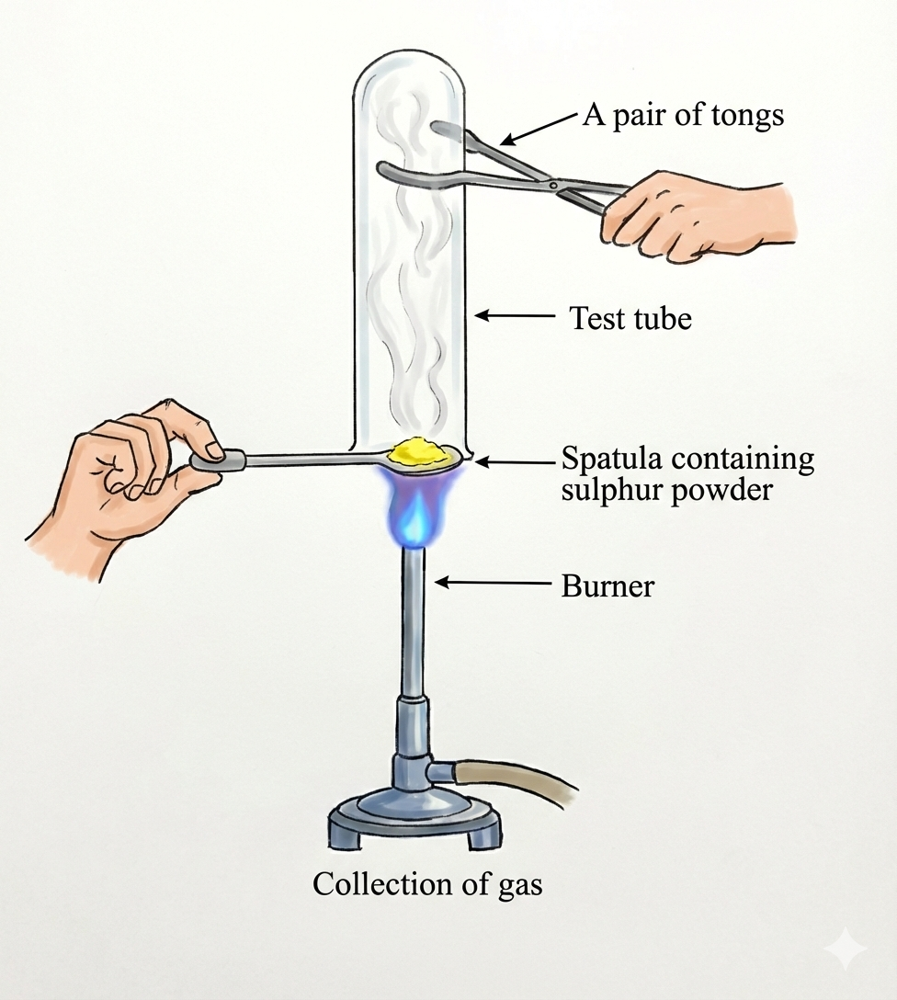

# Non-metals

## Occurrence of Non-metals

| **S.No.** | **Non-metals** | **Free state** | **Combined state** |
|-----------|----------------|----------------|-------------------|
| 1. | Oxygen | Air (21%) | Water, earth's crust |
| 2. | Nitrogen | Air (78%) | Animal and plant kingdom, nitre, Chile salt Petre |
| 3. | Hydrogen | Coal gas | Water, cells of plants and animals, natural gas, petroleum, coal |
| 4. | Phosphorus | - | Rocks, bones, teeth, blood |
| 5. | Carbon | Diamond, graphite, coal | Air (0.03%), natural gas, marsh gas, rocks |
| 6. | Sulphur | Rocks near active and dormant volcanoes | Metallic ores |
| 7. | Silicon | - | Sand, flint, quartz, mica, feldspar |

---

### 💡 INSIGHTS: Allotropes of Carbon

**Carbon** is a non-metal that can exist in different forms. Each form is called an **allotrope**. **Diamond, fullerene and graphite** are allotropes of carbon.

*Figure: Three main allotropes of carbon showing different structural arrangements*  
*Image source: [Wikimedia Commons](https://commons.wikimedia.org/wiki/File:Eight_Allotropes_of_Carbon.png) - CC BY-SA 3.0*

**Download Instructions:** 
1. Visit: https://commons.wikimedia.org/wiki/File:Eight_Allotropes_of_Carbon.png
2. Download high-resolution version
3. Save as: `class10/chem_cengage/3-metals-and-non-metals/images/mnm-fig9-carbon-allotropes.png`

---

## 3.1 Physical Properties of Non-metals

| **Property** | **Description** |
|--------------|-----------------|
| **(i) Physical state** | Non-metals may be **solid, liquid, or gases** at room temperature. **Solids:** Carbon, sulphur, iodine, etc. **Gases:** Oxygen, hydrogen, nitrogen, etc. **Liquids:** Bromine     *Examples of non-metals in different states: Sulfur (solid), Iodine (solid), Bromine (liquid)* *Sources: [Sulfur](https://commons.wikimedia.org/wiki/File:Sulfur_sample.jpg), [Iodine](https://commons.wikimedia.org/wiki/File:Iodine_crystals.jpg), [Bromine](https://commons.wikimedia.org/wiki/File:Bromine_vial_in_acrylic_cube.jpg) - CC BY-SA 3.0* |
| **(ii) Hardness** | Non-metals are generally **soft**. **Exception:** Diamond is the **hardest natural substance** known. |
| **(iii) Malleability** | Non-metals are **not malleable**, i.e., sheets cannot be made from them. |
| **(iv) Ductility** | Non-metals are **not ductile**, i.e., they cannot be drawn (stretched) into thin wires. |
| **(v) Electrical and thermal conductivity** | Non-metals are **bad conductors** of heat and electricity. **Exception:** Graphite is a **good conductor** because of the presence of free electrons.   *Graphite structure with free electrons between layers ([Wikimedia Commons](https://commons.wikimedia.org/wiki/File:Graphite-layers-side-3D-balls.png) - Public Domain)* **Download:** Save as `mnm-fig10-graphite-structure.png` |
| **(vi) Lustre** | Non-metals are **not lustrous** and cannot be polished. **Exception:** Iodine is a **lustrous non-metal**. |
| **(vii) Density** | Non-metals have **low density**. **Exception:** Iodine has high density and diamond which is almost as heavy as Al |
| **(viii) Melting and boiling points** | Non-metals have **low melting and boiling points**. **Exception:** Graphite, another allotropic form of carbon, has a melting point of about 3730°C. Other exceptions are C, B, Si which have high melting and boiling points. |
| **(ix) Tensile strength** | Non-metals have **low tensile strength**. **Exception:** Carbon fiber is as tensile as steel. |
| **(x) Sonorosity** | Non-metals are **non-sonorous**, i.e., when stuck with a hammer they do not produce sound. |
| **(xi) Colour** | Chlorine is a greenish-yellow gas, while bromine is brown in colour. Iodine is violet in colour, while oxygen and nitrogen are colourless gases. Phosphorus is white, red or black. |

---

## 3.2 Chemical Properties of Non-metals

### (A) Reaction with Oxygen

**Non-metals combine with oxygen to form acidic oxides.** Some of these oxides dissolve in water to produce acids.

**General Equations:**

\\[
\\text{Non-metal + Oxygen} \\longrightarrow \\text{Non-metallic oxide}
\\]

\\[
\\text{Non-metallic oxide + Water} \\longrightarrow \\text{Acid}
\\]

**Some examples are as follows:**

**(i) Carbon + Oxygen → Carbon dioxide**

\\[
\\text{C} + \\text{O}_2 \\longrightarrow \\text{CO}_2
\\]

\\[
\\text{CO}_2 + \\text{H}_2\\text{O} \\longrightarrow \\text{H}_2\\text{CO}_3
\\]
\\[
\\text{Carbonic acid}
\\]

**(ii) Sulphur + Oxygen → Sulphur dioxide**

\\[
\\text{S} + \\text{O}_2 \\longrightarrow \\text{SO}_2
\\]

\\[
\\text{SO}_2 + \\text{H}_2\\text{O} \\longrightarrow \\text{H}_2\\text{SO}_3
\\]
\\[
\\text{Sulphurous acid}
\\]

**(iii) Phosphorus + Oxygen → Phosphorus pentoxide**

\\[
\\text{P}_4 + 5\\text{O}_2 \\longrightarrow 2\\text{P}_2\\text{O}_5
\\]

\\[
\\text{P}_2\\text{O}_5 + 3\\text{H}_2\\text{O} \\longrightarrow 2\\text{H}_3\\text{PO}_4
\\]
\\[
\\text{Phosphoric acid}
\\]

**Note:** Other oxides, such as **carbon monoxide (CO)** and **nitrous oxide (N₂O)** are **neutral in nature**.

---

### (B) Reaction with Acids

**Unlike metals, non-metals do not react with acids to liberate hydrogen gas.** However, **concentrated nitric acid** reacts with carbon (coke), sulphur and phosphorus as it is a **powerful oxidizing agent** and oxidizes the non-metals as shown below:

\\[
\\text{C} + 4\\text{HNO}_3(\\text{conc.}) \\longrightarrow \\text{CO}_2 + \\text{H}_2\\text{O} + 4\\text{NO}_2
\\]

\\[
\\text{S} + 6\\text{HNO}_3(\\text{conc.}) \\longrightarrow \\text{H}_2\\text{SO}_4 + 2\\text{H}_2\\text{O} + 6\\text{NO}_2
\\]

\\[
\\text{P} + 5\\text{HNO}_3(\\text{conc.}) \\xrightarrow{\\text{heat}} \\text{H}_3\\text{PO}_4 + 5\\text{NO}_2 + \\text{H}_2\\text{O}
\\]

---

### (C) Reaction with Chlorine

**Non-metals react with chlorine to form chlorides.** The chlorides formed are **covalent in nature** and generally exist as **gases or liquids** at room temperature. For example,

**(i) Phosphorus reacts with chlorine to form phosphorus trichloride.**

\\[
\\text{P}_4(s) + 6\\text{Cl}_2(g) \\longrightarrow 4\\text{PCl}_3(g)
\\]

**(ii) Hydrogen reacts with chlorine to produce hydrogen chloride.**

\\[
\\text{H}_2(g) + \\text{Cl}_2(g) \\longrightarrow 2\\text{HCl}(g)
\\]

---

### (D) Reaction with Hydrogen

**Non-metals combine with hydrogen to form covalent hydrides.** Here are some examples:

**(i) Sulphur combines with hydrogen at 440°C to form hydrogen sulphide gas.**

\\[
\\text{H}_2(g) + \\text{S}(s) \\longrightarrow \\text{H}_2\\text{S}(g)
\\]

**(ii) Nitrogen combines with hydrogen at about 500°C in the presence of iron catalyst to form ammonia. The reaction is of reversible nature.**

\\[
\\text{N}_2(g) + 3\\text{H}_2(g) \\rightleftharpoons 2\\text{NH}_3(g)
\\]
\\[
\\text{Ammonia}
\\]

**Non-metal hydrides are covalent in nature** because non-metals cannot provide electrons to hydrogen atoms to produce hydride ions (H⁻). Due to the non-existence of ions, **non-metallic hydrides are bad conductors of electricity**.

---

### (E) Reaction with Water

**Generally, non-metals do not react with water or steam.** This is because non-metals cannot give electrons to reduce hydrogen ions in water into hydrogen gas. For example,

\\[
\\text{S} + \\text{H}_2\\text{O} \\longrightarrow \\text{No reaction}
\\]
\\[
\\text{Sulphur} \\quad \\text{Water}
\\]

\\[
\\text{C} + \\text{H}_2\\text{O} \\longrightarrow \\text{No reaction}
\\]
\\[
\\text{Coke} \\quad \\text{Water}
\\]

---

### 💡 INSIGHTS

- **Coke is the purest form of carbon.**

- **Pure phosphorus exists in several forms called allotropes.** The different allotropes of phosphorus are white, red, violet, and black phosphorus. All the allotropes have **different physical properties**.

- By passing steam over red-hot coke at 1270 K in the presence of Ni as a **catalyst, hydrogen gas is formed** along with carbon monoxide.

\\[
\\text{C} + \\text{H}_2\\text{O} \\xrightarrow[\\text{Ni/Pt/Pd}]{1270\\text{ K}} \\text{CO} + \\text{H}_2
\\]
\\[
\\text{Coke} \\quad \\text{Steam} \\quad \\quad \\quad \\quad \\text{Water gas}
\\]

The mixture of CO + H₂ is called **water gas, synthesis gas, or syn gas**.

---

### ✍️ TEST YOURSELF

**5.** Do all non-metals exist in two states–solids and gases only?

**6.** What type of oxides are formed when non-metals react with oxygen?

---

## Comparison of Chemical Properties of Metals and Non-metals

| **S.No.** | **Metals** | **Non-metals** |
|-----------|------------|----------------|
| **1.** | Metals lose electrons and form +ve ions. Na → Na⁺ + e⁻ They are **electropositive elements**. | Non-metals gain electrons and form −ve ions. Cl + e⁻ → Cl⁻ They are **electronegative elements**. |
| **2.** | Metals combine with oxygen and form **basic oxides**. 2Mg(s) + O₂(g) → 2MgO(s) | Non-metals combine with oxygen and form **acidic oxides or neutral oxides**. C(s) + O₂(g) → CO₂(g) |
| **3.** | **Basic oxides + Water → Bases** Na₂O(s) + H₂O(l) → 2NaOH(aq) *Sodium hydroxide*  In litmus test, the bases formed turn red litmus paper blue. | **Acidic oxides + Water → Acids** CO₂(g) + H₂O(l) → H₂CO₃(aq) *Carbonic acid*  In litmus test, the acids formed turn blue litmus red. |
| **4.** | **Reaction with water** (i) Na and K react violently with cold water. Evolved H₂ gas catches fire. 2K(s) + 2H₂O(l) → 2KOH(aq) + H₂(g) 2Na(s) + 2H₂O(l) → 2NaOH(aq) + H₂(g)  (ii) Magnesium reacts with hot water. Mg(s) + 2H₂O(l) → Mg(OH)₂(aq) + H₂(g) | (i) Generally, **non-metals do not react with water or steam** but their acidic oxides dissolve in water to produce acids. For example, aqueous solution of carbon dioxide (CO₂) and sulphur dioxide (SO₂) turn blue litmus to red. CO₂(g) + H₂O(l) → H₂CO₃(aq) SO₂(g) + H₂O(l) → H₂SO₃(aq)  (ii) Aqueous solution of **neutral oxides** like CO and N₂O show no change with litmus paper. |
| **5.** | **Reaction with acids** Metals generally react with dil. HCl and H₂SO₄ to liberate H₂ gas. Metal + dil. acid → Salt + Hydrogen | Non-metals **do not displace H₂ from acids** because they are **electron acceptors**, and they **cannot supply electron to hydrogen**. |
| **6.** | **Reaction with chlorine** Metals react with Cl₂ to form **ionic chlorides**. Metals are **electron donors**, and chlorine is electron acceptor. Ca → Ca²⁺ + 2e⁻ 2Cl + 2e⁻ → 2Cl⁻ Ca²⁺ + 2Cl⁻ → CaCl₂ | Non-metals react with Cl₂ to form **covalent chlorides**. P₄(s) + 6Cl₂(g) → 4PCl₃(g) |
| **7.** | **Reaction with hydrogen** Hydrogen can share or lose electrons. But **active metals** like Na, K and Ca can force hydrogen atom to accept the electrons to form **hydrides**. 2Na(s) + H₂(g) → 2NaH(s) Ca(s) + H₂(g) → CaH₂(s) | **Hydrides of non-metals are stable compounds** and are **formed by sharing of electrons**. N₂(g) + 3H₂(g) → 2NH₃(g) H₂(g) + S(s) → H₂S(g) |

---

## 📝 Example 4

**Question:** Pratyush took sulphur powder on a spatula and heated it. He collected the gas evolved by inverting a test tube over it.

(a) What will be the action of gas on
   - (i) dry litmus paper?
   - (ii) moist litmus paper?

(b) Write a balanced chemical equation for the reaction taking place.

*Figure: Experimental setup showing heating of sulphur powder on a spatula with gas collection*

**Solution:**

(a) Upon heating, sulphur burns in air to form **sulphur dioxide (SO₂) gas**.

   **(i) Dry litmus paper:** There is **no change** because sulphur dioxide gas does not affect dry litmus paper.

   **(ii) Moist litmus paper:** The gas turns **blue litmus red** due to the formation of acidic sulphurous acid.

(b) The balanced chemical equation is:

\\[
\\text{S}(s) + \\text{O}_2(g) \\longrightarrow \\text{SO}_2(g)
\\]

\\[
\\text{SO}_2(g) + \\text{H}_2\\text{O}(l) \\longrightarrow \\text{H}_2\\text{SO}_3(aq)
\\]

---

## 3.3 Uses of Non-metals

### Oxygen

- All **living beings (plants and animals)** use oxygen for **respiration** which is a continuous process
- All **combustion processes** need oxygen
- Oxygen is used to **burn fossil fuels**. It is needed for the **extraction of metals** from their ores. It is also useful in preparation of a large variety of chemicals

### Sulphur

- It is used in many **medicines as a germicide**. It is also used in **skin ointments as an antiseptic**
- Sulphur is used in the **vulcanization of rubber**. The process of heating rubber with sulphur or sulphur compounds under heat and pressure to improve elasticity and strength or to produce a hard substance is known as **vulcanization**

### Carbon

- **Carbohydrates, proteins, oils and fats, vitamins, enzymes**, etc., are made up of carbon compounds and these are essential for the **growth, maintenance, and development of living organisms**
- **Graphite** (allotrope of carbon) is also used as **electrode in electrolytic cells and dry cells**

### Nitrogen

- Plants use nitrogen to prepare **protein**, an essential ingredient of our food
- Nitrogen is **inert in nature**, so **liquid nitrogen is used to preserve blood and other donated organs**
- It is also used in **food packaging**, as food does not spoil easily in an inert medium

---

### 💡 INSIGHTS: Haber's Process

**Nitrogen is used in the preparation of ammonia by Haber's process.**

**Haber's process** is the commercial method of producing ammonia. It was invented by a German chemist **Fritz Haber**.

\\[
\\text{N}_2(g) + 3\\text{H}_2(g) \\xrightarrow[\\text{200 atm}]{\\text{500°C, Fe}} 2\\text{NH}_3(g)
\\]

---

### Chlorine

- It is used as a **bleaching agent** in the paper and textile industries and also used in the preparation of **bleaching powder**

\\[
\\text{Ca(OH)}_2 + \\text{Cl}_2 \\longrightarrow \\text{CaOCl}_2 + \\text{H}_2\\text{O}
\\]
\\[
\\text{Slaked lime} \\quad \\text{Chlorine} \\quad \\text{Bleaching powder} \\quad \\text{Water}
\\]

- It is used to **disinfect water** in municipal water treatment plants

### Iodine

- It is used as an **antiseptic**. Its solution in alcohol with some potassium iodide is called a **tincture of iodine** which is applied on cuts
- It is used in the preparation of **iodized salt** to prevent a disease called **goitre**

---

## NCERT PLUS: Metalloids

### What are Metalloids?

**Metalloids are those elements that exhibit properties of both metals and non-metals.**

- There are **seven metalloids** and they form a **zig-zag step line** in the periodic table

**The following elements are metalloids:**

**(i)** Boron (B)  
**(ii)** Silicon (Si)  
**(iii)** Germanium (Ge)  
**(iv)** Arsenic (As)  
**(v)** Antimony (Sb)  
**(vi)** Tellurium (Te)  
**(vii)** Polonium (Po)

### Characteristics of Metalloids

- Metalloids characteristics include their ability to **form amphoteric oxides** and their ability to **behave as semiconductors and semi-metals**
- The metalloids are **placed between metals and non-metals** in the periodic table
- They are separated from the metals and non-metals by a line called the **'amphoteric line'**
- Metalloids are usually **brittle in nature** and behave as **electrical insulators at room temperature**

---

## CONCEPT APPLICATION EXERCISE 2

### Multiple Choice Questions

**1. Which of the following elements will gain electron(s) to form an anion?**

(1) Sulphur  
(2) Osmium  
(3) Lead  
(4) Lithium

**2. Which of the following non-metals exists as a solid at normal temperature and pressure?**

(1) Bromine  
(2) Helium  
(3) Oxygen  
(4) Iodine

**3. Which of the following statements is false?**

(1) Metals are solid at room temperature except mercury.  
(2) Non-metals occur as solid or gas.  
(3) Non-metals are good conductors of heat and electricity.  
(4) Non-metals have low melting point.

**4. An element belonging to the 16th group of the periodic table is used in the manufacturing of vulcanized rubber. This element reacts with hot and conc. HNO₃ to form sulphuric acid. The concerned element is**

(1) Sulphur  
(2) Oxygen  
(3) Silicon  
(4) Germanium

**5. Generally non-metals are not conductors of electricity. Which of the following is a good conductor of electricity?**

(1) Diamond  
(2) Graphite  
(3) Sulphur  
(4) Fullerene

**6. Which oxides will turn the blue litmus solution red?**

A. SO₂  
B. MgO  
C. Na₂O  
D. NO₂

(1) B and C  
(2) A and D  
(3) A and C  
(4) All of these

---

*Source: Cengage Chemistry Class 10, Pages 18-24*
