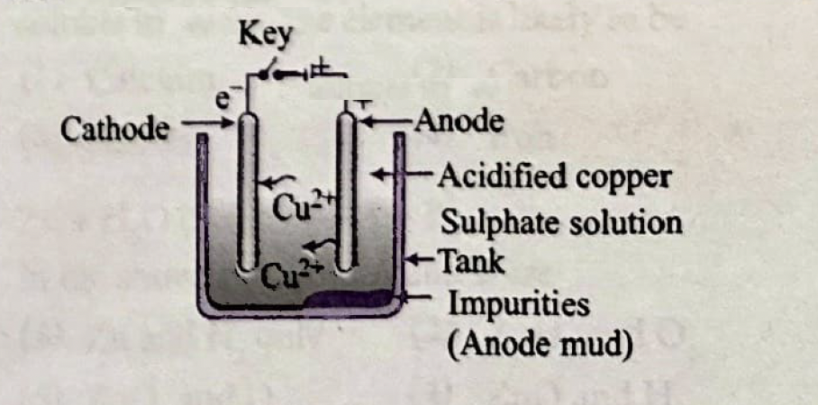

# Occurrence of Metals

## Distribution of Metals

### Natural Occurrence

- Few metals found in free state (native metals)
  - Gold, silver, platinum
  - Due to low reactivity
  
- Most metals found in combined state
  - As ores (mineral containing high percentage of metal)
  - Combined with oxygen, sulfur, carbonates, etc.

## Ores and Minerals

### Definitions

- **Mineral**: Natural material containing metals or their compounds
- **Ore**: Mineral from which metal can be extracted profitably
- **Gangue**: Unwanted material present in ore

### Common Ores

1. **Oxide ores**: Hematite (Fe₂O₃), Bauxite (Al₂O₃.2H₂O)
2. **Sulfide ores**: Galena (PbS), Zinc blende (ZnS)
3. **Carbonate ores**: Calamine (ZnCO₃), Malachite (CuCO₃.Cu(OH)₂)

## Extraction of Metals

### Metallurgy

The process of extracting metals from their ores

#### Steps in Metallurgy

1. **Enrichment/Concentration of ore**
   - Removal of gangue
   - Methods: Hand picking, hydraulic washing, magnetic separation, froth flotation

2. **Conversion to oxide**
   - Calcination (heating carbonate ore)
   - Roasting (heating sulfide ore in presence of air)

3. **Reduction to metal**
   - Chemical reduction (using carbon, aluminum, etc.)
   - Electrolytic reduction (for reactive metals)

4. **Refining**
   - Purification of crude metal
   - Methods: Electrolytic refining, distillation

### Extraction of Specific Metals

#### Iron
- From hematite in blast furnace
- Reduction using carbon

#### Aluminum
- From bauxite by electrolysis
- Hall-Héroult process

#### Copper
- From copper pyrites
- Involves roasting and reduction

### Electrolytic Refining

Electrolytic refining is used to purify impure metals obtained from extraction processes.

*Figure: Electrolytic refining of copper using acidified copper sulphate solution*

**Process:**
- **Anode**: Impure copper (to be refined)
- **Cathode**: Pure copper strip
- **Electrolyte**: Acidified copper sulphate solution
- **Result**: Pure copper deposits at cathode, impurities settle as anode mud

---

*Content to be extracted from textbook pages*
