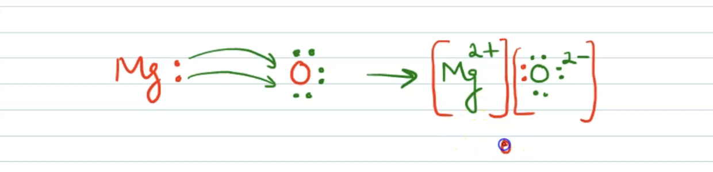

### Board Previous Year Questions (PYQs)

#### Question Index

- [Question 1](#question-1): Electrolytic reduction and sodium extraction (CBSE 2010) | [Answer ↓](#answer-1)
- [Question 2](#question-2): Solvents for electrovalent compounds (CBSE 2012) | [Answer ↓](#answer-2)
- [Question 3](#question-3): Formation of MgO using electron dot structures (CBSE 2012) | [Answer ↓](#answer-3)
- [Question 4](#question-4): Reactivity series - P, Q, R elements (CBSE 2014) | [Answer ↓](#answer-4)
- [Question 5](#question-5): Why calcium floats on water (CBSE 2014) | [Answer ↓](#answer-5)
- [Question 6](#question-6): Reasoning questions on metal reactions (CBSE 2014) | [Answer ↓](#answer-6)
- [Question 7](#question-7): Ionic compounds and AlCl₃ formation (CBSE 2015) | [Answer ↓](#answer-7)
- [Question 8](#question-8): Plastic coating on wires & carbon reduction (CBSE 2016) | [Answer ↓](#answer-8)
- [Question 9](#question-9): Metal extraction from carbonate ores & copper (CBSE 2018) | [Answer ↓](#answer-9)
- [Question 10](#question-10): Ore heating - CO₂ and SO₂ gases (CBSE 2020) | [Answer ↓](#answer-10)
- [Question 11](#question-11): MCQ - Non-metal identification (CBSE 2021) | [Answer ↓](#answer-11)
- [Question 12](#question-12): MCQ - Most active metal (CBSE 2021) | [Answer ↓](#answer-12)
- [Question 13](#question-13): MCQ - Electrolytic refining of copper (CBSE 2023) | [Answer ↓](#answer-13)
- [Question 14](#question-14): MCQ - Metals that don't corrode (CBSE 2023) | [Answer ↓](#answer-14)
- [Question 15](#question-15): Assertion-Reason - Copper sulphate & lead (CBSE 2023) | [Answer ↓](#answer-15)
- [Question 16](#question-16): MCQ - Liquid metal and non-metal (CBSE 2024) | [Answer ↓](#answer-16)
- [Question 17](#question-17): MCQ - Aluminium and zinc oxides (CBSE 2024) | [Answer ↓](#answer-17)
- [Question 18](#question-18): Assertion-Reason - Zinc and nitric acid (CBSE 2024) | [Answer ↓](#answer-18)

---

**1.** What is meant by electrolytic reduction? How is sodium obtained from its molten chloride? Explain. **[CBSE 2010]**

---

**2.** Name the solvent in which electrovalent compounds are soluble and the solvent in which they are insoluble. **[CBSE 2012]**

---

**3.** Show the formation of MgO by the transfer of electrons between the two elements using electron dot structures. **[CBSE 2012]**

---

**4.** $\mathrm{P}, \mathrm{Q}$, and R are three elements that undergo chemical reactions according to the following equations: **[CBSE 2014]**

- (a) $\mathrm{P}_2 \mathrm{O}_3 + 2\mathrm{Q} \rightarrow \mathrm{Q}_2 \mathrm{O}_3 + 2\mathrm{P}$
- (b) $3\mathrm{RSO}_4 + 2\mathrm{Q} \rightarrow \mathrm{Q}_2\left(\mathrm{SO}_4\right)_3 + 3\mathrm{R}$
- (c) $3\mathrm{RO} + 2\mathrm{P} \rightarrow \mathrm{P}_2 \mathrm{O}_3 + 3\mathrm{R}$

Answer the following:
- (i) Which element is the most reactive?
- (ii) Which element is the least reactive?
- (iii) State the type of reaction listed above.

---

**5.** Why does calcium float on water? **[CBSE 2014]**

---

**6.** Give reasons for the following: **[CBSE 2014]**

- (i) Generally, no hydrogen gas is evolved when metals react with dilute nitric acid.
- (ii) Sodium hydroxide solution cannot be kept in aluminium containers.
- (iii) Silver metal does not combine easily with oxygen, but silver jewellery tarnishes after some time.
- (iv) Sodium is obtained by the electrolysis of its molten chloride and not from its aqueous solution.
- (v) Aluminium reacts with dilute hydrochloric acid slowly in the beginning.

---

**7.** **[CBSE 2015]**

- (i) Write any two properties of ionic compounds.
- (ii) Show the formation of aluminium chloride by the transfer of electrons between the atoms. (Atomic number of aluminium and chlorine are 13 and 17, respectively.)

**8.** Account for the following: **[CBSE 2016]**

- (i) Electrical wires are coated with plastic.
- (ii) Carbon is not used for reducing aluminium from aluminium oxide.

---

**9.** **[CBSE 2018]**

- (i) Write the steps involved in the extraction of pure metals in the middle of the activity series from their carbonate ores.
- (ii) How is copper extracted from its sulphide ore? Explain the various steps supported by chemical equations. Draw a labelled diagram for the electrolytic refining of copper.

---

**10.** Two ores of metal X and Y were taken. On heating these ores, it was observed that: **[CBSE (All India) 2020]**

- (i) Ore of metal X gives $\mathrm{CO}_2$ gas, and
- (ii) Ore of metal Y gives $\mathrm{SO}_2$ gas.

Write the steps to convert these ores into metals, giving chemical equations for the reactions that take place.

---

**11.** Non-metal among the following is: **[CBSE (Term-1) 2021]**

- (1) Sodium
- (2) Oxygen
- (3) Potassium
- (4) Boron

---

**12.** The most active metal on the basis of activity series is: **[CBSE (Term-1) 2021]**

- (1) Zinc
- (2) Copper
- (3) Sodium
- (4) Iron

---

**13.** The following diagram shows the electrolytic refining of copper. Which of the following statements is an incorrect description of the process? **[1 Mark / CBSE 2023]**

- (1) The impure metal from the anode dissolves into the electrolyte.
- (2) The pure metal from the electrolyte is deposited on the cathode.
- (3) Insoluble impurities settle down at the bottom of the anode.
- (4) On passing the current through the electrolyte, the pure metal from the anode dissolves into the electrolyte.

---

**14.** Which of the following metals do not corrode in moist air? **[1 Mark / CBSE 2023]**

- (1) Copper
- (2) Iron
- (3) Gold
- (4) Silver

---

**15.** *Directions: The following question consists of two statements: Assertion (A) and Reason (R). Answer by selecting the appropriate option.* **[1 Mark / CBSE 2023]**

**Assertion (A):** The colour of aqueous solution of copper sulphate turns colourless when a piece of lead is added to it.

**Reason (R):** Lead is more reactive than copper, and hence displaces copper from its salt solution.

- (1) Both (A) and (R) are true and (R) is the correct explanation of (A).
- (2) Both (A) and (R) are true, but (R) is not the correct explanation of (A).
- (3) (A) is true, but (R) is false.
- (4) (A) is false, but (R) is true.

---

**16.** A metal and a non-metal that exist in liquid state at room temperature are, respectively: **[1 Mark / CBSE 2024]**

- (1) Bromine and mercury
- (2) Mercury and iodine
- (3) Mercury and bromine
- (4) Iodine and mercury

---

**17.** Oxides of aluminium and zinc are: **[1 Mark / CBSE 2024]**

- (1) Acidic
- (2) Basic
- (3) Amphoteric
- (4) Neutral

---

**18.** *Directions: Assertion-Reason question.* **[1 Mark / CBSE 2024]**

**Assertion (A):** Hydrogen gas is not evolved when zinc reacts with nitric acid.

**Reason (R):** Nitric acid oxidizes the hydrogen gas produced to water and itself gets reduced.

- (1) Both Assertion and Reason are true and the Reason is the correct explanation of the Assertion.
- (2) Both Assertion and Reason are true but the Reason is not the correct explanation of the Assertion.
- (3) Assertion is true, but Reason is false.
- (4) Assertion is false, but Reason is true.

---

## Answers

### Answer Index

- [Answer 1](#answer-1): Electrolytic reduction and sodium extraction | [Question ↑](#question-1)
- [Answer 2](#answer-2): Solvents for electrovalent compounds | [Question ↑](#question-2)
- [Answer 3](#answer-3): Formation of MgO using electron dot structures | [Question ↑](#question-3)
- [Answer 4](#answer-4): Reactivity series - P, Q, R elements | [Question ↑](#question-4)
- [Answer 5](#answer-5): Why calcium floats on water | [Question ↑](#question-5)
- [Answer 6](#answer-6): Reasoning questions on metal reactions | [Question ↑](#question-6)
- [Answer 7](#answer-7): Ionic compounds and AlCl₃ formation | [Question ↑](#question-7)
- [Answer 8](#answer-8): Plastic coating on wires & carbon reduction | [Question ↑](#question-8)
- [Answer 9](#answer-9): Metal extraction from carbonate ores & copper | [Question ↑](#question-9)
- [Answer 10](#answer-10): Ore heating - CO₂ and SO₂ gases | [Question ↑](#question-10)
- [Answer 11](#answer-11): MCQ - Non-metal identification | [Question ↑](#question-11)
- [Answer 12](#answer-12): MCQ - Most active metal | [Question ↑](#question-12)
- [Answer 13](#answer-13): MCQ - Electrolytic refining of copper | [Question ↑](#question-13)
- [Answer 14](#answer-14): MCQ - Metals that don't corrode | [Question ↑](#question-14)
- [Answer 15](#answer-15): Assertion-Reason - Copper sulphate & lead | [Question ↑](#question-15)
- [Answer 16](#answer-16): MCQ - Liquid metal and non-metal | [Question ↑](#question-16)
- [Answer 17](#answer-17): MCQ - Aluminium and zinc oxides | [Question ↑](#question-17)
- [Answer 18](#answer-18): Assertion-Reason - Zinc and nitric acid | [Question ↑](#question-18)

---

**1.** What is meant by electrolytic reduction? How is sodium obtained from its molten chloride? Explain.

**Answer:**

**What is Electrolytic Reduction?**
- It's a process using electrical energy (electrolysis) to break down a compound (like an ore or molten salt) and reduce metal ions to their pure elemental form.
- A strong electric current drives the chemical change, forcing metal cations ($M^{+}$) to gain electrons (reduction) at the cathode (negative electrode).

**How Sodium is Obtained from Molten Sodium Chloride (NaCl):**

1. **Setup:** An electrolytic cell contains molten (liquid) sodium chloride, acting as the electrolyte. Two electrodes (cathode and anode) are immersed in it.

2. **Ionization:** When current flows, NaCl dissociates into mobile sodium ions ($\mathrm{Na}^{+}$) and chloride ions ($\mathrm{Cl}^{-}$).

3. **At the Cathode (Negative Electrode):** $\mathrm{Na}^{+}$ ions are attracted to the cathode, gain an electron, and are reduced to molten sodium metal.
   
   *Reaction:* $$\mathrm{Na}^{+} + e^{-} \rightarrow \mathrm{Na}(\mathrm{l})$$

4. **At the Anode (Positive Electrode):** $\mathrm{Cl}^{-}$ ions are attracted to the anode, lose electrons, and are oxidized to chlorine gas.
   
   *Reaction:* $$2\mathrm{Cl}^{-} \rightarrow \mathrm{Cl}_2(\mathrm{g}) + 2e^{-}$$

5. **Separation:** The molten sodium (less dense) rises and is collected, while chlorine gas is collected separately at the anode to prevent it from reacting back with the sodium.

**Overall Reaction:**

$$2\mathrm{NaCl}(\mathrm{l}) \xrightarrow{\text{Electrolysis}} 2\mathrm{Na}(\mathrm{l}) + \mathrm{Cl}_2(\mathrm{g})$$

---

**2.** Name the solvent in which electrovalent compounds are soluble and the solvent in which they are insoluble.

**Answer:**

An electrovalent compound, also known as an ionic compound, is a chemical compound formed by the complete transfer of electrons from one atom to another, typically from a metal to a non-metal. This transfer creates oppositely charged ions (a positive cation and

Ionic Bond (Electrovalent Bond)
a negative anion) that are held together by strong electrostatic forces. A common example is sodium chloride ( NaCl ), formed when a sodium atom loses an electron to a chlorine atom.

Electrovalent (ionic) compounds, like NaCl , are generally soluble in polar solvents (like water) because the solvent's dipoles break the ionic bonds, but insoluble in nonpolar solvents (like petrol, benzene, kerosene) as they can't overcome the strong electrostatic forces. This "like dissolves like" principle means polar solvents dissolve polar/ionic substances, while nonpolar solvents dissolve nonpolar substances. ©

---

**3.** Show the formation of MgO by the transfer of electrons between the two elements using electron dot structures.

**Answer:**

Mg looses two electrons, O gains two

Reference: <a href="https://allen.in/dn/qna/647240765">Doubtnet</a>

---

**4.** $\mathrm{P}, \mathrm{Q}$, and R are three elements that undergo chemical reactions according to the following equations: **[CBSE 2014]**

- (a) $\mathrm{P}_2 \mathrm{O}_3 + 2\mathrm{Q} \rightarrow \mathrm{Q}_2 \mathrm{O}_3 + 2\mathrm{P}$
- (b) $3\mathrm{RSO}_4 + 2\mathrm{Q} \rightarrow \mathrm{Q}_2\left(\mathrm{SO}_4\right)_3 + 3\mathrm{R}$
- (c) $3\mathrm{RO} + 2\mathrm{P} \rightarrow \mathrm{P}_2 \mathrm{O}_3 + 3\mathrm{R}$

Answer the following:
- (i) Which element is the most reactive?
- (ii) Which element is the least reactive?
- (iii) State the type of reaction listed above.

**Answer:**

P replaces R, Q replaces P, Q replaces R

(i) Q is most reactive.   
(ii) R is least reactive.   
(iii) Displacement reaction.   

---

**5.** Why does calcium float on water?

**Answer:**

When calcium reacts with water, it forms calcium hydroxide and hydrogen gas. The hydrogen gas produced adheres to the surface of the calcium, creating buoyant bubbles that make the metal float on the water’s surface. The formation of hydrogen gas during the reaction is exothermic, and the released heat contributes to the buoyancy. The hydrogen bubbles displace water and reduce the overall density of the calcium, causing it to rise and appear to float. This phenomenon is characteristic of the reactivity of certain metals with water and showcases the displacement of water by the evolved gas during the chemical reaction.

---

**6.** Give reasons for the following: **[CBSE 2014]**

- (i) Generally, no hydrogen gas is evolved when metals react with dilute nitric acid.
- (ii) Sodium hydroxide solution cannot be kept in aluminium containers.
- (iii) Silver metal does not combine easily with oxygen, but silver jewellery tarnishes after some time.
- (iv) Sodium is obtained by the electrolysis of its molten chloride and not from its aqueous solution.
- (v) Aluminium reacts with dilute hydrochloric acid slowly in the beginning.

**Answer:**

- (i) That statement is generally true because nitric acid (HNO₃) is a strong oxidizing agent, so it oxidizes the hydrogen (H) produced to water (\(H_{2}O\)), while the nitric acid itself gets reduced to various nitrogen oxides (like \(NO_{2}\), \(NO\), \(N_{2}O\)), preventing \(H_{2}\) gas from being evolved, except for very reactive metals like magnesium (Mg) and manganese (Mn) with very dilute acid
- (ii) Sodium hydroxide $(\mathrm{NaOH})$ solution cannot be stored in aluminum containers because it reacts with the aluminum, corroding the metal and producing highly flammable hydrogen gas, which creates safety hazards like container failure and potential explosions. The chemical reaction forms sodium aluminate and hydrogen gas: $2 \mathrm{Al}+2 \mathrm{NaOH}+2 \mathrm{H}_2 \mathrm{O} \rightarrow 2 \mathrm{NaAlO}_2+3 \mathrm{H}_2$ (or $2 \mathrm{Al}+2 \mathrm{NaOH}+6 \mathrm{H}_2 \mathrm{O} \rightarrow 2 \mathrm{Na}\left[\mathrm{Al}(\mathrm{OH})_4\right]+3 \mathrm{H}_2$ as a hydrated form).

   Why it's dangerous:
   - Corrosion: The strong base attacks the aluminum, weakening the container.
   - Hydrogen Gas: The released $H_2$ gas is flammable and can build up pressure, leading to container rupture.

  Safer Alternatives:
   - Sodium hydroxide is best stored in containers made of materials resistant to strong bases, such as certain plastics (HDPE, PVC) or stainless steel (316SS).
- (iii) - Sulfur compounds: Silver reacts with sulfur-containing gases like hydrogen sulfide ( $\mathrm{H}_2 \mathrm{~S}$ ), which are present in the air from pollution, industrial emissions, or even certain foods (like eggs). This reaction creates silver sulfide ( $\mathrm{Ag}_2 \mathrm{~S}$ ), which is a black or dark gray film that dulls the metal.
- (iv) Sodium is extracted from molten NaCl (Downs process) because in aqueous NaCl , water is reduced instead of sodium ions ( $\mathrm{Na}^{+}$) at the cathode, producing hydrogen gas ( $\mathrm{H}_2$ ) and sodium hydroxide ( NaOH ) due to water's higher reduction potential, while the highly reactive sodium metal formed immediately reacts with water. Using molten salt eliminates water, allowing pure sodium metal to be produced by reducing $\mathrm{Na} a^{+}$ions.
- (v) Aluminium reacts slowly with dilute HCl at first because of a tough, protective layer of aluminium oxide ( $\mathrm{Al}_2 \mathrm{O}_3$ ) on its surface, which shields the metal; the acid first dissolves this oxide, and then the vigorous reaction to form aluminium chloride ( $\mathrm{AlCl}_3$ ) and hydrogen gas ( $H_2$ ) begins, leading to rapid bubbling.

  The Process Explained:
  1. Protective Layer: Aluminium naturally forms a very stable, hard, transparent oxide layer (like a natural coating) that prevents immediate contact with the acid.
  2. Initial Delay: The dilute HCl needs time to eat through or break down this $\mathrm{Al}_2 \mathrm{O}_3$ barrier, causing the initial slow start and few bubbles.
  3. Vigorous Reaction: Once the oxide layer is gone, the acid directly touches the pure aluminium, triggering a fast single displacement reaction, producing lots of hydrogen gas bubbles and accelerating the reaction rate.

  Chemical Equation:

  $
  2 \mathrm{Al}(s)+6 \mathrm{HCl}(a q) \rightarrow 2 \mathrm{AlCl}_3(a q)+3 \mathrm{H}_2(g)
  $

---

**7.**  **[CBSE 2015]**

- (i) Write any two properties of ionic compounds.
- (ii) Show the formation of aluminium chloride by the transfer of electrons between the atoms. (Atomic number of aluminium and chlorine are 13 and 17, respectively.)

**Answer:**

Ionic compounds have ionic bonds and are formed between metals with extra electrons and non metails like Cl, Br etc.

**Key Properties of Ionic Compounds:**

1. **Physical State:** They are typically hard, crystalline solids at room temperature due to their giant, ordered crystal lattice structure.
2. **Melting & Boiling Points:** Have high melting and boiling points because strong electrostatic forces between oppositely charged ions require a lot of energy to break.
3. **Hardness & Brittleness:** They are hard but brittle; applying pressure can cause layers of ions to shift, bringing like charges together, causing repulsion and breaking the crystal.
4. **Electrical Conductivity:**
   - *Solid State:* Poor conductors because ions are fixed in the lattice and can't move.
   - *Molten (Liquid) State/Aqueous Solution:* Good conductors as ions become free to move and carry charge.
5. **Solubility:** Generally soluble in polar solvents like water but insoluble in non-polar solvents (e.g., kerosene, petrol).
6. **Nature of Bonds:** Formed by strong electrostatic attraction between positive (metal) and negative (non-metal) ions, resulting in strong ionic bonds.

---

**8.** Account for the following: **[CBSE 2016]**

- (i) Electrical wires are coated with plastic.
- (ii) Carbon is not used for reducing aluminium from aluminium oxide.

**Answer:**

- (i) Plastic is bad conductor of electricty
- (ii) Carbon is not used for reducing aluminium from aluminium oxide: Carbon is not used to reduce aluminium from aluminium oxide (alumina) because aluminium has a much higher affinity for oxygen than carbon does, meaning carbon can't effectively displace the oxygen, even at high temperatures, requiring the electrolysis method (Hall-Héroult process) instead. ( )
- 
---

**9.** **[CBSE 2018]**

- (i) Write the steps involved in the extraction of pure metals in the middle of the activity series from their carbonate ores.
- (ii) How is copper extracted from its sulphide ore? Explain the various steps supported by chemical equations. Draw a labelled diagram for the electrolytic refining of copper.

**Answer:**

- (i)  $MgCO_3 \rightarrow MgO + CO_2 \newline $
       $ MgO + C \rightarrow Mg + CO$

Magnesium is mid-tier active metal

- (ii) $\begin{aligned} & 2 \mathrm{Cu}_2 \mathrm{~S}+3 \mathrm{O}_2(\mathrm{~g}) \xrightarrow{\text { Heat }} 2 \mathrm{Cu}_2 \mathrm{O}(\mathrm{s})+2 \mathrm{SO}_2(\mathrm{~g}) \newline
   & 2 \mathrm{Cu}_2 \mathrm{O}+\mathrm{Cu}_2 \mathrm{~S} \xrightarrow{\text { Heat }} 6 \mathrm{Cu}(\mathrm{s})+\mathrm{SO}_2(\mathrm{~g})\end{aligned}$
---

**10.** Two ores of metal X and Y were taken. On heating these ores, it was observed that: **[CBSE (All India) 2020]**

- (i) Ore of metal X gives $\mathrm{CO}_2$ gas, and
- (ii) Ore of metal Y gives $\mathrm{SO}_2$ gas.

Write the steps to convert these ores into metals, giving chemical equations for the reactions that take place.

**Answer:**

- (i) Ore of metal X gives $\mathrm{CO}_2$ gas, and.   
      $XCO_3 \rightarrow XO + CO_2$    
      $XO + C \rightarrow X + CO$
- (ii) Ore of metal Y gives $\mathrm{SO}_2$ gas.   
      $Y_2S + 2O_2 \rightarrow 2YO + SO_2$.   
      $YO + CS \rightarrow Y + CO$

---

**11.** Non-metal among the following is: **[CBSE (Term-1) 2021]**

- (1) Sodium
- (2) Oxygen
- (3) Potassium
- (4) Boron

**Answer:** **(2) Oxygen**

---

**12.** The most active metal on the basis of activity series is: **[CBSE (Term-1) 2021]**

- (1) Zinc
- (2) Copper
- (3) Sodium
- (4) Iron

**Answer:** **(3) Sodium**

---

**13.** The following diagram shows the electrolytic refining of copper. Which of the following statements is an incorrect description of the process? **[1 Mark / CBSE 2023]**

   

- (1) The impure metal from the anode dissolves into the electrolyte.
- (2) The pure metal from the electrolyte is deposited on the cathode.
- (3) Insoluble impurities settle down at the bottom of the anode.
- (4) On passing the current through the electrolyte, the pure metal from the anode dissolves into the electrolyte.

**Answer:** **(4)** On passing the current through the electrolyte, the pure metal from the anode dissolves into the electrolyte. *(Incorrect because impure metal dissolves from anode, not pure metal)*

---

**14.** Which of the following metals do not corrode in moist air? **[1 Mark / CBSE 2023]**

- (1) Copper
- (2) Iron
- (3) Gold
- (4) Silver

**Answer:** **(3) Gold**

---

**15.** *Directions: The following question consists of two statements: Assertion (A) and Reason (R). Answer by selecting the appropriate option.* **[1 Mark / CBSE 2023]**

**Assertion (A):** The colour of aqueous solution of copper sulphate turns colourless when a piece of lead is added to it.

**Reason (R):** Lead is more reactive than copper, and hence displaces copper from its salt solution.

- (1) Both (A) and (R) are true and (R) is the correct explanation of (A).
- (2) Both (A) and (R) are true, but (R) is not the correct explanation of (A).
- (3) (A) is true, but (R) is false.
- (4) (A) is false, but (R) is true.

**Answer:** **(4) (A) is false, but (R) is true.**

*Explanation:* Lead displaces copper from copper sulphate solution, but the solution doesn't turn colourless—it remains light blue or becomes less blue as copper is deposited.

---

**16.** A metal and a non-metal that exist in liquid state at room temperature are, respectively: **[1 Mark / CBSE 2024]**

- (1) Bromine and mercury
- (2) Mercury and iodine
- (3) Mercury and bromine
- (4) Iodine and mercury

**Answer:** **(3) Mercury and bromine**

---

**17.** Oxides of aluminium and zinc are: **[1 Mark / CBSE 2024]**

- (1) Acidic
- (2) Basic
- (3) Amphoteric
- (4) Neutral

**Answer:** **(3) Amphoteric**

---

**18.** *Directions: Assertion-Reason question.* **[1 Mark / CBSE 2024]**

**Assertion (A):** Hydrogen gas is not evolved when zinc reacts with nitric acid.

**Reason (R):** Nitric acid oxidizes the hydrogen gas produced to water and itself gets reduced.

- (1) Both Assertion and Reason are true and the Reason is the correct explanation of the Assertion.
- (2) Both Assertion and Reason are true but the Reason is not the correct explanation of the Assertion.
- (3) Assertion is true, but Reason is false.
- (4) Assertion is false, but Reason is true.

**Answer:** **(1) Both Assertion and Reason are true and the Reason is the correct explanation of the Assertion.**

---