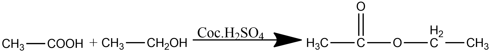

# Short Answer Type Questions

12. Why covalent compounds are volatile in nature with low boiling and low melting point?
13. 
   (a) What is a 'homologous series' of substances?
   (b) In an organic compound, which parts largely determine its physical and chemical properties?
   (c) Write a chemical equation to represent the reaction of ethanol with acidified solution of potassium dichromate.

   C2H5OH -> CH3COOH

14. What are the reactive sites for addition reactions in unsaturated hydrocarbons? Give an example.
15. What are the advantages of synthetic detergents over soaps?
16. How will you distinguish between ethanol and ethanoic acid?
17. What is a covalent bond? What type of bond exists in the following compounds?
(a) $\mathrm{CCl}_4$
(b) $\mathrm{CaCl}_2$
18. Write molecular, electronic, and structural formulae for ethene.
19. Write the structural formulae of all the isomers of an alkane with six C -atoms $\left(\mathrm{C}_6 \mathrm{H}_{14}\right)$.
20. Give an example for the test of unsaturation.
21. How are the following products obtained from ethanol?
(1) Ethyl ethanoate
(2) Sodium ethanoate

## Answers

12. Why covalent compounds are volatile in nature with low boiling and low melting point?
    - Covalent compounds have weak intermolecular forces (van der Waals forces) between their molecules. Therefore, a small amount of energy is sufficient to overcome these forces, resulting in low melting and boiling points, which makes them volatile.

13. 
    (a) What is a 'homologous series' of substances?   
        - A homologous series is a group of organic compounds having the same functional group and similar chemical properties, in which the successive members differ by a $-\mathrm{CH}_2$ unit or 14 mass units.    
    (b) In an organic compound, which parts largely determine its physical and chemical properties?    
        - **Physical properties** are largely determined by the **alkyl group** (carbon chain length).   
        - **Chemical properties** are largely determined by the **functional group**. .  
    (c) Write a chemical equation to represent the reaction of ethanol with acidified solution of potassium dichromate.    
        - $\mathrm{CH}_3 \mathrm{CH}_2 \mathrm{OH} \xrightarrow{\text { Acidified } \mathrm{K}_2 \mathrm{Cr}_2 \mathrm{O}_7} \mathrm{CH}_3 \mathrm{COOH}$

14. What are the reactive sites for addition reactions in unsaturated hydrocarbons? Give an example.
    - The reactive sites for addition reactions in unsaturated hydrocarbons are the double bonds. An example is ethene ($\mathrm{C}_2\mathrm{H}_4$).
15. What are the advantages of synthetic detergents over soaps?
    - Synthetic detergents are more effective than soaps because they are more soluble in water and have a higher surface tension.
16. How will you distinguish between ethanol and ethanoic acid? 
    Smell (ethanoic acid has a strong smell),melting point (ethanoic acid has a higher melting point), boiling point (ethanoic acid has a lower boiling point), 

    
17. CCl_4, 4 covalent bonds. CaCl_2, 2 covalent bonds.
18. C_2H_2, 
19. C_6H14, 6 isomers.
    The five structural isomers of $\mathrm{C}_6 \mathrm{H}_{14}$ with their condensed structural formulas are:   
    - $\boldsymbol{n}$-Hexane (straight chain): $\mathrm{CH}_3 \mathrm{CH}_2 \mathrm{CH}_2 \mathrm{CH}_2 \mathrm{CH}_2 \mathrm{CH}_3$
    - 2-Methylpentane (five-carbon chain, one methyl branch on C2):

    $$
    \mathrm{CH}_3 \mathrm{CH}\left(\mathrm{CH}_3\right) \mathrm{CH}_2 \mathrm{CH}_2 \mathrm{CH}_3
    $$

    - 3-Methylpentane (five-carbon chain, one methyl branch on C3):

    $$
    \mathrm{CH}_3 \mathrm{CH}_2 \mathrm{CH}\left(\mathrm{CH}_3\right) \mathrm{CH}_2 \mathrm{CH}_3
    $$

    - 2,3-Dimethylbutane (four-carbon chain, two methyl branches on C2 and C3):

    $$
    \mathrm{CH}_3 \mathrm{CH}\left(\mathrm{CH}_3\right) \mathrm{CH}\left(\mathrm{CH}_3\right) \mathrm{CH}_3
    $$

    - 2,2-Dimethylbutane (four-carbon chain, two methyl branches on C2):

    $$
    \mathrm{CH}_3 \mathrm{C}\left(\mathrm{CH}_3\right)_2 \mathrm{CH}_2 \mathrm{CH}_3 \text { ® }
    $$

20. Yellow flame
21. How are the following products obtained from ethanol?

    (1) Ethyl ethanoate
    

    A mixture of ethanoic acid, ethanol and concentrated sulfuric acid is gently heated by either a water bath or an electric heater (ethanol is flammable, so a Bunsen can’t be used!)

    The ester is then distilled off as soon as it is formed and collected in a separate beaker by condensation

    As esters have low boiling points (they are volatile), they are the first to evaporate from the reaction mixture. Removing them from the mixture by distillation prevents the reverse reaction from occurring

    

(2) Sodium ethanoate    
    Sodium acetate can be prepared with the help of baking soda and vinegar. (It is advised to wear safety goggles as the splashing can happen and it will cause irritation in the eyes, skin, and respiratory system. If inhaled directly, it can cause inflammation of the lungs and throat).

   $
   \mathrm{CH}_3 \mathrm{COOH}+\mathrm{NaHCO}_3 \rightarrow \mathrm{CH}_3 \mathrm{COONa}+\mathrm{H}_2 \mathrm{CO}_3 
$

Acetic Acid + Baking Soda -> Sodium Acetate Carbonic Acid

  $
  \mathrm{H}_2 \mathrm{C}_3 \rightarrow \mathrm{H}_2 \mathrm{O}+\mathrm{CO}_2
  $

   Carbonic Acid -> Water + Carbon Dioxide