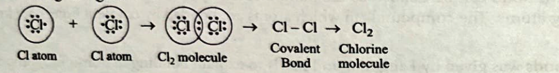
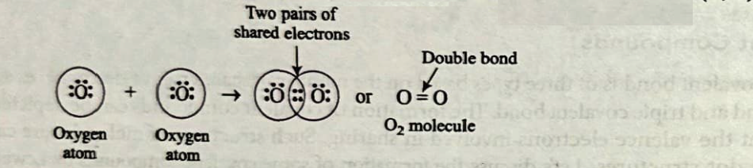
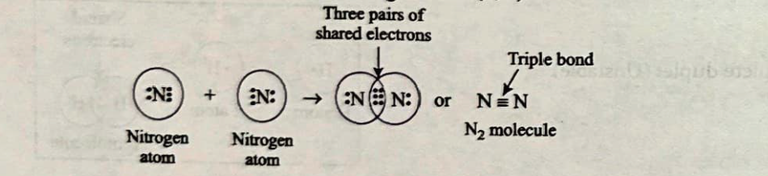
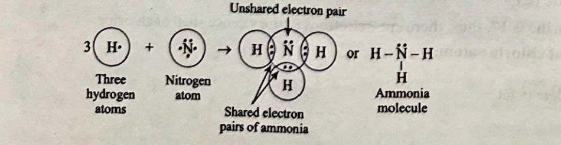
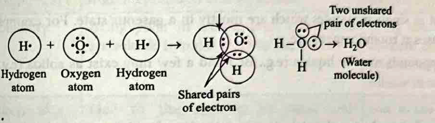
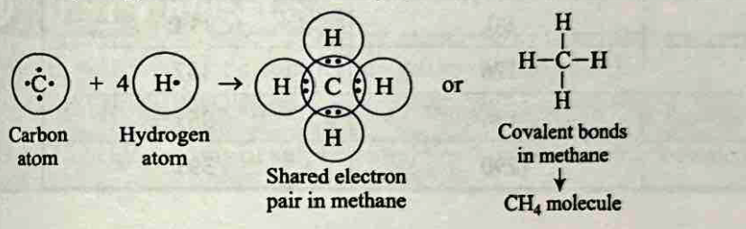

# Bonding in Carbon - The Covalent Bond

## Overview

Carbon is an essential chemical element with the symbol 'C' and atomic number 6. It is renowned for its versatility and ability to form a wide variety of compounds due to its unique bonding characteristics. Carbon chemistry primarily focuses on organic compounds, which are compounds containing carbon atoms. These compounds are abundant in living organisms and form the basis of life. Carbon can form covalent bonds with other carbon atoms and various other elements such as hydrogen, oxygen, nitrogen, sulphur and more. It can also create multiple bonds (single, double or triple) with other carbon atoms, leading to diverse structures.

Hydrocarbons are carbon compounds composed of only carbon and hydrogen atoms. These include alkanes, alkenes and alkynes. Carbon compounds often contain functional groups, which are specific arrangements of atoms that determine the chemical properties of the compound.

Carbon compounds are crucial for life. Biomolecules such as proteins, carbohydrates, lipids and nucleic acids all contain carbon and are essential for the structure and function of living organisms. To summarize, carbon and its compounds play a fundamental role in chemistry, biology and industry due to their remarkable versatility and the vast array of molecules they can form.

---

## 1. Introduction

*   The compounds that are obtained from 'Carbon' are widely used in clothes, medicines, books, food, fertilizer, fuel, etc.
*   All living structures are based on carbon.
*   Carbon (symbol 'C') is a non-metal with an electronic configuration 2, 4.
*   It is the most versatile element known.
*   The amount of carbon present in the earth's crust and in the atmosphere is quite meagre.
*   The earth's crust has only 0.02% carbon in the form of minerals (like carbonates, hydrogen carbonates, coal and petroleum) while the atmosphere has 0.03% carbon dioxide.
*   In spite of the small amount of carbon available in nature, the importance of carbon seems to be immense.
*   Carbon forms a large number of compounds with hydrogen which are known as hydrocarbons.
*   In addition to hydrogen, carbon compounds may also contain some other elements such as oxygen, halogen, nitrogen, phosphorus, sulphur etc.

{: .note }
> **INSIGHTS**
> * Carbon is the fourth most abundant element in the universe (hydrogen, helium, and oxygen are found in higher amounts by mass). It is the 15th most abundant element in the Earth's crust.
> * Its name comes from the Latin word 'carbo' meaning 'coal'. This is because it is the main constituent of coal.

---

## 2. Bonding in Carbon — The Covalent Bond

A neutral atom of carbon has electronic configuration: 2(K), 4(L). To attain inert gas configuration, carbon can either donate four valence electrons (helium gas configuration) or gain four electrons (neon gas configuration), but it cannot do so due to the following reasons:

1.  **Small Size and High Energy:** The carbon atom is very small in size, so the valence electrons are attracted strongly by its nucleus. Therefore, it cannot lose four electrons as it requires a large amount of energy.
2.  **Electronic Repulsion:** Carbon cannot gain 4 electrons, because the addition of 4 electrons in valence shell would result in strong electronic repulsion between the 8 electrons now present in the valence shell. The energy required to overcome these repulsions is very high.

Therefore, to acquire an inert gas configuration, carbon can only **share** its four valence electrons with other atoms to form covalent bonds.

**Definition:** A covalent bond can be defined as the bond formed by the mutual contribution and sharing of electrons in the participating atoms. The compounds in which atoms are bonded by covalent bonds are known as **covalent compounds**.

*   The concept of covalent bonds was given by **Langmuir and Lewis** to explain bonding in non-ionic compounds.
*   In this concept, an atom shares one electron with another atom which also contributes one electron and this mutual sharing of two electrons results in the formation of a **single covalent bond**. The electrons shared by both atoms form a **shared pair of electrons**.

### Formation of Some Covalent Compounds

Covalent bond is of three types based on the number of shared pair of electrons, i.e., **single covalent bond**, **double covalent bond** and **triple covalent bond**. The formation of covalent compounds can be depicted by using dots or crosses to represent the valence electrons involved in sharing. Such structures of molecules are called **electron dot structures** or **Lewis dot structures**.

#### (i) Formation of hydrogen ($H_2$)

Atomic number of hydrogen is 1 and hence it has one electron in its outer shell (K). It requires one more electron to complete its shell and attain the electronic configuration of the nearest noble gas which is helium.

| Atom/Ion | Atomic Number | Shells | Electrons | Stability |
| :--- | :---: | :--- | :---: | :--- |
| **Hydrogen** | 1 | K | 1 | Incomplete duplet (Unstable) |
| **Helium** | 2 | K | 2 | Complete duplet (Stable) |

**Electron Dot Structure:**

*c-fig1: Formation of $H_2$ molecule*

So, two hydrogen atoms share one electron each to form a molecule of hydrogen ($H_2$) containing a single covalent bond. By doing so, each hydrogen atom attains the stable electronic configuration of the nearest noble gas, helium.

#### (ii) Formation of chlorine molecule ($Cl_2$)

The atomic number of chlorine is 17; thus, there are 7 electrons in the valence shell of chlorine.

**Electronic configuration of chlorine atom:**

| Shell | K | L | M |
| :--- | :---: | :---: | :---: |
| **Electrons** | 2 | 8 | 7 |

*Status: Incomplete octet*

**Electronic configuration of argon atom:**

| Shell | K | L | M |
| :--- | :---: | :---: | :---: |
| **Electrons** | 2 | 8 | 8 |

*Status: Complete octet*

So, two chlorine atoms share one electron each to form a molecule of chlorine ($Cl_2$) containing a single covalent bond. By doing so, each chlorine atom attains the stable electronic configuration of the nearest noble gas, argon.

*c-fig2: Formation of $Cl_2$ molecule*

#### (iii) Formation of oxygen molecule ($O_2$)

*   The atomic number of oxygen atom is 8. There are 6 electrons in the valence shell of oxygen atom and thus, it needs 2 more electrons to attain the nearest stable inert gas [Neon (2, 8)] configuration.

*c-fig3: Formation of $O_2$ molecule*

*   In the oxygen molecule, both the oxygen atoms contribute two electrons and thus share two electron pairs to form two covalent bonds. Such bonds are called **double bonds**.

#### (iv) Formation of nitrogen molecule ($N_2$)

*   The atomic number of nitrogen is 7 and its electronic configuration is 2, 5. It needs 3 electrons more to complete its octet like noble gas neon (2, 8).

*c-fig4: Formation of $N_2$ molecule*

*   In the nitrogen molecule, both nitrogen atoms contribute three electrons and thus share three electron pairs to form three covalent bonds. Such bonds are called **triple bonds**.

#### (v) Formation of ammonia molecule ($NH_3$)

*   The atomic number of nitrogen is 7. Its electronic configuration is 2, 5. There are 5 electrons in its valence shell. It needs 3 electrons more to complete its octet like noble gas, neon (2, 8).
*   Hydrogen has one electron in its valence shell and there are total 3 hydrogen atoms. Therefore, all 3 hydrogen atoms will share its electron with nitrogen.

*c-fig5: Formation of $NH_3$ molecule*

#### (vi) Formation of water molecule ($H_2O$)

*   The electronic configuration of hydrogen is K(1) and that of oxygen is K(2), L(6). Thus, each hydrogen requires one electron, and oxygen requires two electrons to achieve the stable electronic configuration of helium and neon, respectively.

*c-fig6: Formation of $H_2O$ molecule*

#### (vii) Formation of methane molecule ($CH_4$)

*   Methane is a covalent compound containing four covalent bonds. It contains one carbon atom to which four hydrogen atoms are covalently bonded.

*c-fig7: Formation of $CH_4$ molecule*

---

## Example 1

Draw the electron dot structure for:
(a) Hydrogen sulphide ($H_2S$)
(b) Propanone ($CH_3COCH_3$)
(c) Difluoride ($F_2$)

**Solution**

(a) **$H_2S$ (Hydrogen sulphide):** H—S—H
(b) **Propanone:**
    H   O   H
    |   ||  |
H—C—C—C—H
    |       |
    H       H
(c) **$F_2$ (Difluoride):** F—F

---

{: .note }
> **INSIGHTS**
> * Molecules which are made up of only one kind of atoms are called **homoatomic molecules**. For example, $H_2, Cl_2, O_2, N_2$, etc.
> * Molecules which are made up of more than one type of atom are called **heteroatomic molecules**. For example, $CH_4, NH_3, H_2O$, etc.

---

## 2.1 Properties of Covalent Compounds

The different properties of covalent compounds are discussed below:

### (i) Physical state
*   Covalent compounds exist as single molecules which are mostly in a gaseous state. For example, $H_2, Cl_2, NH_3, CH_4, SO_2$, etc., are gases at room temperature.
*   Some of the covalent compounds may be liquids (e.g., $Br_2$) and a few may exist as solids (e.g., $I_2, P_4, S_8$ molecules).

### (ii) Melting and boiling points
*   Since no ions are present in the covalent molecules, the attractive forces in them are weak. Therefore, these compounds have usually low melting and boiling points.

| Compound | Melting point (K) | Boiling point (K) |
| :--- | :---: | :---: |
| **Methane** | 90 | 111 |
| **Methyl alcohol** | 176 | 337 |
| **Ethyl alcohol** | 156 | 351 |
| **Acetic acid** | 290 | 391 |

### (iii) Electrical conductivity
*   Covalent compounds are generally poor conductors of electricity because the current is carried by the movement of ions and covalent compounds do not contain ions.
*   However, some of them become good conductors when dissolved in water. For example, hydrogen chloride gas, i.e., $HCl(g)$ is a poor conductor of electricity. But in water, it changes into hydrochloric acid, i.e., $HCl(aq)$. Since the acid can now dissociate in solution to form $H^+(aq)$ and $Cl^-(aq)$ ions, it becomes a good conductor of electricity.

### (iv) Nature of reactions
*   Covalent compounds generally react in molecular form. For example,
    $$H_2(g) + Cl_2(g) \rightarrow 2HCl(g)$$
*   Covalent compounds show slow molecular reactions because they undergo reaction through the breakage of old bonds and formation of new bonds.

### (v) Solubility
*   Ionic compounds are usually water soluble. However, covalent compounds are normally not soluble in water. They dissolve in covalent solvents like carbon tetrachloride ($CCl_4$), benzene ($C_6H_6$), acetone ($CH_3COCH_3$), etc.

---

## Comparative Study of Properties of Ionic and Covalent Compounds

| S.No. | Property | Ionic compounds | Covalent compounds |
| :--- | :--- | :--- | :--- |
| 1 | **Physical state** | They are crystalline solids at room temperature | They are liquids or gases at room temperature |
| 2 | **Hardness and brittleness** | Due to strong electrostatic forces of attraction, ionic compounds are hard and brittle. | Due to weak forces of attraction, covalent compounds are neither hard nor brittle. |
| 3 | **Crystal Structure** | They are generally found in a compactly packed crystalline form. | They may form compact crystals like diamond or crystals with separate layers like graphite. |
| 4 | **Type of reactions** | Due to ionization in solution, they cause fast ionic reactions. | They show slow molecular reactions. |
| 5 | **Melting and boiling point** | Due to strong attraction forces, they show high melting and boiling points. | Due to weak attraction forces, they show low melting and boiling points. |
| 6 | **Solubility** | Being polar in nature, ionic compounds are soluble in polar solvents like water. | Being non-polar or partially polar in nature, covalent compounds are insoluble or partially soluble in polar solvents, but they are highly soluble in non-polar solvents. |
| 7 | **Electrical conductivity** | Due to the presence of ions, ionic compounds are good conductors of electricity in molten state or aqueous state. | Due to the absence of charges or presence of partial charges, covalent compounds are bad conductors of electricity or act as insulators. |

---

{: .test-yourself }
> **TEST YOURSELF**
> 1. Draw the electron dot structure of carbon dioxide ($CO_2$).
> 2. Draw the electron dot structure of a molecule of sulphur which is made up of eight atoms of sulphur.
> *Hint: The eight atoms of sulphur are joined together in the form of a ring.*
