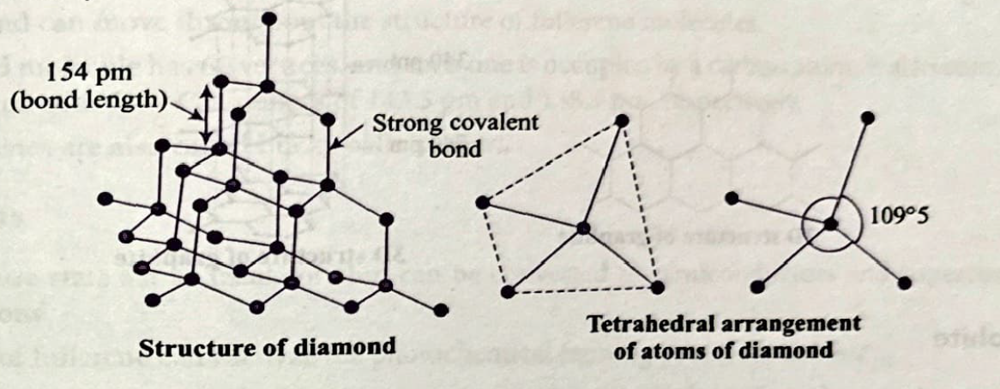
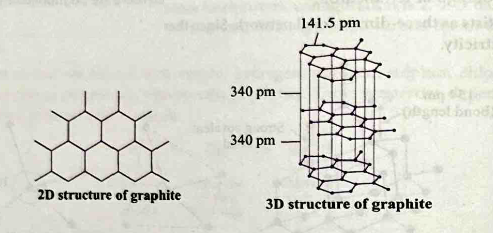
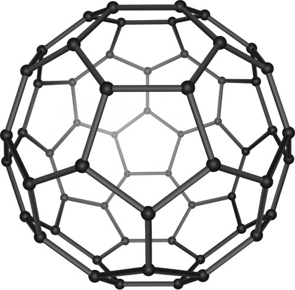
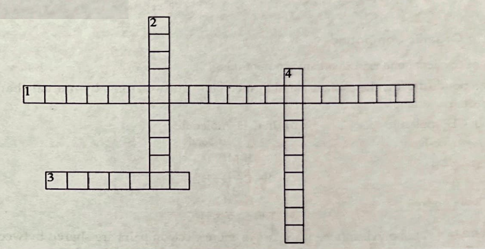

# 4. Allotropes of Carbon

*   The property of an element to exist in two or more different forms in the same physical state is known as **allotropy** and these different forms are called **allotropes**.
*   Allotropes have the same chemical properties, but they differ in their physical properties.
*   Carbon exists in two types of allotropic forms that are crystalline and amorphous. Diamond and graphite are two well-known crystalline forms of carbon.
*   A third form of crystalline carbon was discovered by **H.W. Kroto, E. Smalley and R.F. Curl**. They were awarded Nobel prize in 1996 for the discovery of this allotrope. This form is known as **fullerenes**.

**Allotropes of Carbon:**

*   **Crystalline:**
    *   Diamond
    *   Graphite
    *   Fullerene
*   **Amorphous:**
    *   Lamp black
    *   Charcoal
        *   Wood charcoal
        *   Sugar charcoal
        *   Animal charcoal (Bone charcoal)
    *   Coal

---

## 4.1 Diamond

*   In diamond, each carbon atom is bonded with four other carbon atoms by single covalent bonds only.
*   Each carbon atom is present at the centre of a regular tetrahedron, and the other four carbon atoms linked to it lie at the corners of regular tetrahedron.
*   Thus, diamond exists as three-dimensional network. Since there are no mobile or free electrons, diamond is a bad conductor of electricity.

*c-fig10: Structure and tetrahedral arrangement of atoms in diamond*

*   The C–C bond length in diamond is 154 pm.
*   The directional covalent bonds are present throughout the lattice.
*   Since diamond exists as three-dimensional network solid, it is the hardest substance on earth with high density and melting point.

### Uses of Diamond
*   Since diamond is the hardest substance known, it is used for cutting marble, granite and glass.
*   It is used in making special surgical knives.
*   It is used as an abrasive and for polishing hard surfaces.
*   When a diamond is properly cut, bright light is refracted from its surface, which makes it a precious gem for jewellery.

{: .note }
> **INSIGHTS**
> * Diamonds can be synthesized by subjecting pure carbon to very high pressure and temperature. These synthetic diamonds are small but are otherwise indistinguishable from natural diamonds.
> * Carbon can be one of the least expensive elements (as carbon black or soot) or most expensive (as diamond) element.

---

## 4.2 Graphite

*   Graphite is a greyish-black opaque substance.
*   In graphite, each carbon atom is linked to three other carbon atoms by single covalent bonds.
*   The fourth electron on each carbon atom results in the formation of **$\pi$-bond**.
*   Graphite has sheet like two-dimensional structure with hexagonal layers. The hexagonal rings are fused together and are held together by weak van der Waals' forces. These layers slide over each other which makes graphite soft in touch, and hence, make graphite a good lubricant.

*c-fig11: 2D and 3D structure of graphite showing layered arrangement*

*   C–C bond length in graphite is 141.5 pm and the distance between the two layers is 340 pm.
*   Graphite is a good conductor of electricity.

### Uses of Graphite
*   It is used as a reducing agent in the extraction of metals.
*   Being a good conductor, graphite is used for electrodes in batteries and industrial electrolysis.
*   It is used as a dry lubricant in machines running at high temperature.
*   Mixed with wax and clay, graphite is used for making cores of lead pencils as it can mark paper black, which is why it is often referred to as plumbago or black lead.
*   Graphite crucibles can withstand very high temperature and can be used for melting high-temperature substances.

### Differences Between Diamond and Graphite

| S.No. | Diamond | Graphite |
| :--- | :--- | :--- |
| 1 | It has three-dimensional rigid structure. | It has two-dimensional layered structure. The layers can slip over one another. |
| 2 | It is the hardest substance known. | It is soft and greasy. |
| 3 | It has very high density ($3.514 \text{ g/cm}^3$) | It is less dense (density $= 2.26 \text{ g/cm}^3$) than diamond. |
| 4 | It is a bad conductor of electricity but good conductor of heat. | It is a good conductor of both electricity and heat. |
| 5 | It is a transparent substance. | It is an opaque substance. |

---

## 4.3 Fullerenes

*   Fullerenes are made by heating graphite in an electric arc in the presence of inert gases such as helium or argon.
*   The sooty material formed by condensation of vaporized $C_n$ small molecules consists of mainly $C_{60}$ with smaller quantity of $C_{70}$ and traces of fullerenes consisting of an even number of carbon atoms up to 350 or above.
*   Fullerenes are the only pure form of carbon because they have smooth structure without having 'dangling' bonds.
*   Fullerenes are cage-like molecules. $C_{60}$ molecule has a shape like soccer ball and is called **Buckminsterfullerene**. The name Buckminsterfullerene was given in the honor of American architect Robert Buckminster Fuller who designed geodesic dome structures. It contains twenty six-membered rings and twelve five-membered rings.

*c-11: Structure of Buckminsterfullerene ($C_{60}$)*

*   Each carbon atom forms three sigma bonds with other three carbon atoms. The remaining electron at each carbon is free and can move throughout the structure of fullerene molecules.
*   This ball-shaped molecule has 60 vertices, and each one is occupied by a carbon atom. It also contains both single and double bonds with C — C distances of 143.5 pm and 138.3 pm, respectively.
*   Spherical fullerenes are also called **Bucky balls** in short.

### Uses of Fullerenes
*   Fullerenes in pure state act as insulators but can be converted to semiconductors and superconductors under suitable conditions.
*   Small amounts of fullerene can catalyze the photochemical refining process in industry.
*   Fullerenes help in improving antiwear and antifriction properties of lubricating oils.
*   The ability of Bucky balls or fullerenes, to trap various atoms or molecules makes them useful in the medical field. For example, radioactive $C_{60}$ can be used in cancer therapy as well as in AIDS therapy.

{: .note }
> **INSIGHTS**
> * Bucky balls have been found to inhibit the spread of HIV, according to a study published in 2009 in the Journal of Chemical Information and Modeling. Medical researchers are working to attach drugs, molecule-by-molecule, to Buckyballs in order to deliver medicine directly to sites of infection or tumors in the body. This includes research by Columbia University, Rice University and others.

---

## 4.4 Amorphous Forms of Carbon

Carbon black, coke and charcoal are all impure forms of graphite or fullerenes.

*   **Coke:** When coal is subjected to 'destructive distillation' for the manufacture of oil gas, coke is left as residue in the retort. It is a greyish, hard solid.
*   **Charcoal:** It is a black, soft and highly porous substance. It exists in the following three forms:
    1.  **Wood charcoal:** It is obtained by heating wood in a limited supply of air.
    2.  **Animal charcoal:** It is also called bone charcoal. It is obtained through the destructive distillation of bones. It contains 10% to 20% carbon with the rest being calcium phosphate.
    3.  **Sugar charcoal:** It is obtained by the action of conc. $H_2SO_4$ on sugar.
        $$C_{12}H_{22}O_{11} \xrightarrow{\text{conc. } H_2SO_4} 12C + 11H_2O$$
*   **Carbon black or lamp black:** It is obtained by heating rich hydrocarbons in limited supply of air.
    $$CH_4 + O_2 \xrightarrow{\text{Heat}} C + 2H_2O$$

### Uses
*   Being highly porous, activated charcoal is used in adsorbing poisonous gases. It is also used in water filters to remove organic contaminants and in air-conditioning systems to control odour.
*   Carbon black is used as a black pigment in black ink and as a filler in automobile tyres.
*   Coke is used as fuel and largely as a reducing agent in metallurgy.
*   Animal charcoal and sugar charcoal are used to remove colouring matter.

{: .note }
> **INSIGHTS**
> A carbon nanotube (CNT) is a minuscule, straw-like structure made of carbon atoms. These tubes are extremely useful in a wide variety of electronic, magnetic and mechanical technologies. The diameters of these tubes are so tiny that they are measured in nanometers.
> 1 nanometer = $10^{-9}$ meter (About 10,000 times smaller than a human hair.)

---

## Concept Application Exercise 1

1. The property of self-combination of the atoms of the same element to form long chains is known as
   (1) Protonation (2) Carbonation (3) Coronation (4) Catenation
2. Which of the following is not an allotrope of carbon?
   (1) Diamond (2) Graphite (3) Cumene (4) Fullerene
3. The pencil leads are made of mainly
   (1) Lithium (2) Charcoal (3) Lead (4) Graphite
4. The number of carbon atoms joined in a spherical molecule of buckminsterfullerene is
   (1) Fifty (2) Sixty (3) Seventy (4) Ninety
5. Answer the following riddle.
   I am one element, but in different forms I shine,
   In pencils I write, in jewellery I'm fine.
   I'm as soft as a stroke or as hard as a rock,
   I change my appearance but remain on the block.
   Who am I?
   (1) Nitrogen (2) Carbon (3) Sulphur (4) Iron
6. Answer the following riddle.
   I form when atoms like to share,
   Electrons between them, a balanced pair.
   No ions in sight, just bonds so tight,
   I exist in gases, liquids, and solids light.
   I don't conduct electricity, no charge to see,
   What type of compound could I be?
   _________________________________________________

7. **Match the columns.**

| Column I | Column II |
| :--- | :--- |
| (A) Allotrope of carbon | (i) Hydrocarbons |
| (B) Good lubricant | (ii) Fullerene |
| (C) Compounds of carbon and hydrogen | (iii) Graphite |
| (D) Forming bonds with atoms of same element | (iv) Catenation |

(1) A – (ii), (iii); B – (iii); C – (i); D – (iv). 
(2) A – (iv); B – (iii); C – (ii); D – (i). 
(3) A – (iii); B – (iv); C – (ii); D – (i). 
(4) A – (iii); B – (iv); C – (ii); D – (i).  

8. **Solve the given crossword puzzle.**

| Across | Down |
| :--- | :--- |
| 1. A geodesic dome in the shape of football designed by US architect | 2. Property of carbon responsible for formation of large molecules. |
| 3. A three-dimensional compound with single bonds between each carbon atom. | 4. __________ are the structural modifications of an element having different physical properties and same chemical properties. |
