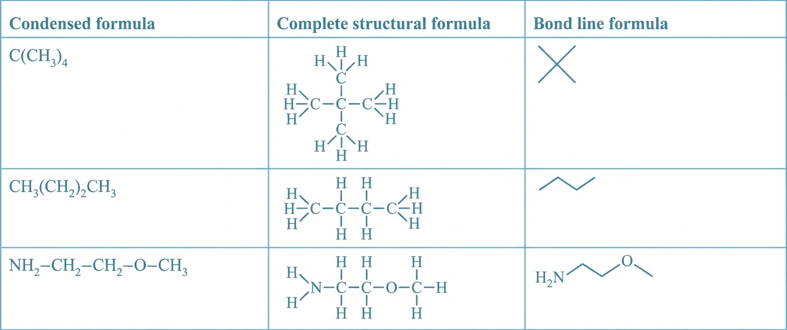
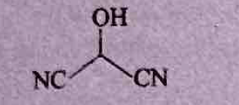

# 5. Organic Compounds

Because of the versatile nature of carbon, it forms many compounds. In the eighteenth century, all known compounds were divided into two categories.

**Compound Classification:**

*   **Organic Compounds:** like urea, sugar, oils, fats, dyes, etc., which were isolated directly or indirectly from living organisms such as animals and plants.
*   **Inorganic Compounds:** like marble, common salt, alum, $CuSO_4$, etc., which were isolated from non-living sources such as rocks and minerals.

---

{: .note }
> **NCERT PLUS**
> * **Old definition of organic compounds:** It was proposed that vital force is necessary for formation of these organic compounds. They can only be obtained from living organisms.
> * **Modern definition of organic compounds:** Compounds of carbon, containing usually hydrogen and one or more other element such as oxygen, nitrogen, sulphur, halogens, phosphorus, etc., are called organic compounds.
> * **Preparation of first organic compound in laboratory:** In 1828, Wohler prepared the first organic compound urea via isomerization reaction by heating ammonium cyanate.
>   $$NH_4CNO \xrightarrow{\text{heat}} NH_2CONH_2$$
>   *(Ammonium cyanate $\rightarrow$ Urea)*

---

## Bonding in Organic Compounds

Two types of covalent bond exist in organic compounds.

### (i) sigma bond ($\sigma$):
It is the covalent bond formed between two atoms by mutual sharing of one pair of electron. For example,

*   **(a) In $CH_4$ molecule:**
    ```
        H
        |
    H — C — H
        |
        H
    ```
    *Total = 4 $\sigma$-bonds*

*   **(b) In $C_2H_6$ molecule:**
    ```
        H   H
        |   |
    H — C — C — H
        |   |
        H   H
    ```
    *Total = 7 $\sigma$-bonds*

### (ii) pi bond ($\pi$):
A pi bond is formed when two or more electron pairs are shared between two atoms. The formation of pi bond takes place only after the formation of a sigma bond. For example, one pi bond is formed in a double ($=$) bond and two pi bonds are formed in a triple ($\equiv$) bond.

*   **(a) In ethene molecule ($C_2H_4$):**
    $H_2C=CH_2$
    *Total $\sigma$-bonds = 5*
    *$\pi$-bonds = 1*

*   **(b) In ethyne molecule ($C_2H_2$):**
    $H—C \equiv C—H$
    *Total $\sigma$-bonds = 3*
    *$\pi$-bonds = 2*

---

## Example 2

Calculate $\sigma$- and $\pi$-bonds in following compounds.
(a) $HC \equiv C—CH=CH—CH_3$
(b) $CH_2=C=CH—CH_3$

**Solution**

(a) $\sigma_{C C C}=4 ; \sigma_{C-H}=6 ; \pi_{C C C}=1 ; \pi_{C C C}=2$

(b) $\sigma_{C-C} = 3$; $\sigma_{C-H} = 6$; $\pi_{C=C} = 2$


---

## Structural Representation of Organic Compounds

There are three ways for representation of organic compounds:

### (i) Complete structural formula:
Such a structural formula focuses on the electrons involved in bond formation. A single dash (–) represents a single bond, double dash (=) is used for double bond and a triple dash (≡) represents triple bond. Lone pairs of electrons on heteroatoms (e.g., oxygen, nitrogen, sulphur, halogens etc.) may or may not be shown.

### (ii) Condensed structural formula:
Structural formulas can be further abbreviated by omitting some or all of the dashes representing covalent bonds and by indicating the number of identical groups attached to an atom by a subscript. The resulting expression of the compounds is called a condensed structural formula.

### (iii) Bond line formula:
In this formula, carbon and hydrogen atoms are not shown and the lines representing carbon-carbon bonds are drawn in a zig-zag fashion. The only atoms specially written are oxygen, chlorine, nitrogen, etc.

**A table comparing the above three methods of structural representation is given below:**


*c-fig13: Comparison of condensed, complete structural, and bond line formulas*

---

## Example 3

Expand each of the following condensed formulas into their complete structural formulas.
(a) $CH_3CH_2COCH_2CH_3$
(b) $CH_3CH=CH(CH_2)_3CH_3$

**Solution**

(a)
```
      H  H  O  H  H
      |  |  || |  |
  H — C — C — C — C — C — H
      |  |     |  |
      H  H     H  H
```

(b)
```
      H  H  H  H  H  H  H
      |  |  |  |  |  |  |
  H — C — C = C — C — C — C — C — H
      |           |  |  |  |
      H           H  H  H  H
```

---

## Example 4

For each of the following compounds, write a condensed formula and also their bond-line formula.
(a) $HOCH_2CH_2CH_2CH(CH_3)CH(CH_3)CH_3$
(b) $N \equiv C — CH(OH) — C \equiv N$

**Solution**

| | Condensed formula | Bond-line formula |
| :--- | :--- | :--- |
| (a) | $HO(CH_2)_3CH(CH_3)CH(CH_3)_2$ |  |
| (b) | $HOCH(CN)_2$ |  |

---

## Types of Carbon and Hydrogen Atoms

There are four types of carbon atoms and three types of hydrogen atoms that can be found in an organic compound.

*   **(i) Primary ($1^\circ$) carbon:** A carbon atom attached to one or no other carbon atoms.
*   **(ii) Secondary ($2^\circ$) carbon:** A carbon atom attached to two other carbon atoms.
*   **(iii) Tertiary ($3^\circ$) carbon:** A carbon atom attached to three other carbon atoms.
*   **(iv) Quaternary ($4^\circ$) carbon:** A carbon atom attached to four other carbon atoms.

Hydrogens attached to primary, secondary, and tertiary carbon atoms are termed as **primary, secondary, and tertiary hydrogen atoms**, respectively.

---

# 6. Saturated and Unsaturated Hydrocarbons

The compounds which contain carbon and hydrogen only are called **hydrocarbons**. They may consist of straight chains, branched chains or rings.

The hydrocarbons in which all the carbon atoms are linked together by single covalent bonds are called **saturated hydrocarbons** while those containing one or more double or triple bonds between carbon atoms are termed as **unsaturated hydrocarbons**.

**Classification of Hydrocarbons:**


*c-fig16: Classification of hydrocarbons into open chain and cyclic forms*


---

## 6.1 Saturated Hydrocarbons

*   In alkanes, no double or triple bonds are present between carbon atoms therefore, they do not undergo addition of hydrogen and are also called **paraffins**. Since alkanes do not undergo addition of hydrogen, they are called saturated hydrocarbons.
*   General formula for alkanes is $C_nH_{2n+2}$ where $n$ is the number of carbon atoms.
*   **A table of some alkanes along with their structure and formula is given below:**

| No. of 'C' atoms | Name | Formula | Structure |
| :--- | :--- | :--- | :--- |
| 1 | Methane | $CH_4$ | (Tetrahedral $CH_4$) |
| 2 | Ethane | $C_2H_6$ | $H_3C—CH_3$ |
| 3 | Propane | $C_3H_8$ | $H_3C—CH_2—CH_3$ |
| 4 | Butane | $C_4H_{10}$ | $H_3C—(CH_2)_2—CH_3$ |
| 5 | Pentane | $C_5H_{12}$ | $H_3C—(CH_2)_3—CH_3$ |
| 6 | Hexane | $C_6H_{14}$ | $H_3C—(CH_2)_4—CH_3$ |

### Dot Structure of Ethane ($C_2H_6$)
To derive the structure of ethane, the following steps are followed.
*   **Step I:** Link the two carbon atoms with a single bond.
*   **Step II:** Three valencies of each carbon atom remain unsatisfied, so each is bonded to three hydrogen atoms, giving the following structure.

**Lewis dot structure of ethane:**
$$ \text{H}:\overset{\text{H}}{\underset{\text{H}}{\text{C}}}:\overset{\text{H}}{\underset{\text{H}}{\text{C}}}:\text{H} $$

### Dot Structure of Propane ($C_3H_8$)
In a similar manner, we can derive the structure of propane.
$$ \text{H}:\overset{\text{H}}{\underset{\text{H}}{\text{C}}}:\overset{\text{H}}{\underset{\text{H}}{\text{C}}}:\overset{\text{H}}{\underset{\text{H}}{\text{C}}}:\text{H} $$

---

{: .note }
> **NCERT PLUS**
> **Physical Properties of Alkanes**
> * Alkanes are almost non-polar molecules because of the covalent nature of C-C and C-H bonds and due to very little difference of electronegativity between carbon and hydrogen atoms.
> * They possess weak van der Waals' forces and due to these weak forces, the first four members, $C_1$ to $C_4$ are gases, $C_5$ to $C_{17}$ are liquids and those containing 18 carbon atoms or more are solids at 298 K.
> * They are colourless and odourless.
> * Boiling point of alkanes increases with increase in molecular mass.

---

## 6.2 Unsaturated Hydrocarbons

The hydrocarbons in which two carbon atoms are bonded to each other by a double (=) or triple (≡) bond are called **unsaturated hydrocarbons**. Unsaturated hydrocarbons are of two types viz. alkenes and alkynes.

### Alkenes ($-C=C-$)
*   The hydrocarbons in which the two carbon atoms are bonded by a double bond are called **alkenes**.
*   Their general formula is $C_nH_{2n}$ where $n$ is the number of carbon atoms.
*   **A table of some alkenes along with their formula and structure is given below:**

| No. of 'C' atoms | Name | Formula | Structure |
| :--- | :--- | :--- | :--- |
| 2 | Ethene | $C_2H_4$ | $CH_2=CH_2$ |
| 3 | Propene | $C_3H_6$ | $CH_3—CH=CH_2$ |
| 4 | Butene | $C_4H_8$ | $CH_3—CH_2—CH=CH_2$ (1-Butene) or $CH_3—CH=CH—CH_3$ (2-Butene) |

#### Formation of Ethene Molecule ($C_2H_4$)
The electronic configuration of carbon atom is 2, 4. There are four valence electrons in one C-atom. Each H-atom contains one valence electron.
$$ \text{H}\cdot + \cdot\text{C}::\text{C}\cdot + \cdot\text{H} \rightarrow H_2C=CH_2 $$

---

{: .note }
> **NCERT PLUS**
> **Physical Properties of Alkenes**
> * Alkenes as a class resemble alkanes in physical properties except in types of isomerism and difference in polar nature.
> * The first three members are gases, the next fourteen are liquids and the higher ones are solids.
> * Ethene is a colourless gas with a faint sweet smell while all other alkenes are colourless and odourless.
> * Alkenes are insoluble in water but fairly soluble in non-polar solvents like benzene, petroleum ether.
> * Boiling point of alkenes increases with increase in size.

---

### Alkynes ($-C \equiv C-$)
*   The hydrocarbons in which two carbon atoms are bonded by a triple bond are called **alkynes**.
*   Their general formula is $C_nH_{2n-2}$ where $n$ is the number of carbon atoms.
*   **A table of some alkynes along with their structure and formula is given below:**

| No. of 'C' atoms | Name | Formula | Structure |
| :--- | :--- | :--- | :--- |
| 2 | Ethyne | $C_2H_2$ | $HC \equiv CH$ |
| 3 | Propyne | $C_3H_4$ | $H_3C—C \equiv CH$ |
| 4 | Butyne | $C_4H_6$ | $H_3C—CH_2—C \equiv CH$ (1-Butyne) or $H_3C—C \equiv C—CH_3$ (2-Butyne) |

#### Formation of ethyne molecule ($C_2H_2$)
$$ \text{H}\cdot + \cdot\text{C}::: \text{C}\cdot + \cdot\text{H} \rightarrow H—C \equiv C—H $$

---

{: .note }
> **NCERT PLUS**
> **Physical Properties of Alkynes**
> * First three members of alkynes are gaseous. The next eight are liquids and the higher ones are solids.
> * All alkynes are colourless.
> * Ethyne has a characteristic odour while other members are odourless.
> * Alkynes are weakly polar in nature. They are lighter than water and immiscible with water but soluble in organic solvents such as ethers, carbon tetrachloride and benzene.
> * Their melting point, boiling point, and density increase with increase in molar mass.

---

{: .note }
> **NOTE**
> Unsaturated hydrocarbons are more reactive than saturated hydrocarbons.

---

## 6.3 Chains, Branches and Rings

On the basis of structure, carbon compounds can be divided into three categories:
(i) Straight chain compounds
(ii) Branched chain compounds
(iii) Closed chain / cyclic / ring compounds

### (i) Straight chain compounds
*   If a carbon compound has carbon-carbon atoms linked in chain fashion, we get a straight chain compound.
*   In these compounds, a carbon can form bond with a maximum of two carbon atoms. For example, $CH_4$ (Methane), $CH_3—CH_3$ (Ethane), $CH_3—CH_2—CH_3$ (Propane), $CH_3—(CH_2)_2—CH_3$ (Butane).

### (ii) Branched chain compounds
*   The alkanes containing three or less carbon atoms do not form branches.
*   The alkanes containing four carbon atoms ($C_4H_{10}$) have two types of arrangement of carbon atoms: **Continuous chain** and **Branched chain**. These are called **structural isomers**.
*   Thus, carbon compounds in which at least one carbon of the chain is linked to three or four other carbon atoms are called branched chain compounds.

### (iii) Closed chain or cyclic or ring hydrocarbons
These hydrocarbons contain closed chain or ring of atoms in their molecules. They can be further classified into two types:

#### (a) Alicyclic hydrocarbons
*   These hydrocarbons contain a ring chain of three or more carbon atoms.
*   These cyclic compounds are named by prefix 'cyclo' before the name of corresponding straight chain hydrocarbon.
*   Examples:


*c-fig20: Examples of alicyclic hydrocarbons - Cyclopropane, Cyclobutane, Cyclopentane*

#### (b) Aromatic hydrocarbons or Unsaturated cyclic carbon compounds
*   These have at least one benzene ring in their molecules.
*   Benzene is a special type of ring of six carbon atoms with three double bonds in alternative positions.


*c-fig21: Structure of Benzene and Phenol*


*c-fig22: Structure of Pyridine (a nitrogen heterocyclic compound)*

---

{: .note }
> **NCERT PLUS**
> **Physical Properties of Aromatic Hydrocarbons**
> * Aromatic hydrocarbons are non-polar in nature.
> * They are colourless liquids or solids with a characteristic aroma. For example, naphthalene balls.
> * Aromatic hydrocarbons are immiscible with water but are readily miscible with organic solvents.
> * They burn with sooty flame.

---

## Concept Application Exercise 2

The questions for Concept Application Exercise 2, based on the classification and structure of hydrocarbons, can be found here:

[**Exercise Questions**](../exercises/04-concept-application-2.html) | [**View Solutions**](../exercises/04-concept-application-2-solutions.html)
