# 7. NOMENCLATURE OF CARBON COMPOUNDS

Nomenclature means a method or a system of naming organic compounds. It implies assigning proper names to various compounds based on certain criteria.

## 7.1 Basic Rules of IUPAC Nomenclature

For naming simple aliphatic compounds, the normal saturated hydrocarbons have been considered the parent compounds and the other compounds as their derivatives obtained by the replacement of one or more hydrogen atoms with various functional groups.

According to IUPAC, each systematic name has two or three of the following parts:

*   **Word root:** The basic unit of a series is the word root which indicates linear or continuous number of carbon atoms.
*   **Suffix:** It represents multiple bond(s) or functional group(s) present in organic compounds. It is of two types:
    (i) **Primary suffix:** Primary suffixes are added to the word root to show saturation or unsaturation in a carbon chain.
    (ii) **Secondary suffix:** Suffixes added after the primary suffix to indicate the presence of a particular functional group in the carbon chain are known as secondary suffixes.
*   **Prefix:** These indicate the substitution of other groups (not regarded as functional group) in place of hydrogen atom in the compound.

### Naming of Straight Chain Hydrocarbons

The name of straight chain hydrocarbon may be divided into two parts:
(a) **Word root** + (b) **Primary suffix**

#### (a) Word roots for carbon chain lengths

| Chain length | Word root | Chain length | Word root |
| :--- | :--- | :--- | :--- |
| \(C_1\) | Meth- | \(C_6\) | Hex- |
| \(C_2\) | Eth- | \(C_7\) | Hept- |
| \(C_3\) | Prop- | \(C_8\) | Oct- |
| \(C_4\) | But- | \(C_9\) | Non- |
| \(C_5\) | Pent- | \(C_{10}\) | Dec- |

#### (b) Primary suffix

| Class of compounds | Primary suffix | General name |
| :--- | :--- | :--- |
| Saturated (\(—C—C—\)) | -ane | Alkane |
| Unsaturated (\(>C=C<\)) | -ene | Alkene |
| Unsaturated (\(—C \equiv C—\)) | -yne | Alkyne |

**Examples:**

| Molecular formula | Word root | Primary suffix | IUPAC Name |
| :--- | :--- | :--- | :--- |
| \(CH_4\) | Meth- | -ane | Methane |
| \(CH_3—CH_3\) | Eth- | -ane | Ethane |
| \(CH_3—CH_2—CH_3\) | Prop- | -ane | Propane |
| \(CH_3—CH_2—CH_2—CH_3\) | But- | -ane | Butane |
| \(CH_2=CH_2\) | Eth- | -ene | Ethene |
| \(CH_3—CH=CH_2\) | Prop- | -ene | Propene |
| \(CH_3—C \equiv CH\) | Prop- | -yne | Propyne |

{: .note }
> **NOTE**
> The name of the compound, in general, is written in the following sequence:
> (Position of substituents) + (prefixes) + (word root) + (primary suffix).

---

## Naming of Branched Chain Hydrocarbons

*   Carbon atoms in the branched-chain hydrocarbons are present as side chain. These side-chain carbon atoms constitute the **alkyl group** or alkyl radicals.
*   An alkyl group is obtained from an alkane by the removal of a hydrogen atom.
*   General formula of alkyl group: \(C_nH_{2n+1}\).
*   An alkyl group is represented by **R**.
*   Some examples of alkyl groups obtained from different alkanes are as follows:

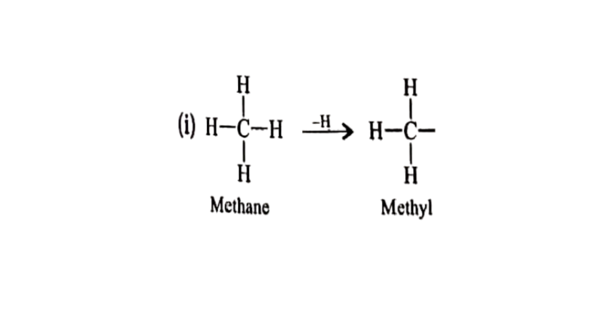

*c-fig25: Derivation of methyl group from methane*

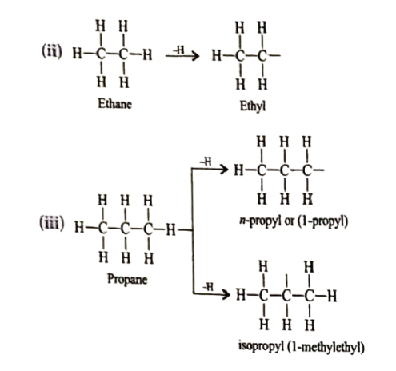
*c-fig26: Derivation of ethyl and propyl groups from ethane and propane respectively*

### General IUPAC Rules for Branched Chain Hydrocarbons

#### Rule 1: Longest chain rule
*   Select the longest possible continuous chain of carbon atoms.
*   If a multiple bond is present, the longest chain selected must contain the multiple bond.
    (i) The number of carbon atoms in the selected chain determines the word root.
    (ii) Saturation or unsaturation determines the primary suffix (P. suffix).
    (iii) Alkyl substituents are indicated by prefixes.

**For example,**

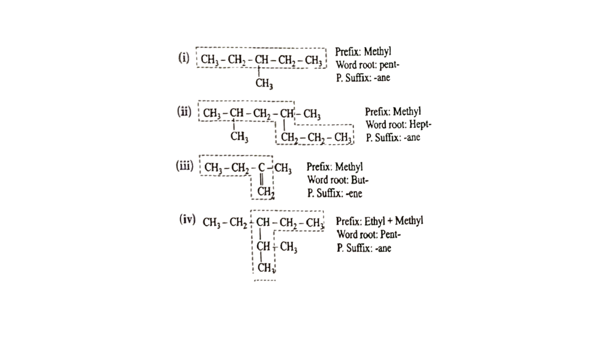
*c-fig27: Examples of selecting the longest chain*

#### Rule 2: Lowest number rule
*   The chain selected is numbered in terms of Arabic numerals and the position of the alkyl group is indicated by the number of the carbon atom to which the alkyl group is attached.
*   Numbering is done in such a way that the substituent carbon atom has the lowest possible number.
*   If a multiple bond is present in the chain, the carbon atoms involved in the multiple bond should get the lowest possible numbers.

**For example,**

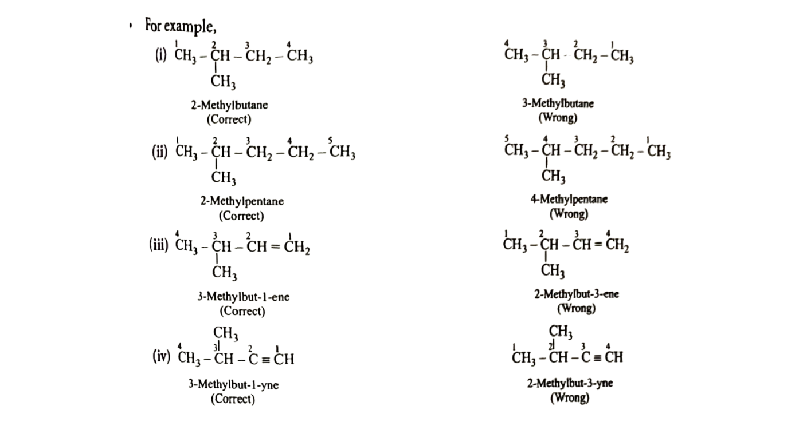
*c-fig28: Correct vs Wrong numbering examples for Rule 2*

#### Rule 3: Use of prefixes di, tri, etc.
*   If the compound contains more than one similar alkyl group, then their positions are indicated separately and an appropriate numerical prefix (di, tri, etc.) is attached to the name of the substituents.
*   The positions of the substituents are separated by commas.

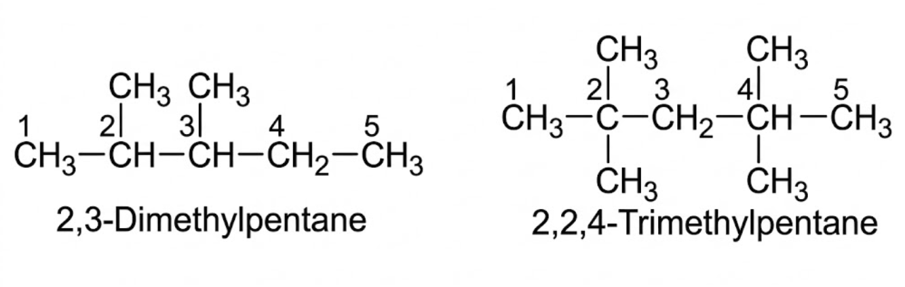

*c-fig29: Examples of using prefixes di and tri for multiple similar substituents*

#### Rule 4: Alphabetical arrangement of prefixes
*   If there are different alkyl substituents present in the compound, then their names are written in alphabetical order.
*   However, numerical prefixes such as di, tri, etc., are not considered during alphabetical arrangement.

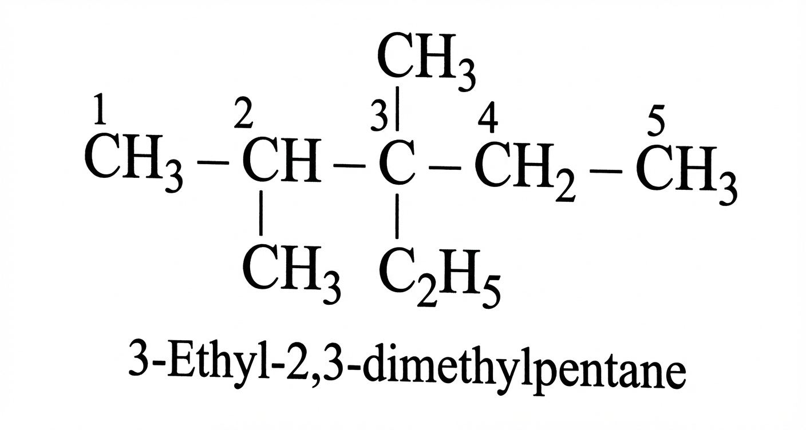

*c-fig30-g: Alphabetical arrangement of ethyl and methyl groups (3-Ethyl-2,3-dimethylpentane)*

#### Rule 5: Naming of different alkyl substituents at the equivalent positions
*   The numbering of the chain is done in such a way that the alkyl group that comes first in alphabetical order gets the lower position.

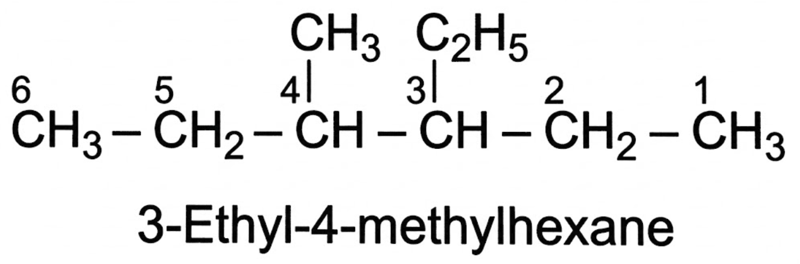

*c-fig31-g: Numbering priority based on alphabetical order (3-Ethyl-4-methylhexane)*

#### Rule 6: Lowest sum rule
*   According to this rule, the numbering of the chain is done in such a way that the sum of positions of different substituents gets a lower value.

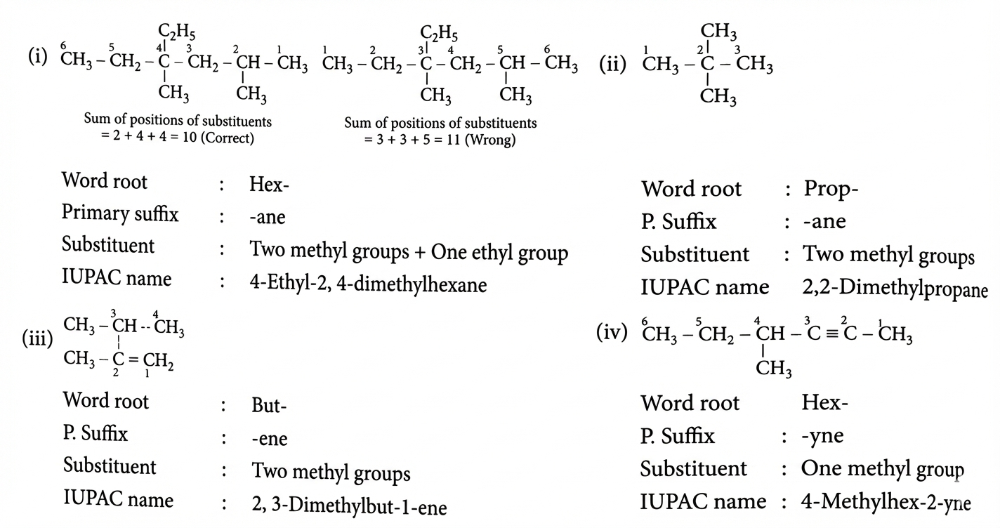
*c-fig32: Examples of applying the lowest sum rule*

---

## 7.2 Nomenclature of Compounds Containing Functional Group

*   In case a functional group (other than \(C=C\) and \(C \equiv C\)) is present in a molecule, then the functional group is indicated by adding **secondary suffix** after the primary suffix.
*   The terminal 'e' of the primary suffix is generally removed before adding the secondary suffix.
*   The terminal 'e' of the primary suffix is removed if it is followed by a suffix beginning with 'a', 'i', 'o', 'u' or 'y'.
*   Some functional groups (such as \(-OR\)) are indicated by the prefixes.
*   The various classes of organic compounds, their functional groups, and their secondary suffixes used to indicate them along with their general IUPAC names, are given in table.
*   It may be mentioned here that the groups \(-NO_2, -OR, -F, -Cl, -Br\) and \(-I\) are considered as substituents and are indicated by prefixes and the groups \(-CONH_2, -COOR, -NH_2, -CN\) and \(-OH\) are considered as functional groups and are indicated by suffixes.

| Functional group structure | General formulae | Class of organic compounds | IUPAC group prefix/Suffix | Examples |
| :--- | :--- | :--- | :--- | :--- |
| \(-X\) (where \(X = F, Cl, Br, I\)) | \(R-X\) | Haloalkanes | Halo- | \(CH_3Cl\) (Chloromethane) |
| \(-NO_2\) | \(R-NO_2\) | Nitro compounds | Nitro- | \(CH_3CH_2NO_2\) (Nitroethane) |
| \(-C-O-C-\) | \(R-O-R\) | Ethers | Alkoxy- | \(CH_3OCH_3\) (Methoxymethane) |
| \(-OH\) | \(R-OH\) | Alcohols | -ol | \(CH_3OH\) (Methanol) |
| \(H-C=O\) | \(R-CHO\) | Aldehydes | -al | \(HCHO\) (Methanal) |
| \(-C=O\) | \(RCOR\) | Ketones | -one | \(CH_3COCH_3\) (Propanone) |
| \(-C(=O)-OH\) | \(R-COOH\) | Carboxylic acids | -oic acid | \(CH_3COOH\) (Ethanoic acid) |
| \(-NH_2\) | \(R-NH_2\) | Amines | -amine | \(CH_3NH_2\) (Methanamine) |
| \(-C \equiv N\) | \(R-CN\) | Nitriles | nitrile | \(CH_3—CN\) (Methane nitrile) |
| \(-C(=O)-NH_2\) | \(R-CONH_2\) | Amides | -amide | \(CH_3CONH_2\) (Ethanamide) |
| \(-C(=O)-O-R\) | \(R-COOR\) | Esters | -oate | \((CH_3COOCH_3)\) (Methyl ethanoate) |
| \(-C(=O)-X\) | \(R-COX\) | Acyl halides | -oyl halide | \(CH_3CH_2COCl\) (Propionyl chloride) |

### Steps for Naming an Organic Compound Containing One Functional Group

*   **Step 1:** Select the longest continuous chain of carbon atoms as the parent chain. The selected chain must include the carbon atoms involved in the functional groups like \(-COOH, -CHO, -CN\), etc., or those that carry the functional groups like \(-OH, -NH_2, -Cl, -NO_2\), etc. The number of carbon atoms in the parent chain decides the word root.
*   **Step 2:** The presence of carbon-carbon multiple bond determines the primary suffix.
*   **Step 3:** The secondary suffix is decided by the functional group.
*   **Step 4:** The carbon atoms of the parent chain are numbered in such a way so that the carbon atom of the functional group gets the lowest possible number. If the functional group does not have a carbon atom, then the carbon atom of the parent chain that is attached to the functional group should get the lowest possible number.
*   **Step 5:** The name of the compound is written as: prefixes + word root + primary suffix + secondary suffix.

**Some examples of functional group naming:**

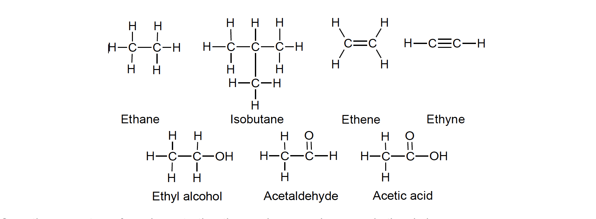
*c-fig18: Common organic structures including Ethane, Isobutane, Ethene, Ethyne, Ethyl alcohol, Acetaldehyde, Acetic acid*

> **TODO: Extract specific step-by-step naming diagrams from pages 32-33 for:**
> (i) 2, 5-Dimethylheptan-1-ol
> (ii) Pent-2-en-1-oic acid or Pent-2-enoic acid
> (iii) Propan-1-amine
> (iv) 1-Nitropropane
> (v) 2-Chlorobutane

---

## Example 7

Give IUPAC name of the following compounds.

(i) \(H_3C-CH_2-CH_2-OH\)

(ii) \(CH_3-CH_2-CH=CH_2\)

(iii) \(CH_3-CH_2-C(=O)OH\)

(iv) \(CH_3-CH_2-C(=O)-CH_3\)

(v) \(CH_3-CH_2-CH_2-CHO\)

(vi) \(CH_3-CH_2-CH(Cl)-CH_3\)

(vii) \(CH_3-C \equiv C-CH_3\)

(viii) \(CH_3-CH(CH_3)-CH_3\)

(ix) \(CH_3-CH(NH_2)-CH_3\)

(x) \(CH_3-CH(CH_3)-CH_2-OH\)

**Solution**

(i) **Word root:** Prop-; **Primary suffix:** -ane; **Secondary suffix:** -ol (Position = 1); **IUPAC name:** 1-Prop + ane - e + ol = **1-propanol**

(ii) **Word root:** But-; **Primary suffix:** -ene (Position = 1); **IUPAC name:** **1-Butene**

(iii) **Word root:** Prop-; **Primary suffix:** -ane; **Secondary suffix:** -oic acid (Position = 1); **Name:** **Propanoic acid**

(iv) **Word root:** But-; **Primary suffix:** -ane; **Secondary suffix:** -one (Position = 2); **Name:** **2-Butanone**

(v) **Word root:** But-; **Primary suffix:** -ane; **Secondary suffix:** -al (Position = 1); **Name:** **Butanal**

(vi) **Word root:** But-; **Primary suffix:** -ane; **Prefix:** Chloro- (Position = 2); **IUPAC name:** **2-Chlorobutane**

(vii) **Word root:** But-; **Primary suffix:** -yne (Position = 2); **IUPAC name:** **But-2-yne**

(viii) **Word root:** Prop-; **Primary suffix:** -ane; **Prefix:** Methyl- (Position = 2); **IUPAC name:** **2-Methylpropane**

(ix) **Word root:** Prop-; **Primary suffix:** -ane; **Secondary suffix:** -amine (Position = 2); **IUPAC name:** **Propan-2-amine**

(x) **Word root:** Prop-; **Primary suffix:** -ane; **Secondary suffix:** -ol (Position = 1); **Prefix:** Methyl- (Position = 2); **IUPAC name:** **2-Methylpropan-1-ol**

---

{: .note }
> **NCERT PLUS**
> **Nomenclature of Polyfunctional Compounds**
> * Polyfunctional compounds are compounds containing more than one functional group in the parent carbon chain. For naming these compounds, one of the functional groups is chosen as the principal functional group and the compound is then named on that basis. The remaining functional groups, which are subordinate functional groups, are named as substituents using the appropriate prefixes. The choice of principal functional group is made on the basis of order of preference. The order of decreasing priority for some functional groups is:
>   \(-COOH, -SO_3H, -COOR (R = alkyl group), COCl, -CONH_2, -CN, -HC=O, >C=O, -OH, -NH_2, >C=C<, -C \equiv C-\)

**Prefixes of some important functional groups are given below:**

| Class of compounds | IUPAC group prefix |
| :--- | :--- |
| Alcohols | hydroxy- |
| Aldehydes | formyl, or oxo |
| Ketones | oxo- |
| Nitriles | cyano |
| Carboxylic acids | carboxy |
| Amines | amino- |

---

# 8. ISOMERISM

Such compounds that have the same molecular formula, but different physical and chemical properties are known as **isomers** and the phenomenon is called **isomerism**. It is of two types:
(i) **Structural isomerism**
(ii) **Stereoisomerism**

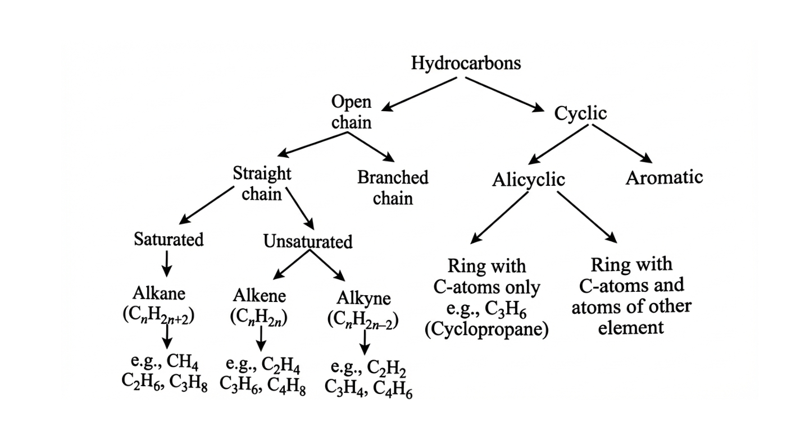
*c-fig16: Classification of hydrocarbons and isomerism overview*

> **TODO: Extract Isomerism flowchart from page 35.**

## Structural Isomerism

Compounds having the same molecular formula but different structures (manners in which atoms are linked) are classified as structural isomers. Some typical examples of different types of structural isomerism are given below:

### (a) Chain isomerism
*   The isomerism in which the isomers differ from each other due to the presence of different carbon chain skeletons is known as chain isomerism. For example,
    (i) **Isomers of** \(C_4H_{10}\): \(CH_3-CH_2-CH_2-CH_3\) (n-Butane) and \(CH_3-CH(CH_3)-CH_3\) (2-Methylpropane or Isobutane).
    (ii) **Isomers of** \(C_5H_{12}\): \(CH_3-CH_2-CH_2-CH_2-CH_3\) (n-pentane), \(CH_3-CH(CH_3)-CH_2-CH_3\) (2-Methylbutane or Isopentane), and \(C(CH_3)_4\) (2,2-Dimethylpropane or neo-pentane).
    (iii) **Isomers of** \(C_4H_8\): \(CH_3-CH_2-CH=CH_2\) (But-1-ene) and \(CH_3-C(CH_3)=CH_2\) (2-Methylpropene).

### (b) Position isomerism
*   In this type of isomerism, isomers differ in structure due to differences in the position of the multiple bond or functional group. For example,
    (i) **Isomers of** \(C_4H_8\): \(CH_3-CH_2-CH=CH_2\) (But-1-ene) and \(CH_3-CH=CH-CH_3\) (But-2-ene).
    (ii) **Isomers of** \(C_3H_8O\): \(CH_3-CH_2-CH_2-OH\) (Propan-1-ol) and \(CH_3-CH(OH)-CH_3\) (Propan-2-ol).

### (c) Functional group isomerism
*   In this type of isomerism, isomers differ in structure due to the presence of different functional groups. For example,
    (i) **Isomers of** \(C_3H_8O\): \(CH_3-CH_2-O-CH_3\) (Methoxy ethane) and \(CH_3-CH_2-CH_2-OH\) (Propan-1-ol).
    (ii) **Isomers of** \(C_4H_6\): \(CH_3-CH_2-C \equiv CH\) (But-1-yne) and \(CH_2=CH-CH=CH_2\) (Buta-1,3-diene).

*c-fig19: Methylethylether and Dimethylamine as examples of functional isomers*

---

## Example 8

Which type of isomerism does the following pair of compounds represents?
Acetic acid (\(CH_3-C(=O)-OH\)) and Methyl formate (\(H-C(=O)-OCH_3\))

**Solution**
The above pairs of compounds represent functional isomerism because they possess same molecular formula \(C_2H_4O_2\) but different functional groups (carboxylic acid and ester).

---

## Example 9

Give the chain isomers of the following compounds.
(a) n-Butane
(b) 1-Butanol
(c) 1-Butene

**Solution**
(a) \(CH_3-CH_2-CH_2-CH_3\) (n-Butane) and \((CH_3)_2CHCH_3\) (2-Methylpropane or Isobutane).
(b) \(CH_3CH_2CH_2CH_2OH\) (1-Butanol) and \((CH_3)_2CHCH_2OH\) (2-Methylpropan-1-ol).
(c) \(CH_3CH_2CH=CH_2\) (1-Butene) and \((CH_3)_2C=CH_2\) (2-Methylpropene).

---

## CONCEPT APPLICATION EXERCISE 3

### Questions

**1. Which compound is 2,2,3-trimethylhexane?**

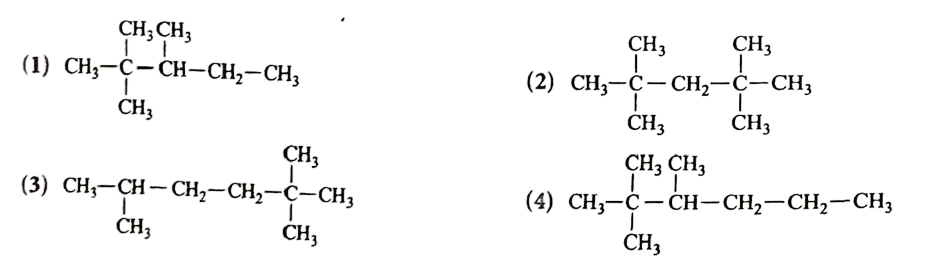
(1) 
(2) 
(3) 
(4) 

**2. The IUPAC name of** \(\left(\mathrm{CH}_3\right)_3 \mathrm{C}-\mathrm{CH}=\mathrm{CH}_2\) **is**
(1) 2,2-Dimethylbut-3-ene
(2) 2,2-Dimethylpent-4-ene
(3) 3,3-Dimethylbut-1-ene
(4) Hex-1-ene

**3. The IUPAC name of the compound having the formula** \(CH \equiv C-CH=CH_2\) **is**
(1) But-1-en-3-yne
(2) But-3-en-1-yne
(3) But-3-yn-1-ene
(4) But-1-yn-3-ene

**4. The molecular formula of a homologue of butane is**
(1) \(C_4H_8\)
(2) \(C_3H_6\)
(3) \(C_4H_6\)
(4) \(C_3H_8\)

**5. One of the following molecular formulas can represent two organic compounds having different functional groups. This molecular formula is**
(1) \(C_5H_{13}N\)
(2) \(C_5H_{10}O\)
(3) \(C_5H_{10}\)
(4) \(C_5H_{12}\)

**6. The number of carbon atoms present in the molecule of fifth member of the homologous series of alkynes is**
(1) Four
(2) Five
(3) Six
(4) Seven

**7. The number of** \(\sigma\)- **and** \(\pi\)-**bonds in 1-butene-3-yne is**
(1) \(5 \sigma\) and \(5 \pi\)
(2) \(7 \sigma\) and \(3 \pi\)
(3) \(8 \sigma\) and \(2 \pi\)
(4) \(6 \sigma\) and \(4 \pi\)

**8. The functional group which always occurs in the middle of a carbon chain is**
(1) Alcohol group
(2) Aldehyde group
(3) Ketone group
(4) Carboxylic group

**9. The molecular formula of an organic compound is** \(C_{48}H_{94}\). **This compound belongs to the homologous series of**
(1) Alkenes
(2) Aldehydes
(3) Alkynes
(4) Alkanes

**10. One of the following molecular formulae represents a ketone. This formula is**
(1) \(C_5H_{12}O\)
(2) \(C_6H_{12}O_2\)
(3) \(C_6H_{14}O\)
(4) \(C_6H_{12}O\)

**11. Answer the following riddle.**
> I'm a functional group with nitrogen and a lone pair,
> I'm found in amines and amides, I'm always there.
> What functional group is me?
(1) Amino
(2) Acyl chloride
(3) Amide
(4) Ammonium

**12. Answer the following riddle.**
> I'm a family where members grow,
> By one carbon and hydrogen in a row.
> Each of us has a common end,
> With -COOH, that's our trend.
> From formic to acetic, we're quite a team,
> What's our series, can you dream?
(1) Homologous series of ketones
(2) Homologous series of aldehydes
(3) Homologous series of alcohols
(4) Homologous series of acids

**13. Answer the following riddle.**
> We share the same atoms, it's true,
> But our arrangements are distinct.
> One's straight, the other's branched or in a ring,
> What are we? Can you predict?
(1) Chain isomers
(2) Structural isomers
(3) Metamers
(4) Functional isomers

**14. Match the columns.**

| Column I | | Column II |
| :--- | :--- | :--- |
| (A) Propane | (i) | \(C_2H_5OH\) |
| (B) Ethyl alcohol | (ii) | \(C_3H_8\) |
| (C) Carboxylic acid | (iii) | \(CH_3COOH\) |
| (D) Ethyl ethanoate | (iv) | \(CH_3COOC_2H_5\) |

### Solutions

1.  **(4)**
    * **Explanation:** To name structure (4), you find the longest chain (6 carbons, "hexane"). Numbering from the end that gives the lowest numbers (from the right), you find two methyl groups on carbon 2 and one methyl group on carbon 3. This is **2,2,3-trimethylhexane**.
    * (1) is 1-ethyl-2,3,3-trimethylcyclopropane.
    * (2) is 2,2,4,4-tetramethylpentane.
    * (3) is 2,2,5-trimethylhexane.

2.  **(3)**
    * **Explanation:** The longest carbon chain that includes the double bond has 4 carbons ("but-"). Number from the end that gives the double bond the lowest number, so it is "but-1-ene". This puts two methyl groups on carbon 3. The full name is **3,3-Dimethylbut-1-ene**.

3.  **(1)**
    * **Explanation:** The chain has 4 carbons ("but-"). It has both a double bond ("-en-") and a triple bond ("-yn-"). When numbering, you give the lowest locant to either the double or triple bond, whichever is first. If there's a tie, the double bond gets the lower number. Numbering from the right gives the double bond position 1 and the triple bond position 3. The name is **But-1-en-3-yne**.

4.  **(4)**
    * **Explanation:** Butane (\(C_4H_{10}\)) is an **alkane** (general formula \(C_nH_{2n+2}\)). A homologue is a compound in the same family. \(C_3H_8\) (Propane) is also an alkane and is therefore a homologue of butane. The other options are alkenes or alkynes.

5.  **(2)**
    * **Explanation:** The formula \(C_5H_{10}O\) (\(C_nH_{2n}O\)) can represent an **aldehyde** (e.g., pentanal) or a **ketone** (e.g., pentan-2-one). Aldehydes and ketones are different functional groups, making them functional isomers.
    * \(C_5H_{12}\) (alkanes) only has structural isomers.
    * \(C_5H_{10}\) (alkene/cycloalkane) and \(C_5H_{13}N\) (amines) are less common examples of functional isomerism.

6.  **(3)**
    * **Explanation:** The alkyne series starts with $n=2$ (Ethyne).
        * 1st member: \(C_2H_2\) (Ethyne)
        * 2nd member: \(C_3H_4\) (Propyne)
        * 3rd member: \(C_4H_6\) (Butyne)
        * 4th member: \(C_5H_8\) (Pentyne)
        * 5th member: \(C_6H_{10}\) (Hexyne). It has **Six** carbon atoms.

7.  **(2)**
    * **Explanation:** The structure is \(CH_2=CH-C \equiv CH\).
    * **Sigma (\(\sigma\)) bonds:** Count all single bonds + 1 for each double/triple bond.
        * C-H bonds: 4
        * C-C bonds: 1 (single), 1 (double), 1 (triple) = 3
        * Total \(\sigma\) bonds = $4 + 3 = 7$
    * **Pi (\(\pi\)) bonds:** Count 1 for each double bond + 2 for each triple bond.
        * 1 (from C=C) + 2 (from C\(\equiv\)C) = 3
    * Total: **\(7 \sigma\) and \(3 \pi\)**

8.  **(3)**
    * **Explanation:** A **Ketone group** (\(R-CO-R\)) is a carbonyl (\(C=O\)) bonded to two other carbon atoms, so it must be in the middle of a chain. Alcohols (\(R-OH\)), Aldehydes (\(R-CHO\)), and Carboxylic acids (\(R-COOH\)) can all be at the end of a chain.

9.  **(3)**
    * **Explanation:** Check the general formulas with $n=48$.
        * Alkanes: \(C_nH_{2n+2}\) -> $2(48)+2 = 98$. (\(C_{48}H_{98}\))
        * Alkenes: \(C_nH_{2n}\) -> $2(48) = 96$. (\(C_{48}H_{96}\))
        * **Alkynes:** \(C_nH_{2n-2}\) -> $2(48)-2 = 94$. (\(C_{48}H_{94}\))
    * The formula \(C_{48}H_{94}\) matches the alkyne series.

10. **(4)**
    * **Explanation:** Ketones have the general formula \(C_nH_{2n}O\) (a 1:2 ratio of C to H, plus one O).
        * (1) \(C_5H_{12}O\): \(C_nH_{2n+2}O\) (Saturated alcohol/ether)
        * (2) \(C_6H_{12}O_2\): \(C_nH_{2n}O_2\) (Carboxylic acid/Ester)
        * (3) \(C_6H_{14}O\): \(C_nH_{2n+2}O\) (Saturated alcohol/ether)
        * (4) \(C_6H_{12}O\): \(C_nH_{2n}O\) (Matches ketone/aldehyde)

11. **(1)**
    * **Explanation:** The **Amino** group (\(-NH_2\)) is the functional group described, which is the key component of both amines and amides.

12. **(4)**
    * **Explanation:** A "homologous series" where members grow ("by \(CH_2\)") and share the "-COOH" functional group is the **Homologous series of acids** (carboxylic acids).

13. **(2)**
    * **Explanation:** The riddle describes **Structural isomers**—compounds with the same molecular formula ("share the same atoms") but different connectivity or arrangement ("arrangements are distinct... straight, branched, or in a ring").

14. **Correct Matches:**
    * (A) Propane \(\rightarrow\) (ii) \(C_3H_8\)
    * (B) Ethyl alcohol \(\rightarrow\) (i) \(C_2H_5OH\)
    * (C) Carboxylic acid \(\rightarrow\) (iii) \(CH_3COOH\) (Acetic acid is an example)
    * (D) Ethyl ethanoate \(\rightarrow\) (iv) \(CH_3COOC_2H_5\) (This is an ester)
