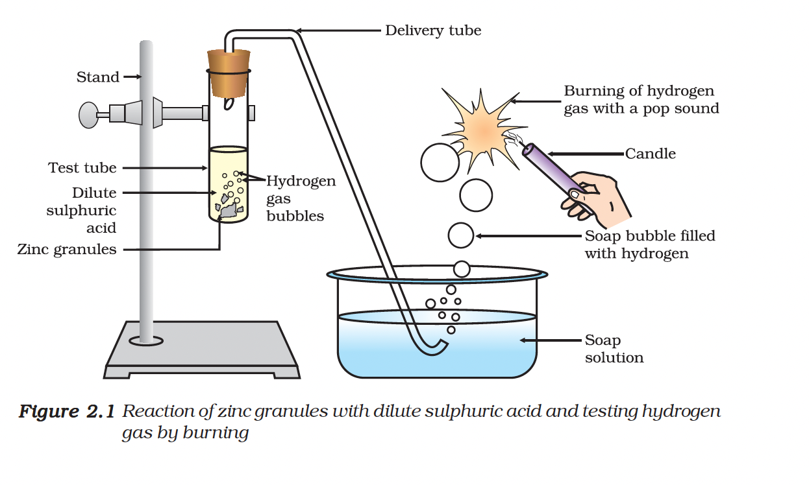
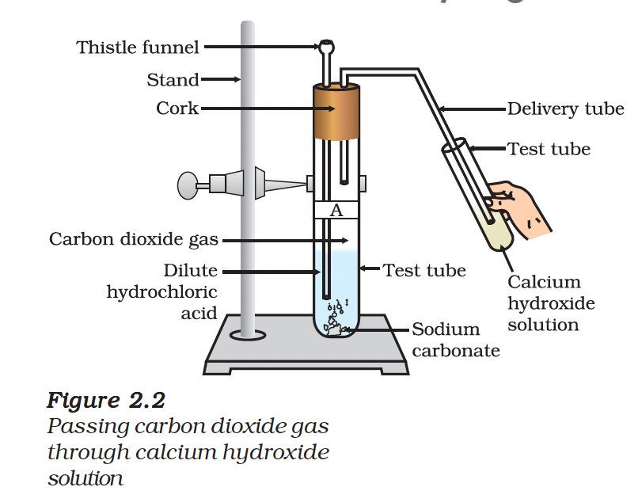

# 2.1 Understanding the Chemical Properties of Acids and Bases

## 2.1.1 Acids and Bases in the Laboratory

### Activity 2.1

Collect the following solutions from the science laboratory:
- Hydrochloric acid (HCl)
- Sulphuric acid ($H_{2}SO_{4}$)
- Nitric acid ($HNO_{3}$)
- Acetic acid ($CH_{3}COOH$)
- Sodium hydroxide (NaOH)
- Calcium hydroxide [$Ca(OH)_{2}$]
- Potassium hydroxide (KOH)
- Magnesium hydroxide [$Mg(OH)_{2}$]
- Ammonium hydroxide ($NH_{4}OH$)

Put a drop of each of the above solutions on a watch-glass one by one and test with indicators.

**Table 2.1**

| Sample solution | Red litmus solution | Blue litmus solution | Phenolphthalein solution | Methyl orange solution |
|:---|:---|:---|:---|:---|
| | | | | |

These indicators tell us whether a substance is acidic or basic by change in colour.

---

### Olfactory Indicators

There are some substances whose odour changes in acidic or basic media. These are called **olfactory indicators**.

### Activity 2.2

- Take some finely chopped onions in a plastic bag along with some strips of clean cloth. Tie up the bag tightly and leave overnight in the fridge.
- The cloth strips can now be used to test for acids and bases.
- Test with dilute HCl and dilute NaOH solutions.
- Similarly, test dilute vanilla essence and clove oil with dilute HCl and dilute NaOH solutions.

Which of these – vanilla, onion and clove, can be used as olfactory indicators?

---

## 2.1.2 How do Acids and Bases React with Metals?

### Activity 2.3

**CAUTION:** This activity needs the teacher's assistance.

- Take about 5 mL of dilute sulphuric acid in a test tube and add a few pieces of zinc granules to it.
- Pass the gas being evolved through the soap solution.
- Take a burning candle near a gas filled bubble.

**Observations:**
- Bubbles are formed in the soap solution
- The gas burns with a 'pop' sound (hydrogen gas)

The metal displaces hydrogen atoms from the acids as hydrogen gas and forms a compound called a **salt**.

### General Reaction

$\text{Acid} + \text{Metal} \rightarrow \text{Salt} + \text{Hydrogen gas}$

**Examples:**

$2HCl + Zn \rightarrow ZnCl_2 + H_2 \uparrow$

$H_2SO_4 + Zn \rightarrow ZnSO_4 + H_2 \uparrow$

---

### Activity 2.4 - Reaction of Base with Metal

- Place a few pieces of granulated zinc metal in a test tube.
- Add 2 mL of sodium hydroxide solution and warm the contents.

**Reaction:**

$2NaOH(aq) + Zn(s) \rightarrow Na_{2}ZnO_{2}(s) + H_{2}(g)$

(Sodium zincate)

Hydrogen is formed in this reaction too. However, such reactions are not possible with all metals.

---

## 2.1.3 How do Metal Carbonates and Metal Hydrogencarbonates React with Acids?

### Activity 2.5

- Take about 0.5 g of sodium carbonate ($Na_{2}CO_{3}$) in test tube A
- Take about 0.5 g of sodium hydrogencarbonate ($NaHCO_{3}$) in test tube B
- Add about 2 mL of dilute HCl to both test tubes
- Pass the gas produced through lime water

**Reactions:**

**Test tube A:**
$Na_{2}CO_{3}(s) + 2HCl(aq) \rightarrow 2NaCl(aq) + H_{2}O(l) + CO_{2}(g)$

**Test tube B:**
$NaHCO_{3}(s) + HCl(aq) \rightarrow NaCl(aq) + H_{2}O(l) + CO_{2}(g)$

**Lime water test:**
$Ca(OH)_{2}(aq) + CO_{2}(g) \rightarrow CaCiteite_{3}(s) + H_{2}O(l)$

(Lime water) → (White precipitate)

**On passing excess carbon dioxide:**
$CaCO_{3}(s) + H_{2}O(l) + CO_{2}(g) \rightarrow Ca(HCO_{3})_{2}(aq)$

(Soluble in water)

> **Note:** Limestone, chalk and marble are different forms of calcium carbonate.

### General Reaction

$\text{Metal carbonate/Metal hydrogencarbonate} + \text{Acid} \rightarrow \text{Salt} + \text{Carbon dioxide} + \text{Water}$

---

## 2.1.4 How do Acids and Bases React with each other?

### Activity 2.6

- Take about 2 mL of dilute NaOH solution in a test tube
- Add two drops of phenolphthalein solution (pink colour appears)
- Add dilute HCl solution drop by drop
- Observe the colour change

**Observation:** The pink colour disappears as the acid neutralises the base.

**Reaction:**
$NaOH(aq) + HCl(aq) \rightarrow NaCl(aq) + H_{2}O(l)$

### Neutralisation Reaction

The reaction between an acid and a base to give a salt and water is known as a **neutralisation reaction**.

$\text{Base} + \text{Acid} \rightarrow \text{Salt} + \text{Water}$

---

## 2.1.5 Reaction of Metallic Oxides with Acids

### Activity 2.7

- Take a small amount of copper oxide in a beaker
- Add dilute hydrochloric acid slowly while stirring

**Observation:** The colour of the solution becomes blue-green (copper(II) chloride is formed).

### General Reaction

$\text{Metal oxide} + \text{Acid} \rightarrow \text{Salt} + \text{Water}$

$CuO + 2HCl \rightarrow CuCl_2 + H_2O$

> Since metallic oxides react with acids to give salts and water (similar to base + acid), **metallic oxides are said to be basic oxides**.

---

## 2.1.6 Reaction of a Non-metallic Oxide with Base

Calcium hydroxide (a base) reacts with carbon dioxide (a non-metallic oxide) to produce a salt and water.

$Ca(OH)_2 + CO_2 \rightarrow CaCO_3 + H_2O$

Since this is similar to the reaction between a base and an acid, we can conclude that **non-metallic oxides are acidic in nature**.

---

## Summary of Reactions

| Reaction Type | General Equation | Products |
|---------------|-----------------|----------|
| Acid + Metal | Acid + Metal → | Salt + H₂ |
| Base + Metal | Base + Metal → | Salt + H₂ |
| Acid + Metal Carbonate | Acid + Carbonate → | Salt + H₂O + CO₂ |
| Acid + Base | Acid + Base → | Salt + H₂O |
| Acid + Metal Oxide | Acid + Metal Oxide → | Salt + H₂O |
| Base + Non-metal Oxide | Base + Non-metal Oxide → | Salt + H₂O |

---

## Questions

1. Why should curd and sour substances not be kept in brass and copper vessels?
2. Which gas is usually liberated when an acid reacts with a metal? Illustrate with an example. How will you test for the presence of this gas?
3. Metal compound A reacts with dilute hydrochloric acid to produce effervescence. The gas evolved extinguishes a burning candle. Write a balanced chemical equation for the reaction if one of the compounds formed is calcium chloride.

### Answers

Here are the answers to your chemistry questions, broken down by topic.

### 1. Storing Curd and Sour Substances in Metal Vessels

Curd and other sour substances should **not** be kept in brass and copper vessels because they contain acids (such as lactic acid in curd).

* **The Reaction:** The acids present in the food stuffs react with the copper and brass (which contains copper) to form **toxic metal salts**.
* **The Result:** These toxic salts spoil the food and make it unfit for consumption, potentially causing food poisoning or other health issues.

---

### 2. Reaction of Acid with Metal

**Which gas is liberated?**
Hydrogen gas ($H_2$) is usually liberated when an acid reacts with a metal.

**Example and Illustration**
When Zinc granules ($Zn$) react with dilute Sulfuric Acid ($H_2SO_4$), Zinc Sulfate and Hydrogen gas are produced.

**Chemical Equation:**
$$Zn(s) + H_2SO_4(aq) \rightarrow ZnSO_4(aq) + H_2(g)$$

[Image of reaction of zinc with dilute sulfuric acid]

**Testing for the presence of Hydrogen gas:**
1.  Set up the apparatus so the evolved gas passes through a soap solution. Bubbles will form because hydrogen is less dense than air.
2.  Bring a burning candle or matchstick near a gas-filled soap bubble.
3.  **Observation:** The gas will burn instantly with a characteristic **"pop" sound**. This confirms the presence of Hydrogen.

---

### 3. Reaction of Metal Compound A

Based on the clues provided, we can identify the compounds and the reaction:

1.  **Identification:**
    * **Effervescence:** Suggests a gas is being released rapidly.
    * **Extinguishes a burning candle:** This is the standard test for **Carbon Dioxide ($CO_2$)**.
    * **Product is Calcium Chloride ($CaCl_2$):** This indicates the metal compound contains Calcium.
    * **Conclusion:** Metal Compound A is **Calcium Carbonate ($CaCO_3$)**.

2.  **Balanced Chemical Equation:**
    $$CaCO_3(s) + 2HCl(aq) \rightarrow CaCl_2(aq) + H_2O(l) + CO_2(g)$$

***

**Would you like me to explain more about the properties of acids and bases or how to identify other gases?**