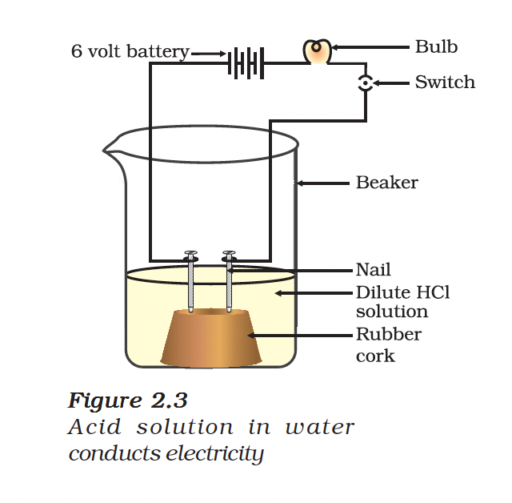
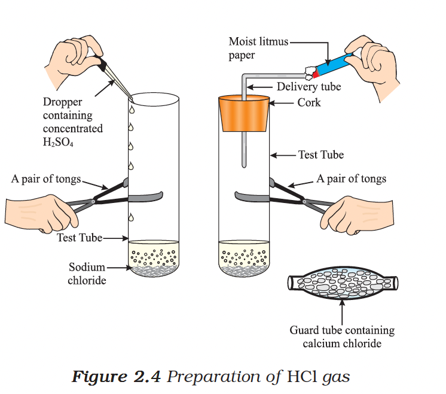

# 2.2 What Do All Acids and All Bases Have in Common?

In Section 2.1 we have seen that all acids have similar chemical properties. What leads to this similarity in properties? We saw that all acids generate hydrogen gas on reacting with metals, so hydrogen seems to be common to all acids.

Let us investigate whether all compounds containing hydrogen are acidic.

---

## Activity 2.8 - Electrical Conductivity Test

- Take solutions of glucose, alcohol, hydrochloric acid, sulphuric acid, etc.
- Fix two nails on a cork, and place the cork in a 100 mL beaker.
- Connect the nails to the two terminals of a 6 volt battery through a bulb and a switch.
- Pour different solutions and observe if the bulb glows.

### Observations

| Solution | Bulb Glows? | Conducts Electricity? |
|----------|-------------|----------------------|
| Dilute HCl | Yes | Yes |
| Dilute H₂SO₄ | Yes | Yes |
| Glucose solution | No | No |
| Alcohol solution | No | No |

The bulb glows in the case of acids because the electric current is carried through the acidic solution by **ions**.

---

## Ions in Acids

Acids contain $H^{+}$ ion as cation and various anions:

| Acid | Formula | Cation | Anion |
|------|---------|--------|-------|
| Hydrochloric acid | HCl | $H^{+}$ | $Cl^{-}$ |
| Nitric acid | $HNO_{3}$ | $H^{+}$ | $NO_{3}^{-}$ |
| Sulphuric acid | $H_{2}SO_{4}$ | $H^{+}$ | $SO_{4}^{2-}$ |
| Acetic acid | $CH_{3}COOH$ | $H^{+}$ | $CH_{3}COO^{-}$ |

> **Key Point:** Since the cation present in acids is $H^{+}$, acids produce hydrogen ions, $H^{+}(aq)$, in solution, which are responsible for their acidic properties.

---

## 2.2.1 What Happens to an Acid or a Base in a Water Solution?

Do acids produce ions only in aqueous solution? Let us test this.

### Activity 2.9 - Dry HCl Gas Test

- Take about 1g solid NaCl in a clean and dry test tube.
- Add some concentrated sulphuric acid to the test tube.
- Test the gas evolved with dry and wet blue litmus paper.

### Observations

| Litmus Paper | Colour Change? |
|--------------|----------------|
| Dry blue litmus | No change |
| Wet blue litmus | Turns red |

This experiment suggests that **hydrogen ions in HCl are produced only in the presence of water**.

---

## Formation of Hydronium Ion

The separation of $H^{+}$ ion from HCl molecules cannot occur in the absence of water.

$HCl + H_{2}O \rightarrow H_{3}O^{+} + Cl^{-}$

Hydrogen ions cannot exist alone, but they exist after combining with water molecules. Thus hydrogen ions must always be shown as $H^{+}(aq)$ or **hydronium ion** ($H_{3}O^{+}$).

$H^{+} + H_{2}O \rightarrow H_{3}O^{+}$

---

## Bases in Water

When a base is dissolved in water:

$NaOH(s) \overset{H_2O}{\longrightarrow} Na^{+}(aq) + OH^{-}(aq)$

$KOH(s) \overset{H_2O}{\longrightarrow} K^{+}(aq) + OH^{-}(aq)$

$Mg(OH)_{2}(s) \overset{H_2O}{\longrightarrow} Mg^{2+}(aq) + 2OH^{-}(aq)$

**Bases generate hydroxide ($OH^{-}$) ions in water.**

> **Definition:** Bases which are soluble in water are called **alkalis**.

> **Do You Know?**
> 
> All bases do not dissolve in water. An alkali is a base that dissolves in water. They are soapy to touch, bitter and corrosive. Never taste or touch them as they may cause harm.

---

## Neutralisation Reaction Revisited

Now that we have identified that:
- All acids generate $H^{+}(aq)$
- All bases generate $OH^{-}(aq)$

We can view the neutralisation reaction as:

$\text{Acid} + \text{Base} \rightarrow \text{Salt} + \text{Water}$

$HX + MOH \rightarrow MX + HOH$

$H^{+}(aq) + OH^{-}(aq) \rightarrow H_{2}O(l)$

---

## Mixing Acids and Bases with Water

### Activity 2.10

- Take 10 mL water in a beaker.
- Add a few drops of concentrated $H_{2}SO_{4}$ to it and swirl the beaker slowly.
- Touch the base of the beaker.

**Observation:** The beaker becomes hot. This is an **exothermic process**.

> **Warning:** The process of dissolving an acid or a base in water is a highly exothermic one.

### Safety Precaution

**The acid must always be added slowly to water with constant stirring.**

If water is added to a concentrated acid:
- The heat generated may cause the mixture to splash out and cause burns
- The glass container may break due to excessive local heating

---

## Dilution

Mixing an acid or base with water results in **decrease in the concentration of ions** ($H_{3}O^{+}/OH^{-}$) per unit volume. Such a process is called **dilution** and the acid or the base is said to be **diluted**.

---

## Summary

| Substance | Ions Produced in Water |
|-----------|----------------------|
| **Acids** | $H^{+}(aq)$ or $H_{3}O^{+}$ (Hydronium ions) |
| **Bases** | $OH^{-}(aq)$ (Hydroxide ions) |

---

## Questions

1. Why do HCl, $HNO_{3}$, etc., show acidic characters in aqueous solutions while solutions of compounds like alcohol and glucose do not show acidic character?
2. Why does an aqueous solution of an acid conduct electricity?
3. Why does dry HCl gas not change the colour of the dry litmus paper?
4. While diluting an acid, why is it recommended that the acid should be added to water and not water to the acid?
5. How is the concentration of hydronium ions ($H_{3}O^{+}$) affected when a solution of an acid is diluted?
6. How is the concentration of hydroxide ions ($OH^{-}$) affected when excess base is dissolved in a solution of sodium hydroxide?

