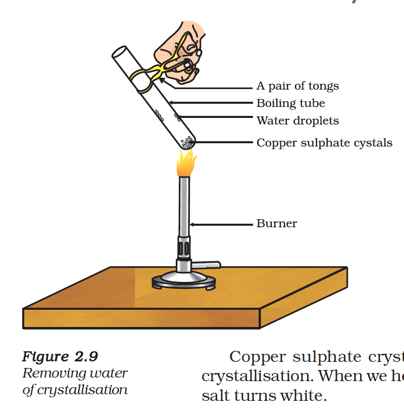

# 2.4 More About Salts

In the previous sections we have seen the formation of salts during various reactions. Let us understand more about their preparation, properties and uses.

---

## 2.4.1 Family of Salts

### Activity 2.13

Write the chemical formulae of the salts given below:
- Potassium sulphate
- Sodium sulphate
- Calcium sulphate
- Magnesium sulphate
- Copper sulphate
- Sodium chloride
- Sodium nitrate
- Sodium carbonate
- Ammonium chloride

Identify the acids and bases from which these salts may be obtained.

> **Note:** Salts having the same positive or negative radicals are said to belong to a **family**.

**Examples:**
- \(NaCl\) and \(Na_{2}SO_{4}\) belong to the family of **sodium salts**
- \(NaCl\) and \(KCl\) belong to the family of **chloride salts**

---

## 2.4.2 pH of Salts

### Activity 2.14

Collect salt samples and check their pH using distilled water and pH paper.

**Table 2.4**

| Salt | pH | Acid used | Base used |
| :--- | :--- | :--- | :--- |
| Sodium chloride | 7 | \(HCl\) (Strong) | \(NaOH\) (Strong) |
| Sodium carbonate | >7 | \(H_{2}CO_{3}\) (Weak) | \(NaOH\) (Strong) |
| Ammonium chloride | <7 | \(HCl\) (Strong) | \(NH_{4}OH\) (Weak) |

### Rules for Salt pH

| Salt Type | pH Value | Nature |
| :--- | :--- | :--- |
| Strong acid + Strong base | 7 | Neutral |
| Strong acid + Weak base | < 7 | Acidic |
| Weak acid + Strong base | > 7 | Basic |

---

## 2.4.3 Chemicals from Common Salt

By now you have learnt that the salt formed by the combination of hydrochloric acid and sodium hydroxide solution is called **sodium chloride**. This is the salt you use in food. It is a neutral salt.

### Sources of Common Salt

- **Seawater:** Contains many dissolved salts; sodium chloride is separated from these
- **Rock salt:** Large crystals often brown due to impurities; formed when seas of bygone ages dried up

> **Historical Note:** You must have heard about Mahatma Gandhi's Dandi March. Sodium chloride was an important symbol in our struggle for freedom!

---

### Common Salt — A Raw Material for Chemicals

Common salt is an important raw material for:
- Sodium hydroxide
- Baking soda
- Washing soda
- Bleaching powder

---

### Sodium Hydroxide (Chlor-alkali Process)

When electricity is passed through an aqueous solution of sodium chloride (called **brine**), it decomposes to form sodium hydroxide.

$$2NaCl(aq) + 2H_{2}O(l) \rightarrow 2NaOH(aq) + Cl_{2}(g) + H_{2}(g)$$

The process is called the **chlor-alkali process** because of the products formed:
- **Chlor** for chlorine
- **Alkali** for sodium hydroxide

| Product | Formed At |
| :--- | :--- |
| Chlorine gas | Anode |
| Hydrogen gas | Cathode |
| Sodium hydroxide | Near the cathode |

---

### Bleaching Powder

Chlorine produced during electrolysis is used for manufacturing bleaching powder.

**Preparation:**
$$Ca(OH)_{2} + Cl_{2} \rightarrow CaOCl_{2} + H_{2}O$$

(Slaked lime) + (Chlorine) → (Bleaching powder)

Bleaching powder is represented as \(CaOCl_{2}\) (or \(Ca(ClO)_2\)) though the actual composition is quite complex.

**Uses of Bleaching Powder:**
1. For bleaching cotton and linen in the textile industry
2. For bleaching wood pulp in paper factories
3. For bleaching washed clothes in laundry
4. As an oxidising agent in many chemical industries
5. To make drinking water free from germs

---

### Baking Soda (Sodium Hydrogencarbonate)

**Chemical name:** Sodium hydrogencarbonate (\(NaHCO_{3}\))

**Preparation:**
$$NaCl + H_{2}O + CO_{2} + NH_{3} \rightarrow NH_{4}Cl + NaHCO_{3}$$

**Reaction on heating:**
$$2NaHCO_{3} \xrightarrow{Heat} Na_{2}CO_{3} + H_{2}O + CO_{2}$$

**Uses of Baking Soda:**

1. **Making baking powder:** A mixture of baking soda and a mild edible acid such as tartaric acid
   $$NaHCO_{3} + H^{+} \rightarrow CO_{2} + H_{2}O + \text{Sodium salt of acid}$$
   Carbon dioxide produced makes bread or cake rise, making them soft and spongy.

2. **Antacids:** Being alkaline, it neutralises excess acid in the stomach

3. **Soda-acid fire extinguishers**

---

### Washing Soda (Sodium Carbonate Decahydrate)

**Chemical formula:** \(Na_{2}CO_{3}.10H_{2}O\)

**Preparation:**
Sodium carbonate obtained by heating baking soda; recrystallisation gives washing soda.
$$Na_{2}CO_{3} + 10H_{2}O \rightarrow Na_{2}CO_{3}.10H_{2}O$$

It is also a basic salt.

**Uses of Washing Soda:**
1. Used in glass, soap and paper industries
2. Used in the manufacture of sodium compounds such as borax
3. Used as a cleaning agent for domestic purposes
4. Used for removing permanent hardness of water

---

## 2.4.4 Are the Crystals of Salts really Dry?

### Activity 2.15

- Heat a few crystals of copper sulphate in a dry boiling tube
- Observe the colour change
- Add 2-3 drops of water on the sample obtained after heating

### Observations

| State | Colour |
| :--- | :--- |
| Hydrated copper sulphate | Blue |
| After heating (anhydrous) | White |
| After adding water | Blue (restored) |

---

### Water of Crystallisation

**Definition:** Water of crystallisation is the **fixed number of water molecules present in one formula unit of a salt**.

| Salt | Formula | Water Molecules |
| :--- | :--- | :--- |
| Copper sulphate | \(CuSO_{4}.5H_{2}O\) | 5 |
| Washing soda | \(Na_{2}CO_{3}.10H_{2}O\) | 10 |
| Gypsum | \(CaSO_{4}.2H_{2}O\) | 2 |

---

### Plaster of Paris

On heating gypsum at **373 K**, it loses water molecules and becomes **calcium sulphate hemihydrate**.

$$CaSO_{4}.2H_{2}O \xrightarrow{373K} CaSO_{4}.\frac{1}{2}H_{2}O + 1\frac{1}{2}H_{2}O$$

This is called **Plaster of Paris**.

**Setting reaction:**
$$CaSO_{4}.\frac{1}{2}H_{2}O + 1\frac{1}{2}H_{2}O \rightarrow CaSO_{4}.2H_{2}O$$

(Plaster of Paris) + (Water) → (Gypsum - hard solid mass)

> **Note:** Only half a water molecule is shown because two formula units of \(CaSO_{4}\) share one molecule of water.

**Uses of Plaster of Paris:**
- Plaster for supporting fractured bones
- Making toys
- Materials for decoration
- Making surfaces smooth

---

## Questions

1. What is the common name of the compound \(CaOCl_{2}\)?
2. Name the substance which on treatment with chlorine yields bleaching powder.
3. Name the sodium compound which is used for softening hard water.
4. What will happen if a solution of sodium hydrogencarbonate is heated? Give the equation of the reaction involved.
5. Write an equation to show the reaction between Plaster of Paris and water.
