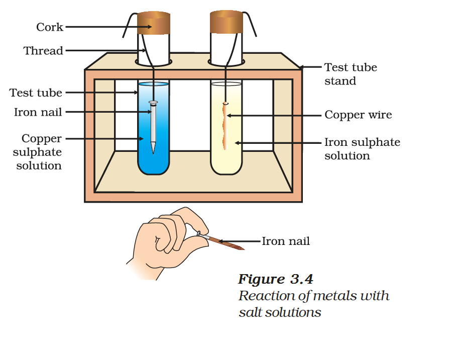

# 3.2 Chemical Properties of Metals

## 3.2.1 What happens when Metals are burnt in Air?

Almost all metals combine with oxygen to form metal oxides.

$$\text{Metal} + \text{Oxygen} \rightarrow \text{Metal oxide}$$

For example, when copper is heated in air, it combines with oxygen to form copper(II) oxide, a black oxide.

$$2Cu + O_2 \rightarrow 2CuO$$

Similarly, aluminium forms aluminium oxide.

$$4Al + 3O_2 \rightarrow 2Al_2O_3$$

Metal oxides are basic in nature. But some metal oxides, such as aluminium oxide and zinc oxide, show both acidic as well as basic behaviour. Such metal oxides which react with both acids as well as bases to produce salts and water are known as **amphoteric oxides**.

$$Al_2O_3 + 6HCl \rightarrow 2AlCl_3 + 3H_2O$$

$$Al_2O_3 + 2NaOH \rightarrow 2NaAlO_2 + H_2O$$

Most metal oxides are insoluble in water but some dissolve in water to form alkalis:

$$Na_2O(s) + H_2O(l) \rightarrow 2NaOH(aq)$$

$$K_2O(s) + H_2O(l) \rightarrow 2KOH(aq)$$

{: .note }
> **Do You Know?**
> Anodising is a process of forming a thick oxide layer of aluminium. Aluminium develops a thin oxide layer when exposed to air. This aluminium oxide coat makes it resistant to further corrosion. During anodising, a clean aluminium article is made the anode and is electrolysed with dilute sulphuric acid.

---

## 3.2.2 What happens when Metals react with Water?

Metals react with water and produce a metal oxide and hydrogen gas. Metal oxides that are soluble in water dissolve in it to further form metal hydroxide.

$$\text{Metal} + \text{Water} \rightarrow \text{Metal oxide} + \text{Hydrogen}$$

$$\text{Metal oxide} + \text{Water} \rightarrow \text{Metal hydroxide}$$

Metals like potassium and sodium react violently with cold water:

$$2K(s) + 2H_2O(l) \rightarrow 2KOH(aq) + H_2(g) + \text{heat energy}$$

$$2Na(s) + 2H_2O(l) \rightarrow 2NaOH(aq) + H_2(g) + \text{heat energy}$$

The reaction of calcium with water is less violent:

$$Ca(s) + 2H_2O(l) \rightarrow Ca(OH)_2(aq) + H_2(g)$$

Metals like aluminium, iron and zinc do not react either with cold or hot water. But they react with steam:

*Figure 3.3: Action of steam on a metal*

$$2Al(s) + 3H_2O(g) \rightarrow Al_2O_3(s) + 3H_2(g)$$

$$3Fe(s) + 4H_2O(g) \rightarrow Fe_3O_4(s) + 4H_2(g)$$

Metals such as lead, copper, silver and gold do not react with water at all.

---

## 3.2.3 What happens when Metals react with Acids?

$$\text{Metal} + \text{Dilute acid} \rightarrow \text{Salt} + \text{Hydrogen}$$

The reactivity decreases in the order: $Mg > Al > Zn > Fe$. Copper does not react with dilute HCl.

{: .note }
> **Do You Know?**
> Aqua regia (Latin for 'royal water') is a freshly prepared mixture of concentrated hydrochloric acid and concentrated nitric acid in the ratio of 3:1. It can dissolve gold, even though neither of these acids can do so alone.

Hydrogen gas is not evolved when a metal reacts with nitric acid because $HNO_3$ is a strong oxidising agent. It oxidises the $H_2$ produced to water and itself gets reduced to any of the nitrogen oxides ($N_2O$, $NO$, $NO_2$). But magnesium (Mg) and manganese (Mn) react with very dilute $HNO_3$ to evolve $H_2$ gas.

---

## 3.2.4 How do Metals react with Solutions of other Metal Salts?

Reactive metals can displace less reactive metals from their compounds in solution or molten form.

$$\text{Metal A} + \text{Salt solution of B} \rightarrow \text{Salt solution of A} + \text{Metal B}$$

*Figure 3.4: Reaction of metals with salt solutions*

---

## 3.2.5 The Reactivity Series

The reactivity series is a list of metals arranged in the order of their decreasing activities.

| Metal | Symbol | Reactivity |
| :--- | :--- | :--- |
| Potassium | K | Most reactive |
| Sodium | Na | |
| Calcium | Ca | |
| Magnesium | Mg | |
| Aluminium | Al | |
| Zinc | Zn | Reactivity decreases |
| Iron | Fe | |
| Lead | Pb | |
| [Hydrogen] | [H] | |
| Copper | Cu | |
| Mercury | Hg | |
| Silver | Ag | |
| Gold | Au | Least reactive |
