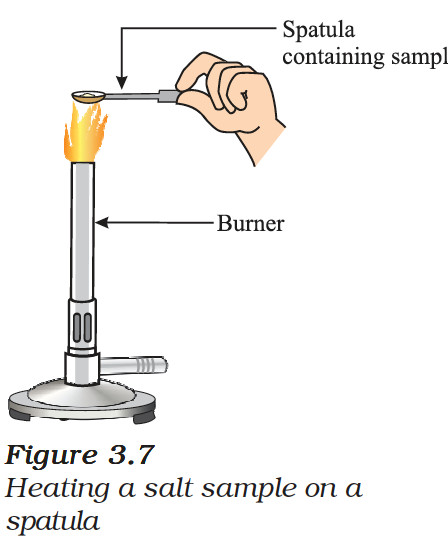
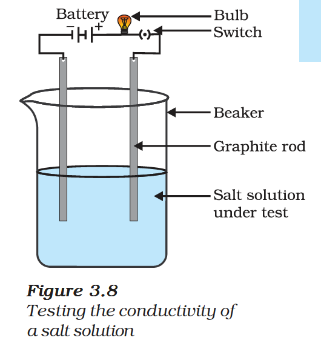

# 3.3 How do Metals and Non-metals React?

Noble gases, which have a completely filled valence shell, show little chemical activity. We explain the reactivity of elements as a tendency to attain a completely filled valence shell.

A sodium atom has one electron in its outermost shell. If it loses the electron from its M shell then its L shell now becomes the outermost shell and that has a stable octet. The nucleus still has 11 protons but the number of electrons has become 10, so there is a net positive charge giving us a sodium cation $Na^+$.

On the other hand chlorine has seven electrons in its outermost shell and it requires one more electron to complete its octet. After gaining an electron, the chlorine atom gets a unit negative charge giving us a chloride anion $Cl^-$.

$$Na \rightarrow Na^+ + e^-$$
$$(2,8,1) \quad (2,8)$$

$$Cl + e^- \rightarrow Cl^-$$
$$(2,8,7) \quad (2,8,8)$$

Sodium and chloride ions, being oppositely charged, attract each other and are held by strong electrostatic forces of attraction to exist as **sodium chloride (NaCl)**.

*Figure 3.5: Formation of sodium chloride*

Similarly, for the formation of **magnesium chloride**:

$$Mg \rightarrow Mg^{2+} + 2e^-$$
$$(2,8,2) \quad (2,8)$$

*Figure 3.6: Formation of magnesium chloride*

The compounds formed by the transfer of electrons from a metal to a non-metal are known as **ionic compounds** or **electrovalent compounds**.

---

## 3.3.1 Properties of Ionic Compounds

*Figure 3.7: Heating a salt sample on a spatula*

*Figure 3.8: Testing the conductivity of a salt solution*

**(i) Physical nature:** Ionic compounds are solids and are somewhat hard because of the strong force of attraction between the positive and negative ions. These compounds are generally brittle and break into pieces when pressure is applied.

**(ii) Melting and Boiling points:** Ionic compounds have high melting and boiling points. This is because a considerable amount of energy is required to break the strong inter-ionic attraction.

| Ionic compound | Melting point (K) | Boiling point (K) |
| :--- | :---: | :---: |
| NaCl | 1074 | 1686 |
| LiCl | 887 | 1600 |
| $CaCl_2$ | 1045 | 1900 |
| CaO | 2850 | 3120 |
| $MgCl_2$ | 981 | 1685 |

**(iii) Solubility:** Electrovalent compounds are generally soluble in water and insoluble in solvents such as kerosene, petrol, etc.

**(iv) Conduction of Electricity:** A solution of an ionic compound in water contains ions, which move to the opposite electrodes when electricity is passed through the solution. Ionic compounds in the solid state do not conduct electricity because movement of ions in the solid is not possible due to their rigid structure. But ionic compounds conduct electricity in the molten state.
