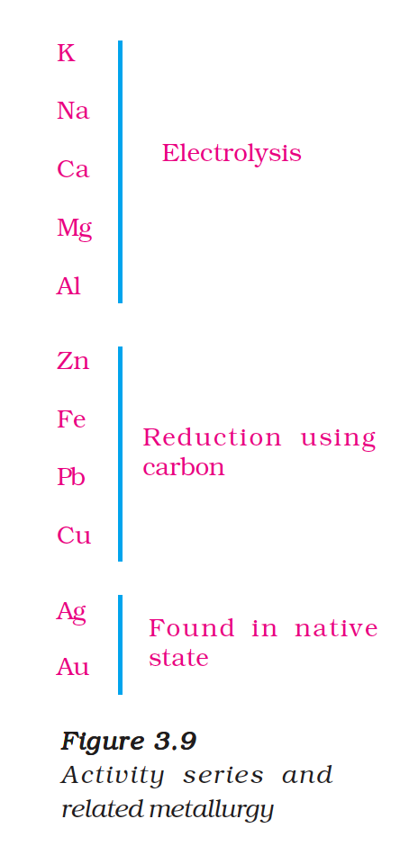
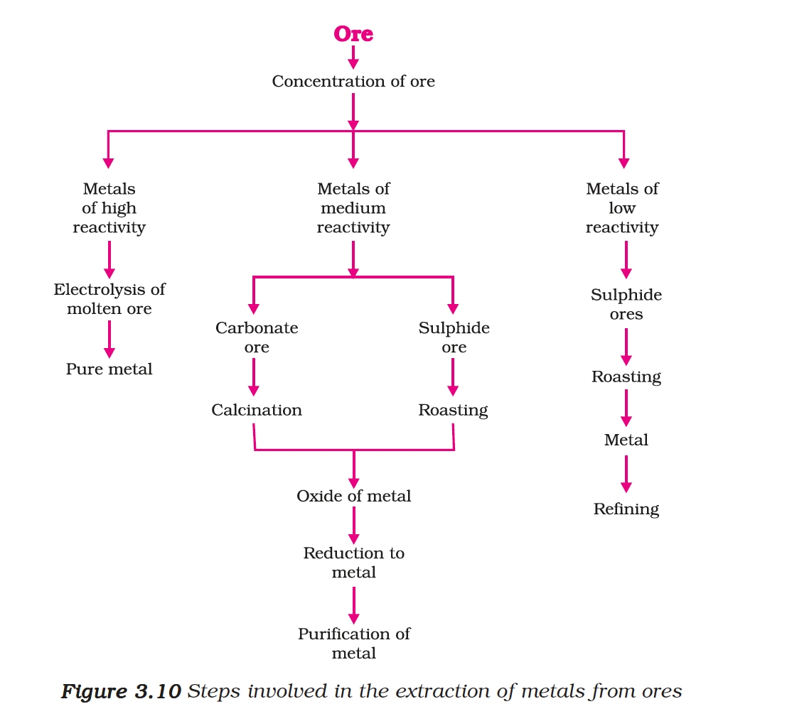
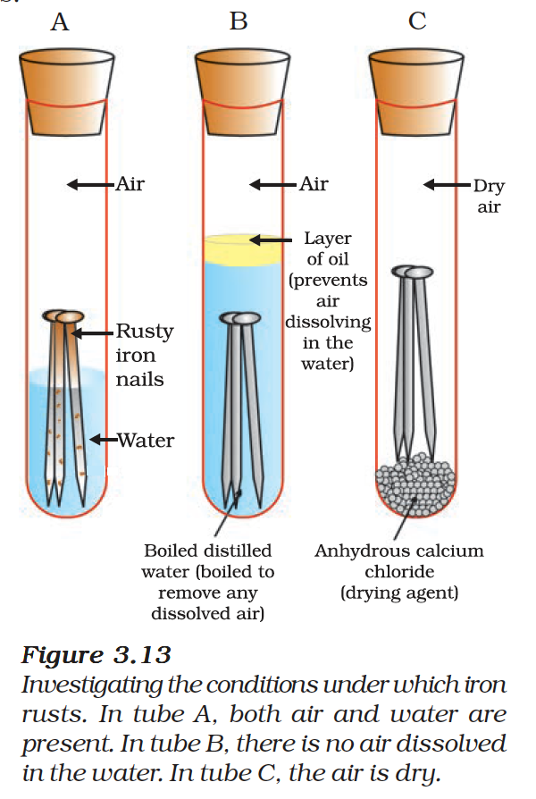

# 3.4 Occurrence of Metals

The earth's crust is the major source of metals. The elements or compounds, which occur naturally in the earth's crust, are known as **minerals**. At some places, minerals contain a very high percentage of a particular metal and the metal can be profitably extracted from it. These minerals are called **ores**.

---

## 3.4.1 Extraction of Metals

On the basis of reactivity, we can group the metals into three categories:
1. **Metals of low reactivity** (Cu, Ag, Au)
2. **Metals of medium reactivity** (Zn, Fe, Pb)
3. **Metals of high reactivity** (K, Na, Ca, Mg, Al)

*Figure 3.9: Activity series and related metallurgy*

*Figure 3.10: Steps involved in the extraction of metals from ores*

---

## 3.4.2 Enrichment of Ores

Ores mined from the earth are usually contaminated with large amounts of impurities such as soil, sand, etc., called **gangue**. The impurities must be removed from the ore prior to the extraction of the metal.

---

## 3.4.3 Extracting Metals Low in the Activity Series

The oxides of these metals can be reduced to metals by heating alone. For example, cinnabar (HgS) is an ore of mercury:

$$2HgS(s) + 3O_2(g) \xrightarrow{Heat} 2HgO(s) + 2SO_2(g)$$

$$2HgO(s) \xrightarrow{Heat} 2Hg(l) + O_2(g)$$

Similarly, copper which is found as $Cu_2S$ in nature:

$$2Cu_2S + 3O_2(g) \xrightarrow{Heat} 2Cu_2O(s) + 2SO_2(g)$$

$$2Cu_2O + Cu_2S \xrightarrow{Heat} 6Cu(s) + SO_2(g)$$

---

## 3.4.4 Extracting Metals in the Middle of the Activity Series

These are usually present as sulphides or carbonates in nature. Prior to reduction, metal sulphides and carbonates must be converted into metal oxides.

**Roasting:** The sulphide ores are converted into oxides by heating strongly in the presence of excess air.

$$2ZnS(s) + 3O_2(g) \xrightarrow{Heat} 2ZnO(s) + 2SO_2(g)$$

**Calcination:** The carbonate ores are changed into oxides by heating strongly in limited air.

$$ZnCO_3(s) \xrightarrow{Heat} ZnO(s) + CO_2(g)$$

The metal oxides are then reduced using carbon:

$$ZnO(s) + C(s) \rightarrow Zn(s) + CO(g)$$

Sometimes displacement reactions can also be used. The **thermit reaction** is used to join railway tracks:

$$Fe_2O_3(s) + 2Al(s) \rightarrow 2Fe(l) + Al_2O_3(s) + \text{Heat}$$

---

## 3.4.5 Extracting Metals towards the Top of the Activity Series

These metals are obtained by **electrolytic reduction**. For example, sodium is obtained by the electrolysis of molten sodium chloride:

At cathode: $Na^+ + e^- \rightarrow Na$

At anode: $2Cl^- \rightarrow Cl_2 + 2e^-$

Similarly, aluminium is obtained from alumina ($Al_2O_3$) by electrolytic reduction.

---

## 3.4.6 Refining of Metals

The most widely used method for refining impure metals is **electrolytic refining**. In this process:
- The impure metal is made the **anode**
- A thin strip of pure metal is made the **cathode**
- A solution of the metal salt is used as the **electrolyte**

On passing the current, the pure metal from the anode dissolves into the electrolyte. An equivalent amount of pure metal from the electrolyte is deposited on the cathode.

---

# 3.5 Corrosion

You must have observed that iron articles are shiny when new, but get coated with a reddish brown powder when left for some time. This process is commonly known as **rusting of iron**.

$$\text{Corrosion:}\ \ 4Fe + 3O_2 + 2xH_2O \rightarrow 2Fe_2O_3 \cdot xH_2O \ (\text{rust})$$

Silver articles become black after some time due to the formation of a coating of silver sulphide ($Ag_2S$). Copper reacts with moist carbon dioxide in the air to gain a green coat of copper carbonate.

*Figure 3.13: Investigating the conditions under which iron rusts. In tube A, both air and water are present. In tube B, there is no air dissolved in the water. In tube C, the air is dry.*

---

## Prevention of Corrosion

Methods to prevent corrosion include:
1. **Painting** the surface
2. **Oiling and greasing**
3. **Galvanisation** — coating with a layer of zinc
4. **Electroplating** — coating with a non-reactive metal like chromium or nickel
5. **Alloying** — making alloys (e.g., stainless steel is an alloy of iron with chromium and nickel)

{: .note }
> **What is an alloy?**
> An alloy is a homogeneous mixture of two or more metals, or a metal and a non-metal. It is prepared by first melting the primary metal, and then dissolving the other elements in it. For example:
> - **Iron** (pure) is very soft and stretches when hot. Mixed with carbon (0.05%), it becomes **steel** which is hard and strong.
> - **Stainless steel** is an alloy of iron with nickel and chromium; it does not rust.
> - **Brass** is an alloy of copper and zinc.
> - **Bronze** is an alloy of copper and tin.
> - **Solder** (alloy of lead and tin) has a low melting point and is used for welding electrical wires.
> - **Gold** used for making ornaments is not pure; it is alloyed with silver or copper to make it hard. The purity is expressed in terms of **carats**. 24 carat gold is pure gold.
