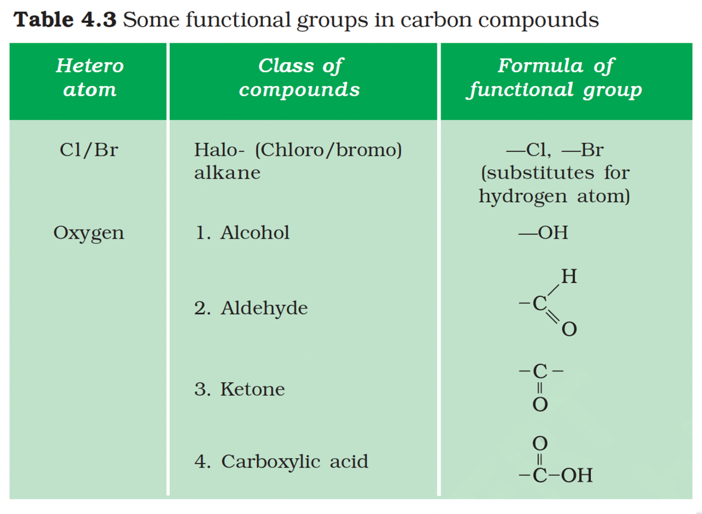
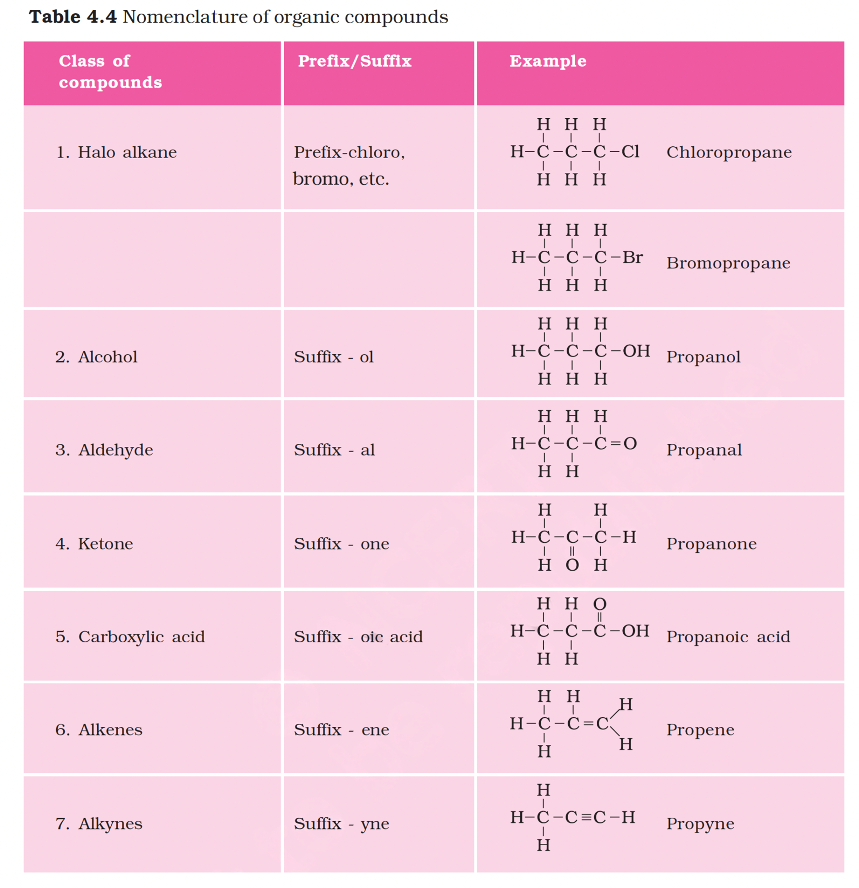
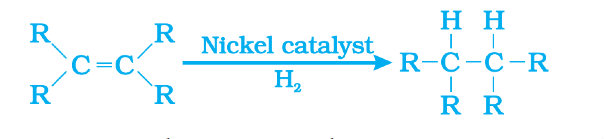
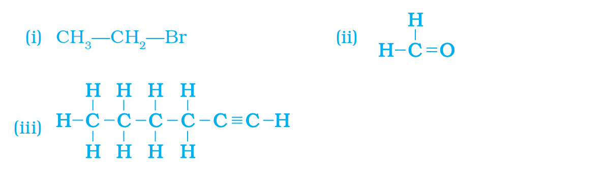
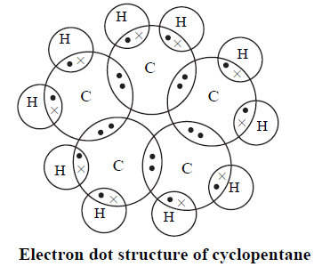

# Carbon and its Compunds

## 4.3 Chemical properties of Carbon

### 4.3.1 Combustion
All carbon compounds give heat and light on combustion.

* $ C + O_2 \xrightarrow{\text{Combustion}} CO_2 $ 
* $ CH_4 + 2O_2 \xrightarrow{\text{Combustion}} CO_2 + 2H_2O $ 
* $ C_2H_6 + 3O_2 \xrightarrow{\text{Combustion}} 2CO_2 + 3H_2O $ 

Saturated carbon compounds will generally give a clean flame while unsaturated carbon compounds will give a yellow flame with lots of black smoke. This results in a sooty deposit on the metal plate. However, limiting the supply of air results in incomplete combustion of even saturated hydrocarbons giving a sooty flame.

### 4.3.2 Oxidation
Carbon compounds can be easily oxidized on combustion. In addition to this complete oxidation, we have reactions in which alcohols are converted to carboxylic acids.

* $ CH_3-CH_2OH \xrightarrow{\text{Alkaline } KMnO_4 + \text{Heat} \text{ / Acidified } K_2Cr_2O_7 + \text{Heat}} CH_3COOH $

### 4.3.3 Addition Reaction
Unsaturated hydrocarbons add hydrogen in the presence of catalysts such as palladium or nickel to give saturated hydrocarbons. Vegetable oils generally have long unsaturated carbon chains while animal fats have saturated carbon chains.

* $ R_2C=CR_2 \xrightarrow{Ni \text{ catalyst}} R_2CH-CHR_2 $

### 4.3.4 Substitution Reaction
Saturated hydrocarbons are fairly unreactive and are inert in the presence of most reagents. However, in the presence of sunlight, chlorine is added to hydrocarbons in a very fast reaction. Chlorine can replace the hydrogen atoms one by one.

* $ CH_4 + Cl_2 \xrightarrow{\text{Sunlight}} CH_3Cl + HCl $ (in the presence of sunlight) give clean blue flame on combustion.
Unsaturated carbon compunds give yellow sooty flame on combustion.

## 4.4 Ethanol and Ethanoic Acid

### 4.4.1 Properties of Ethanol

### 4.4.2 Properties of Ethanoic Acid

## 4.5 Soap and Detergents

### 4.5.1 Properties of Soap

### 4.5.2 Properties of Detergent

## Questions

1. How many structural isomers can you draw for pentane?
2. What are the two properties of carbon which lead to the huge number of carbon compounds we see around us?
3. What will be the formula and electron dot structure of cyclopentane?
4. Draw the structures for the following compounds.
    (i) Ethanoic acid
    (ii) Bromopentane*
    (iii) Butanone
    (iv) Hexanal.
    *Are structural isomers possible for bromopentane?
5. How would you name the following compounds?
    

### Answers

1. **Pentane ($C_5H_{12}$)** has **3** structural isomers:
    (i) n-pentane
    (ii) iso-pentane (2-methylbutane)
    (iii) neo-pentane (2,2-dimethylpropane)

2. The two properties of carbon which lead to the huge number of carbon compounds are:
    (i) **Catenation**: The unique ability of carbon atoms to form bonds with other atoms of carbon, giving rise to large molecules.
    (ii) **Tetravalency**: Carbon has a valency of four, capable of bonding with four other atoms of carbon or atoms of other mono-valent elements.

3. **Cyclopentane** has the formula $C_5H_{10}$ and its electron dot structure is:
   

4. (i) **Ethanoic Acid**: $CH_3COOH$
   (ii) **Bromopentane**: $C_5H_{11}Br$
   (iii) **Butanone**: $C_4H_{8}O$ (also called Ethyl methyl ketone)
   (iv) **Hexanal**: $C_6H_{12}O$

   **Are structural isomers possible for bromopentane?**
   Yes, bromopentane has structural isomers (e.g., 1-bromopentane, 2-bromopentane).

5. (i) Bromoethane
   (ii) Ethanoic Acid
   (iii) Ethylbenzene
   (iv) Ethyl methyl ketone (Butanone)

### Activity 4.3
**CAUTION: This Activity needs the teacher's assistance.**

- **Procedure**:
  - Take some carbon compounds (naphthalene, camphor, alcohol) one by one on a spatula and burn them.
  - Observe the nature of the flame and note whether smoke is produced.
  - Place a metal plate above the flame. Is there a deposition on the plate in case of any of the compounds?

- **Observations**:
  - **Alcohol (Ethanol)**: Burns with a clean **blue flame** (complete combustion) and no smoke. No deposition on the metal plate.
  - **Naphthalene / Camphor**: Burn with a **yellow, sooty flame** (incomplete combustion) and produce black smoke.
  - **Deposition**: A black deposit (soot/carbon) collects on the metal plate when burning naphthalene or camphor.

- **Conclusion**:
  - Saturated compounds (like alcohol) generally burn with a clean flame.
  - Unsaturated or aromatic compounds (like naphthalene, camphor) burn with a yellow flame with lots of black smoke.

### Activity 4.4
- **Procedure**:
  - Light a Bunsen burner and adjust the air hole at the base to get different types of flames/presence of smoke.
  - When do you get a yellow, sooty flame?
  - When do you get a blue flame?

- **Observations**:
  - **Yellow, sooty flame**: Obtained when the air hole is **closed** or partially obstructed. This limits the oxygen supply, leading to incomplete combustion of the fuel.
  - **Blue flame**: Obtained when the air hole is **open**. This allows sufficient oxygen to mix with the fuel, leading to complete combustion.

## Exercises

1. Ethane, with the molecular formula $\mathrm{C}_2 \mathrm{H}_6$ has
(a) 6 covalent bonds.
(b) 7 covalent bonds.
(c) 8 covalent bonds.
(d) 9 covalent bonds.
2. Butanone is a four-carbon compound with the functional group
(a) carboxylic acid.
(b) aldehyde.
(c) ketone.
(d) alcohol.
3. While cooking, if the bottom of the vessel is getting blackened on the outside, it means that
(a) the food is not cooked completely.
(b) the fuel is not burning completely.
(c) the fuel is wet.
(d) the fuel is burning completely.
4. Explain the nature of the covalent bond using the bond formation in $\mathrm{CH}_3 \mathrm{Cl}$.
5. Draw the electron dot structures for
(a) ethanoic acid.
(b) $\quad \mathrm{H}_2 \mathrm{~S}$.
(c) propanone.
(d) $\mathrm{F}_2$.
6. What is an homologous series? Explain with an example.
7. How can ethanol and ethanoic acid be differentiated on the basis of their physical and chemical properties?

### Answers

1. (b)
2. (c)
3. (b)
4. Bond Type: Covalent Bond (formed by sharing electrons).
Formation:
Carbon (4 valence electrons) shares 3 electrons with 3 Hydrogen atoms and 1 electron with 1 Chlorine atom.
Hydrogen atoms share 1 electron each with Carbon.
Chlorine shares 1 electron with Carbon.
5. 
  CH_3COOH
  H:S:H
  $C_2H_6CO$

6. A homologous series is a group of organic compounds with the same functional group and similar chemical properties, where each successive member differs by a single $\mathrm{CH}_2$ unit. For example, the alkanes are a homologous series with the general formula $\mathrm{C}_n \mathrm{H}_{2 n+2}$, where successive members like methane $\left(\mathrm{CH}_4\right)$, ethane $\left(\mathrm{C}_2 \mathrm{H}_6\right)$, propane ( $\mathrm{C}_3 \mathrm{H}_8$ ), and butane ( $\mathrm{C}_4 \mathrm{H}_{10}$ ) differ by one carbon and two hydrogen atoms. (c)

7. Ethanol $\left(\mathrm{CH}_3 \mathrm{CH}_2 \mathrm{OH}\right)$ is an alcohol with a pleasant smell, while ethanoic acid ( $\mathrm{CH}_3 \mathrm{COOH}$ ) is a carboxylic acid with a pungent, vinegar-like smell. They differ in functional group (- -OH vs. -COOH ), acidity (ethanoic acid is a weak acid, ethanol is not), reactivity with bases like carbonates, and physical properties such as boiling point (ethanoic acid is higher).

  | Feature | Ethanol | Ethanoic Acid |
  | :--- | :--- | :--- |
  | Class | Alcohol | Carboxylic Acid |
  | Functional Group | -OH (hydroxyl) | -COOH (carboxyl) |
  | Smell | Pleasant | Pungent, vinegar-like |
  | Acidity | Not acidic | Weakly acidic |
  | Reaction with Bases | No reaction with carbonates or hydrogen carbonates | Reacts with carbonates and hydrogen carbonates to produce $\mathrm{CO}_2$ |
  | Boiling Point | $78.2^{\circ} \mathrm{C}(351 \mathrm{~K})$ | $118^{\circ} \mathrm{C}(390 \mathrm{~K})$ |
  | State at room temperature | Liquid | Liquid (melts at $16^{\circ} \mathrm{C}$ ) |
  | Common uses | Alcoholic beverages, solvents, sanitizers | Vinegar, food preservative, paints, and dyes |