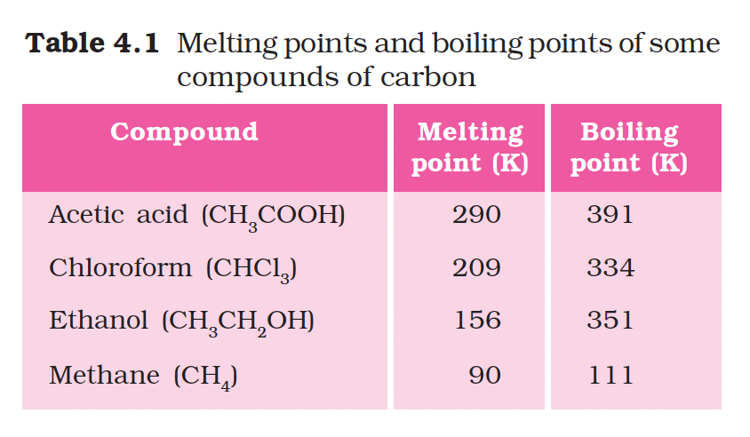
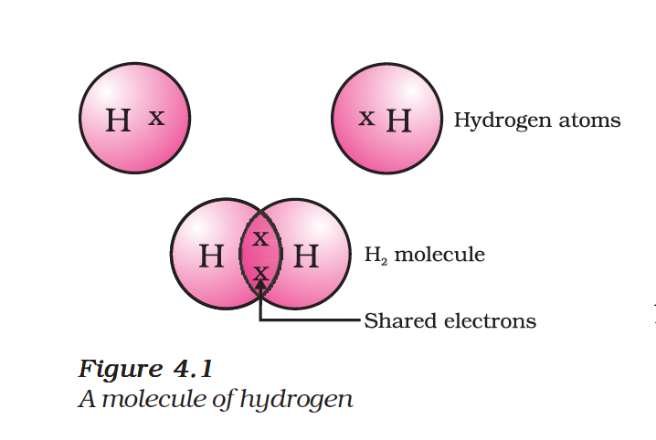
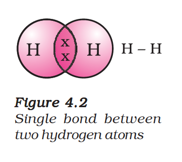
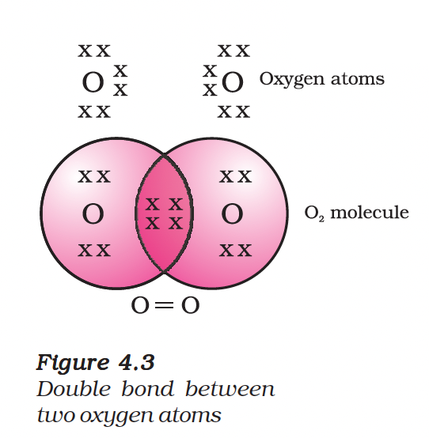
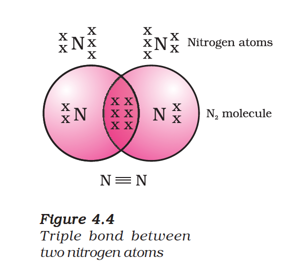
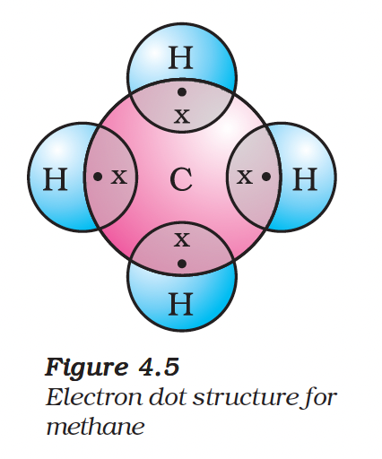
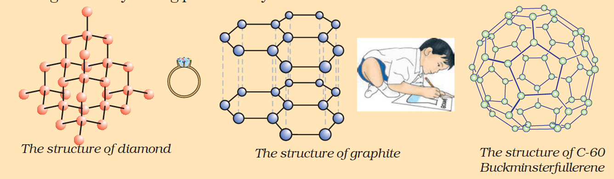

# Carbon and its Compounds

## Introduction

Carbon is an element of immense significance, forming the basis for all living structures and many everyday items like food, clothes, medicines, and books. Although the earth's crust contains only 0.02% carbon and the atmosphere has only 0.03% carbon dioxide, the importance of carbon is immense.

---

## 4.1 Bonding in Carbon — The Covalent Bond

Most carbon compounds are poor conductors of electricity and have low melting and boiling points compared to ionic compounds. This indicates that the forces of attraction between molecules are not very strong and the bonding does not give rise to any ions.

### Electronic Configuration

| Property | Details |
|----------|---------|
| **Atomic Number** | 6 |
| **Valence Electrons** | 4 electrons in outermost shell |

**Reactivity:** To attain a noble gas configuration, carbon needs to gain or lose four electrons:

- **Gaining 4 electrons ($C^{4-}$ anion):** It would be difficult for the nucleus with six protons to hold on to ten electrons.
- **Losing 4 electrons ($C^{4+}$ cation):** It would require a large amount of energy to remove four electrons, leaving a carbon cation with six protons holding just two electrons.

---

### Covalent Bonding

Carbon overcomes this problem by **sharing** its valence electrons with other atoms of carbon or atoms of other elements. The shared electrons belong to the outermost shells of both atoms, leading both to attain the noble gas configuration. This type of bond formed by sharing electron pairs is called a **covalent bond**.

### Examples of Covalent Bonds

| Molecule | Bond Type | Description |
|----------|-----------|-------------|
| **Hydrogen ($H_2$)** | Single bond | Two hydrogen atoms share one electron pair |
| **Chlorine ($Cl_2$)** | Single bond | Forms a diatomic molecule by sharing electrons |
| **Oxygen ($O_2$)** | Double bond | Two oxygen atoms share two pairs of electrons |
| **Nitrogen ($N_2$)** | Triple bond | Two nitrogen atoms share three pairs of electrons |
| **Methane ($CH_4$)** | Single bonds | Carbon shares its four valence electrons with four hydrogen atoms |

---

## Allotropes of Carbon

Carbon occurs in nature in different forms called **allotropes**, which have varying physical properties but the same chemical properties.

### 1. Diamond

- Each carbon atom is bonded to four other carbon atoms
- Forms a rigid three-dimensional structure
- **Hardest substance known**

### 2. Graphite

- Each carbon atom is bonded to three others in the same plane
- Forms a hexagonal array
- **Smooth, slippery, and a very good conductor of electricity**

### 3. Fullerenes

- First identified was C-60
- Carbon atoms arranged in the shape of a football
- Resembles a geodesic dome

---

## Questions

1. What would be the electron dot structure of carbon dioxide which has the formula $CO_2$?
2. What would be the electron dot structure of a molecule of sulphur which is made up of eight atoms of sulphur? (Hint – The eight atoms of sulphur are joined together in the form of a ring.)

