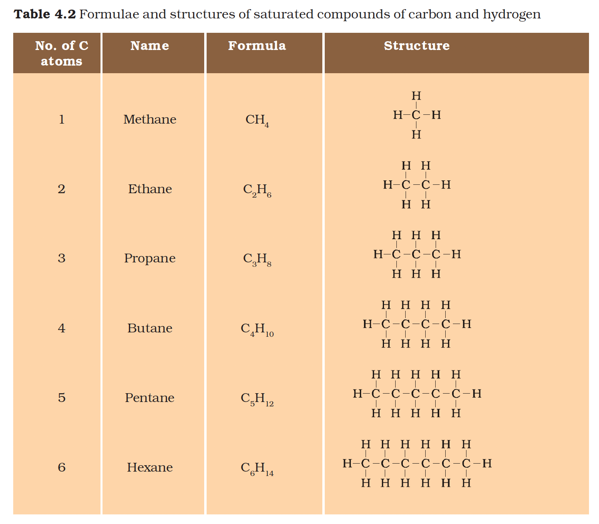
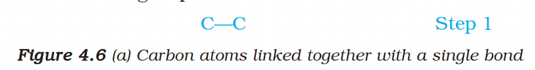
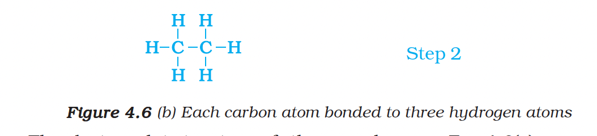
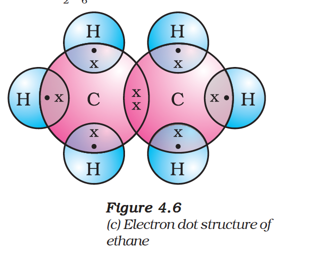
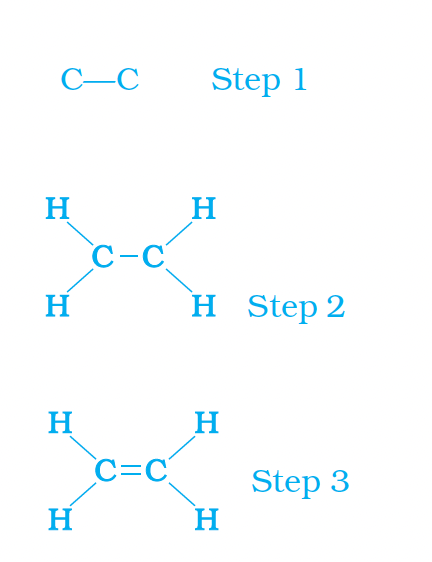
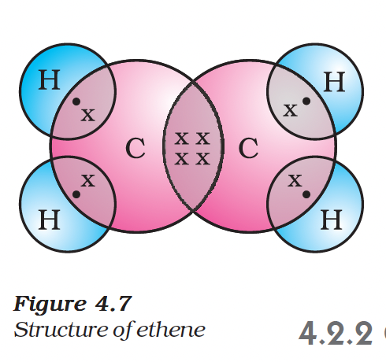
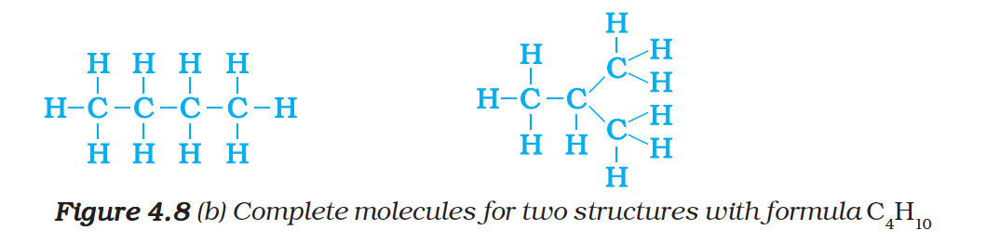
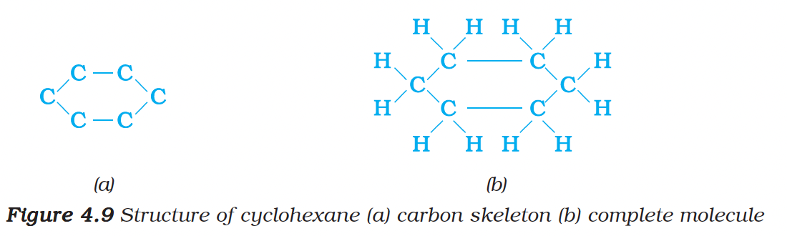
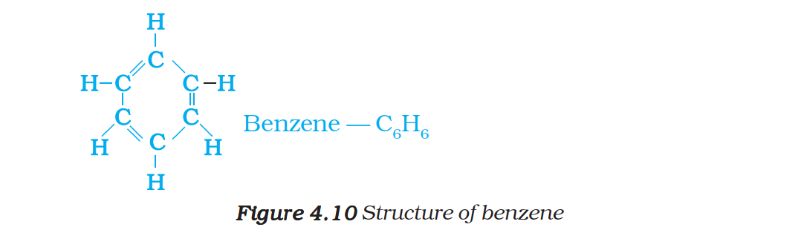

# 4.2 Versatile Nature of Carbon

Carbon forms millions of compounds, outnumbering those formed by all other elements put together. This is due to two factors:

---

## 1. Catenation

Carbon has the unique ability to form bonds with other atoms of carbon, giving rise to large molecules.

- This property is called **catenation** and allows for long chains, branched chains, or rings of carbon atoms.
- **Saturated Compounds:** Compounds linked by only single bonds between carbon atoms.
- **Unsaturated Compounds:** Compounds having double or triple bonds between carbon atoms.
- The carbon-carbon bond is very strong and stable, unlike other elements like silicon which form reactive compounds with hydrogen chains of only up to seven or eight atoms.

---

## 2. Tetravalency

Since carbon has a valency of four, it is capable of bonding with four other atoms of carbon or atoms of other monovalent elements.

- Carbon forms compounds with oxygen, hydrogen, nitrogen, sulphur, chlorine, and many other elements.
- The bonds are strong because the small size of the carbon atom enables the nucleus to hold on to the shared pairs of electrons strongly.

---

## Types of Carbon Compounds

### Saturated Hydrocarbons (Alkanes)

Examples include:
- Methane ($CH_4$)
- Ethane ($C_2H_6$)
- Propane ($C_3H_8$)

These are normally not very reactive.

### Table 4.2: Formulae and Structures of Saturated Hydrocarbons

| No. of C atoms | Name | Formula |
|----------------|------|---------|
| 1 | Methane | $CH_4$ |
| 2 | Ethane | $C_2H_6$ |
| 3 | Propane | $C_3H_8$ |
| 4 | Butane | $C_4H_{10}$ |
| 5 | Pentane | $C_5H_{12}$ |
| 6 | Hexane | $C_6H_{14}$ |

### Unsaturated Hydrocarbons

| Type | Bond | Example |
|------|------|---------|
| **Alkenes** | Double bond | Ethene ($C_2H_4$) |
| **Alkynes** | Triple bond | Ethyne ($C_2H_2$) |

### Structural Isomers

Compounds with identical molecular formulas but different structures.

**Example:** Butane ($C_4H_{10}$) has straight and branched carbon skeletons.

### Cyclic Compounds

Carbon atoms arranged in the form of a ring.

**Examples:**
- Cyclohexane ($C_6H_{12}$)
- Benzene ($C_6H_6$)

---

## Functional Groups

Heteroatoms (like chlorine or oxygen) can replace hydrogen in a hydrocarbon chain, conferring specific properties to the compound regardless of the chain length.

| Class of Compounds | Functional Group |
|:---|:---|
| **Halo alkane** | $-Cl, -Br$ |
| **Alcohol** | $-OH$ |
| **Aldehyde** | $-CHO$ |
| **Ketone** | $-CO-$ |
| **Carboxylic acid** | $-COOH$ |

---

## Homologous Series

A homologous series is a series of compounds in which the same functional group substitutes for hydrogen in a carbon chain.

- Successive members differ by a $-CH_2-$ unit and **14 u** in molecular mass.
- **General Formula for Alkenes:** $C_nH_{2n}$
- As molecular mass increases, physical properties (like melting and boiling points) show a gradation, but chemical properties remain similar.

---

## Nomenclature

Names of compounds are based on the carbon chain length modified by a prefix or suffix indicating the functional group.

### Rules:

1. Identify the number of carbon atoms (e.g., 3 carbons = Propane)
2. If a functional group is present, modify the name with a prefix or suffix (e.g., Ketone suffix is 'one' → Propanone)
3. If unsaturated, change 'ane' to 'ene' (double bond) or 'yne' (triple bond)

---

## Questions

1. How many structural isomers can you draw for pentane?
2. What are the two properties of carbon which lead to the huge number of carbon compounds we see around us?
3. What will be the formula and electron dot structure of cyclopentane?
4. Draw the structures for the following compounds:
   - (i) Ethanoic acid
   - (ii) Bromopentane
   - (iii) Butanone
   - (iv) Hexanal

