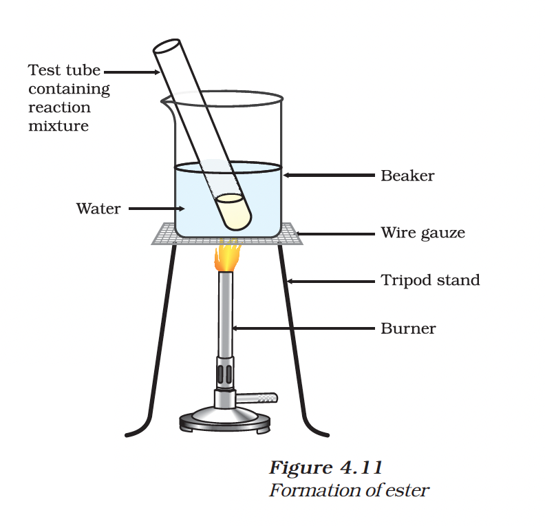

# 4.4 Some Important Carbon Compounds

---

## Ethanol ($CH_3CH_2OH$)

### Properties

| Property | Details |
|----------|---------|
| State | Liquid at room temperature |
| Solubility | Soluble in water in all proportions |
| Uses | Good solvent used in medicines like tincture iodine and cough syrups |

### Safety Warning

> **Caution:** Consumption of ethanol causes drunkenness. Intake of pure ethanol (absolute alcohol) can be lethal.

To prevent misuse, industrial ethanol is made unfit for drinking by adding poisonous substances like methanol. This is called **denatured alcohol**.

### Chemical Reactions

#### 1. Reaction with Sodium

Ethanol reacts with sodium to produce hydrogen gas and sodium ethoxide.

$2Na + 2CH_3CH_2OH \rightarrow 2CH_3CH_2O^-Na^+ + H_2 \uparrow$

#### 2. Dehydration

Heating ethanol at 443 K with excess concentrated sulphuric acid gives ethene.

$CH_3CH_2OH \xrightarrow{Hot~Conc.~H_2SO_4} CH_2=CH_2 + H_2O$

---

## Ethanoic Acid ($CH_3COOH$)

### Properties

| Property | Details |
|----------|---------|
| Common Name | Acetic acid |
| Vinegar | 5-8% solution in water |
| Glacial Acetic Acid | Pure ethanoic acid (melting point 290 K) |
| Nature | Weak acid compared to mineral acids |

> **Note:** Pure ethanoic acid is called "glacial acetic acid" because it often freezes during winter.

### Chemical Reactions

#### 1. Esterification

Ethanoic acid reacts with absolute ethanol in the presence of an acid catalyst to give an **ester** (sweet-smelling substance).

$CH_3COOH + CH_3CH_2OH \xrightarrow{Acid~catalyst} CH_3COOCH_2CH_3 + H_2O$

(Ethanoic acid + Ethanol → Ethyl ethanoate + Water)

#### 2. Saponification

On treating with a base like NaOH, the ester converts back to alcohol and sodium salt of carboxylic acid. This reaction is used to prepare **soap**.

$CH_3COOCH_2CH_3 + NaOH \rightarrow CH_3COONa + CH_3CH_2OH$

#### 3. Reaction with Base

Reacts with a base such as sodium hydroxide to give a salt (sodium ethanoate) and water.

$NaOH + CH_3COOH \rightarrow CH_3COONa + H_2O$

#### 4. Reaction with Carbonates/Hydrogencarbonates

Reacts to give a salt, carbon dioxide, and water.

$2CH_3COOH + Na_2CO_3 \rightarrow 2CH_3COONa + H_2O + CO_2 \uparrow$

$CH_3COOH + NaHCO_3 \rightarrow CH_3COONa + H_2O + CO_2 \uparrow$

---

## Comparison: Ethanol vs Ethanoic Acid

| Feature | Ethanol | Ethanoic Acid |
|:---|:---|:---|
| **Class** | Alcohol | Carboxylic Acid |
| **Functional Group** | -OH (hydroxyl) | -COOH (carboxyl) |
| **Smell** | Pleasant | Pungent, vinegar-like |
| **Acidity** | Not acidic | Weakly acidic |
| **Reaction with Carbonates** | No reaction | Produces $CO_2$ |
| **Boiling Point** | 78.2°C (351 K) | 118°C (390 K) |
| **Common Uses** | Beverages, solvents, sanitizers | Vinegar, food preservative |

