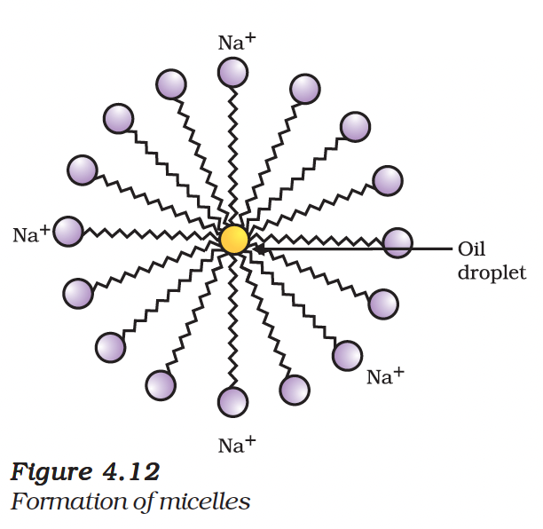
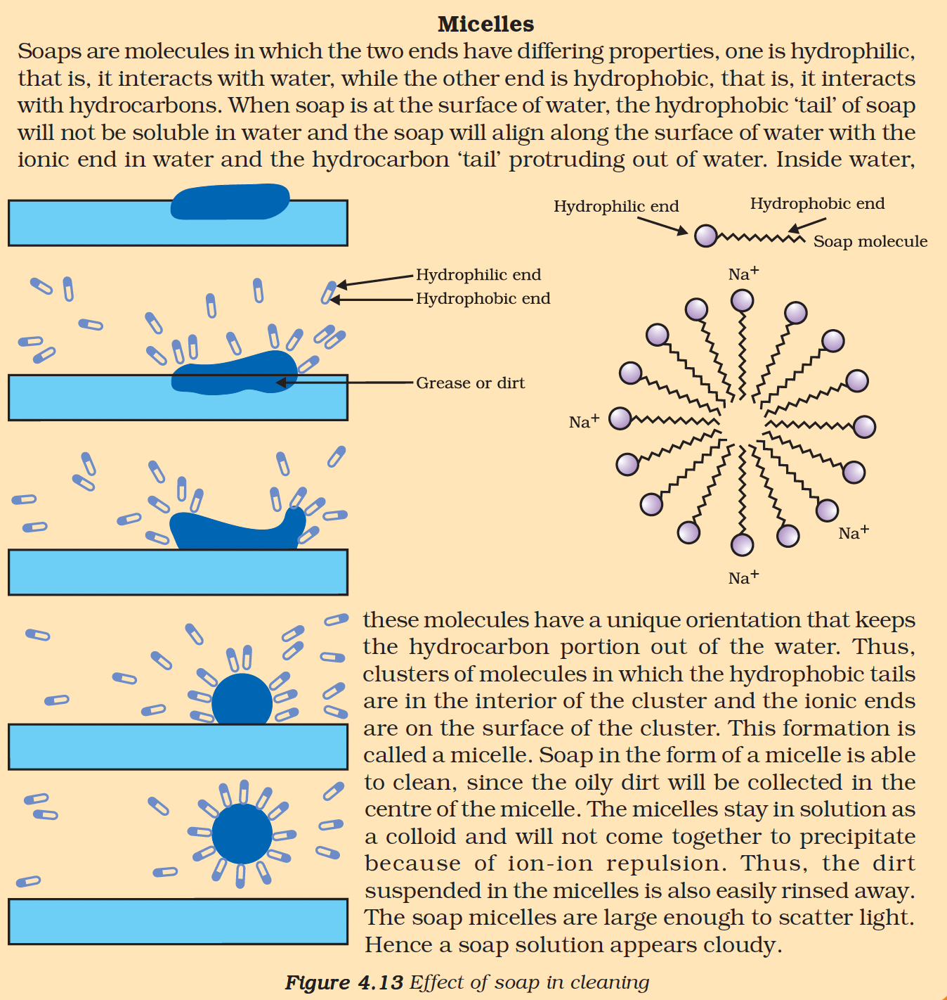

# 4.5 Soaps and Detergents

---

## Soaps

Soaps are **sodium or potassium salts of long-chain carboxylic acids**.

### Cleaning Mechanism

The soap molecule has two ends with different properties:

| End | Property | Interaction |
|-----|----------|-------------|
| **Hydrophilic** (ionic end) | Water-loving | Interacts with water |
| **Hydrophobic** (carbon chain) | Water-hating | Interacts with oil/grease |

### How Soap Cleans

1. In water, soap molecules form structures called **micelles**
2. The hydrophobic tail faces the oil droplet (dirt)
3. The ionic end faces outside (towards water)
4. This forms an **emulsion** in water
5. The emulsion helps pull out dirt and wash clothes clean

> **Note:** Micelles are large enough to scatter light, making soap solution appear cloudy.

---

## Scum Formation

### Problem with Hard Water

In **hard water**, soap reacts with calcium and magnesium salts to form an insoluble precipitate called **scum**.

$2C_{17}H_{35}COONa + CaCl_2 \rightarrow (C_{17}H_{35}COO)_2Ca + 2NaCl$

(Soap + Hard water → Scum + Salt)

This limits the effectiveness of soap in hard water.

---

## Detergents

Detergents are generally:
- **Sodium salts of sulphonic acids**, or
- **Ammonium salts** with chloride or bromide ions

### Advantages over Soaps

| Property | Soap | Detergent |
|----------|------|-----------|
| **In hard water** | Forms scum | Remains effective |
| **Precipitate formation** | Yes (with Ca²⁺/Mg²⁺) | No |
| **Common uses** | Bathing bars | Shampoos, laundry products |

The charged ends of detergents do not form insoluble precipitates with calcium and magnesium ions in hard water. Thus, they remain effective in hard water.

---

## Summary

| Feature | Soap | Detergent |
|---------|------|-----------|
| **Chemical Nature** | Sodium/potassium salts of fatty acids | Sodium salts of sulphonic acids |
| **Raw Material** | Natural fats/oils | Petroleum products |
| **Hard Water** | Forms scum | Works well |
| **Biodegradability** | Easily biodegradable | Some are not biodegradable |
| **Cost** | Relatively cheaper | Can be more expensive |

---

## Questions

1. What is the difference between the molecules of soaps and detergents, chemically?
2. Why are detergents more effective than soaps in hard water?
3. Explain the cleaning action of soap with a diagram.

