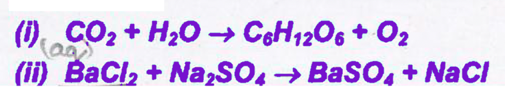

# Chemical Equations
The method of representing a chemical reaction with the help of symbols and formulae of the substances involved in it is known as a chemical equation. Let us take an example to understand the meaning of a chemical equation clearly.
When a magnesium ribbon is burnt in oxygen, it gets converted to magnesium oxide.
The above chemical equation for this reaction can be represented in word form as:
Magnesium + Oxygen
Reactants
Products

The substances that undergo chemical change are called the reactants. The new substances formed during the reaction are called the products.
In the above reaction, magnesium and oxygen are reactants and magnesium oxide is product.
The reactants are written on the left hand side with a plus sign ( + ) between them. Similarly, products are written on the right-hand side with a plus sign (+) between them.
The arrow is put between reactants and products and the arrow head is pointed towards the products, which shows the direction of the reaction.

## Writing a Chemical Equation
Chemical equation can be made more concise and useful if we use chemical formula instead of words in word-equation.
Example:

$
\mathrm{Mg}+\mathrm{O}_2 \longrightarrow \mathrm{MgO}
$

$\mathrm{Mg}, \mathrm{O}_2$ and MgO are the formulae of magnesium, oxygen and magnesium oxide respectively.

**<b>$\sigma$ Illustration 1</b>:**
Write the chemical equation for the following word-equation:
Zinc + Sulphuric acid $\rightarrow$ Zinc sulphate + Hydrogen

Solution:

$
\mathrm{Zn}+\mathrm{H}_2 \mathrm{SO}_4 \longrightarrow \mathrm{ZnSO}_4+\mathrm{H}_2
$

<b>Exercise 1</b>  
(a) What change will you observe when lime is added to water?  
(b) When carbon is burnt in presence of oxygen, carbon dioxide is formed. Write the chemical equation for this change?  
(c) Write the chemical equation for the burning of methane.  

<b>Solutions for Exercise 1</b>

Here are the answers to your questions:

**(a) What change will you observe when lime is added to water?**

You will observe the following changes:

*   **Heat Generation:** The mixture will get hot as the reaction is exothermic. In some cases, it may boil.
*   **Slaking:** The lime will react with water in a process called slaking or hydration.
*   **Formation of Slaked Lime:** Calcium hydroxide (Ca(OH)₂), also known as slaked lime, will be formed.
*   **Cloudy Appearance:** The mixture will become cloudy or milky due to the formation of a suspension of calcium hydroxide.
*   **Settling:** Over time, the calcium hydroxide will settle to the bottom of the container.

**(b) When carbon is burnt in the presence of oxygen, carbon dioxide is formed. Write the chemical equation for this change.**

C(s) + O₂(g) → CO₂(g)

**(c) Write the chemical equation for the burning of methane.**

CH₄(g) + 2O₂(g) → CO₂(g) + 2H₂O(g)

## Balanced Chemical Equation
A balanced chemical equation has an equal number of atoms of different elements in the reactants and products.
In other words, the number of atoms of each element remains the same, before and after the chemical reaction.
Consider the following chemical equation

$
\mathrm{Zn}+\mathrm{H}_2 \mathrm{SO}_4 \longrightarrow \mathrm{ZnSO}_4+\mathrm{H}_2
$

Let us examine the number of atoms of different elements on both sides of the arrow:

| Element | No. of atoms in reactants | No. of atoms in products |
| :---: | :---: | :---: |
| Zn | 1 | 1 |
| H | 2 | 2 |
| S | 1 | 1 |
| O | 4 | 4 |

As the number of atoms of each element is the same on both sides of the arrow, hence the chemical equation is called balanced chemical equation.
If we see a chemical equation as following:

$
\mathrm{Fe}+\mathrm{H}_2 \mathrm{O} \longrightarrow \mathrm{Fe}_2 \mathrm{O}_3+\mathrm{H}_2
$

Then we can say that the equation is not balanced since number of Fe and O atom is not same in reactant and product both sides.

Following steps are involved in balancing the chemical equations:
Step 1: First of all identify the atoms which are not balanced e.g. Fe and $O$ in above mentioned equation.
Step 2: Pick any one element and start balancing. It is convenient to start with the compound that contains the maximum number of atoms.
Step 3: Then pick the $2^{\text {nd }}$ element to balance the partly balanced equation.
Step 4: Pick the next element to get the equation balanced.
This procedure is to be repeated till the equation is finally balanced.
So the balanced equation is:

$
2 \mathrm{Fe}+3 \mathrm{H}_2 \mathrm{O} \longrightarrow \mathrm{Fe}_2 \mathrm{O}_3+3 \mathrm{H}_2
$

Note 1. To make a chemical equation more informative, the physical states of the reactants and products are mentioned along with their chemical formulae. The gaseous, liquid and solid states of reactants and products are represented by the notations $(\mathrm{g}),(\ell)$ and $(\mathrm{s})$ respectively. The word aqueous $(\mathrm{aq})$ is written if the reactant or product is present as a solution in water. Moreover an arrow $\downarrow$ for the formation of precipitate and arrow $\uparrow$ for the evolution of a gas can be assigned. So the balanced chemical equation of the above example can be represented as:  
$2 \mathrm{Fe}(\mathrm{s})+3 \mathrm{H}_2 \mathrm{O}(\mathrm{g}) \longrightarrow \mathrm{Fe}_2 \mathrm{O}_3(\mathrm{~s})+3 \mathrm{H}_2(\mathrm{~g})$.

Note 2. Sometimes the reaction conditions such as temperature, pressure, catalyst etc; for the reaction are indicated above and or below the arrow in the chemical equation.
For example:

$
\begin{aligned}
& 6 \mathrm{CO}_2(\mathrm{~g})+6 \mathrm{H}_2 \mathrm{O}(\ell) \xrightarrow[\substack{\text { culcropphyll }}]{\text { sanligh }} \mathrm{C}_6 \mathrm{H}_{12} \mathrm{O}_6(\mathrm{aq})+6 \mathrm{O}_2(\mathrm{~g})
\end{aligned}
$

**<b>$\sigma$ Illustration 2</b>:**
Balance the following equation: $\mathrm{H}_2 \mathrm{SO}_4+\mathrm{NaOH} \rightarrow \mathrm{Na}_2 \mathrm{SO}_4+\mathrm{H}_2 \mathrm{O}$
Solution: The unbalanced atoms are Na and H . We will start with balancing of Na .

$
\mathrm{H}_2 \mathrm{SO}_4+2 \mathrm{NaOH} \longrightarrow \mathrm{Na}_2 \mathrm{SO}_4+\mathrm{H}_2 \mathrm{O}
$

Now balance H atom

$
\mathrm{H}_2 \mathrm{SO}_4+2 \mathrm{NaOH} \longrightarrow \mathrm{Na}_2 \mathrm{SO}_4+2 \mathrm{H}_2 \mathrm{O}
$

<b>$\sigma$ Exercise 2</b>:

(a) Balance the following equations:  
(i) $\mathrm{C}+\mathrm{CO}_2 \rightarrow \mathrm{CO}$  
(ii) $\mathrm{C}+\mathrm{O}_2 \rightarrow \mathrm{CO}$  
(iii) $\mathrm{Fe}+\mathrm{Cl}_2 \rightarrow \mathrm{FeCl}_3$  

(b) Balance the following chemical equations:  
(i) $\mathrm{Fe}+\mathrm{O}_2 \rightarrow \mathrm{Fe}_2 \mathrm{O}_3$  
(ii) $\mathrm{Al}(\mathrm{OH})_3 \rightarrow \mathrm{Al}_2 \mathrm{O}_3+\mathrm{H}_2 \mathrm{O}$  
(iii) $\mathrm{BaCl}_2+\mathrm{H}_2 \mathrm{SO}_4 \rightarrow \mathrm{BaSO}_4+\mathrm{HCl}$  
(c) Balance and write down the physical state of the reactants and products in the following   reactions:

