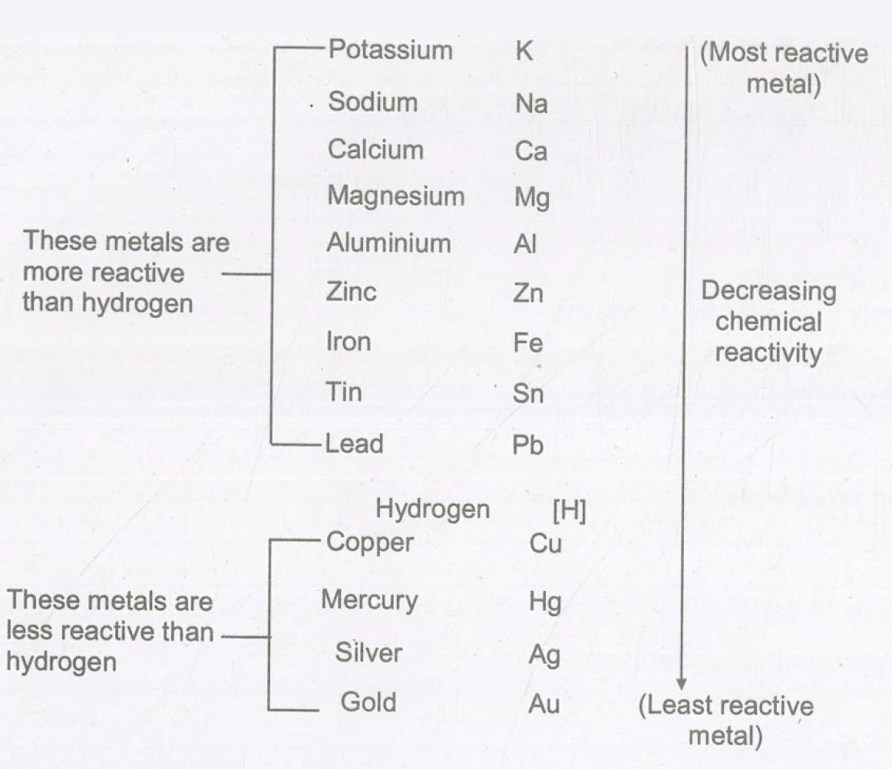

# Types of Chemical Reactions
## Combination Reaction
In a combination reaction, two or more substances combine to form a new substance. For example

$
\begin{aligned}
& \mathrm{C}(\mathrm{~s})+\mathrm{O}_2(\mathrm{~g}) \longrightarrow \mathrm{CO}_2(\mathrm{~g}) \\
& 2 \mathrm{H}_2(\mathrm{~g})+\mathrm{O}_2(\mathrm{~g}) \xrightarrow{\text { andinton }} 2 \mathrm{H}_2 \mathrm{O}(\mathrm{~g})
\end{aligned}
$

Combination reactions are also termed as synthesis reaction.
Decomposition Reaction
In a decomposition reaction, a single compound breaks down to produce two or more simpler substances. The decomposition reactions take place when energy is supplied in the form of heat electricity or light. When a substance is decomposed by passing electric current the process is called electrolytic decomposition or electrolysis.

$
2 \mathrm{H}_2 \mathrm{O}(\mathrm{t}) \xrightarrow{\text { aldectio corrent }} 2 \mathrm{H}_2(\mathrm{~g})+\mathrm{O}_2(\mathrm{~g})
$

When a substance decomposes on heating it is called thermal decomposition or thermolysis.

$
\underset{\substack{\text { line stone }}}{\mathrm{CaCO}_3(\mathrm{~s}) \xrightarrow{\text { Heat }} \underset{\text { Ouick lime }}{\mathrm{CaO}(\mathrm{~s})}+\mathrm{CO}_2(\mathrm{~g})}
$
When a substance is decomposed in presence of sunlight, it is called a photochemical decomposition or photolysis.

$
\mathrm{AgBr} \xrightarrow{\text { wonlight }} \mathrm{Ag}+\mathrm{Br}
$

Before we discuss the displacement reactions, we should know about the reactivity of metals: 

## Reactivity Series of Metals
Reactivity series of metals is a series in which the metals are arranged in the decreasing order of their reactivity. A more reactive metal can displace the less reactive metal from its solution.

## Displacement Reaction
In a displacement reaction, a more active element displaces or removes less reactive element from a compound, for example Zn displaces Cu from $\mathrm{CuSO}_4$ solution because Zn is more active than Cu .

$
\begin{aligned}
& \mathrm{Zn}(\mathrm{~s})+\mathrm{CuSO}_4(\mathrm{aq}) \longrightarrow \mathrm{ZnSO}_4(\mathrm{aq})+\mathrm{Cu}(\mathrm{~s}) \\
& \mathrm{Mg}(\mathrm{~s})+\mathrm{CuSO}_4(\mathrm{aq}) \longrightarrow \mathrm{MgSO}_4(\mathrm{aq})+\mathrm{Cu}(\mathrm{~s})
\end{aligned}
$

## Double Displacement Reaction
The reactions in which two different atoms or groups of atoms are displaced by other atoms or groups of atoms are double displacement reactions, for eg.

$
\begin{aligned}
& \mathrm{BaCl}_2(\mathrm{aq})+\mathrm{Na}_2 \mathrm{SO}_4(\mathrm{aq}) \longrightarrow \mathrm{BaSO}_4(\mathrm{~s})+2 \mathrm{NaCl}(\mathrm{aq}) \\
& \mathrm{AgNO}_3(\mathrm{aq})+\mathrm{NaCl}(\mathrm{aq}) \longrightarrow \mathrm{AgCl}(\mathrm{~s})+\mathrm{NaNO}_3(\mathrm{aq})
\end{aligned}
$

They can be further categorized into precipitation reaction and neutralization reaction.

<b>$\sigma$ Illustration 3</b>:
What happens when a piece of iron metal is placed in copper sulphate solution? Name the type of reaction involved?

Solution:
Iron being more reactive will displace copper from copper sulphate solution

$
\mathrm{Fe}(\mathrm{~s})+\mathrm{CuSO}_4(\mathrm{aq}) \longrightarrow \mathrm{FeSO}_4(\mathrm{aq})+\mathrm{Cu}(\mathrm{~s})
$

It is a displacement reaction.

<b>$\sigma$ Exercise 3</b>: 
 
(a) Write balanced equation for the following reaction and identify the type of reaction:  
(I) Zinc carbonate (s) $\rightarrow$ Zinc oxide (s) + Carbon dioxide (g)  
(ii) Zinc (s) + hydrochloric acid (dil.) $\rightarrow$ Zinc Chloride + Hydrogen    
(b) Write balanced equation for the following reaction and identify the type of reaction:  
(i) Silver nitrate $\rightarrow$ Silver + Oxygen + Nitrogen dioxide
(ii) Sulphur dloxide + Oxygen $\rightarrow$ Sulphur trioxide  
(c) Identify the type of reactions:  
(i) $\mathrm{AgCl} \xrightarrow{\text { huv }} \mathrm{Ag}+\mathrm{Cl}_2$  
(ii) $\mathrm{Mg}+\mathrm{CuSO}_4 \rightarrow \mathrm{MgSO}_4+\mathrm{Cu}$  
(iii) $2 \mathrm{FeCl}_2+\mathrm{Cl}_2 \rightarrow 2 \mathrm{FeCl}_3$  