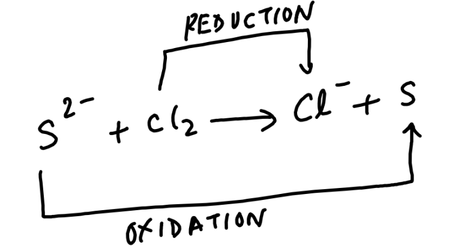

# Oxidation and Reduction Reaction
This type of reaction involves transfer of electrons.
Oxidation is
(i) Addition of oxygen
(ii) Removal of hydrogen
(iii) Loss of electron

$
\text { eg. } \mathrm{Mg}+\mathrm{O}_2 \longrightarrow \mathrm{MgO}
$

Any chemical substance following any of these rules is said to be oxidised.
Reduction is  
(i) Removal of oxygen  
(ii) Addition of hydrogen  
(iii) Gain of electron  

e.g. $\mathrm{Cl}+\mathrm{e}^{-} \longrightarrow \mathrm{Cl}^{-}$

Reactions involving both oxidation and reduction processes, occurring simultaneously are known as REDOX reactions.
For eg. $\mathrm{H}_2 \mathrm{~S}+\mathrm{Cl}_2 \longrightarrow 2 \mathrm{HCl}+\mathrm{S}$
This is a molecular equation. The representation of molecular equation in terms of its ions is known as an ionic equation.
So, its ionic equation is:

Here sulphide ion is losing its electrons and chlorine is accepting its electrons therefore the reaction involves oxidation and reduction both, therefore its a redox reaction. Since sulphur is losing its electrons, therefore sulphur is oxidised and $\mathrm{Cl}_2$ is gaining electrons therefore chlorine is reduced. Reduction of $\mathrm{Cl}_2$ is brought by sulphur therefore sulphur is reducing agent and oxidation of sulphur is brought by $\mathrm{Cl}_2$ therefore $\mathrm{Cl}_2$ is oxidizing agent.
Oxidation Number or Oxidation State
It is defined as the charge (real or imaginary) which an atom appears to have when it is in compound state. In the case of electrovalent compounds, the oxidation number of an element or radical is the same as the charge on the ion. 

The following rules are followed in ascertaining the oxidation number in any type of compounds:  
(i) The oxidation number of an atom in elementary state is always zero.  
(ii) The oxidation number of fluorine is always -1 .  
(iii) The oxidation number of oxygen is -2 in all compounds except in peroxides, super oxides and oxygen fluorides.  
(iv) The oxidation number of hydrogen is +1 in all of its compounds except in metallic hydrides. In metallic hydrides, oxidation number of hydrogen is -1.  

## Oxidation Number or Oxidation State

It is defined as the charge (real or imaginary) which an atom appears to have when it is in compound state. In the case of electrovalent compounds, the oxidation number of an element or radical is the same as the charge on the ion. The following rules are followed in ascertaining the oxidation number in any type of compounds:  
(i) The oxidation number of an atom in elementary state is always zero.  
(ii) The oxidation number of fluorine is always -1 .  
(iii) The oxidation number of oxygen is -2 in all compounds except in peroxides, super oxides and oxygen fluorides.  
(iv) The oxidation number of hydrogen is +1 in all of its compounds except in metallic hydrides. In metallic hydrides, oxidation number of hydrogen is -1.  
(v) The oxidation number of an ion is equal to the electrical charge present on it.
(vi) The oxidation number of alkali metal is +1 and that of alkaline earth metals is +2 .
(vii) For complex ions, the algebraic sum of oxidation number of all the atoms is equal to the net charge on the ion.
(viii) In the case of neutral molecules, the algebraic sum of oxidation numbers of all the atoms present in the molecules in zero.
Ion Electron Method for Balancing Redox Reaction  

**The following steps are followed:**   

(i) Ionic equation of redox reaction is first written.  
(ii) The ionic reaction is split into two half reaction, one for oxidation and the other for reduction.  
(iii) Each half reaction is balanced for the number of atoms of each element. For this purpose :  

&nbsp;&nbsp;&nbsp; a. First of all atoms other than H and O for each half reaction are balanced using simple multiples.  
&nbsp;&nbsp;&nbsp; b. In acidic and neutral mediums, H ions are added to the side deficient in hydrogen and water molecules to the side deficient in oxygen.  
&nbsp;&nbsp;&nbsp; c. In alkaline medium, for each excess of oxygen atom, one water molecule is added to the same side and two $\mathrm{OH}^{-}$ ions to the other side. If hydrogen is still unbalanced, one $\mathrm{OH}^{-}$ ion is added for each   excess of hydrogen on the same side and one water molecule to the other side.  

(iv) Electron are added to the side deficient in electrons as to equalize the charges on both sides of the half reactions.  
(v) Electrons are made equal in both the half reactions by multiplying one or both the half reactions by a suitable number.  
(vi) Both the balanced half reactions are added and any term common to both sides is cancelled.

<b>$\sigma$ Illustration 4</b>:

Identify reducing and oxidizing agent in the given equation:
Solution:
Fe is gaining electrons so it is reduced therefore Al is reducing agent Al is losing electrons so it is oxidized therefore $\mathrm{Fe}_2 \mathrm{O}_3$ is oxidizing agent.

### <b>Exercise 4</b>:  
(a) FInd the substance oxidized, reduced, oxidizing agent and reducing agent in the following reactions:  
&nbsp;&nbsp;&nbsp; (i) $2 \mathrm{Al}+6 \mathrm{HCl} \rightarrow 2 \mathrm{AlCl}_3+3 \mathrm{H}_2$  
&nbsp;&nbsp;&nbsp; (ii) $\mathrm{H}_2+\mathrm{Cl}_2 \rightarrow 2 \mathrm{HCl}$  
&nbsp;&nbsp;&nbsp; (iii) $\mathrm{Zn}+\mathrm{H}_2 \mathrm{SO}_4 \rightarrow \mathrm{ZnSO}_4+\mathrm{H}_2$  
(b) Find out the oxidation state of the following reactants and products:  
&nbsp;&nbsp;&nbsp; (i) $\mathrm{C}+\mathrm{O}_2 \rightarrow \mathrm{CO}_2$  
&nbsp;&nbsp;&nbsp; (ii) $\mathrm{CaCO}_3 \rightarrow \mathrm{CaO}+\mathrm{CO}_2$  
(c) Balance the following equations by ion-electron method.  

&nbsp;&nbsp;&nbsp; $
    \mathrm{Fe}^{3+}+\mathrm{H}_2 \mathrm{~S} \longrightarrow \mathrm{Fe}^{2+}+\mathrm{H}^{+}+\mathrm{S} .
$

<b>Solution for Exercise 4</b>:   

(a) 

(i) $2 \mathrm{Al}+6 \mathrm{HCl} \rightarrow 2 \mathrm{AlCl}_3+3 \mathrm{H}_2$

*   **Substance Oxidized:** $\mathrm{Al}$ (Aluminum loses electrons; oxidation state increases from 0 to +3)
*   **Substance Reduced:** $\mathrm{H}$ (Hydrogen from HCl gains electrons; oxidation state decreases from +1 to 0)

*   **Oxidizing Agent:** $\mathrm{HCl}$ (Hydrogen gains electrons to produce Hydrozen so itself get reduced)
*   **Reducing Agent:** $\mathrm{Al}$ (Causes Hydrogen's reducation by providing electros through itself is getting oxidised)

&nbsp;&nbsp;&nbsp; (ii) $\mathrm{H}_2+\mathrm{Cl}_2 \rightarrow 2 \mathrm{HCl}$  