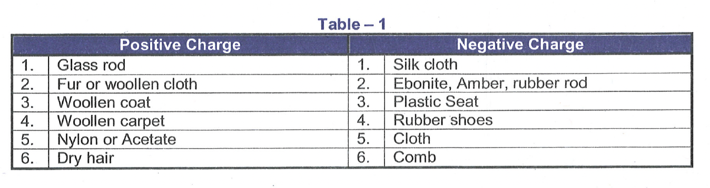

# ELECTRICITY
Matter is made up with two intrinsic properties mass and charge. Due to the possession of mass, gravitational attraction takes place between two bodies (governed by Newton's law of gravitation) and we have discussed it in the previous class. It has been found that there are two types of electric charges, positive charge and negative charge. We can notice that while combing dry hair, the comb gets charged and can pick up small pieces of paper brought near it. The charge acquired by a glass rod rubbed with silk is by convention, called a positive charge and that on ebonite rod rubbed with wool is called a negative charge. Whenever two bodies are charged by rubbing, one gets positively charged and the other gets negatively charged. The following table gives the list of certain rubbing pairs and respective charge separation.

## PROPERTIES OF CHARGE
When two bodies are rubbed, the sum of charges appearing on the two bodies remains the same as that before rubbing. This property of charge is called as law of conservation of charge. Other important properties and comparison of charge with mass is given in the following table (2). The unit of charge is Coulomb (C).

**Study of charges may be divided into two parts:**
1. The study of physical phenomenon related to charges at rest is called static electricity or electrostatics.
2. The study of physical phenomenon related to charges in motion is called as current electricity.