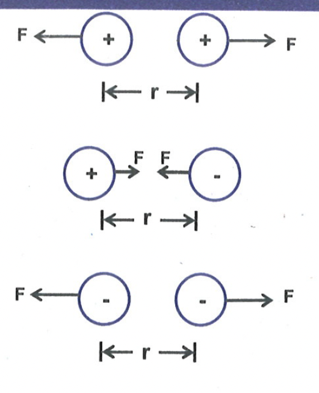
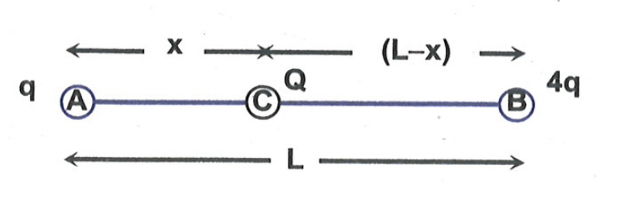

# ADD TO YOUR KNOWLEDGE

## COULOMB'S LAW

The law governing the force between the charged particles is called Coulomb's law. It states that the force between the two small charged particles at rest is directly proportional to the product of the charges and inversely proportional to the square of the distance between them.

$
F=k \frac{q_1 q_2}{r^2}
$

Here k is constant which depends upon the medium in which charges are placed. This force $F$ is directed along the line joining the small charged bodies. If the value of $F$ is positive, it is repulsive and if the value of $F$ is negative, it is attractive.

## Superconductors

At very low temperature, the resistance of some materials becomes exactly zero. In this case, a current can be maintained within the loop without connecting battery and it can persist for any length of time. Such material with zero resistance is called superconductor.

**Example 1:** Calculate the coulomb force between two protons separated by a distance of $1.6 \times 10^{-5} \mathrm{~m}$. (Given $k=9 \times 10^9 \mathrm{Nm}^2 / \mathrm{C}^2$ )

Solution: 

$\mathrm{F}=\mathrm{k} \frac{\mathrm{q}_1 \mathrm{q}_2}{\mathrm{r}^2}=\frac{9 \times 10^9 \times 1.6 \times 10^{-19} \times 1.6 \times 10^{-19}}{\left(1.6 \times 10^{-5}\right)^2}=9 \times 10^{-19} \mathrm{~N}$.

**Example 2:** Two point charges $+4 q$ and $+q$ are placed at a distance $L$ apart. A third charge is so placed that all the three charges are in equilibrium. Find the location, magnitude and nature of third charge.

Solution: If the system of three charges is to be in equilibrium, the forces on each charge must be zero. Let the third charge Q lie between the other two. If the force acting on it due to the other two is in the same direction, then $Q$ can't be in equilibrium. If Q is at a distance x from q , then for its equilibrium.

$
\begin{aligned}
& k \frac{Q q}{x^2}-k \frac{Q(4 q)}{(L-x)^2}=0 \newline
& (L-x)=2 x \\
& \text { or, } x=L / 3
\end{aligned}
$

And for equilibrium of $q$.

$
k \frac{Q q}{x^2}+k \frac{q(4 q)}{L^2}=0
$

i.e. $Q=-\frac{4}{9} q$

So the third charge is negative, of magnitude $\left(\frac{4}{9}\right) q$ and at a distance $\left(\frac{L}{3}\right)$ from $q$, between the charges, on the line joining the charges.

**Example 3:** How much work will be done in bringing a charge of 5.0 millicoulombs from infinity to a point $P$ at which the potential is 12 V ?

Solution: The work done is, $\mathrm{W}=\mathrm{QV}=\left(5 \times 10^{-3} \mathrm{C}\right) \times(12 \mathrm{~V})=60 \times 10^{-3} \mathrm{~J}=0.06 \mathrm{~J}$.