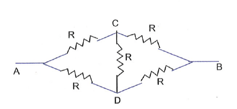

# Wheatstone Bridge
Figure shows the fundamental diagram of a Wheatstone bridge. The bridge has four resistances, together with a source of emf (a battery) and a galvanometer, which is a null detector. The galvanometer current depends upon the potential difference between the points ' $c$ ' and ' $d$ '. The bridge is said to be balanced, when the potential difference across the galvanometer is zero so that there is no current through the galvanometer. This condition occurs when the voltage drop from point ' $c$ ' to point ' $a$ ' equals the voltage drop from point ' $d$ ' to point ' $a$ ' or, by referring to the other battery terminals, when voltage drop from point ' $c$ ' to point ' $b$ ' equals the voltage drop from point ' $d$ ' to point ' $b$ '.
Hence, the bridge is balanced when,

$
I_1 R_1=I_2 R_2
$

If the galvanometer current is zero, then

$
\begin{aligned}
I_1 & =I_3=\frac{E}{R_1+R_3} \newline
\text { and } I_2 & =I_4=\frac{E}{R_2+R_4}
\end{aligned}
$

From (i), (ii) and (iii),

$
\frac{R_1}{R_2}=\frac{R_3}{R_4}
$

**Example 4:** Five equal resistors each of $R \Omega$ are connected in network as shown in figure. Calculate the equivalent resistance between the point $A$ and $B$.

Solution:
The given circuit is a balanced wheatstone bridge. Therefore, the resistance of arm CD is ineffective. Hence, we have the resistance of $\operatorname{arm} A C B=R+R=2 R$ in parallel to the resistance of $\operatorname{arm} A D B=R+R=2 R$
Effective resistance between $A$ and $B$ is $=\frac{2 R \times 2 R}{2 R+2 R}=R \Omega$

**Example 5:** An immersion heater rated 1.5 kW is used to heat 10 kg of water. Calculate the time taken in raising the temperature of the water by $32^{\circ} \mathrm{C}$. Specific heat capacity of water is $4200 \mathrm{~J} / \mathrm{kg}^{\circ} \mathrm{C}$.

Solution: The amount of heat produced in time $t$ is

$
\mathrm{H}=\mathrm{U}=\mathrm{P} \times \mathrm{t}=(1.5 \times 1000 \mathrm{~W}) \mathrm{t}
$

The amount of heat needed to raise the temperature by $32^{\circ} \mathrm{C}$ is

$
\mathrm{H}=\mathrm{mC} \Delta \mathrm{~T}=10 \times 4200 \times 32=1.344 \times 10^6 \mathrm{~J}
$

From (i) and (ii), we have

$
\begin{aligned}
& (1.5 \times 1000 \mathrm{~W}) \mathrm{t}=1.344 \times 10^6 \mathrm{~J} \newline
& \text { or, } \quad t=\frac{1.344 \times 10^6}{1.5 \times 1000}=896 \mathrm{~s}=14.9 \mathrm{~min}
\end{aligned}
$
