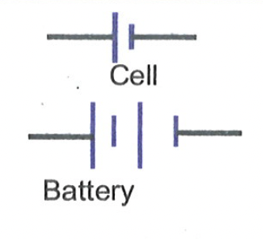

# CELL

Cell is a device that maintains a constant potential difference between its terminals for a long time. 

For a constant flow of charge over a long time we need a cell. A combination of cells is called a battery. Symbols of a cell and a battery are as shown in the figure.

## CONDUCTORS AND INSULATORS :
Materials that conduct electricity are called conductors and materials that do not conduct electricity easily are called insulators. All metals conduct electricity and most solids that are non metals do not conduct electricity.

How metals conduct?

In metals, each atom allows some of its outer most electrons to detach from it and move quite freely within the metal. After the detachment of electron from it, the atom becomes positively charged. Therefore, a metal can be viewed as a collection of stationary positive charges and mobile electrons. When the potential difference is created across the metal, there is a flow of electrons and thus current develops.