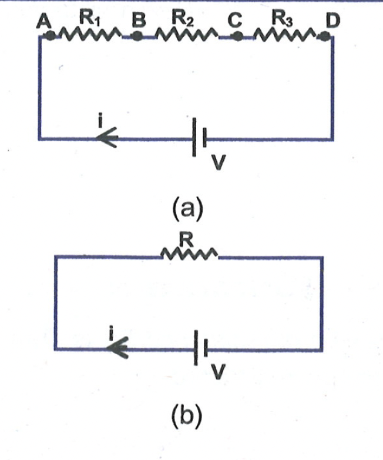
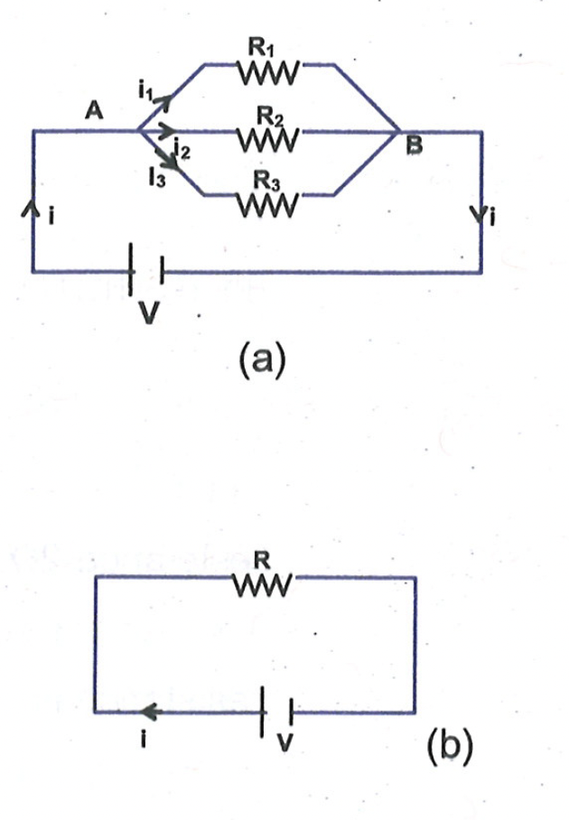
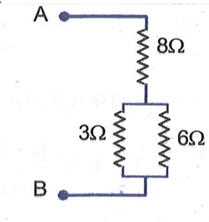
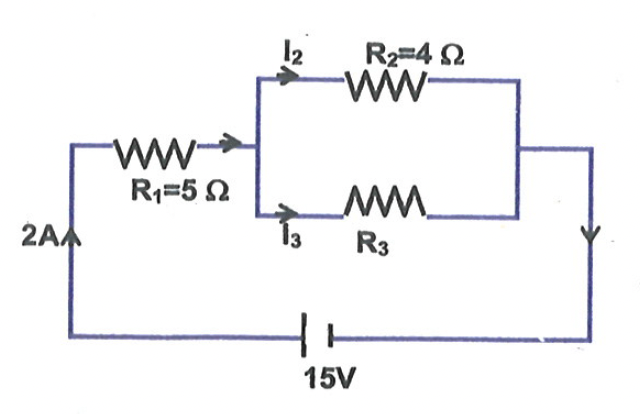
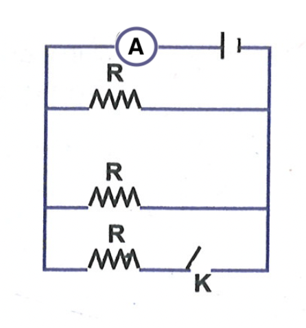
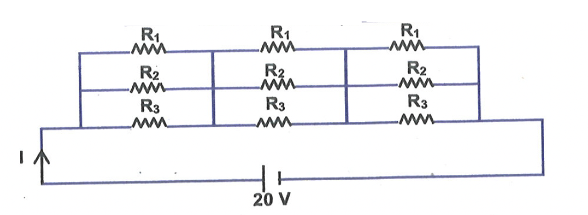
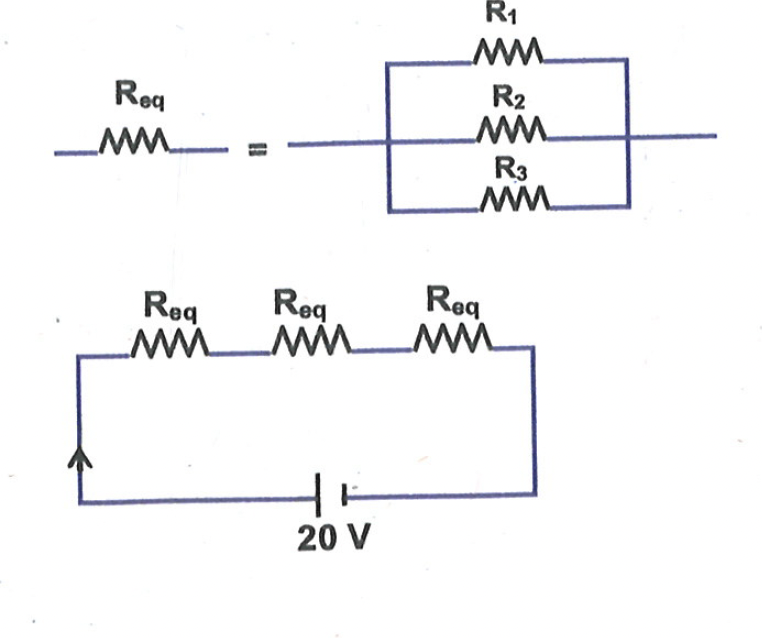
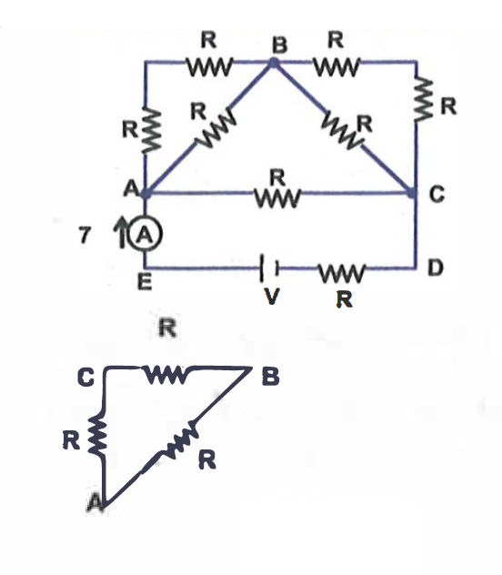
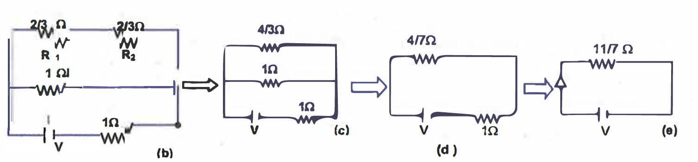

# SERIES AND PARALLEL COMBINATIONS OF RESISTORS

## Series Combination

The combination of resistances where same current (same charge carriers) passes through every resistance is called series combination.
Combination of resistance, which are connected in series, can be replaced by a single resistance $R$, which if connected across the same potential difference draws the same current. Thus, current through each resistance connected in series is equal to the current passing through equivalent resistance $R$.
From first circuit diagram, (a)

$
\begin{aligned}
& V_A-V_B=i R_1 \newline
& V_B-V_C=i R_2
\end{aligned}
$

$
V_C-V_D=i R_3
$

$
V_A-V_D=i\left(R_1+R_2+R_3\right)
$

$\Rightarrow \quad V=i\left(R_1+R_2+R_3\right)$

From second circuit diagram, (b)

$
V=i R
$

Therefore $R=R_1+R_2+R_3$.
$R$ is called as equivalent resistance of series combination of $R_1, R_2$ and $R_3$.

## Parallel Combination

The combination of resistances where different current (different charge carriers) pass through every resistance is called parallel combination. For e.g. in the diagram (a) shown below, $R_1, R_2$ and $R_3$ are connected in parallel.

Combination of resistances, which are connected in parallel, can be replaced by a single resistance $R$. If connected across the same potential difference, the total current flowing into the parallel combination of resistances is equal to current through equivalent resistance R.
From first circuit diagram (a)
(a)

And $\quad i=i_1+i_2+i_3$
On solving these equations, we get,

$
i=\frac{V}{R_1}+\frac{V}{R_2}+\frac{V}{R_3}
$

from second circuit diagram, if R is the equivalent of $R_1, R_2$ and $R_3$ then

$
V=i R
$

Therefore, $\frac{1}{\mathrm{R}}=\frac{1}{\mathrm{R}_1}+\frac{1}{\mathrm{R}_2}+\frac{1}{\mathrm{R}_3}$
Thus, $R$ is called as equivalent resistance of parallel combination of $R_1, R_2$ and $R_3$.

<b>$\sigma$ Illustration 7 :</b>

What is the resistance between $A$ and $B$ in the given network ?  
**Solution**: For the two resistors in parallel $\frac{1}{R}=\frac{1}{3}+\frac{1}{6}=\frac{2}{6}+\frac{1}{6}=\frac{3}{6}$ or $\mathrm{R}=2 \Omega$.
This is in series with $8 \Omega$, so $\mathrm{R}_{\mathrm{AB}}=2 \Omega+8 \Omega=10 \Omega$

<b>$\sigma$ Illustration 8 :</b>

Three resistance of $12 \Omega, 16 \Omega$ and $20 \Omega$ are connected in parallel. What resistance must be connected in series with this combination to give a total resistance of $25 \Omega$ ?

**Solution**: The resistance R of the parallel combination is given by

$
\begin{aligned}
& \frac{1}{R}=\frac{1}{R_1}+\frac{1}{R_2}+\frac{1}{R_3}=\frac{1}{12}+\frac{1}{16}+\frac{1}{20} \newline
& =\frac{20}{240}+\frac{15}{240}+\frac{12}{240}=\frac{47}{240}
\end{aligned}
$

or $\quad R=5.11 \Omega$
Then, $R_x+R=25$
or $\quad R_x=25-5.11=19.89 \Omega$

<b>$\sigma$ Illustration 9 :</b>

Consider the circuit shown in the figure. Calculate the current through $3 \Omega$ resistor.

**Solution**: The $3 \Omega$ resistor and the $6 \Omega$ resistor are joined in parallel. Their equivalent resistance is

$
R_{\mathrm{eq}}=\frac{3 \times 6}{3+6}=2 \Omega
$

Thus, the two resistors may be replaced by a single resistor of resistance $2 \Omega$. The circuit can be redrawn as shown in the figure. The two resistors in the figure are joined in series. The equivalent resistance is

$
\mathrm{R}=4 \Omega+2 \Omega=6 \Omega
$

The current through the battery is $\mathrm{i}=\frac{12}{6}=2 \mathrm{~A}$
The current through the battery and the $4 \Omega$ resistor is 2 A . This current is divided in the two resistors ( $3 \Omega$ and $6 \Omega$ ) which are joined in parallel.
Using $i_1=\frac{R_2 i}{R_1+R_2}$,
the current through the $3 \Omega$ resistor is

$
i_1=\frac{6 \times 2}{3+6}=\frac{12}{9}=1.33 \mathrm{~A} .
$

<b>$\sigma$ Illustration 10 :</b>

For the given circuit. Find (i) the value of resistance $R_3$. (ii) the current flowing across resistor $R_3$.

**Solution**: Potential difference across $\mathrm{R}_1=2 \times 5=10 \mathrm{~V}$.
$\therefore$ Potential difference across $\mathrm{R}_2$
and $R_3=15-10=5 \mathrm{~V}$
Let the current flowing across $\mathrm{R}_3$ be $\mathrm{I}_3$ and current flowing across $R_2$ be $I_2$.

$
\begin{array}{r}
I_2+I_3=2 \newline
\text { Or, } I_2=2-I_3
\end{array}
$

Potential difference across $R_2$ and $R_3$ is same.

$
\begin{aligned}
& \therefore I_2 R_2=I_3 R_3=5 \newline
& \Rightarrow\left(2-I_3\right) 4=I_3 R_3 \newline
& \Rightarrow\left(2-I_3\right) 4=5 \newline
& \Rightarrow I_3=2-5 / 4=3 / 4 \mathrm{~A}
\end{aligned}
$

And $I_3 R_3=5$

$
\Rightarrow R_3=\frac{5}{I_3}=\frac{5}{3 / 4}=\frac{20}{3} \Omega
$

$\therefore$ Value of resistor $\mathrm{R}_3=20 / 3 \Omega$
Value of current through $\mathrm{R}_3=0.75 \mathrm{~A}$.

<b>$\sigma$ Illustration 11 :</b>

In the diagram, cell and the ammeter both have negligible resistance. The resistors are identical with the switch $k$ open, the ammeter reads 0.6 A . What will be the ammeter reading when the switch is closed?

**Solution**: When switch K is open, effective resistance is given by

$
=\frac{R \times R}{R+R}=\frac{R}{2}
$

If battery emf is assumed to be $V$

$
\begin{aligned}
& \mathrm{V}=0.6 \mathrm{R} / 2 \newline
& \mathrm{R}=\mathrm{V} / 0.3 \quad \ldots \text { (i) }
\end{aligned}
$

When the switch is closed,
Effective resistance becomes, $R_{\text {eq }}$

$
\frac{1}{R_{e q}}=\frac{3}{R} \text { or } R_{e q}=\frac{R}{3}
$

Let current flowing through the Ammeter be I,

$
\begin{aligned}
& I R_{e q}=V \newline
\Rightarrow & 1 \frac{R}{3}=V \newline
\Rightarrow & I=\frac{3 V}{R}=\frac{3 V}{V / 0.3}=3 \times 0.3=0.9 \mathrm{~A} .
\end{aligned}
$

<b>$\sigma$ Illustration 12:</b>

In the given circuit, find the value of $I$, when $R_1=$ $1 \Omega, R_2=2 \Omega, R_3=3 \Omega$.

**Solution**:
The circuit can be redrawn as shown, where

$
\begin{aligned}
& R_{\text {eq }} \text { is, } \frac{1}{R_{\text {eq }}}=1+\frac{1}{2}+\frac{1}{3}=\frac{11}{6} \newline
& R_{\text {eq }}=\frac{6}{11} \Omega \newline
& \mathrm{R}_{\text {res }}=3 \mathrm{R}_{\text {eq }}=\frac{18}{11} \Omega \newline
& \mathrm{I}=\frac{\mathrm{V}}{\mathrm{R}_{\text {res }}}=\frac{20}{18 / 11}=\frac{110}{9} \mathrm{~A}
\end{aligned}
$

<b>$\sigma$ Illustration 13:</b>

In given circuit, $R=1 \Omega$ and ammeter shows reading of 7 amperes, then find the value of $V$.

**Solution**: The resistance across $A B=2 / 3 \Omega$
Similarly resistance across $B C=2 / 3 \Omega$
The circuit can be reduced to simplified circuit,

Thus total resistance $=11 / 7 \Omega$ Then, $V=I R=7 \times\left(\frac{11}{7}\right)=11$ volt

<b>Exercise 5:</b>

(i). Join three resistances of $2 \Omega$ each, such that the total resistance of the circuit is $3 \Omega$.  
(ii). How will you connect three resistors of $2 \Omega, 3 \Omega$ and $5 \Omega$ respectively to obtain a equivalent resistance of $2.5 \Omega$ ? Draw the diagram to show arrangement.  
(iii). If 3 resistors having values $2 \Omega, 3 \Omega$ and $5 \Omega$ are in parallel, then will the value of total resistance be less than $2 \Omega$ or greater than $5 \Omega$ or lie between $2 \Omega$ and $5 \Omega$ ?  