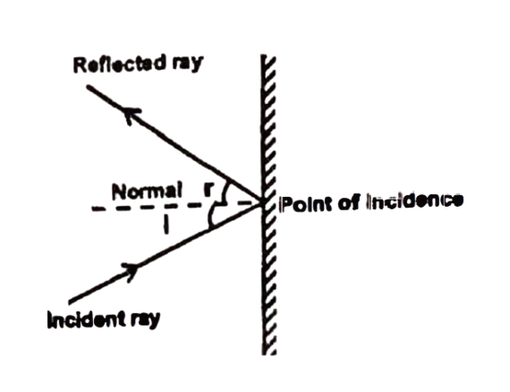
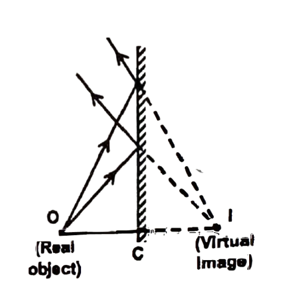
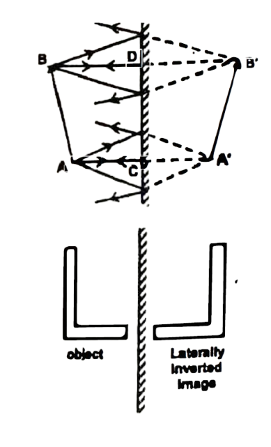
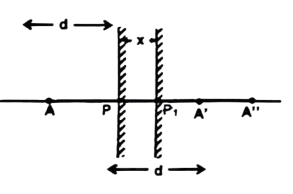
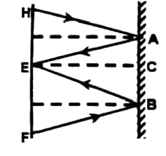
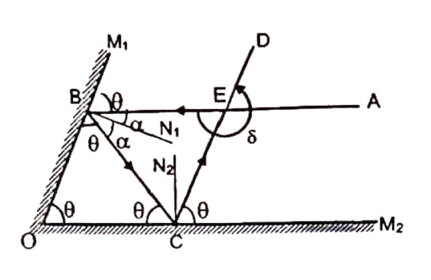
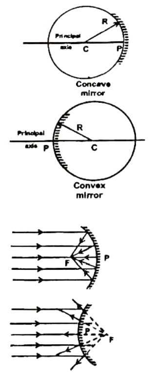

# LIGHT - REFLECTION AND REFRACTION

The sensation of sight is caused by the light, which is a form of electromagnetic radiation. Without light we can not see objects. The objects which can be seen as they emit their own light are called luminous object like sun, stars, lamp etc and those objects which can be observed only when the light is scattered or reflected by them are called non luminous objects like book, pen, flower, tree, moon etc. The branch of science that deals with the nature of light is called optics.

## THE NATURE OF LIGHT
Although most of the common phenomena shown by light can be understood if we consider light as waves, certain phenomena can be explained only if we consider light as being made up of particles. Light shows the characteristics of both a wave and a particle, i.e. light has dual nature.

Sound is a mechanical wave, as it requires a material medium to travel. But light is an electromagnetic wave. It is a non-mechanical wave, as it does not require material medium to travel.
However, the speed of these waves depends on the nature of the medium. Speed of light in vacuum or free space is $3 \times 10^8 \mathrm{~m} / \mathrm{s} \|_{\mathrm{n}}$ air, the speed of light is only marginally less, whereas in glass or water, it is reduced considerably.

## Some Properties of Light

1. Light does not require any material medium to travel, i.e. it can travel in vacuum also. e.g. light travells from the sun to the earth across vast expanses of space that has no material. Since light does not need a medium to travel, light is a non-mechanical wave.
2. Speed of light in vacuum is $299,792.458 \mathrm{~m} / \mathrm{s}$ whereas speed of light is different in different medium.
3. Wavelength of the light is very small. It is only ten thousandth part of a centimetre.
4. When the light falls on a surface between two media, usually a part is reflected or scattered, a part is transmitted or refracted and a part is absorbed. As light is an electromagnetic wave, when it falls on an object, the electrons in that object experience forces similar to those experienced by an electron placed in suitable electric and magnetic field.

### Propagation of Light
Light travels along straight lines in a medium or in vacuum. Its path changes when there is an object in its path or where the medium changes. This is called as rectilinear propagation of light. Straight line path of light is called as light-ray. Bundle of light rays is called as beam of light.
The medium in which light can travel over large distances is called a transparent medium e.g. glass, water, air etc. The medium in which light cannot travel is called opaque e.g. paper, metals, and wood. The medium in which light can travel over short distances only and its intensity reduces rapidly, such medium is called as translucent medium. e.g. fog, butter paper etc.

## REFLECTION OF LIGHT
A line perpendicular to plane of mirror where the light ray strikes the mirror is called normal. The angle made by incident light ray and normal is called angle of incidence (i). The angle made by reflected ray and normal is called as angle of reflection (r). The law of reflection states that angle of incidence and angle of reflection are equal. Also incident light ray, the reflected ray and the normal to the mirror at the point of incidence are in the same plane.
These laws of reflection are applicable to all types of reflecting surfaces including spherical surface.

### Reflection by Plane Mirror
(I) Image of a Point Object in a Plane Mirror:

A point object $O$ is placed in front of a plane mirror; various light rays from this object incident on the mirror and get reflected. When reflected rays are produced backward, they meet at a point I . This point is called image of object $O$.
When the image is not formed by actual intersection of reflected light rays it is called a virtual image. When image is formed by actual intersection of light rays it is called a real image. Also distance of 0 from plane mirror is equal to distance of I from the same mirror. (fie.

$
O C=I C)
$

(II) Image of an Extended Object in a Plane Mirror:

An extended object is made up of infinite number of points. We can see the images of all such points in a mirror, the collective image of all such points is the extended image of the object. $A^{\prime} B^{\prime}$ is the image of the extended object $A B$ as shown in the figure.

Here, $A B=A^{\prime} B^{\prime}, A C=A^{\prime} C$ and $B D=B^{\prime} D$
The image formed by the plane mirror is erect, virtual and laterally inverted. Erect image means that image does not become upside down. Mirror of different shapes forms an image which is upside down, these images are called as inverted images. Lateral inversion means left part of the object becomes the right part of the image. For example, if in front of the mirror if you move your left hand, there will be movement in right hand of the inverted image.

Note: If two plane mirrors facing each other are inclined at an angle $\theta$ with each other, then numbers of images are formed due to muttiple reflections.
(i) If $360 / \theta$ is an even integer, then the number of image formed is $n=\frac{360}{\theta}-1$

For example, if $\theta=60^{\circ}$, then $n=\frac{360}{60}-1=5$

(ii) If $360 / \theta$ is an odd integer, then following two situations arise.
(a) If the object lies symmetrically between the mirrors, then $n=\frac{360}{\theta}-1$.
(b) If the object lies asymmetrically, then $n=\frac{360}{\theta}$.

If the plane mirrors are parallel to each other then $n=\frac{360}{\theta}=\infty$.

<b>$\sigma$ Illustration 1 :</b>

An Object is placed in front of a plane mirror. If the mirror is moved away from the object through a distance $x$, by how much distance will the image move?

**Solution:** Suppose the object was at a distance $d$ from the mirror as shown in the figure.
The image is formed at $A^{\prime}$. When the mirror is shifted from $P$ to $P_1$, the image is formed at $A^{\prime \prime}$. We have

$
\begin{aligned}
& A P=P A^{\prime}=d \\
& \text { Also, } A P_1=P_1 A^{\prime \prime}=d+x \\
& \text { Thus, } A A^{\prime \prime}=A P_1+P_1 A^{\prime \prime}=2(d+x) \text {, and } \\
& A A^{\prime}=A P+P A^{\prime}=2 d \\
& \text { Thus, } A^{\prime} A^{\prime \prime}=A A^{\prime \prime}-A A^{\prime}=2(d+x)-2 d=2 x
\end{aligned}
$

<b>$\sigma$ Illustration 2 :</b>

A man 2 m tall, whose eye level is 1.84 m above the ground, looks at his image in vertical mirror. What is the minimum vertical length of the mirror if the man is to be able to see the whole of himself?

**Solution:** Let the man is represented by HF where H is the head and F represents the feet. Suppose the eyes of the man are represented by E.
Since the man sees his head, therefore, a ray of light starting from $H$ must reach $E$ after reflection from the mirror. Clearly A lies on the perpendicular bisector HE .

$
\therefore \quad A C=\frac{1}{2} H E=\frac{1}{2}(2-1.84) \mathrm{m}=0.08 \mathrm{~m}
$

Since the man sees his feet therefore a ray of light starting from $F$ must reach $E$ after reflection from the mirror. So, the perpendicular bisector of EF passes through B .

$
\begin{aligned}
& \mathrm{BC}=\frac{1}{2} \mathrm{EF}=\frac{1}{2} \times 1.84 \mathrm{~m}=0.92 \mathrm{~m} \\
& \text { Length of mirror }=0.08 \mathrm{~m}+0.92 \mathrm{~m}=1 \mathrm{~m}
\end{aligned}
$

<b>$\sigma$ Illustration 3 :</b>

Two plane mirrors are inclined to each other such that a ray of light incident on the first mirror and parallel to the second is reflected from the second mirror parallel to the first mirror. Determine the angle between the two mirrors.

**Solution:** Let $\theta$ be the angle between the two mirrors $O M_1$ and $O M_2$. The incident ray $A B$ is parallel to mirror $\mathrm{OM}_2$ and strikes the mirror $\mathrm{OM}_1$ at an angle of incidence equal to $\alpha$. It is reflected along BC ; the angle of reflection being $\alpha$. From figure, we have

$
\angle M_1 B A=\angle O B C=\angle M_1 O M_2=\theta
$

Similarly, for reflection at mirror $\mathrm{OM}_2$, we have

$
\angle \mathrm{M}_2 \mathrm{CD}=\angle \mathrm{BCO}=\angle \mathrm{M}_2 \mathrm{OM}_1=\theta
$

Now, in triangle OBC, $3 \theta=180^{\circ}$, therefore, $\theta=60^{\circ} .$

### Exercise 1:回
(i) A ray of light falls on a plane mirror, show that if the mirror is tilted through an angle $\theta$, as shown in the figure, the reflected. ray tilts through an angle $2 \theta$.  

in What is the magnification produced by a plane mirror?  
(iii) Prove that the size of the image formed by a plane mirror is equal to that of the object.  
(a) What is the focal length of a plane mirror?  

## Reflection By Spherical Mirror

Spherical mirror is part of a hollow sphere. If its outer surface is reflecting it is called as convex mirror and if its inner surface is reflecting it is called as concave mirror. The surfaces of the mirror from which reflection can take place is called its aperture. Centre of the hollow sphere of which spherical mirror is a part is called as the centre of curvature of the mirror. Radius of the sphere is called as radius of curvature. A line passing through centre of sphere and intersecting the mirror surface is called as principal axis. The point where this line intersects the mirror is called as a pole.

The point on the principal axis where incident rays parallel to the principal axis converge or appear to diverge from, after reflection is called the principal focus or focus of the mirror. Distance between focus and pole is called as focal length of the mirror. Focal length of the spherical mirror is equal to half of radius of curvature.

> **_NOTE:_**  $C=$ centre of curvature, $R=$ radius of curvature, $P=$ pole,$F=$ focus

