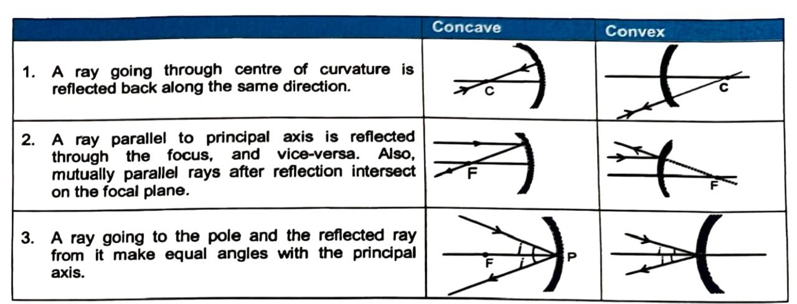
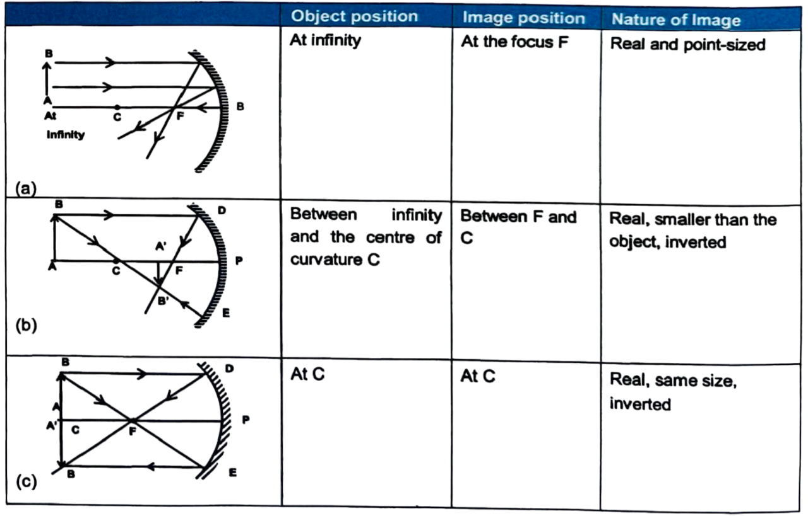
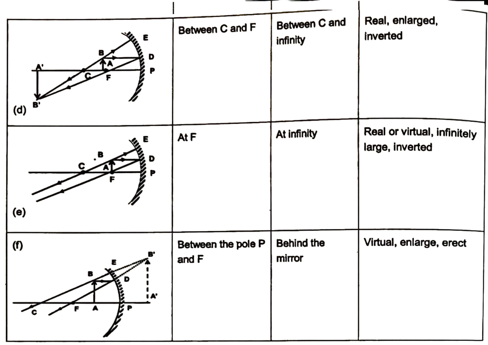
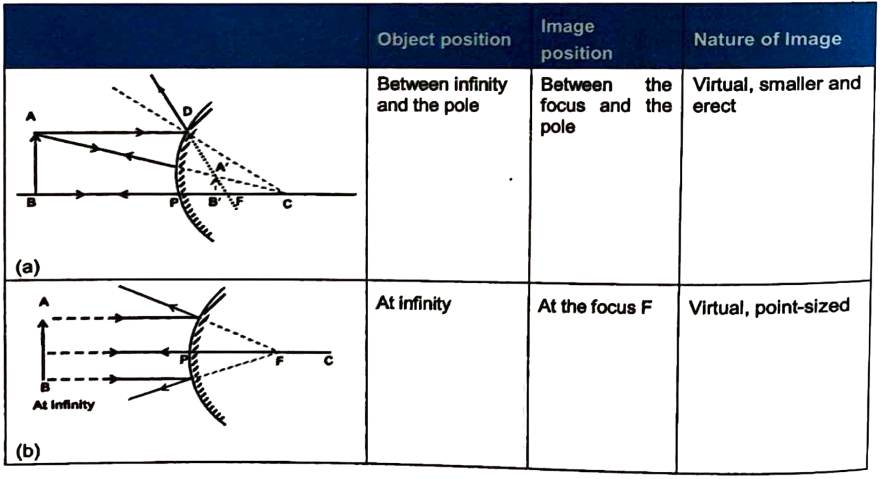

# RAY TRACING

In geometrical optics, to locate the image of an object, tracing of a ray as it reflects or refracts, is very important.

## Images formed by a Concave Mirror
For an extended object figure (a)-(f), illustrate the formation of image $A^{\prime} B^{\prime}$ in several situations by a concave mirror. Here aperture of the mirror is small. For large aperture, the image is not distinct. It suffers from certain defects.

## Images Formed By a Convex Mirror

For an extended object figure (a)-(b), illustrate the formation of image $A^{\prime} B^{\prime}$ in several situations by a concave mirror. Here aperture of the mirror is small.

