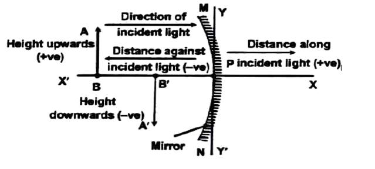

# Spherical Mirrors

## USES OF SPHERICAL MIRRORS
### Concave Mirrors
1. The reflectors of table lamp act as concave mirrors. This helps to direct light in a given area.
2. Shaving mirrors are made slightly concave. This gives an enlarged erect image of the face. When the face is kept closer than the principal focus of the mirror, a virtual erect and enlarged image is formed behind the mirror.
3. The dentists use concave mirrors to see large images of the teeth of patients.
4. Sun's rays are focused by large concave mirror's on the object to be heated. Thus, concave mirrors play a vital role in the field of solar energy.
### Convex Mirrors
They are used in automobiles as rear view mirrors because of two reasons:
(i) A convex mirror always produces an erect image.
(ii) The image is diminished in size, so that it gives a wide field of view.

## SIGN CONVENTIONS

- All the distances are measured from pole of the mirror as origin of coordinate.
- Distance measured in the same direction as that of incident light is taken to be as positive.
- Distance measured against the direction of incident light are taken as negative.
- The object height is always taken to be positive. If the image is formed on the same side of the principal axis (erect image), the image height is also taken to be positive. If the image is formed on the opposite side (inverted image), then image height is taken to be negative.
- Focal length and radius of curvature are always negative for concave mirror and always positive for convex mirror.
Note: On the basis of New Cartesian sign convention,
(a) The focal length of concave mirror is negative and of convex mirror is positive.
(b) For a concave mirror, the magnification is negative in case of real image and is positive in case of virtual image. But for a convex mirror image formed is always virtual and erect hence m is always positive.

## SYMBOLS FOR SPHERICAL MIRROR
In dealing with spherical mirrors, we generally required four distances parallel to principal axis and two distances perpendicular to the principal axis. All these six distances has a particular mathematical quantity associated with it as given in the table?

| Distance | Quantity |  |
| :--- | :--- | :--- |
| From the pole to the object | Object - distance | U |
| From the pole to the image | Image-distance | V |
| From the pole to the focus | Focal length | F |
| From the pole to the centre | Radius of curvature | R |
| Height of the object | Object - height | $\mathrm{h}_{\boldsymbol{e}}$ |
| Height of the image | Image - height | $\mathrm{h}_{\boldsymbol{e}}$ |