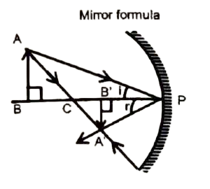
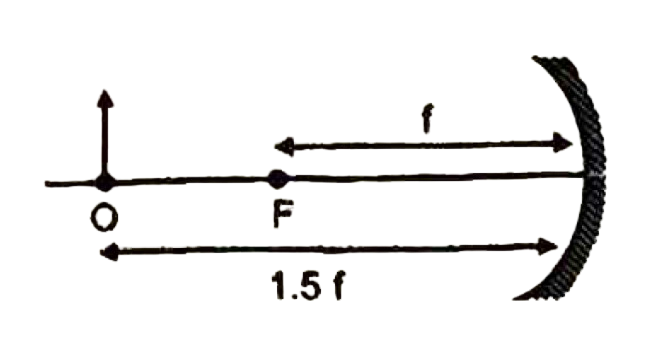

# MIRROR FORMULA 

Consider a spherical mirror having small aperture (much less than the radius of curvature $R$ ). We will now establish a relation between 
(a) distance $u$ of object from pole, 
(b) distance $v$ of image from pole and 
(c) focal length $f$ of mirror. 

It is this mathematical relation which is known as the mirror equation or mirror formula.

In the given figure, the object $A B$, is placed on the left in front of the concave mirror, beyond its centre of curvature $C$. $A^{\prime} B^{\prime}$ is the image of $A B$ formed by a spherical mirror as shown in the figure.
Using the new Cartesian sign convention,
Object distance $(P B)=-u$; Image distance $\left(P B^{\prime}\right)=-v$,
Focal length $=P F=-f$, Radius of curvature $=P C=-R$,

$
\begin{aligned}
& \angle \mathrm{i}=\angle \mathrm{r} \quad \text { (law of } 1 \newline
& \angle \mathrm{ABC}=\angle \mathrm{A}^{\prime} \mathrm{B}^{\prime} \mathrm{C}=90^{\circ}
\end{aligned}
$

(law of reflection)
Therefore $\triangle A B P$ and $\triangle A^{\prime} B^{\prime} P$ are similar,

$
\therefore \quad \frac{A^{\prime} B^{\prime}}{A B}=\frac{P B^{\prime}}{P B}=\frac{(-v)}{(-u)}=\frac{v}{u}
$

$\triangle A B C$ and $\triangle A^{\prime} B^{\prime} C$ are also similar

$
\begin{array}{ll}
\therefore & \frac{A^{\prime} B^{\prime}}{A B}=\frac{C B^{\prime}}{C B} \newline
\Rightarrow & \frac{A^{\prime} B^{\prime}}{A B}=\frac{P C-P B^{\prime}}{P B-P C}=\frac{(-R)-(-v)}{(-u)-(-R)}=\frac{-R+v}{-u+R}
\end{array}
$

From equation (i) and (ii),

$
\frac{-R+v}{-u+R}=\frac{v}{u} \Rightarrow u R+v R=2 u v
$

Dividing both sides by $u v R$, we get

$
\frac{1}{v}+\frac{1}{u}=\frac{2}{R}
$

When object $A B$ is at infinite separation, image is formed at focus,

$
\Rightarrow \quad \frac{1}{f}+\frac{1}{\infty}=\frac{2}{R} \Rightarrow f=R / 2
$

From equations (iii) and (iv) we get, $\frac{1}{u}+\frac{1}{v}=\frac{1}{f}$
This formula is valid for all spherical mirrors with small aperture (paraxial rays).
Magnification
Magnification is defined as ratio of height of image to the height of object.

$
m=\frac{\text { height of image }}{\text { height of object }\left(h_1\right)}
$

The magnification $m$ is also related to the object distance $(u)$ and image distance $(v)$. It can be expressed as $m=-\frac{v}{u}$.
A negative sign in the value of the magnification indicates that the image is real. A positive sign in the value of magnification indicates that the image is virtual,

<b>$\sigma$ Illustration 4 :</b>

 At what distance from a convex mirror of focal length $30 \mathrm{~cm}$ should an object be placed, so that its image is formed $20 \mathrm{~cm} $ from the mirror at right side.

**Solution:**
From mirror formula

$
\frac{1}{v}+\frac{1}{u}=\frac{1}{f}
$

Here $u=$ object distance, $v$ (image distance) $=20 \mathrm{~cm}$,
$f$ (focal length of mirror) $=30 \mathrm{~cm}$

$
\begin{aligned}
& \frac{1}{u}+\frac{1}{20}=\frac{1}{30} \newline
& u=-60 \mathrm{~cm}
\end{aligned}
$

Hence object should be placed at a distance of 60 cm in front of mirror.

<b>$\sigma$ Illustration 5 :</b>

An object 3 cm high is placed at a distance of 16 cm from a spherical mirror, which produces a virtual image of 4.5 cm height. Find  
(i) the focal length and nature of the mirror  
(ii) the position of the image  

**Solution:**
Solution:
(i) Calculation of position of image:

The height of image is $4.5 \mathrm{~cm}\left(h_1\right)$ and it is virtual hence magnification will be positive

$
m=\frac{h_1}{h_0}=\frac{4.5}{3}=+1.5
$

Here $h_0=$ object height, Now $m=-v / u$;
$u$ (object distance) $=-16 \mathrm{~cm}$
(Image distance) $v=1.5 \times 16=+24 \mathrm{~cm}$
Thus the position of image is 24 cm at the right side of mirror.
(ii) Calculation of focal length:

Here $v=24 \mathrm{~cm}, u=-16 \mathrm{~cm}$

$
\frac{1}{f}=\frac{1}{v}+\frac{1}{u}
$

Here $f=$ focal length of mirror

$
\begin{aligned}
& \frac{1}{f}=-\frac{1}{16}+\frac{1}{24} \newline
& f=-48 \mathrm{~cm}
\end{aligned}
$

Hence focal length of mirror is 48 cm and minus sign shows that it is concave mirror.

<b>$\sigma$ Illustration 6 :</b>

An object of length 2.5 cm is placed at 1.5 f from a concave mirror, where f is the focal length of the mirror. The length of the object is perpendicular to the principal axis. Find the length of the image. Is the image erect or inverted?

**Solution:**

The focal length $F=-f$

$
\text { and } u=-1.5 f
$

We have,

$
\frac{1}{u}+\frac{1}{v}=\frac{1}{F} \text { or } \frac{1}{-1.5 f}+\frac{1}{v}=-\frac{1}{f}
$

$
\frac{1}{v}=\frac{1}{1.5 f}-\frac{1}{f}=-\frac{1}{3 f}
$

$
v=-3 i
$

Now, $m=-v / u=-\frac{3 f}{1.5 f}=-2$
or $\frac{h_2}{h_1}=-2$ or $h_2=-2 h_1=-5 \mathrm{~cm}$
The image is 5 cm long. The minus sign shows that it is inverted.

<b>$\sigma$ Illustration 7 :</b>

An object is placed in front of a concave mirror of radius of curvature 40 cm at a distance of 10 cm . Find the position, nature and magnification of the image.

**Solution:**

$
\text { Here } R=-40 \mathrm{~cm}, u=-10 \mathrm{~cm}
$

Focal length of concave mirror, .

$
f=\frac{R}{2}=\frac{-40}{2}=-20 \mathrm{~cm}
$

Using $\frac{1}{v}=\frac{1}{f}-\frac{1}{u}$

$
=\frac{1}{20}-\frac{1}{(-10)}=-\frac{1}{20}+\frac{1}{10}=\frac{-1+2}{20}=\frac{1}{20}
$

$
\therefore v=+20 \mathrm{~cm}
$

Thus, position of the image is at 20 cm to the right side of the pole of the mirror.
Since $v$ is positive, so virtual image is formed.

$
\begin{aligned}
& m=-\frac{v}{u}=\frac{-20}{(-10)}=2 \newline
& \text { Since } m=\frac{1}{0}=2 \newline
& \because 1=20
\end{aligned}
$

Therefore, size of image is double than the size of the object, Moreover, image is erect.

<b>$\sigma$ Illustration 8 :</b>

Where should an object be placed in front of concave mirror of focal length $f$ so that the image to be of the same size as that of the object?

Solution: Since size of image $=$ size of object

$
\begin{aligned}
& \therefore m=\frac{1}{0}=-\frac{v}{u}=1 \newline
& \text { or } v=-u
\end{aligned}
$

Using $\frac{1}{u}+\frac{1}{v}=\frac{1}{f}$, we get
$-\frac{1}{u}-\frac{1}{v}=\frac{-1}{f}$ ( $u$ and $f$ are taken as $-v e$ )
or $\frac{2}{u}=\frac{1}{f}$ or $u=2 f$
Since $2 f=R \quad \therefore u=R$
so the object must be placed at the centre of curvature of the concave mirror.

<b>$\sigma$ Illustration 9 :</b>

An object is placed 40 cm infront of a concave mirror of focal length 20 cm . A plane mirror is placed at a distance of 20 cm in front of the concave mirror. Find the final position of the image.

Solution:
Here $u=-40 \mathrm{~cm}, f=-20 \mathrm{~cm}$
Using $\frac{1}{u}+\frac{1}{v}=\frac{1}{f}$, we get

$
\begin{aligned}
& \frac{1}{v}=\frac{1}{f}-\frac{1}{u} \newline
& =-\frac{1}{20}+\frac{1}{40} \newline
& =\frac{-2+1}{40}=-\frac{1}{40} \newline
& \text { or } v=-40 \mathrm{~cm}
\end{aligned}
$

The image formed by the concave mirror is at 40 cm in fornt of it.
For plane mirror, $f=\infty$. The image formed by the concave mirror acts as the object for the plane mirror.
So $u=20-40=-20 \mathrm{~cm}$.
Using $\frac{1}{u}+\frac{1}{v}=\frac{1}{f}$, we get

$
\frac{1}{v}=\frac{1}{f}-\frac{1}{u}=\frac{1}{\infty}+\frac{1}{20}=\frac{1}{20}
$

or $v=20 \mathrm{~cm}$
Therefore, the final position of the image is 20 cm in front of the plane mirror.

<b>$\sigma$ Illustration 10 :</b>
A thin rod of length 5 cm lies along the principal axis of the concave mirror of focal length 15 cm in such a way that the end closer to the pole is 30 cm away from it. Find the length of the image.
Solution:
Let's solve this step by step.

Given:
- Length of rod = 5 cm
- Focal length (f) = -15 cm (concave mirror)
- Distance of closer end from pole (u₁) = -30 cm
- Distance of farther end from pole (u₂) = -(30 + 5) = -35 cm

For closer end:
Using $\frac{1}{u}+\frac{1}{v}=\frac{1}{f}$

$\frac{1}{v_1}=\frac{1}{f}-\frac{1}{u_1}=\frac{-1}{15}+\frac{1}{30}=\frac{-2+1}{30}=-\frac{1}{30}$

$\therefore v_1 = -30$ cm

For farther end:
$\frac{1}{v_2}=\frac{1}{f}-\frac{1}{u_2}=\frac{-1}{15}+\frac{1}{35}=\frac{-35+15}{525}=-\frac{20}{525}$

$\therefore v_2 = -26.25$ cm

Length of image = $|v_2 - v_1|$ = $|(-26.25) - (-30)|$ = 3.75 cm

Therefore, the length of the image is 3.75 cm.

<b>$\sigma$ Illustration 11 :</b>

A 2.5 cm needle is placed 10 cm away from a convex mirror of focal length 20 cm . What is the location of the image and the magnification. What would happen if the needle is moved away from the mirror?

Solution:
Let's solve this step by step.

Given:
- Height of needle (h) = 2.5 cm 
- Object distance (u) = -10 cm
- Focal length (f) = 20 cm (convex mirror)

Using mirror formula: $\frac{1}{u}+\frac{1}{v}=\frac{1}{f}$

$\frac{1}{v}=\frac{1}{f}-\frac{1}{u}=\frac{1}{20}+\frac{1}{10}=\frac{3}{20}$

$\therefore v = \frac{20}{3} \approx 6.67$ cm

The image is formed 6.67 cm behind the mirror.

For magnification (m):
$m = -\frac{v}{u} = -\frac{6.67}{10} = 0.667$

The negative sign indicates that the image is virtual and erect.
The image is 0.667 times the size of the object, i.e. height of image = 1.67 cm

If the needle is moved away from the mirror:
- The image distance (v) will decrease (move closer to focal point)
- The magnification will decrease (image becomes smaller)
- Image will remain virtual and erect
- Image will always be formed between F and P (pole)

This is because for a convex mirror:
- Image is always virtual, erect and diminished
- Image is always formed between F and P
- As object moves away, image moves closer to focal point

<b>Exercise 2:</b>. 

(i) Focal length of a curved mirror depends on.   
$\quad$(A) the wavelength of light.  
$\quad$(B) the frequency of light.  
$\quad$(C) the material of mirror.  
$\quad$(D) none of these.  
(ii).   
$\quad$(a) What is the minimum distance between the real object and its real image in a concave mirror?  
$\quad$(b) A concave mirror is placed in water will there be any change in its focal length? Give reason.

Reference [Doubtnet Video](https://www.doubtnut.com/qna/16412729)

**Exercise 2 Solutions**. 

(i) The focal length (f) of a curved mirror is determined by its radius of curvature (R). The relationship is given by the formula:

f = R / 2

Let's analyze the options:

* **(A) the wavelength of light:** The reflection of light from a mirror follows the laws of reflection, which depend on angles, not the wavelength of light. Wavelength affects phenomena like dispersion in lenses (due to refraction), but not the focal length of a mirror.
* **(B) the frequency of light:** Similar to wavelength, the frequency of light does not influence how light reflects geometrically from the mirror's surface.
* **(C) the material of mirror:** While the material affects the reflectivity (how well the mirror reflects light), it doesn't determine the focal point, which is a purely geometric property related to the mirror's shape (curvature).

Since the focal length depends only on the radius of curvature, which is a geometric property of the mirror, none of the options provided (wavelength, frequency, material) are correct.

Therefore, the correct answer is **(D) none of these**.

(ii) (a) Okay, here is a concise answer for the second question, using points from the earlier detailed explanation and formatted with Markdown:

**Minimum distance between real object and real image (concave mirror):**

* **Setup:** For a concave mirror, let `u` be object distance, `v` be image distance, and `f` be focal length. For real object/image, `u`, `v`, and `f` are negative. Using magnitudes `U = |u|`, `V = |v|`, `F = |f|`, the mirror formula is `1/U + 1/V = 1/F`. A real image requires `U > F`.
* **Distance:** The distance between object and image is `D = |u - v| = |V - U|`.
* **Minimum Case:** Consider placing the object at the center of curvature (C). Here, `U = R = 2F`.
* **Calculation:** Substituting `U = 2F` into the mirror formula:
    `1/V + 1/(2F) = 1/F`
    `1/V = 1/F - 1/(2F) = 1/(2F)`
    `V = 2F`
* **Result:** When the object is at C (`U=2F`), the image is also formed at C (`V=2F`).
* **Conclusion:** The object and image coincide. Therefore, the minimum distance `D = |V - U| = |2F - 2F|` is **zero**.

## Illustration Questions Only

<b>$\sigma$ Illustration 4 :</b>

 At what distance from a convex mirror of focal length $30 \mathrm{~cm}$ should an object be placed, so that its image is formed $20 \mathrm{~cm} $ from the mirror at right side.

*
<b>$\sigma$ Illustration 5 :</b>

An object 3 cm high is placed at a distance of 16 cm from a spherical mirror, which produces a virtual image of 4.5 cm height. Find  
(i) the focal length and nature of the mirror  
(ii) the position of the image  

<b>$\sigma$ Illustration 6 :</b>

An object of length 2.5 cm is placed at 1.5 f from a concave mirror, where f is the focal length of the mirror. The length of the object is perpendicular to the principal axis. Find the length of the image. Is the image erect or inverted?

<b>$\sigma$ Illustration 7 :</b>

An object is placed in front of a concave mirror of radius of curvature 40 cm at a distance of 10 cm . Find the position, nature and magnification of the image.

<b>$\sigma$ Illustration 8 :</b>

Where should an object be placed in front of concave mirror of focal length $f$ so that the image to be of the same size as that of the object?

<b>$\sigma$ Illustration 9 :</b>

<b>$\sigma$ Illustration 10 :</b>
A thin rod of length 5 cm lies along the principal axis of the concave mirror of focal length 15 cm in such a way that the end closer to the pole is 30 cm away from it. Find the length of the image.

<b>$\sigma$ Illustration 11 :</b>

A 2.5 cm needle is placed 10 cm away from a convex mirror of focal length 20 cm . What is the location of the image and the magnification. What would happen if the needle is moved away from the mirror?

<b>Exercise 2:</b>. 

(i) Focal length of a curved mirror depends on.   
$\quad$(A) the wavelength of light.  
$\quad$(B) the frequency of light.  
$\quad$(C) the material of mirror.  
$\quad$(D) none of these.  
(ii).   
$\quad$(a) What is the minimum distance between the real object and its real image in a concave mirror?  
$\quad$(b) A concave mirror is placed in water will there be any change in its focal length? Give reason.

