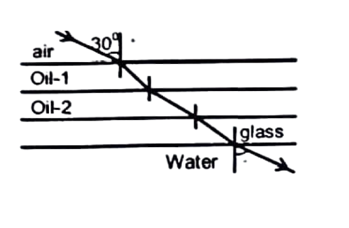

# REFRACTION
The phenomenon of change in the path of light as it travels from one medium to another is called refraction.

## Laws of Refraction
(a) The incident ray, the refracted ray and the normal to the refracting surface at the point of incidence, all lie in the same plane.
(b) Also the ratio of sine of the angle of incidence to the sine of the angle of refraction is constant, for the light of a given colour and for the given pair of media.

$
\frac{\sin i}{\sin \mathrm{r}}={ }_1 \mu_2
$

Where ${ }_1 \mu_2$ is the refractive index of second medium with respect of first medium. If ${ }_1 \mu_2$ is greater than 1 then light ray bends towards normal and if ${ }_1 \mu_2$ is less than 1 , then right ray bends away from normal.  
Equation (i) is known as Snell's law of refraction.  
As $\frac{\sin i}{\sin r}={ }_1 \mu_2=\frac{\mu_2}{\mu_1}$, when there are several media we can say,

$
\frac{\sin i_1}{\sin i_2}=\frac{\mu_2}{\mu_1} \Rightarrow \mu_1 \sin i_1=\mu_2 \sin i_2
$

Hence, $\mu_1 \sin i_1=\mu_2 \sin i_2=\mu_3 \sin i_3=$ constant or $\mu \sin i=$ constant.
This equation is found to be very useful for solving problems involving a variable refractive index.

<b>$\sigma$ Illustration 12 :</b>.  
A ray of light is incident on a substance ( $x$ ) at an angle of incidence of $60^{\circ}$. If the angle of refraction were $37^{\circ}$. Calculate the refractive index of substance $(x)$.

**Solution:**
Given:
- Angle of incidence (i) = 60°
- Angle of refraction (r) = 37°
- Light travels from air (medium 1) to substance x (medium 2)

Using Snell's law:
$\frac{\sin i}{\sin r} = \frac{\mu_2}{\mu_1} = {}_1\mu_2$

Since medium 1 is air, $\mu_1 = 1$
Therefore, $\mu_2 = {}_1\mu_2$

$\mu_2 = \frac{\sin 60°}{\sin 37°}$

$\mu_2 = \frac{0.866}{0.602} = 1.44$

Therefore, the refractive index of substance x is 1.44.

<b>$\sigma$ Illustration 13 :</b>.  

Light is incident from air on oil at an angle of $30^{\circ}$. After moving through oil-1, oil-2, and glass it enters water. If the refractive indices of glass and water are 1.5 and 1.3, respectively, find the angle which the ray makes with normal in water.

**Solution:**
Let's solve this using $\mu \sin i = constant$ for all media.

Given:
- Initial angle in air (i₁) = 30°
- Refractive index of glass (μ_g) = 1.5 
- Refractive index of water (μ_w) = 1.3
- Refractive index of air (μ_a) = 1.0

Using $\mu_1 \sin i_1 = \mu_2 \sin i_2$:

For air to water transition:
$\mu_a \sin i_a = \mu_w \sin i_w$

$1.0 \times \sin 30° = 1.3 \times \sin i_w$

$0.5 = 1.3 \times \sin i_w$

$\sin i_w = \frac{0.5}{1.3} = 0.385$

$i_w = \sin^{-1}(0.385) = 22.6°$

Therefore, the ray makes an angle of approximately 22.6° with the normal in water.

Note: The intermediate media (oil-1, oil-2, and glass) don't affect the final angle as long as we know the initial and final media's properties, due to the principle that $\mu \sin i$ remains constant throughout all media.

<b>$\sigma$ Illustration 14 :</b>.  

At what angle must a ray of light incident on the glass so that it is refracted at an angle of $30^{\circ}$ ? Given refractive index of glass $=1.5$

**Solution:** Here ${ }^{\circ} n_0=1.5, r=30^{\circ}$ Using $\frac{\sin i}{\sin r}={ }^{\circ} n_0$ or $\sin i={ }^{\circ} n_0 \times \sin r$
or $\sin \mathrm{i}=1.5 \times \sin 30^{\circ}=1.5 \times \frac{1}{2}=0.7500$
or angle of incidence $i=\sin ^{-1}(0.7500)=48^{\circ} 36^{\prime}$.

<b>Exercise 3:</b>.  

Which of the following does not change during the refraction of light? Wavelength, frequency or velocity of light?
During refraction of light, frequency remains constant while wavelength and velocity change.

**Solution to Exercise 3:**

This is because:
1. Frequency (f) is determined by the source of light and remains unchanged when light passes from one medium to another
2. Velocity (v) changes when light enters a different medium with different refractive index
3. Since v = fλ (where λ is wavelength), and f is constant but v changes, λ must change to maintain this relationship

Therefore, frequency is the only property that remains unchanged during refraction.

## Refractive Index

$
{ }_1 \mu_2=\mu_2 / \mu_1
$

where $\mu_2$ and $\mu_1$ are refractive indices of material 1 and 2 w.r.t. vacuum.
index of the medium. It is simply represented by $\mu_m$. If $c$ is the speed of light in air and $v$ is the speed of light in the medium, then the refractive index of the medium ( $\mu_m$ ) is given by

$
\mu_m=\frac{\text { speed of light in vacuum(Air) }}{\text { speedof light in themedium }}=\frac{c}{v}
$

The absolute refractive index of a medium is simply called its refractive index.

$
\begin{aligned}
& { }_1 \mu_2=\frac{\mu_2}{\mu_1} \newline
& { }_1 \mu_2=\frac{\mu_2}{\mu_1}=\frac{c / v_2}{c / v_1}=\frac{v_1}{v_2}
\end{aligned}
$

where $v_1$ and $v_2$ are the speeds of light in medium 1 and 2 respectively.
of a pair of transparent media, the one that has the higher refractive index is called the optically denser medium of the two, while the one that has the lower refractive index is called the optically rarer medium. Thus, a ray of light travelling from a rarer medium to a denser medium bends towards the normal,

<b>$\sigma$ Illustration 15 :</b>.  

 

Find.   
(i) Refractive index of glass.    
(ii) Refractive index of water.   
(iii) Speed of light in water.  

Solution:
(i) Refractive index of glass $=\frac{\text { Speed of light inair (or vacuum) }}{\text { Speed of lightinglass }}$

$
a \mu_g=\frac{3 \times 10^8}{2 \times 10^8} \Rightarrow a \mu_g=\frac{3}{2}
$

(ii) ${ }_w \mu_z=\frac{{ }_g \mu_g}{\mu_w} \Rightarrow{ }_{:} \mu_w=\frac{3 / 2}{9 / 8}=\frac{4}{3}$

$
\begin{aligned}
\text { (iii) } \mu_{\mathrm{w}} & =\frac{\text { Speed of lightinair (or vacuum) }}{\text { Speedof lightin water }} \newline
V_{\mathrm{w}} & =\frac{3 \times 10^8 \times 3}{4}=2.25 \times 10^8 \mathrm{~m} / \mathrm{s}
\end{aligned}
$

<b>$\sigma$ Illustration 16 :</b>.  

The wavelength of light in air is $7800 \mathrm{~A}^0$. What is the wavelength of this light in a medium whose refractive index is $4 / 3$.

Solution: $\quad \lambda_m=\frac{\lambda}{\mu}=\frac{7800 \times 3}{4}=5850 \mathrm{~A}^0$

### <b>Exercise 4:</b>.  

When a light goes from glass $(\mu=3 / 2)$ to water $(\mu=4 / 3)$. What is the refractive index of water with respect to glass?

**Solution for exercise:**

$
\begin{aligned}
{}_g\mu_w &= \frac{\mu_w}{\mu_g} \newline
&= \frac{4/3}{3/2} \newline
&= \frac{4}{3} \times \frac{2}{3} \newline
&= \frac{8}{9}
\end{aligned}
$

Therefore, the refractive index of water with respect to glass is $\frac{8}{9}$.

## Change in Wavelength Due to Change in Medium

Like any wave, the wavelength $\lambda$, frequency $u$ of light are related as
$v=v \lambda$, where $v$ is the velocity of light in the medium.
When light changes medium its frequency does not changes.
According to this relation, refraction is accompanied by a change in wavelength of light.

### <b>Exercise 5:</b>.  

A glass ray of wavelength $7200 A^{\circ}$ goes from glass $(\mu=3 / 2)$ to water $(\mu=4 / 3)$. Find wavelength of refracted ray in water

**Solution:**

Let $\lambda_g$ be wavelength in glass and $\lambda_w$ be wavelength in water.

$\lambda_g = 7200 A^{\circ}$

For glass to water:
$
\begin{aligned}
{}_g\mu_w &= \frac{\lambda_g}{\lambda_w} \newline
\frac{8}{9} &= \frac{7200}{\lambda_w} \newline
\lambda_w &= 7200 \times \frac{9}{8} \newline
&= 8100 A^{\circ}
\end{aligned}
$

Therefore, the wavelength of refracted ray in water is $8100 A^{\circ}$.

## Refraction Through A Rectangular glass Slab

Consider a ray of light EF passing from air (rarer medium $n_1=1$ ) through a paralled sided glass slab (denser medium, $n_2$ ) into air. The ray of light will clearly suffer two refractions. Since the medium on both sides of glass is the same therefore the ray of light will get laterally shifted without any deviation. This is proved below. At the first surface $A B$, with $n_1=1$, from Snell's law of refraction,

$
n_2 \sin r_1=n_1 \sin i_1=\sin i_1
$

At the second surface ( $C D$ ) parallel to $A B$, applying Snell's law, we have,

$
\begin{aligned}
& \quad n_2 \sin i_2=n_3 \sin i_2=\sin i_2 \newline
& \text { But, } \angle r_1=\angle i_2 \newline
& \therefore \quad n_2 \sin r_1=n_3 \sin r_2=\sin r_2
\end{aligned}
$

Comparing equation (1) and (2), we have,

$
\sin i_1=\sin r_2
$

So that, $\angle_1=\angle r_2$
The ray of light will leave the parallel glass slab at the same angle at which it entered the glass slab on the opposite side. However, it gets laterally displaced. Thus we can say that emergent ray is parallel to the incident ray.

<b>$\sigma$ Illustration 17 :</b> 

$\overline{\text { Refractive index of glass w.r.t. water is } 9 / 8 \text {. Refractive index of glass w.r.t. air is } 3 / 2 \text {. Find the refractive }}$ index of water w.r.t air.

**Solution:**
Given that ${ }_w n_9=9 / 8$ and $n_9=3 / 2$

$
\begin{aligned}
& \text { As, } n_g \times{ }_g n_w \times n_8=1 \newline
& \therefore \frac{1}{n_8}=n_m=n_0 \times n_m=\frac{n_8}{n_8} \newline
& \therefore \quad n_w=\frac{3 / 2}{9 / 8}=\frac{4}{3} .
\end{aligned}
$

Exercise 6: $\square$
For a glass slab, the deviation produced is $\qquad$ .

