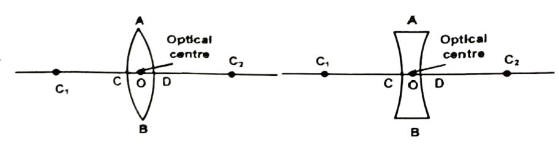
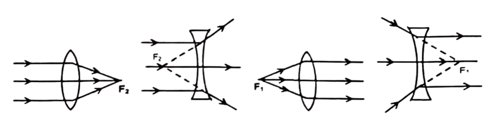
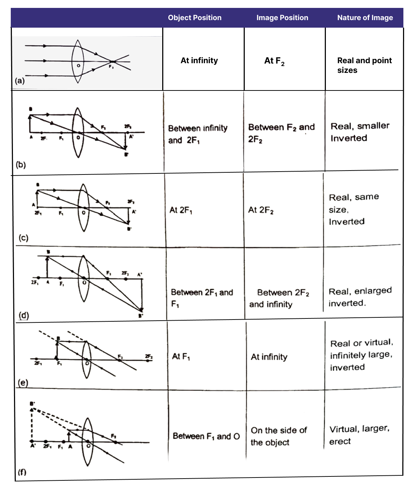
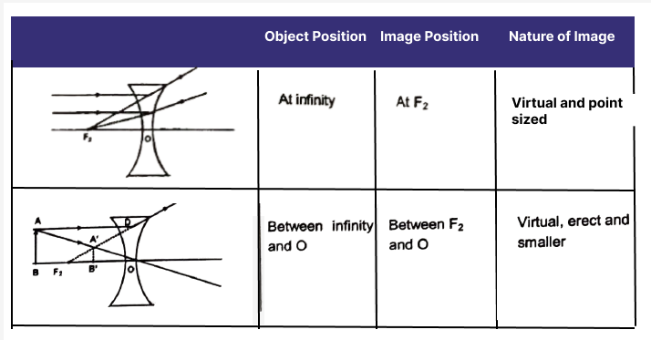
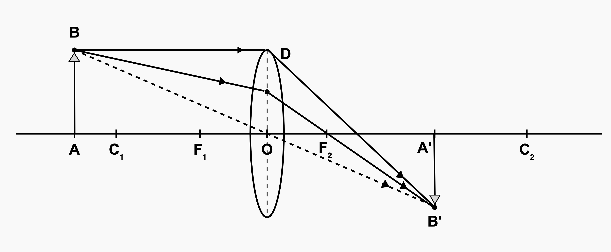

# LENSES
A spherical lens is formed when a transparent material is bounded by two spherical surfaces. While passing through a lens, light is refracted twice - once at each surface. Lens is of two types convex and concave. Convex lens is thicker at the centre while concave is thinner.

The geometrical centre of the lens is called its optical centre. A light ray passing through optical centre goes undeviated. The lens is bounded by two spherical surfaces and therefore, has two centres of curvature $C_1$ and $C_2$. Line joining $C_1$ and $C_2$ is called as principal axis of the lens.

This point is called as second principal focus of lens. If incident rays emerge from a point or appear to coverage at a point and after passing through the lens the refracted rays become parallel to principal axis. Then this point is called as first principal focus. For a thin lens, the distances of $F_1$ and $F_2$ from the optical are the same. This distance is called the focal length of the lens. Convex lens is also called converging lens and concave lens is also called diverging lens. We shall confine our discussion in this chapter to such lenses whose aperture is much less than its radius of curvature. Such lenses are called thin lenses with small apertures.

## Refraction By The Lens
The image formation by lenses can be discussed by tracing the path of any two of the following rays of light from a point on the object as shown in the figure (a) to (f) for convex lens and in figure (a) and (b) for concave. lenses.  
(a). A ray parallel to the principal axis after refraction passes through the second principal focus $F_2$ (in a convex lens) or appears to diverge (in a concave lens) from the first principal focus $F_1$.  
(b) A ray through the optical centre $O$ passes undeviated.  
(c) A ray passing through the first principal focus (in a convex lens) or appearing to meet at it (in a concave lens) becomes parallel to the principal axis after 
  refraction.

### Image Formation by Thin Convex Lens

In different situations figures (a) to (f), illustrate the formation of image $A^{\prime} B^{\prime}$ of an extended object $A B$ by a thin convex lens. The summary of image formation by a convex lens is shown below.

### Image Formation by Thin Concave Lens
In different situations figures (a) - (b), illustrate the formation of image $A^{\prime} B^{\prime}$ of an extended object $A B$ by concave lens. The image formation by a concave lenses are summarised below.

#### Sign Convention of Lenses
- $u, v$ and $f$ are measured from the optical centre.
- The distance, which is measured along incident rays, is taken to be as positive.
- The height of the object is taken to be as positive. The height of image is taken to be as positive if the image and the object are on the same side of the principal axis.
- The focal length of convex lens is taken to be as positive and the focal length of concave lens is taken to be as negative.

### Symbols for Lens 

| Distance | Quantity | Symbol |
| :--- | :--- | :--- |
| From the optical centre to the foot of the perpendicular drawn from the point object to the principal axis. | Object - distance | $u$ |
| From the optical centre to the foot of the perpendicular drawn from the image of a point object to the principal axis. | Image-distance | v |
| From the optical centre to the second principal focus | Focal length | f |
| Height of the object | Object - height | ho |
| Height of the image | Image - height | h. |

## THE LENS FORMULA
Given figure by a convex lens shows the formation of image $A^{\prime} B^{\prime}$, which is real, inverted and diminished in size. Size of the object $A B$ and image $A^{\prime} B^{\prime}$ are $h$ and $h^{\prime}$ respectively. According to new Cartesian Sign convention, we have
Object distance $(O A)=-u$, Image - distance $=\left(O A^{\prime}\right)=+v$, focal length $=O F_2=+f$,

In the given figure
$\triangle A B O$ and $\triangle A^{\prime} B^{\prime} O$ are similar.

$
\therefore \quad \frac{A^{\prime} B^{\prime}}{A B}=\frac{O A^{\prime}}{O A}=\frac{+v}{-u}
$

$\triangle O D F_2$ and $\triangle A^{\prime} B^{\prime} F_2$ are also similar

$
\therefore \quad \frac{A^{\prime} B^{\prime}}{O D}=\frac{F_2 A^{\prime}}{O F_2}
$

As $A B=O D$ then,

$
\Rightarrow \quad \frac{A^{\prime} B^{\prime}}{A B}=\frac{F_2 A^{\prime}}{O F_2}=\frac{O A^{\prime}-O F_2}{C F_2}=\frac{+v-f}{f}
$

From equation (i) and (ii),

$
\frac{+v}{-u}=\frac{+v-f}{f} \Rightarrow v f=-u v+u f
$

Dividing both sides by uvf, we get

$
\frac{1}{v}-\frac{1}{u}=\frac{1}{f}
$

The relation between $\mathbf{u}, \mathbf{v}$ and $\mathbf{f}$ is the required lens formula. This formula is valid in all situations with a spherical lens, including the virtual image formed by a concave lens or a convex lens.

Magnification Produced By a Lens
Magnification by a lens is defined as the ratio of the size of the image to the size of the object.

$
m=\frac{\text { size of image }}{\text { size of object }} \quad \text { or, } \quad m=\frac{+\left(A^{\prime} B^{\prime}\right)}{-(A B)}
$

From the above shown equation and equation (i) used in the derivation of lens formula

$
m=\frac{A^{\prime} B^{\prime}}{A B}=\frac{C A^{\prime}}{C A}=\frac{+v}{-u}
$

Therefore $\mathbf{m}=\frac{\mathbf{v}}{\mathbf{u}}$

## Magnification Produced By a Lens
Magnification by a lens is defined as the ratio of the size of the image to the size of the object.

$
m=\frac{\text { size of image }}{\text { size of object }} \quad \text { or, } \quad m=\frac{+\left(A^{\prime} B^{\prime}\right)}{f(A B)}
$

From the above shown equation and equation (i) used in the derivation of lens formula

$
m=\frac{A^{\prime} B^{\prime}}{A B}=\frac{C A^{\prime}}{C A}=\frac{+v}{-u}
$

Therefore $\mathbf{m}=\frac{\mathbf{v}}{\mathbf{u}}$
Illustration 18:
Find the size, nature and position of image formed when an object of size 2 cm is placed at a distance of 20 cm from a convex lens of focal length 10 cm .

Solution:
(i) Position of image

Object distance $u=-20 \mathrm{~cm}$
And focal length $f=+10 \mathrm{~cm}$
$\frac{1}{v}-\frac{1}{u}=\frac{1}{f} \quad \Rightarrow \quad \frac{1}{v}+\frac{1}{20}=\frac{1}{10}$
So, Image distance $v=20 \mathrm{~cm}$
(ii) Nature of Image: Since the image is formed at the back of the convex lens, it will be real and inverted.
(iii) Size of Image: The magnification produced by a lens is given by $m=v / u$ Image distance $v=+20 \mathrm{~cm}$, object distance $u=-20 \mathrm{~cm} ; m=\frac{-20}{20}=-1$
We know $m=\frac{h_1}{h_0}$.
size of object $h_0=2 \mathrm{~cm}, h_1=$ size of image $h_1=-1 \times 2=-2 \mathrm{~cm}$
Thus, the size of image is 2 cm long. The minus sign here indicates that the image is real and inverted.