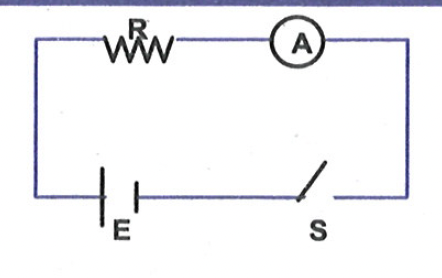
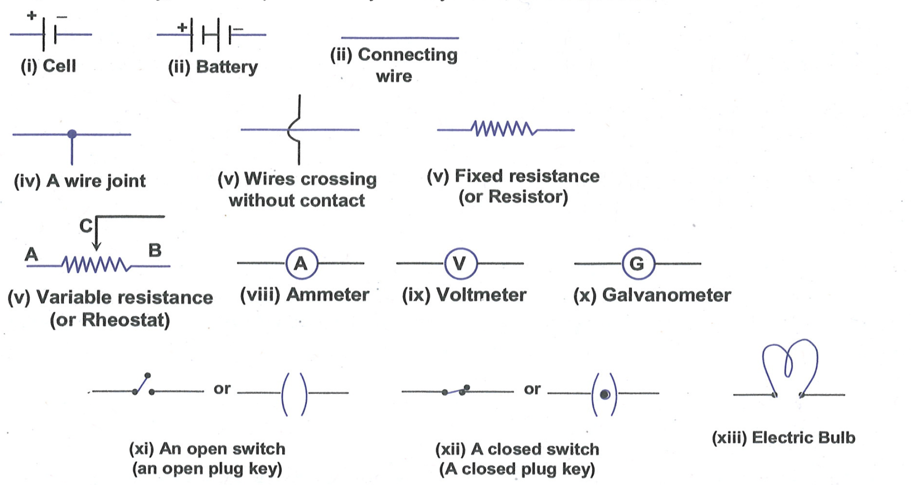
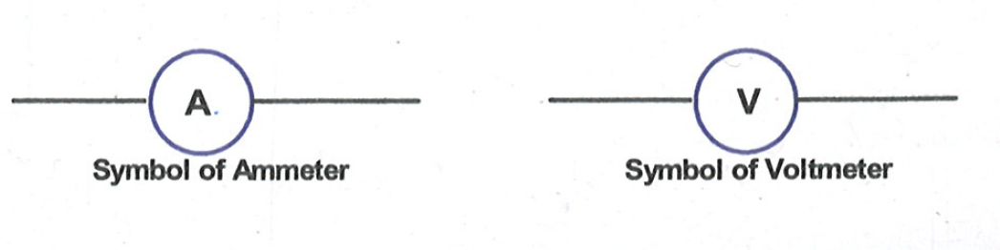
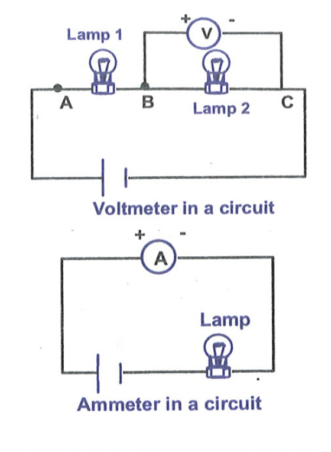
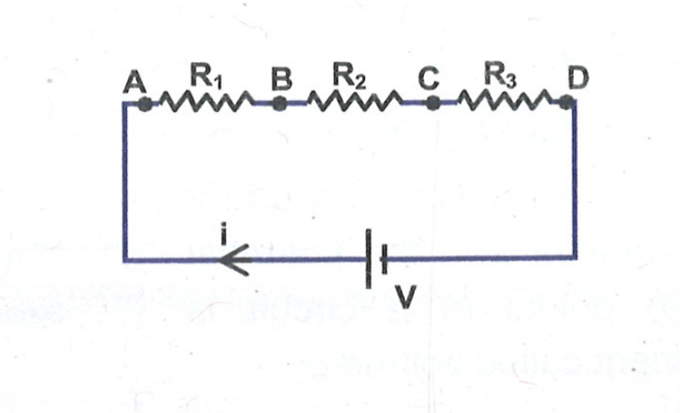
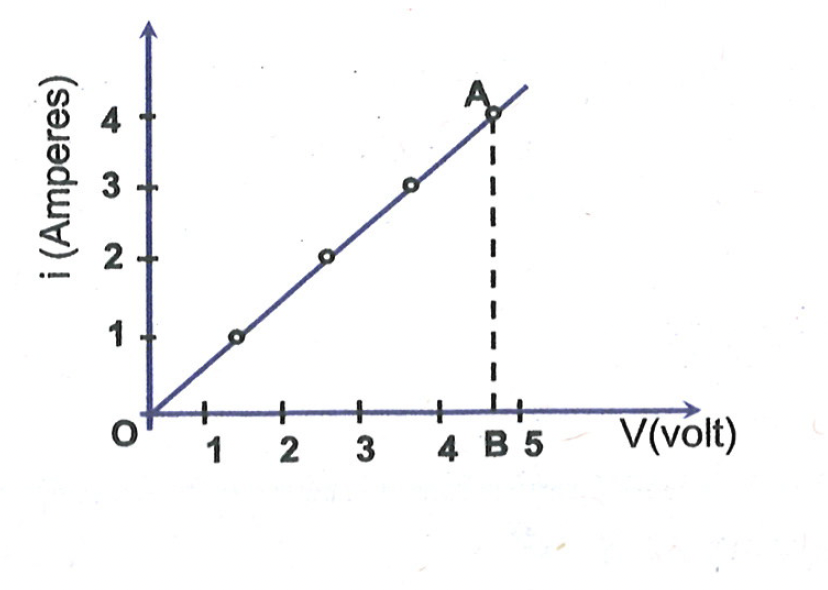

# ELECTRICAL CIRCUIT ELEMENT (Components)

When one or more electric elements such as cells, switches or keys, wires, bulbs etc are connected to form a closed path for electrical charges to flow, we get an electric circuit. A circuit is represented by a circuit diagram. 

The bulb, cell, switch or key, etc are represented by their symbols, as shown below.

## Measuring Instruments in Electricity

 Electric current flowing in a wire is measured by an instrument called ammeter and the potential differences across two points in a circuit is measured by an instrument called voltmeter.

Measuring Instruments in Electricity Electric current flowing in a wire is measured by an instrument called ammeter and the potential differences across two points in a circuit is measured by an instrument called voltmeter.

These measuring instruments have two terminals, one is positive terminal and the other is negative terminal. These terminals are used for connecting wires.

The electric elements are said to be connected in series if the current passing one element also passes through the other elements. If the electric elements are connected in such a way that the potential difference across them is equal then these elements are said to be connected in parallel. An ammeter is always connected in series while a voltmeter is connected in parallel.

## OHM'S LAW
At a constant temperature, the potential difference applied between the ends of a wire is directly proportional to the current passing through it,

$
\begin{aligned}
& \text { i.e. } V \propto i \newline
& \text { or, } V=i R
\end{aligned}
$

The proportionality constant, R , is called as the resistance of the wire. This is called as ohm's law. The unit of resistance is ohm.

$
1 \text { Ohm = } 1 \text { volt } / 1 \text { Ampere. }
$

The resistance of a wire is the property of the wire, which opposes the flow of current. The resistance of a wire of uniform cross section is proportional to its length and inversely proportional to its cross sectional area

$
\text { i.e. } \mathrm{R} \propto \frac{\ell}{\mathrm{~A}} \quad \text { or, } \mathrm{R}=\rho \frac{\ell}{\mathrm{A}}
$

The proportionality constant $\rho$ is called as resistivity of the wire. Resistivity depends only upon material and it does not depend upon shape and size of the wire.

The SI unit of resistivity is $\Omega \mathrm{m}$. The metals and alloys have very low resistivity in the range of $10^{-8} \Omega \mathrm{~m}$ to $10^{-6} \Omega \mathrm{~m}$. They are good conductors of electricity. Insulators like rubber and glass have resistivity of the order of $10^{12}$ to $10^{17} \Omega \mathrm{~m}$. Both the resistance of a wire and resistivity of a material vary with temperature. Resistivity of metals increases with increase in temperature.

Ohm's Law, as discussed above, is true for even a small branch of a circuit. We can illustrate this by the following example.

In the circuit shown we can write,

$
\begin{aligned}
& V_A-V_B=i R_1 \newline
& V_B-V_C=i R_2 \newline
& V_C-V_D=i R_3
\end{aligned}
$

<b>$\sigma$ Illustration 2 :</b>

Calculate the resistance of a copper wire of length 1 m and area of cross-section $2 \mathrm{~mm}^2$. Resistivity of copper is $1.7 \times 10^{-8} \Omega \mathrm{~m}$.

Solution: $\quad \mathrm{R}=\rho \frac{\ell}{\mathrm{A}}=\left(1.7 \times 10^{-8}\right) \times \frac{1}{2 \times\left(10^{-3}\right)^2}=8.5 \times 10^{-3} \Omega$

<b>$\sigma$ Illustration 3 :</b>

In an experiment to verify Ohm's law, the current through a resistor and the potential difference across it are measured. From the values given below, plot a graph of $i$ versus $V$. Show that the data confirms Ohm's law, and find the resistance of the resistor.

| Current (A) | 0.1 | 0.2 | 0.3 | 0.4 |
| :--- | :--- | :--- | :--- | :--- |
| Potential difference (V) | 1.2 | 2.4 | 3.6 | 4.8 |2

Solution: The graph is shown in the figure. Scales are chosen to cover the given maximum values. We see that the graph is a straight line passing through the origin.
Thus $\mathrm{i} \propto \mathrm{V}$, which is Ohm's law. The resistance is

$
\mathrm{R}=\frac{\mathrm{V}}{\mathrm{i}}=\frac{\mathrm{OB}}{\mathrm{AB}}=\frac{4.8 \mathrm{~V}}{0.4 \mathrm{~A}}=12 \Omega
$

<b>$\sigma$ Illustration 4 :</b>

A copper wire of resistance $R_0$ is stretched till its length is increased to $n$ times of its original length. What will be its new resistance?

Solution: Original resistance, $\mathrm{R}_0=\rho \ell_0 / A_0$
New resistance, $R=\rho \ell / A$
As the volume of wire remains constant
So, $\quad \ell_0 A_0=\ell A=\left(n \ell_0\right) A$ or $A=A_0 / n$
Now, $\quad R=\frac{\rho \ell}{A}=\rho \frac{n \ell_0}{A_0 / n}=n^2\left(\frac{\rho \ell}{A}\right)=n^2 R_0$

<b>$\sigma$ Illustration 5 :</b>
A wire of resistance $5 \Omega$ is drawn out so that its length is increased by twice its original length. Calculate its new resistance.

Solution: Here, $\mathrm{R}_1=5 \Omega, \ell_1=\ell$ say,

$
\begin{aligned}
& \mathrm{A}_1=\mathrm{A} \newline
& \mathrm{R}_2=?, \ell_2=2 \ell+\ell=3 \ell, \mathrm{~A}_2=?
\end{aligned}
$

As volume of the wire remains the same, therefore

$
\mathrm{A}_1 \ell_1=\mathrm{A}_2 \ell_2
$

Or, $\quad A_2=\frac{A_1 \ell_1}{\ell_2}=\frac{A \ell}{3 \ell}=\frac{A}{3}$
As specific resistance of the wire remains the same

$
\therefore \quad \mathrm{R}_1=\rho\left(\frac{\ell_1}{\mathrm{~A}_1}\right) \text { and } \mathrm{R}_2=\rho\left(\frac{\ell_2}{\mathrm{~A}_2}\right)
$

Hence, $\frac{R_2}{R_1}=\frac{\ell_2}{A_2} \times \frac{A_1}{\ell_1}$
Or, $\quad \frac{R_2}{5}=\frac{3 \ell}{\mathrm{~A} / 3} \times \frac{\mathrm{A}}{\ell}=9$
Or, $\quad \mathrm{R}_2=5 \times 9=45 \Omega$

<b>$\sigma$ Illustration 6 :</b>

$\overline{\text { A cylindrical copper rod is re-formed to twice its original length with no change in volume. The resistance }}$ between its ends initially was $R$. Find the new resistance.

Solution:

$
\frac{\mathrm{R}^{\prime}}{\mathrm{R}}=\left(\frac{2 \ell}{\ell}\right)^2 \Rightarrow \mathrm{R}^{\prime}=4 \mathrm{R}
$

**Exercise 3:**

(i) On what factors does the resistance of a conductor depend?  
(ii) Let the resistance of an electrical component remains constant while the potential difference across the two ends of the component decreases to half of its former value. What change will occur in the current through it?  

