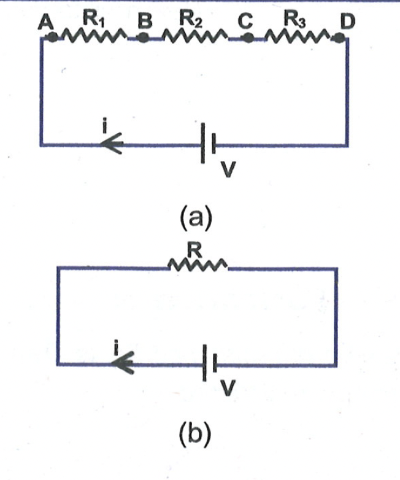
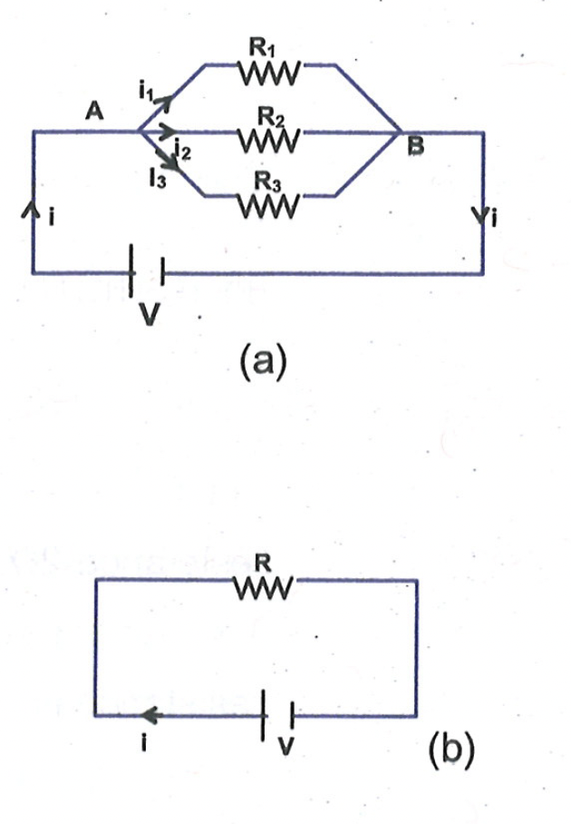
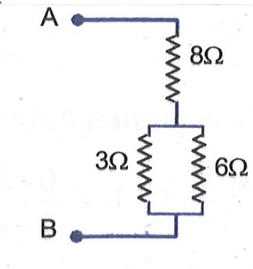

# SERIES AND PARALLEL COMBINATIONS OF RESISTORS

## Series Combination

The combination of resistances where same current (same charge carriers) passes through every resistance is called series combination.
Combination of resistance, which are connected in series, can be replaced by a single resistance $R$, which if connected across the same potential difference draws the same current. Thus, current through each resistance connected in series is equal to the current passing through equivalent resistance $R$.
From first circuit diagram, (a)

$
\begin{aligned}
& V_A-V_B=i R_1 \newline
& V_B-V_C=i R_2
\end{aligned}
$

$
V_C-V_D=i R_3
$

$
V_A-V_D=i\left(R_1+R_2+R_3\right)
$

$\Rightarrow \quad V=i\left(R_1+R_2+R_3\right)$

From second circuit diagram, (b)

$
V=i R
$

Therefore $R=R_1+R_2+R_3$.
$R$ is called as equivalent resistance of series combination of $R_1, R_2$ and $R_3$.

## Parallel Combination

The combination of resistances where different current (different charge carriers) pass through every resistance is called parallel combination. For e.g. in the diagram (a) shown below, $R_1, R_2$ and $R_3$ are connected in parallel.

Combination of resistances, which are connected in parallel, can be replaced by a single resistance $R$. If connected across the same potential difference, the total current flowing into the parallel combination of resistances is equal to current through equivalent resistance R.
From first circuit diagram (a)
(a)

And $\quad i=i_1+i_2+i_3$
On solving these equations, we get,

$
i=\frac{V}{R_1}+\frac{V}{R_2}+\frac{V}{R_3}
$

from second circuit diagram, if R is the equivalent of $R_1, R_2$ and $R_3$ then

$
V=i R
$

Therefore, $\frac{1}{\mathrm{R}}=\frac{1}{\mathrm{R}_1}+\frac{1}{\mathrm{R}_2}+\frac{1}{\mathrm{R}_3}$
Thus, $R$ is called as equivalent resistance of parallel combination of $R_1, R_2$ and $R_3$.

<b>$\sigma$ Illustration 7 :</b>

What is the resistance between $A$ and $B$ in the given network ?  
Solution: For the two resistors in parallel $\frac{1}{R}=\frac{1}{3}+\frac{1}{6}=\frac{2}{6}+\frac{1}{6}=\frac{3}{6}$ or $\mathrm{R}=2 \Omega$.
This is in series with $8 \Omega$, so $\mathrm{R}_{\mathrm{AB}}=2 \Omega+8 \Omega=10 \Omega$

<b>$\sigma$ Illustration 8 :</b>

Three resistance of $12 \Omega, 16 \Omega$ and $20 \Omega$ are connected in parallel. What resistance must be connected in series with this combination to give a total resistance of $25 \Omega$ ?

Solution: The resistance R of the parallel combination is given by

$
\begin{aligned}
& \frac{1}{R}=\frac{1}{R_1}+\frac{1}{R_2}+\frac{1}{R_3}=\frac{1}{12}+\frac{1}{16}+\frac{1}{20} \newline
& =\frac{20}{240}+\frac{15}{240}+\frac{12}{240}=\frac{47}{240}
\end{aligned}
$

or $\quad R=5.11 \Omega$
Then, $R_x+R=25$
or $\quad R_x=25-5.11=19.89 \Omega$