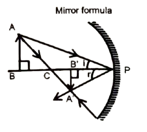
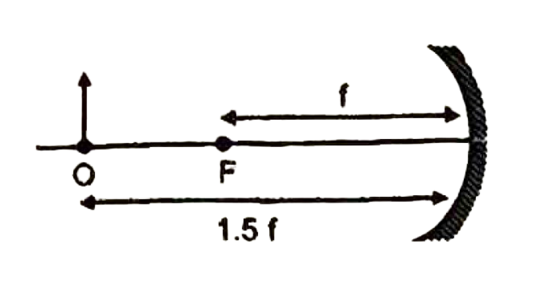

# MIRROR FORMULA 

establish a relation between (a) distance $u$ of object from pole, (b) distance $v$ of image from pole and (c) focal length $f$ of mirror. It is this mathematical relation which is known as the mirror equation or mirror formula.
In the given figure, the object $A B$, is placed on the left in front of the concave mirror, beyond its centre of curvature $C$. $A^{\prime} B^{\prime}$ is the image of $A B$ formed by a spherical mirror as shown in the figure.
Using the new Cartesian sign convention,
Object distance $(P B)=-u$; Image distance $\left(P B^{\prime}\right)=-v$,
Focal length $=P F=-f$, Radius of curvature $=P C=-R$,

$
\begin{aligned}
& \angle \mathrm{i}=\angle \mathrm{r} \quad \text { (law of } 1 \newline
& \angle \mathrm{ABC}=\angle \mathrm{A}^{\prime} \mathrm{B}^{\prime} \mathrm{C}=90^{\circ}
\end{aligned}
$

(law of reflection)
Therefore $\triangle A B P$ and $\triangle A^{\prime} B^{\prime} P$ are similar,

$
\therefore \quad \frac{A^{\prime} B^{\prime}}{A B}=\frac{P B^{\prime}}{P B}=\frac{(-v)}{(-u)}=\frac{v}{u}
$

$\triangle A B C$ and $\triangle A^{\prime} B^{\prime} C$ are also similar

$
\begin{array}{ll}
\therefore & \frac{A^{\prime} B^{\prime}}{A B}=\frac{C B^{\prime}}{C B} \newline
\Rightarrow & \frac{A^{\prime} B^{\prime}}{A B}=\frac{P C-P B^{\prime}}{P B-P C}=\frac{(-R)-(-v)}{(-u)-(-R)}=\frac{-R+v}{-u+R}
\end{array}
$

From equation (i) and (ii),

$
\frac{-R+v}{-u+R}=\frac{v}{u} \Rightarrow u R+v R=2 u v
$

Dividing both sides by $u v R$, we get

$
\frac{1}{v}+\frac{1}{u}=\frac{2}{R}
$

When object $A B$ is at infinite separation, image is formed at focus,

$
\Rightarrow \quad \frac{1}{f}+\frac{1}{\infty}=\frac{2}{R} \Rightarrow f=R / 2
$

From equations (iii) and (iv) we get, $\frac{1}{u}+\frac{1}{v}=\frac{1}{f}$
This formula is valid for all spherical mirrors with small aperture (paraxial rays).
Magnification
Magnification is defined as ratio of height of image to the height of object.

$
m=\frac{\text { height of image }}{\text { height of object }\left(h_1\right)}
$

The magnification $m$ is also related to the object distance $(u)$ and image distance $(v)$. It can be expressed as $m=-\frac{v}{u}$.
A negative sign in the value of the magnification indicates that the image is real. A positive sign in the value of magnification indicates that the image is virtual,

<b>$\sigma$ Illustration 4 :</b>

 At what distance from a convex mirror of focal length $30 \mathrm{~cm}$ should an object be placed, so that its image is formed $20 \mathrm{~cm} $ from the mirror at right side.

**Solution:**
From mirror formula

$
\frac{1}{v}+\frac{1}{u}=\frac{1}{f}
$

Here $u=$ object distance, $v$ (image distance) $=20 \mathrm{~cm}$,
$f$ (focal length of mirror) $=30 \mathrm{~cm}$

$
\begin{aligned}
& \frac{1}{u}+\frac{1}{20}=\frac{1}{30} \newline
& u=-60 \mathrm{~cm}
\end{aligned}
$

Hence object should be placed at a distance of 60 cm in front of mirror.

<b>$\sigma$ Illustration 5 :</b>

An object 3 cm high is placed at a distance of 16 cm from a spherical mirror, which produces a virtual image of 4.5 cm height. Find  
(i) the focal length and nature of the mirror  
(ii) the position of the image  

**Solution:**
Solution:
(i) Calculation of position of image:

The height of image is $4.5 \mathrm{~cm}\left(h_1\right)$ and it is virtual hence magnification will be positive

$
m=\frac{h_1}{h_0}=\frac{4.5}{3}=+1.5
$

Here $h_0=$ object height, Now $m=-v / u$;
$u$ (object distance) $=-16 \mathrm{~cm}$
(Image distance) $v=1.5 \times 16=+24 \mathrm{~cm}$
Thus the position of image is 24 cm at the right side of mirror.
(ii) Calculation of focal length:

Here $v=24 \mathrm{~cm}, u=-16 \mathrm{~cm}$

$
\frac{1}{f}=\frac{1}{v}+\frac{1}{u}
$

Here $f=$ focal length of mirror

$
\begin{aligned}
& \frac{1}{f}=-\frac{1}{16}+\frac{1}{24} \\
& f=-48 \mathrm{~cm}
\end{aligned}
$

Hence focal length of mirror is 48 cm and minus sign shows that it is concave mirror.

<b>$\sigma$ Illustration 6 :</b>

An object of length 2.5 cm is placed at 1.5 f from a concave mirror, where f is the focal length of the mirror. The length of the object is perpendicular to the principal axis. Find the length of the image. Is the image erect or inverted?

**Solution:**

The focal length $F=-f$

$
\text { and } u=-1.5 f
$

We have,

$
\frac{1}{u}+\frac{1}{v}=\frac{1}{F} \text { or } \frac{1}{-1.5 f}+\frac{1}{v}=-\frac{1}{f}
$

$
\frac{1}{v}=\frac{1}{1.5 f}-\frac{1}{f}=-\frac{1}{3 f}
$

$
v=-3 i
$

Now, $m=-v / u=-\frac{3 f}{1.5 f}=-2$
or $\frac{h_2}{h_1}=-2$ or $h_2=-2 h_1=-5 \mathrm{~cm}$
The image is 5 cm long. The minus sign shows that it is inverted.

<b>$\sigma$ Illustration 7 :</b>

An object is placed in front of a concave mirror of radius of curvature 40 cm at a distance of 10 cm . Find the position, nature and magnification of the image.

**Solution:**

$
\text { Here } R=-40 \mathrm{~cm}, u=-10 \mathrm{~cm}
$

Focal length of concave mirror, .

$
f=\frac{R}{2}=\frac{-40}{2}=-20 \mathrm{~cm}
$

Using $\frac{1}{v}=\frac{1}{f}-\frac{1}{u}$

$
=\frac{1}{20}-\frac{1}{(-10)}=-\frac{1}{20}+\frac{1}{10}=\frac{-1+2}{20}=\frac{1}{20}
$

$
\therefore v=+20 \mathrm{~cm}
$

Thus, position of the image is at 20 cm to the right side of the pole of the mirror.
Since $v$ is positive, so virtual image is formed.

$
\begin{aligned}
& m=-\frac{v}{u}=\frac{-20}{(-10)}=2 \\
& \text { Since } m=\frac{1}{0}=2 \\
& \because 1=20
\end{aligned}
$

Therefore, size of image is double than the size of the object, Moreover, image is erect.