# Some Applications of Trigonometry

In this chapter, we will study the sequence (list of numbers) in which succeeding terms are obtained by adding a fixed number to the preceding terms. We will find the formulae to find the value of any term and the sum of terms for this sequence.

Measuring height and distances is an important application of trigonometry. In this chapter, we shall study the use of trigonometry in measuring the height and distances of towers, buildings and other objects. In solving problems of height and distances of different objects, we need to define few terms as discussed below.

---

## Line of Sight

The **line of sight** is the line drawn from the eye of an observer to the point in the object viewed by the observer.

---

## Angle of Elevation

The **angle of elevation** of an object viewed, is the angle formed by the line of sight with the horizontal, when it is above the horizontal level, i.e. the case when we raise our head to look at object.

Let $P$ be the position of the object above the horizontal line $OA$ and $O$ be the eye of the observer. Then, $OP$ is the line of sight and $\angle AOP$ is called angle of elevation, because the observer has to elevate (raise) his/her line of sight from the horizontal $OA$ to see the object $P$.

### Some Important Points
(i) A plane level parallel to Earth's surface is called the horizontal plane level and a line drawn parallel to horizontal plane is called a horizontal line.
(ii) If the observer moves towards the perpendicular line (tower/building), then angle of elevation increases and if the observer moves away from the perpendicular line (tower/building), then angle of elevation decreases.
(iii) If the height of tower is doubled and the distance between the observer and foot of the tower is also doubled, then the angle of elevation remains same.
(iv) If the angle of elevation of Sun, above a tower decreases, then the length of shadow of a tower increases and vice-versa.

---

## Angle of Depression

The **angle of depression** of an object viewed, is the angle formed by the line of sight with the horizontal, when it is below the horizontal level i.e. the case when we lower our head to look at the object.

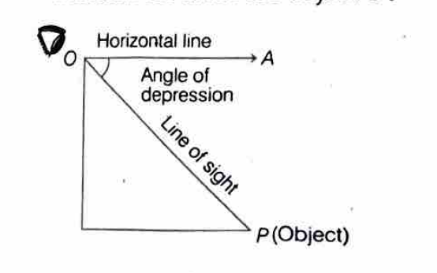

Let $P$ be the position of the object below the horizontal level $OA$ and $O$ be the eye of the observer. Then, $OP$ is the line of sight and $\angle AOP$ is called an angle of depression, because the observer has to depress (lower) his/her line of sight from the horizontal $OA$ to see the object $P$.

### Some Important Points

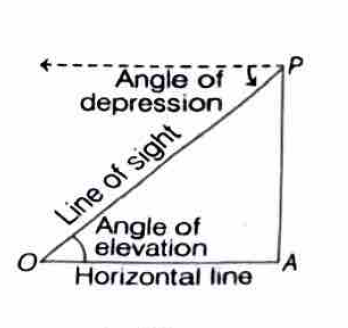

(i) The angle of elevation of a point $P$ as seen from a point $O$ is always equal to the angle of depression of $O$ as seen from $P$.
(ii) The angles of elevation and depression are always acute angles.
(iii) In solving problems, observer is represented by a point and object is represented by a line segment or a point.

---

## Solved Examples

### Example 1
A tower stands vertically on the ground. From a point on the ground which is $15\sqrt{3}$ m away from the foot of the tower, the angle of elevation of the top of the tower is found to be $30°$. Find the height of the tower.

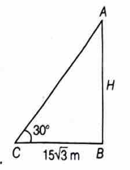

**Solution:**
Let the height of the tower be $H$ m. So, $AB = H$ m
Distance of the point from the foot of the tower $= 15\sqrt{3}$ m
$\Rightarrow CB = 15\sqrt{3}$ m

$\therefore \tan 30° = \frac{AB}{BC}$
$\Rightarrow \frac{1}{\sqrt{3}} = \frac{AB}{15\sqrt{3}}$
$\Rightarrow AB = 15$ m

Hence, the height of the tower is **15 m**.

---

### Example 2
If $300\sqrt{3}$ m high tower makes angle of elevation at a point on ground which is 300 m away from its foot, then find the angle of elevation.

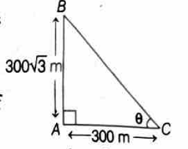

**Solution:**
Let $AB$ be the tower whose height is $300\sqrt{3}$ m, i.e. $AB = 300\sqrt{3}$ m.
Let $C$ be the point at a distance of 300 m from the foot of the tower, i.e. $AC = 300$ m.
Here, the angle of elevation is unknown, so let it be $\theta$.

Since, here base and perpendicular are given.
So, in right angled $\triangle BAC$,
$\tan \theta = \frac{\text{Perpendicular}}{\text{Base}} = \frac{AB}{AC} = \frac{300\sqrt{3}}{300}$
$\Rightarrow \tan \theta = \sqrt{3} = \tan 60°$
$\therefore \theta = 60°$

Hence, the required angle of elevation is **60°**.

---

### Example 3
An electrician has to repair an electric fault on a pole of height 4 m. He needs to reach a point 1 m below the top of the pole to undertake the repair work. What should be the length of the ladder that he should use, when inclined at an angle of $60°$ to the horizontal, which would enable him to reach the required position? [Take $\sqrt{3} = 1.73$]

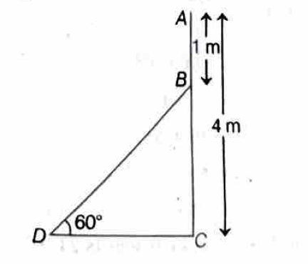

**Solution:**
Let $AC$ be the pole and $BD$ be the ladder.
We have, $AC = 4$ m, $AB = 1$ m and $\angle BDC = 60°$
and $BC = AC - AB = 4 - 1 = 3$ m

In $\triangle BDC$, $\sin 60° = \frac{BC}{BD}$
$\Rightarrow \frac{\sqrt{3}}{2} = \frac{3}{BD}$ $\quad \left[\because \sin 60° = \frac{\sqrt{3}}{2}\right]$
$\Rightarrow BD = \frac{3 \times 2}{\sqrt{3}} = \frac{6}{\sqrt{3}} = 2\sqrt{3}$
$\Rightarrow BD = 2 \times 1.73 = 3.46$ m

Hence, the length of the ladder should be **3.46 m**.

---

### Example 4
A bridge on a river makes an angle of $45°$ with its edge. If the length along the bridge from one edge to the other is 150 m, then find the width of the river.

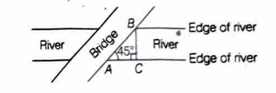

**Solution:**
Let $BC$ be the width of the river and $A$, $B$ be the ends of river such that $AB = 150$ m = Length of the bridge [given] and $\angle BAC = 45°$.

In right angled $\triangle ACB$,
$\sin 45° = \frac{P}{H}$
$\Rightarrow \frac{1}{\sqrt{2}} = \frac{BC}{AB} = \frac{BC}{150}$ $\quad \left[\because \sin 45° = \frac{1}{\sqrt{2}}\right]$
$\therefore BC = \frac{150}{\sqrt{2}} \times \frac{\sqrt{2}}{\sqrt{2}}$ [by rationalising denominator]
$= \frac{150}{2}\sqrt{2} = 75\sqrt{2}$
$= 75 \times 1.414$ $\quad [\because \sqrt{2} = 1.414]$
$= 106.05$ m (approx.)

Hence, the width of the river is **106.05 m**.

---

### Example 5
A straight tree is broken due to thunderstorm. The broken part is bent in such a way that the peak of the tree touches the ground at an angle of $60°$ at a distance of $2\sqrt{3}$ m. Find the height of the tree.

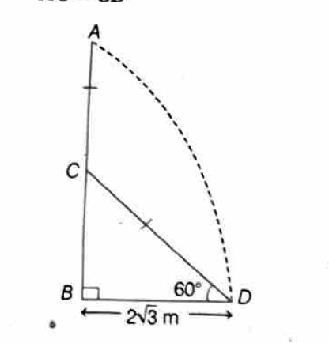

**Solution:**
Let $AB$ be the original height of the tree and it is broken at point $C$.
Let $BD = 2\sqrt{3}$ m and $\angle BDC = 60°$

In $\triangle BCD$,
$\tan 60° = \frac{BC}{BD}$
$\Rightarrow \sqrt{3} = \frac{BC}{2\sqrt{3}}$
$\Rightarrow BC = 6$ m

Also, $\cos 60° = \frac{BD}{CD}$
$\Rightarrow \frac{1}{2} = \frac{2\sqrt{3}}{CD}$
$\Rightarrow CD = 4\sqrt{3}$ m

Since $CD = CA$ (broken part),
Total height of tree $= BC + CA = 6 + 4\sqrt{3} = 6 + 4(1.732) = 6 + 6.928 = 12.928$ m

Hence, the height of the tree is approximately **12.93 m**.

---

### Example 6
From the top of a 7 m high building, the angle of elevation of the top of a cable tower is $60°$ and the angle of depression of its foot is $45°$. Determine the height of the tower.

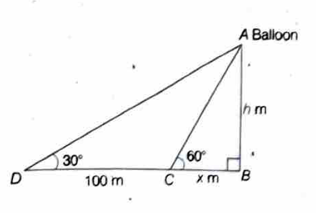

**Solution:**
Let $AB$ be the building of height 7 m and $CD$ be the cable tower.
Let $\angle EAD = 60°$ (angle of elevation of top of tower)
and $\angle EAC = 45°$ (angle of depression of foot of tower)

Since $AE \parallel BC$, $\angle ACB = \angle EAC = 45°$ (alternate angles)

In $\triangle ABC$,
$\tan 45° = \frac{AB}{BC}$
$\Rightarrow 1 = \frac{7}{BC}$
$\Rightarrow BC = 7$ m

Also, $AE = BC = 7$ m and $CE = AB = 7$ m

In $\triangle AED$,
$\tan 60° = \frac{DE}{AE}$
$\Rightarrow \sqrt{3} = \frac{DE}{7}$
$\Rightarrow DE = 7\sqrt{3}$ m

Height of tower $CD = CE + DE = 7 + 7\sqrt{3} = 7(1 + \sqrt{3}) = 7(1 + 1.732) = 7 \times 2.732 = 19.124$ m

Hence, the height of the tower is approximately **19.12 m**.

---

### Example 7
From a point on the ground, the angles of elevation of the bottom and the top of a transmission tower fixed at the top of a 20 m high building are $45°$ and $60°$ respectively. Find the height of the tower. *[CBSE 2020]*

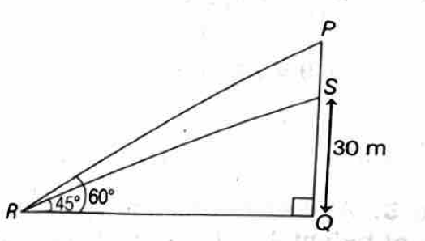

**Solution:**
Let $BC = 20$ m be the height of building and $CD = h$ be the height of transmission tower.
Let $A$ be the point on ground from which angles are observed.
$\angle BAC = 45°$ and $\angle BAD = 60°$

In $\triangle ABC$,
$\tan 45° = \frac{BC}{AB}$
$\Rightarrow 1 = \frac{20}{AB}$
$\Rightarrow AB = 20$ m

In $\triangle ABD$,
$\tan 60° = \frac{BD}{AB} = \frac{BC + CD}{AB}$
$\Rightarrow \sqrt{3} = \frac{20 + h}{20}$
$\Rightarrow 20\sqrt{3} = 20 + h$
$\Rightarrow h = 20\sqrt{3} - 20 = 20(\sqrt{3} - 1) = 20(1.732 - 1) = 20 \times 0.732 = 14.64$ m

Hence, the height of the transmission tower is **14.64 m**.

---

### Example 8
The angle of elevation of the top of a building from the foot of the tower is $30°$ and the angle of elevation of the top of the tower from the foot of the building is $60°$. If the tower is 50 m high, find the height of the building.

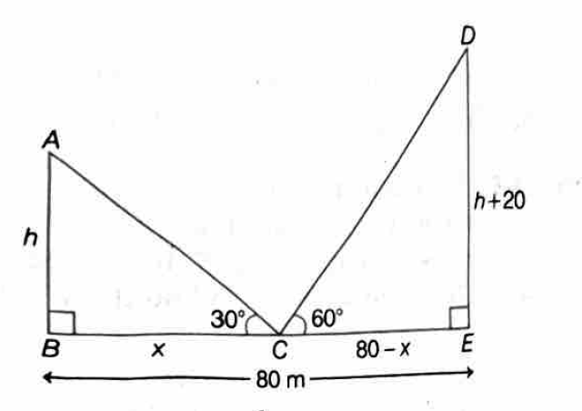

**Solution:**
Let $AB$ be the tower of height 50 m and $CD$ be the building of height $h$ m.
$\angle ADB = 60°$ (angle of elevation of top of tower from foot of building)
$\angle CBD = 30°$ (angle of elevation of top of building from foot of tower)

In $\triangle ABD$,
$\tan 60° = \frac{AB}{BD}$
$\Rightarrow \sqrt{3} = \frac{50}{BD}$
$\Rightarrow BD = \frac{50}{\sqrt{3}} = \frac{50\sqrt{3}}{3}$ m

In $\triangle BCD$,
$\tan 30° = \frac{CD}{BD}$
$\Rightarrow \frac{1}{\sqrt{3}} = \frac{h}{\frac{50\sqrt{3}}{3}}$
$\Rightarrow h = \frac{50\sqrt{3}}{3\sqrt{3}} = \frac{50}{3} = 16.67$ m

Hence, the height of the building is **16.67 m** (or $\frac{50}{3}$ m).

---

### Example 9
Two poles of equal heights are standing opposite each other on either side of the road, which is 80 m wide. From a point between them on the road, the angles of elevation of the top of the poles are $60°$ and $30°$ respectively. Find the height of the poles and the distances of the point from the poles. *[CBSE 2019]*

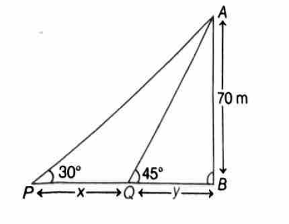

**Solution:**
Let $AB$ and $CD$ be two poles of equal height $h$ m.
Let $P$ be a point on the road $BD$ such that $BP = x$ m.
Then $PD = (80 - x)$ m
$\angle APB = 60°$ and $\angle CPD = 30°$

In $\triangle ABP$,
$\tan 60° = \frac{AB}{BP}$
$\Rightarrow \sqrt{3} = \frac{h}{x}$
$\Rightarrow h = x\sqrt{3}$ ... (i)

In $\triangle CDP$,
$\tan 30° = \frac{CD}{PD}$
$\Rightarrow \frac{1}{\sqrt{3}} = \frac{h}{80 - x}$
$\Rightarrow h = \frac{80 - x}{\sqrt{3}}$ ... (ii)

From (i) and (ii):
$x\sqrt{3} = \frac{80 - x}{\sqrt{3}}$
$\Rightarrow 3x = 80 - x$
$\Rightarrow 4x = 80$
$\Rightarrow x = 20$ m

From (i): $h = 20\sqrt{3} = 20 \times 1.732 = 34.64$ m

$PD = 80 - 20 = 60$ m

Hence, height of poles = **34.64 m**, Distance from first pole = **20 m**, Distance from second pole = **60 m**.

---

### Example 10
As observed from the top of a 75 m high lighthouse from the sea-level, the angles of depression of two ships are $30°$ and $45°$. If one ship is exactly behind the other on the same side of the lighthouse, find the distance between the two ships. *[CBSE 2023]*

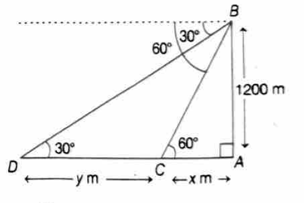

**Solution:**
Let $AB$ be the lighthouse of height 75 m.
Let $C$ and $D$ be the positions of two ships.
$\angle XAC = 30°$ and $\angle XAD = 45°$ (angles of depression)

Since $AX \parallel CD$,
$\angle ACB = 30°$ and $\angle ADB = 45°$ (alternate angles)

In $\triangle ABD$,
$\tan 45° = \frac{AB}{BD}$
$\Rightarrow 1 = \frac{75}{BD}$
$\Rightarrow BD = 75$ m

In $\triangle ABC$,
$\tan 30° = \frac{AB}{BC}$
$\Rightarrow \frac{1}{\sqrt{3}} = \frac{75}{BC}$
$\Rightarrow BC = 75\sqrt{3}$ m

Distance between ships $= CD = BC - BD = 75\sqrt{3} - 75 = 75(\sqrt{3} - 1)$
$= 75(1.732 - 1) = 75 \times 0.732 = 54.9$ m

Hence, the distance between the two ships is approximately **54.9 m**.
