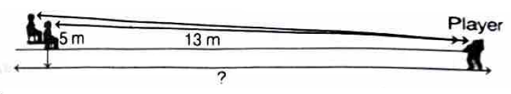

# Review Exercise

## Multiple Choice Questions (MCQs)

**1.** If the height of the tower is equal to the length of its shadow, then the angle of elevation of the Sun is *[CBSE 2023 Basic]* [→ Answer](#a1)
- (a) $30°$
- (b) $45°$
- (c) $60°$
- (d) $90°$

**2.** A pole 6 m high casts a shadow $2\sqrt{3}$ m long on the ground, then the Sun's elevation is [→ Answer](#a2)
- (a) $60°$
- (b) $45°$
- (c) $30°$
- (d) $90°$

**3.** A circus artist is climbing a 30 m long rope, which is tightly stretched and tied from the top of a vertical pole to the ground, then the height of pole, if the angle made by the rope with the ground level is $30°$, is *[Competency Based]* [→ Answer](#a3)
- (a) 5 m
- (b) 10 m
- (c) 15 m
- (d) 20 m

**4.** The length of a string between a kite and a point on the ground is 85 m. If the string makes an angle $\theta$ with level ground such that $\tan \theta = \frac{15}{8}$, then the height of kite is *[Competency Based]* [→ Answer](#a4)
- (a) 75 m
- (b) 78.05 m
- (c) 226 m
- (d) None of these

**5.** The top of two poles of height 20 m and 14 m are connected by a wire. If the wire makes an angle of $30°$ with the horizontal, then the length of the wire is [→ Answer](#a5)
- (a) 12 m
- (b) 10 m
- (c) 8 m
- (d) 6 m

**6.** An observer, 1.5 m tall is 20.5 m away from a tower 22 m high, then the angle of elevation of the top of the tower from the eye of the observer is *[NCERT Exemplar]* [→ Answer](#a6)
- (a) $30°$
- (b) $45°$
- (c) $60°$
- (d) $90°$

**7.** A tree 6 m tall casts a 4 m long shadow. At the same time, a flag pole casts a shadow 50 m long. How long is the flag pole? *[Competency Based]* [→ Answer](#a7)
- (a) 75 m
- (b) 100 m
- (c) 150 m
- (d) 50 m

**8.** A kite is flying at a height of 80 m above the ground. The string attached to the kite is temporarily tied to a point on the ground. The inclination of the string with ground is $60°$, then the length of the string is *[Competency Based]* [→ Answer](#a8)
- (a) 62.37 m
- (b) 92.37 m
- (c) 52.57 m
- (d) 72.57 m

**9.** From a point on the ground which is 30 m away from the foot of a vertical tower, the angle of elevation of the top of the tower is found to be $60°$. The height (in metres) of the tower is *[CBSE 2024 Standard]* [→ Answer](#a9)
- (a) $10\sqrt{3}$
- (b) $30\sqrt{3}$
- (c) 60
- (d) 30

**10.** From the top of a 8 m high building the angle of elevation of the top of a cable tower is $60°$ and the angle of depression of its foot is $45°$, then the height of the tower is [→ Answer](#a10)
- (a) 14.124 m
- (b) 17.124 m
- (c) 21.856 m
- (d) 15.124 m

**11.** Seaweed is found under 80 m deep seafloor. To reach it, a diver makes a $45°$ dive from a boat. What is the distance travelled by the diver to reach the seafloor? *[Competency Based]* [→ Answer](#a11)
- (a) 80 m
- (b) 80.2 m
- (c) $80\sqrt{2}$ m
- (d) $80\sqrt{3}$ m

**12.** A 9 m high street-light pole is broken during a storm. The top end of the pole touches the ground at $30°$. At what height did the pole break? [→ Answer](#a12)
- (a) 3 m
- (b) 3.75 m
- (c) 4.5 m
- (d) 9 m

**13.** Two persons are watching a game in a stadium. The distance between them is 1.5 m as shown in the figure. Based on the above information, what is the distance of the second person from the player? [→ Answer](#a13)

- (a) 10 m
- (b) 12 m
- (c) 13.5 m
- (d) 14.5 m

---

## Assertion-Reason Type Questions

<!-- Assertion-Reason questions will be added here -->

## Case Study Based Questions

**14.** A group of students of Class X visited India Gate on an education trip. The teacher and students had interest in history as well. The teacher narrated that India Gate, official name Delhi Memorial, originally called All India War Memorial, monumental sandstone arch in New Delhi, dedicated to the troops of British India who died in wars fought between 1914 and 1919. The teacher also said that India Gate, which is located at the eastern end of the Rajpath (formerly called the Kingsway), is about 138 ft (42 m) in height. [→ Answer](#a14)

**(i)** What is the angle of elevation if they are standing at a distance of 42 m away from the monument?
- (a) $30°$
- (b) $45°$
- (c) $60°$
- (d) $0°$

**(ii)** They want to see the tower at an angle of $60°$. So, they want to know the distance where they should stand and hence find the distance.
- (a) 24.25 m
- (b) 20.12 m
- (c) 42 m
- (d) 24.64 m

**(iii)** If the altitude of the Sun is at $60°$, then the height of the vertical tower that will cast a shadow of length 20 m is
- (a) $20\sqrt{3}$ m
- (b) $\frac{20}{\sqrt{3}}$ m
- (c) $\frac{15}{\sqrt{3}}$ m
- (d) $15\sqrt{3}$ m

**(iv)** The ratio of the length of a rod and its shadow is $1:1$. The angle of elevation of the Sun is
- (a) $30°$
- (b) $45°$
- (c) $60°$
- (d) $90°$

**(v)** The angle formed by the line of sight with the horizontal when the object viewed is below the horizontal level is
- (a) corresponding angle
- (b) angle of elevation
- (c) angle of depression
- (d) complete angle

---

**15.** Radio towers are used for transmitting a range of communication services including radio and television. The tower will either act as an antenna itself or support one or more antennas on its structure. On a similar concept, a radio station tower was built in two Sections $A$ and $B$. Tower is supported by wires from a point $O$. *[CBSE 2023 Standard]* [→ Answer](#a15)

Distance between the base of the tower and point $O$ is 36 m. From point $O$, the angle of elevation of the top of the Section $B$ is $30°$ and the angle of elevation of the top of Section $A$ is $45°$.

Based on the above information, answer the following questions:

**(i)** Find the length of the wire from the point $O$ to the top of Section $B$.

**(ii)** Find the distance $AB$.

**(iii)** Find the height of the Section $A$ from the base of the tower.

**Or** Find the area of $\triangle OPB$.

---

**16.** One evening, Kaushik was in a park. Children were playing cricket. Birds were singing on a nearby tree of height 80 m. He observed a bird on the tree at an angle of elevation of $45°$. *[CBSE Sample Paper 2023 Standard]* [→ Answer](#a16)

When a sixer was hit, a ball flew through the tree frightening the bird to fly away. In 2 s, he observed the bird flying at the same height at an angle of elevation of $30°$ and the ball flying towards him at the same height at an angle of elevation of $60°$.

Based on the above information, answer the following questions:

**(i)** At what distance from the foot of the tree was he observing the bird sitting on the tree?

**(ii)** How far did the bird fly in the mentioned time?

**Or** After hitting the tree, how far did the ball travel in the sky when Kaushik saw the ball?

**(iii)** What is the speed of the bird in m/min, if it had flown $20(\sqrt{3}+1)$ m?

---

## Very Short Answer Type Questions

<!-- 
Very Short Answer questions typically:
- Require 1-2 step solutions
- Are worth 1-2 marks
- Can be answered in 1-3 lines
-->

---

## Short Answer Type Questions

<!-- 
Short Answer questions typically:
- Require 3-4 step solutions
- Are worth 2-3 marks
- Can be answered in 4-6 lines
-->

---

## Long Answer Type Questions

<!-- 
Long Answer questions typically:
- Require multi-step solutions with diagrams
- Are worth 4-5 marks
- Involve detailed calculations and proofs
-->

---

## Answers

### MCQ Answers

**1.** (b) $45°$ [← Question](#q1)

Let height of tower = $h$, then shadow = $h$
$\tan \theta = \frac{h}{h} = 1 = \tan 45°$
$\therefore \theta = 45°$

**2.** (a) $60°$ [← Question](#q2)

$\tan \theta = \frac{6}{2\sqrt{3}} = \frac{3}{\sqrt{3}} = \sqrt{3} = \tan 60°$
$\therefore \theta = 60°$

**3.** (c) 15 m [← Question](#q3)

$\sin 30° = \frac{h}{30}$
$\frac{1}{2} = \frac{h}{30}$
$h = 15$ m

**4.** (a) 75 m [← Question](#q4)

Given: $\tan \theta = \frac{15}{8}$, so $\sin \theta = \frac{15}{17}$, $\cos \theta = \frac{8}{17}$
Height $= 85 \times \sin \theta = 85 \times \frac{15}{17} = 75$ m

**5.** (a) 12 m [← Question](#q5)

Height difference = $20 - 14 = 6$ m
$\sin 30° = \frac{6}{\text{wire length}}$
$\frac{1}{2} = \frac{6}{\text{wire}}$
Wire length $= 12$ m

**6.** (b) $45°$ [← Question](#q6)

Effective height = $22 - 1.5 = 20.5$ m
$\tan \theta = \frac{20.5}{20.5} = 1 = \tan 45°$
$\therefore \theta = 45°$

**7.** (a) 75 m [← Question](#q7)

$\frac{\text{Tree height}}{\text{Tree shadow}} = \frac{\text{Pole height}}{\text{Pole shadow}}$
$\frac{6}{4} = \frac{h}{50}$
$h = \frac{6 \times 50}{4} = 75$ m

**8.** (b) 92.37 m [← Question](#q8)

$\sin 60° = \frac{80}{\text{string}}$
$\frac{\sqrt{3}}{2} = \frac{80}{\text{string}}$
String $= \frac{160}{\sqrt{3}} = \frac{160\sqrt{3}}{3} \approx 92.37$ m

**9.** (b) $30\sqrt{3}$ [← Question](#q9)

$\tan 60° = \frac{h}{30}$
$\sqrt{3} = \frac{h}{30}$
$h = 30\sqrt{3}$ m

**10.** (c) 21.856 m [← Question](#q10)

From angle of depression $45°$: Distance $= 8$ m
From angle of elevation $60°$: Extra height $= 8\sqrt{3} = 13.856$ m
Total height $= 8 + 13.856 = 21.856$ m

**11.** (c) $80\sqrt{2}$ m [← Question](#q11)

$\sin 45° = \frac{80}{\text{distance}}$
$\frac{1}{\sqrt{2}} = \frac{80}{\text{distance}}$
Distance $= 80\sqrt{2}$ m

**12.** (a) 3 m [← Question](#q12)

Let pole break at height $h$, then fallen part $= 9 - h$
$\sin 30° = \frac{h}{9-h}$
$\frac{1}{2} = \frac{h}{9-h}$
$9 - h = 2h \Rightarrow h = 3$ m

**13.** (c) 13.5 m [← Question](#q13)

(Answer based on figure - need figure to verify calculation)

**14.** [← Question](#q14)

**(i)** (b) $45°$
$\tan \theta = \frac{42}{42} = 1 = \tan 45°$
$\therefore \theta = 45°$

**(ii)** (d) 24.64 m
$\tan 60° = \frac{42}{d}$
$\sqrt{3} = \frac{42}{d}$
$d = \frac{42}{\sqrt{3}} = \frac{42\sqrt{3}}{3} = 14\sqrt{3} \approx 24.25$ m

**(iii)** (a) $20\sqrt{3}$ m
$\tan 60° = \frac{h}{20}$
$\sqrt{3} = \frac{h}{20}$
$h = 20\sqrt{3}$ m

**(iv)** (b) $45°$
Ratio $= 1:1$ means $\tan \theta = 1 = \tan 45°$
$\therefore \theta = 45°$

**(v)** (c) angle of depression

---

**15.** [← Question](#q15)

**(i)** In $\triangle OPB$: $\cos 30° = \frac{36}{\text{wire}}$
$\frac{\sqrt{3}}{2} = \frac{36}{\text{wire}}$
Wire length $= \frac{72}{\sqrt{3}} = 24\sqrt{3}$ m

**(ii)** Height of $B$ from base: $\tan 30° = \frac{PB}{36}$
$PB = \frac{36}{\sqrt{3}} = 12\sqrt{3}$ m

Height of $A$ from base: $\tan 45° = \frac{PA}{36}$
$PA = 36$ m

$AB = PA - PB = 36 - 12\sqrt{3} = 36 - 20.78 = 15.22$ m

**(iii)** Height of Section $A$ from base $= 36$ m

**Or** Area of $\triangle OPB = \frac{1}{2} \times 36 \times 12\sqrt{3} = 216\sqrt{3}$ m²

---

**16.** [← Question](#q16)

**(i)** At what distance from the foot of the tree was he observing the bird?
$\tan 45° = \frac{80}{d}$
$1 = \frac{80}{d}$
$d = 80$ m

**(ii)** How far did the bird fly?
Initial position: 80 m from Kaushik (at tree)
After 2s at $30°$: $\tan 30° = \frac{80}{d_2}$
$d_2 = 80\sqrt{3}$ m
Distance flown by bird $= 80\sqrt{3} - 80 = 80(\sqrt{3} - 1) \approx 58.56$ m

**Or** How far did the ball travel?
Ball position at $60°$: $\tan 60° = \frac{80}{d_3}$
$d_3 = \frac{80}{\sqrt{3}} = \frac{80\sqrt{3}}{3}$ m
Distance traveled by ball from tree $= 80 - \frac{80\sqrt{3}}{3} = 80\left(1 - \frac{\sqrt{3}}{3}\right) \approx 33.87$ m

**(iii)** Speed of bird if it flew $20(\sqrt{3}+1)$ m in 2 s:
Speed $= \frac{20(\sqrt{3}+1)}{2}$ m/s $= 10(\sqrt{3}+1)$ m/s
In m/min: $= 10(\sqrt{3}+1) \times 60 = 600(\sqrt{3}+1) \approx 1639.2$ m/min

### Very Short Answer Type

### Short Answer Type

### Long Answer Type

