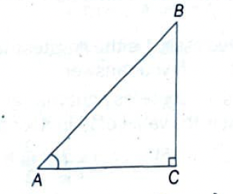
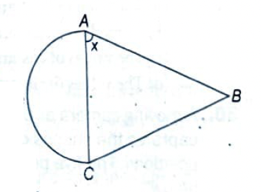
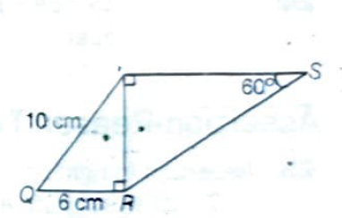
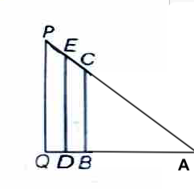
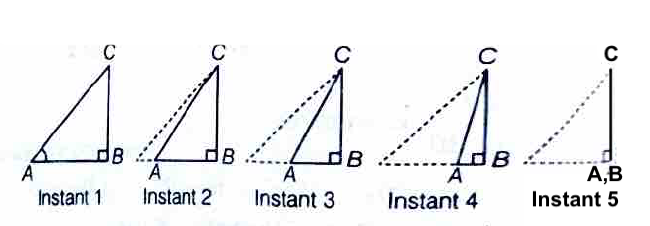

# Review Exercise

## Multiple Choice Questions

**1.** If $\tan \theta = \frac{5}{12}$, then the value of $\frac{\sin \theta + \cos \theta}{\sin \theta - \cos \theta}$ is: *[CBSE 2023 Standard]* [→ Answer](#a1)

- (a) $\frac{-17}{7}$
- (b) $\frac{17}{7}$
- (c) $\frac{17}{13}$
- (d) $\frac{-7}{13}$

**2.** In $\triangle ABC$, $\angle C$ is right angle. If $\tan A = \frac{8}{7}$, then find the value of $\cot B$. *[Competency Based]* [→ Answer](#a2)

- (a) $\frac{7}{8}$
- (b) $\frac{8}{7}$
- (c) $\frac{7}{\sqrt{113}}$
- (d) $\frac{8}{\sqrt{113}}$

**3.** If $\cos \theta = \frac{1}{\sqrt{2}}$, then $\tan \theta$ is equal to: *[CBSE 2024 Basic]* [→ Answer](#a3)

- (a) $\frac{1}{\sqrt{2}}$
- (b) $0$
- (c) $1$
- (d) $\sqrt{2} + 1$

**4.** $\triangle ABC$ is an isosceles triangle, with $AB = BC$. A semi-circle of the area equal to that of the triangle is combined with it. What is the value of $\tan x$? *[Competency Based]* [→ Answer](#a4)

- (a) $1$
- (b) $\frac{1}{4}\pi$
- (c) $\frac{1}{2}\pi$
- (d) $\pi$

**5.** $\frac{2\tan 30°}{1 + \tan^2 30°}$ is equal to: *[CBSE 2023 Standard]* [→ Answer](#a5)

- (a) $\sin 60°$
- (b) $\cos 60°$
- (c) $\tan 60°$
- (d) $\sin 30°$

**6.** If $\sin \theta - \cos \theta = 0$, then the value of $\theta$ is: *[CBSE 2021 Term I Basic]* [→ Answer](#a6)

- (a) $30°$
- (b) $45°$
- (c) $90°$
- (d) $0°$

**7.** If $\theta$ is an acute angle and $\tan \theta + \cot \theta = 2$, then the value of $\sin^3 \theta + \cos^3 \theta$ is: *[CBSE 2021 Term I Standard]* [→ Answer](#a7)

- (a) $1$
- (b) $\frac{1}{2}$
- (c) $\frac{\sqrt{2}}{2}$
- (d) $\sqrt{2}$

**8.** If $\cos \theta = \frac{\sqrt{3}}{2}$ and $\sin \phi = \frac{1}{2}$, then $\tan(\theta + \phi)$ is: *[CBSE 2024 Standard]* [→ Answer](#a8)

- (a) $\sqrt{3}$
- (b) $\frac{1}{\sqrt{3}}$
- (c) $1$
- (d) not defined

**9.** The value of $(\tan^2 45° - \cos^2 60°)$ is: *[CBSE 2022 Basic]* [→ Answer](#a9)

- (a) $\frac{1}{2}$
- (b) $\frac{1}{4}$
- (c) $\frac{3}{2}$
- (d) $\frac{3}{4}$

**10.** If $\cot \theta = \frac{1}{\sqrt{3}}$, the value of $\sec^2 \theta + \csc^2 \theta$ is: *[CBSE 2022 Standard]* [→ Answer](#a10)

- (a) $1$
- (b) $\frac{40}{9}$
- (c) $\frac{38}{9}$
- (d) $5\frac{1}{3}$

**11.** In a right-angled $\triangle PQR$, $\angle Q = 90°$. If $\angle P = 45°$, then value of $\tan P - \cos^2 R$ is: [→ Answer](#a11)

- (a) $0$
- (b) $1$
- (c) $\frac{1}{2}$
- (d) $\frac{3}{2}$

---

### Directions (Q. 12-13)

*In the figure given below, PQRS is a quadrilateral. PR is perpendicular to QR and PS.* *[Competency Based]*

**12.** What is the value of $\tan Q$? [→ Answer](#a12)

- (a) $\frac{3}{5}$
- (b) $\frac{1}{2}$
- (c) $1$
- (d) $\frac{4}{3}$

**13.** What is the length of RS? [→ Answer](#a13)

- (a) $8$ units
- (b) $10$ units
- (c) $8\sqrt{2}$ units
- (d) $\frac{16}{3}\sqrt{3}$ units

---

**14.** $(\cos^4 A - \sin^4 A)$ in simplified form, gives: *[CBSE 2023 Standard]* [→ Answer](#a14)

- (a) $2\sin^2 A - 1$
- (b) $2\sin^2 A + 1$
- (c) $2\cos^2 A + 1$
- (d) $2\cos^2 A - 1$

**15.** If $\theta$ is an acute angle of a right angled triangle, then which of the following equation is NOT true? [→ Answer](#a15)

- (a) $\sin \theta \cot \theta = \cos \theta$
- (b) $\cos \theta \tan \theta = \sin \theta$
- (c) $\csc^2 \theta - \cot^2 \theta = 1$
- (d) $\tan^2 \theta - \sec^2 \theta = 1$

**16.** If $x\sin^3 \theta + y\cos^3 \theta = \sin \theta \cos \theta$ and $x\sin \theta = y\cos \theta$, then $x^2 + y^2$ is equal to: *[CBSE 2023 Standard]* [→ Answer](#a16)

- (a) $0$
- (b) $\frac{1}{2}$
- (c) $1$
- (d) $\frac{3}{2}$

**17.** $1 - \cos^2 A$ is equal to: *[CBSE Sample Paper Basic]* [→ Answer](#a17)

- (a) $\sin^2 A$
- (b) $\tan^2 A$
- (c) $1 - \sin^2 A$
- (d) $\sec^2 A$

**18.** $\frac{\cos^2 \theta}{\sin^2 \theta} - \frac{1}{\sin^2 \theta}$, in simplified form, is: [→ Answer](#a18)

- (a) $\tan^2 \theta$
- (b) $\sec^2 \theta$
- (c) $1$
- (d) $-1$

**19.** If $\sec \theta - \tan \theta = \frac{1}{3}$, then the value of $(\sec \theta + \tan \theta)$ is: *[CBSE 2023 Standard]* [→ Answer](#a19)

- (a) $\frac{4}{3}$
- (b) $\frac{2}{3}$
- (c) $\frac{1}{3}$
- (d) $3$

**20.** $(1 + \tan^2 A)(1 + \sin A)(1 - \sin A)$ is equal to: [→ Answer](#a20)

- (a) $\frac{\cos^2 A}{\sec^2 A}$
- (b) $1$
- (c) $0$
- (d) $2$

**21.** If $\sin \theta = \frac{3}{4}$, then $\frac{(\sec^2 \theta - 1) \cos^2 \theta}{\sin \theta}$ equals: *[CBSE 2023 Basic]* [→ Answer](#a21)

- (a) $\frac{3}{5}$
- (b) $\frac{3}{4}$
- (c) $\frac{4}{3}$
- (d) $\frac{9}{16}$

**22.** If $\sec \theta + \tan \theta = p$, then $\tan \theta$ is: *[CBSE 2021 Term I Standard]* [→ Answer](#a22)

- (a) $\frac{p^2 + 1}{2p}$
- (b) $\frac{p^2 - 1}{2p}$
- (c) $\frac{p^2 - 1}{p^2 + 1}$
- (d) $\frac{p^2 + 1}{p^2 - 1}$

**23.** Given that $\sin \theta = \frac{a}{b}$, find $\cos \theta$: [→ Answer](#a23)

- (a) $\frac{b}{\sqrt{b^2 - a^2}}$
- (b) $\frac{b}{a}$
- (c) $\frac{\sqrt{b^2 - a^2}}{b}$
- (d) $\frac{a}{\sqrt{b^2 - a^2}}$

**24.** If $a \cot \theta + b \csc \theta = p$ and $b \cot \theta + a \csc \theta = q$, then $p^2 - q^2$ is equal to: *[CBSE 2022 Standard]* [→ Answer](#a24)

- (a) $a^2 - b^2$
- (b) $b^2 - a^2$
- (c) $a^2 + b^2$
- (d) $b - a$

---

## Assertion-Reason Type Questions

*Directions: In the following questions, a statement of Assertion (A) is followed by a statement of Reason (R). Choose the correct option.*

- **(a)** Both Assertion and Reason are correct and Reason is the correct explanation of Assertion.
- **(b)** Both Assertion and Reason are correct but Reason is not the correct explanation of Assertion.
- **(c)** Assertion is correct but Reason is incorrect.
- **(d)** Assertion is incorrect but Reason is correct.

**25.** *[CBSE 2023 Standard]* [→ Answer](#a25)

**Assertion:** In right angled triangles $\triangle ABC$ and $\triangle DEF$ ($\angle C = \angle F = 90°$), $\angle B$ and $\angle E$ are acute angles such that $\sin B = \sin E$, then $\angle B = \angle E$.

**Reason:** $\triangle ABC \sim \triangle DEF$.

**26.** [→ Answer](#a26)

**Assertion:** The equation $\sec^2 \theta = \frac{4xy}{(x+y)^2}$ is only possible when $x = y$.

**Reason:** $\sec^2 \theta \geq 1$ and therefore $(x - y)^2 \leq 0$.

**27.** *[CBSE 2023 Basic]* [→ Answer](#a27)

**Assertion:** For $0 < \theta \leq 90°$, $\csc \theta - \cot \theta$ and $\csc \theta + \cot \theta$ are reciprocal of each other.

**Reason:** $\csc^2 \theta - \cot^2 \theta = 1$.

**28.** [→ Answer](#a28)

**Assertion:** $\cos^2 A - \sin^2 A = 1$ is a trigonometric identity.

**Reason:** An equation involving trigonometric ratios of an angle is called trigonometric identity, if it is true for all values of the angles involved.

---

## Case Study Based Questions

**29.** In the given figure, $\triangle ABC$, $\triangle ADE$, and $\triangle AQP$ are three right angled triangles. [→ Answer](#a29)

Based on the above information, answer the following questions:

**(i)** The value of $\sin A$ is the greatest for $\triangle PQA$. Do you agree? Justify your answer.

**(ii)** $\triangle ABC$ is an isosceles right triangle, right-angled at $B$. What is the value of $2 \sin A \times \cos A$?
- (a) $\frac{1}{2}$
- (b) $1$
- (c) $\frac{3}{2}$
- (d) $2$

**(iii)** Which one of the following statements is true about trigonometric ratios in a right triangle?
- (a) The values of $\cot$ and $\tan$ vary from $0$ to $1$.
- (b) The values of $\sin$ and $\cos$ vary from $0$ to $1$.
- (c) The values of $\cos$ and $\sec$ vary from $0$ to $1$.
- (d) The values of $\sin$ and $\csc$ vary from $0$ to $1$.

**30.** A moving camera at the top of a 41 m high building captures the images of a walking man at five different positions. The five positions are shown in the figure below. [→ Answer](#a30)

Based on the above information, answer the following questions:

**(i)** Describe the change in the value of $\sin A$.

**(ii)** Which of the following is not true for position 5?
- (a) $AB = 0$
- (b) $BC = AC$
- (c) $BC = 1$
- (d) $CA = AB$

**(iii)** In the isosceles $\triangle ABC$, $BD$ is the altitude and $\angle ABC = 120°$. What is the value of $\cos C$?

---

## Answers

**1. (a)** Given, $\tan \theta = \frac{5}{12}$ [← Question](#q1)

By Pythagoras theorem: $AC^2 = AB^2 + BC^2 = 5^2 + 12^2 = 169$ → $AC = 13$

So $\sin \theta = \frac{5}{13}$ and $\cos \theta = \frac{12}{13}$

$\frac{\sin \theta + \cos \theta}{\sin \theta - \cos \theta} = \frac{\frac{5}{13} + \frac{12}{13}}{\frac{5}{13} - \frac{12}{13}} = \frac{17}{-7} = \frac{-17}{7}$

**2. (b)** In $\triangle ACB$, $\tan A = \frac{BC}{AC} = \frac{8}{7}$ [← Question](#q2)

Since $\angle C = 90°$, $\cot B = \frac{BC}{AC} = \frac{8}{7}$

**3. (c)** Given, $\cos \theta = \frac{1}{\sqrt{2}} = \cos 45°$ → $\theta = 45°$ [← Question](#q3)

$\tan \theta = \tan 45° = 1$

**4. (c)** In isosceles $\triangle ABC$, let $BP = h$ (perpendicular to AC) [← Question](#q4)

Area of semi-circle = Area of triangle: $\frac{1}{2}\pi r^2 = \frac{1}{2} \cdot 2r \cdot h$ → $h = \frac{\pi r}{2}$

$\tan x = \frac{h}{r} = \frac{\pi r/2}{r} = \frac{\pi}{2}$

**5. (a)** $\tan 30° = \frac{1}{\sqrt{3}}$ [← Question](#q5)

$\frac{2\tan 30°}{1 + \tan^2 30°} = \frac{2 \cdot \frac{1}{\sqrt{3}}}{1 + \frac{1}{3}} = \frac{\frac{2}{\sqrt{3}}}{\frac{4}{3}} = \frac{2}{\sqrt{3}} \times \frac{3}{4} = \frac{\sqrt{3}}{2} = \sin 60°$

**6. (b)** $\sin \theta - \cos \theta = 0$ → $\sin \theta = \cos \theta$ → $\tan \theta = 1$ → $\theta = 45°$ [← Question](#q6)

**7. (c)** If $\tan \theta + \cot \theta = 2$, then $\theta = 45°$ [← Question](#q7)

$\sin^3 45° + \cos^3 45° = \left(\frac{1}{\sqrt{2}}\right)^3 + \left(\frac{1}{\sqrt{2}}\right)^3 = \frac{1}{2\sqrt{2}} + \frac{1}{2\sqrt{2}} = \frac{1}{\sqrt{2}} = \frac{\sqrt{2}}{2}$

**8. (a)** $\cos \theta = \frac{\sqrt{3}}{2} = \cos 30°$ → $\theta = 30°$ [← Question](#q8)

$\sin \phi = \frac{1}{2} = \sin 30°$ → $\phi = 30°$

$\tan(\theta + \phi) = \tan 60° = \sqrt{3}$

**9. (d)** $\tan^2 45° - \cos^2 60° = 1 - \left(\frac{1}{2}\right)^2 = 1 - \frac{1}{4} = \frac{3}{4}$ [← Question](#q9)

**10. (d)** $\cot \theta = \frac{1}{\sqrt{3}} = \cot 60°$ → $\theta = 60°$ [← Question](#q10)

$\sec^2 60° + \csc^2 60° = 4 + \frac{4}{3} = \frac{16}{3} = 5\frac{1}{3}$

**11. (c)** In $\triangle PQR$, $\angle Q = 90°$ and $\angle P = 45°$, so $\angle R = 45°$ [← Question](#q11)

$\tan P - \cos^2 R = \tan 45° - \cos^2 45° = 1 - \left(\frac{1}{\sqrt{2}}\right)^2 = 1 - \frac{1}{2} = \frac{1}{2}$

**12. (d)** From the figure, in $\triangle PQR$, $\tan Q = \frac{PR}{QR} = \frac{4}{3}$ [← Question](#q12)

**13. (d)** Using Pythagoras in $\triangle PRS$, $RS = \frac{16}{3}\sqrt{3}$ units [← Question](#q13)

**14. (d)** $\cos^4 A - \sin^4 A = (\cos^2 A + \sin^2 A)(\cos^2 A - \sin^2 A) = 1 \cdot (\cos^2 A - \sin^2 A)$ [← Question](#q14)

$= \cos^2 A - (1 - \cos^2 A) = 2\cos^2 A - 1$

**15. (d)** Option (d) $\tan^2 \theta - \sec^2 \theta = 1$ is NOT true. [← Question](#q15)

The correct identity is $\sec^2 \theta - \tan^2 \theta = 1$

**16. (c)** From $x\sin \theta = y\cos \theta$, we get $x = y\cot \theta$ [← Question](#q16)

Substituting in the first equation and simplifying: $x^2 + y^2 = 1$

**17. (a)** From the identity $\sin^2 A + \cos^2 A = 1$ [← Question](#q17)

$1 - \cos^2 A = \sin^2 A$

**18. (d)** $\frac{\cos^2 \theta}{\sin^2 \theta} - \frac{1}{\sin^2 \theta} = \frac{\cos^2 \theta - 1}{\sin^2 \theta} = \frac{-\sin^2 \theta}{\sin^2 \theta} = -1$ [← Question](#q18)

**19. (d)** Using identity $\sec^2 \theta - \tan^2 \theta = 1$ [← Question](#q19)

$(\sec \theta - \tan \theta)(\sec \theta + \tan \theta) = 1$

$\frac{1}{3} \times (\sec \theta + \tan \theta) = 1$ → $\sec \theta + \tan \theta = 3$

**20. (b)** $(1 + \tan^2 A)(1 + \sin A)(1 - \sin A) = \sec^2 A \cdot (1 - \sin^2 A) = \sec^2 A \cdot \cos^2 A = 1$ [← Question](#q20)

**21. (b)** $\frac{(\sec^2 \theta - 1) \cos^2 \theta}{\sin \theta} = \frac{\tan^2 \theta \cdot \cos^2 \theta}{\sin \theta} = \frac{\sin^2 \theta}{\sin \theta} = \sin \theta = \frac{3}{4}$ [← Question](#q21)

**22. (b)** Given $\sec \theta + \tan \theta = p$ and using $\sec^2 \theta - \tan^2 \theta = 1$ [← Question](#q22)

$\sec \theta - \tan \theta = \frac{1}{p}$

Adding: $2\sec \theta = p + \frac{1}{p}$. Subtracting: $2\tan \theta = p - \frac{1}{p} = \frac{p^2 - 1}{p}$

$\tan \theta = \frac{p^2 - 1}{2p}$

**23. (c)** Given $\sin \theta = \frac{a}{b}$, using $\sin^2 \theta + \cos^2 \theta = 1$ [← Question](#q23)

$\cos^2 \theta = 1 - \frac{a^2}{b^2} = \frac{b^2 - a^2}{b^2}$ → $\cos \theta = \frac{\sqrt{b^2 - a^2}}{b}$

**24. (b)** $p^2 - q^2 = (a \cot \theta + b \csc \theta)^2 - (b \cot \theta + a \csc \theta)^2$ [← Question](#q24)

$= (a^2 - b^2)\cot^2 \theta + (b^2 - a^2)\csc^2 \theta = (b^2 - a^2)(\csc^2 \theta - \cot^2 \theta) = b^2 - a^2$

**25. (a)** Both Assertion and Reason are correct and Reason is the correct explanation. [← Question](#q25)

If $\sin B = \sin E$ in right triangles, the triangles are similar (AAA), hence $\angle B = \angle E$.

**26. (a)** Both Assertion and Reason are correct and Reason is the correct explanation. [← Question](#q26)

Since $\sec^2 \theta \geq 1$, we need $\frac{4xy}{(x+y)^2} \geq 1$. This implies $(x-y)^2 \leq 0$, which is only true when $x = y$.

**27. (a)** Both Assertion and Reason are correct and Reason is the correct explanation. [← Question](#q27)

$(\csc \theta - \cot \theta)(\csc \theta + \cot \theta) = \csc^2 \theta - \cot^2 \theta = 1$

Hence they are reciprocals of each other.

**28. (d)** Assertion is incorrect but Reason is correct. [← Question](#q28)

The correct identity is $\sin^2 A + \cos^2 A = 1$, not $\cos^2 A - \sin^2 A = 1$.

**29.** [← Question](#q29)

**(i)** Yes. $\sin A = \frac{\text{Perpendicular}}{\text{Hypotenuse}}$. In $\triangle PQA$, the perpendicular $PQ$ is greatest relative to its hypotenuse compared to the other triangles, so $\sin A$ is greatest.

**(ii) (b)** In isosceles right triangle with $\angle A = 45°$:
$2 \sin 45° \times \cos 45° = 2 \times \frac{1}{\sqrt{2}} \times \frac{1}{\sqrt{2}} = 2 \times \frac{1}{2} = 1$

**(iii) (b)** The values of $\sin$ and $\cos$ vary from $0$ to $1$ for acute angles.

**30.** [← Question](#q30)

**(i)** As the man walks from position 1 to position 5, the perpendicular distance $AB$ decreases while the hypotenuse $AC$ decreases. The value of $\sin A = \frac{AB}{AC}$ increases from position 1 to position 5.

**(ii) (c)** At position 5, the man is directly below the camera, so $AB = 0$, $BC = AC = 41$ m. Thus $BC = 1$ is not true.

**(iii)** In isosceles $\triangle ABC$ with $\angle ABC = 120°$, we have $\angle A = \angle C = 30°$. Therefore, $\cos C = \cos 30° = \frac{\sqrt{3}}{2}$.
