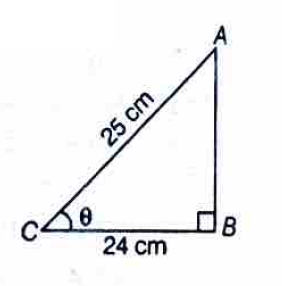

# Review Exercise - Part 2

## Very Short Answer Type Questions

**1.** If $\tan A = \frac{3}{4}$, then find the value of $\frac{1}{\sin A} + \frac{1}{\cos A}$. *[CBSE Sample Paper 2020 Standard]* [→ Answer](#a1)

**2.** If $7 \tan \theta = 4$, then find the value of $\frac{7 \sin \theta - 3 \cos \theta}{7 \sin \theta + 3 \cos \theta}$. [→ Answer](#a2)

**3.** If $\sqrt{3} \tan \theta = 3 \sin \theta$, then find the value of $\sin^2 \theta - \cos^2 \theta$. *[Competency Based]* [→ Answer](#a3)

**4.** Evaluate $\sin^2 60° + 2 \tan 45° - \cos^2 30°$. *[CBSE Sample Paper 2023 Basic]* [→ Answer](#a4)

**5.** Given that $\sin \alpha = \frac{1}{2}$ and $\cos \beta = \frac{1}{2}$, what is the value of $(\alpha + \beta)$? *[NCERT Exemplar]* [→ Answer](#a5)

**6.** Prove that $\sec A(1 - \sin A)(\sec A + \tan A) = 1$. [→ Answer](#a6)

**7.** If $\cos A + \cos^2 A = 1$, find the value of $\sin^2 A + \sin^4 A$. *[NCERT Exemplar]* [→ Answer](#a7)

**8.** If $x = 2 \sin^2 \theta$ and $y = 2 \cos^2 \theta + 1$, then find $x + y$. [→ Answer](#a8)

**9.** If $4x = \csc \theta$ and $\frac{4}{x} = \cot \theta$, find the value of $4\left(x^2 - \frac{1}{x^2}\right)$. *[Competency Based]* [→ Answer](#a9)

---

## Short Answer Type Questions

**10.** If $\tan A = \sqrt{2} - 1$, prove that $\frac{\tan A}{1 + \tan^2 A} = \frac{\sqrt{2}}{4}$. [→ Answer](#a10)

**11.** In right angled $\triangle ACB$, $\angle C = 90°$, $AB = 29$ units and $BC = 21$ units. If $\angle ABC = \theta$, find $\cos^2 \theta - \sin^2 \theta$ and $\sin^2 \theta + \cos^2 \theta$. [→ Answer](#a11)

**12.** With the help of following figure, find the value of: 
[→ Answer](#a12)

- (i) $\sec^2 \theta + \tan^2 \theta$
- (ii) $\csc^2 \theta - \cot^2 \theta$

**13.** If $\cos A = \frac{5}{13}$, then verify that $\frac{\cos A}{1 - \tan A} + \frac{\sin A}{1 - \cot A} = \cos A + \sin A$. *[CBSE 2024 Basic]* [→ Answer](#a13)

---

**22.** Two famous bowlers of Indian Cricket team Navdeep Saini and Jasprit Bumrah throw a ball at an angle of $A$ and $B$ respectively in such a way that $\sin(A-B) = \frac{1}{2}$ and $\cos(A+B) = 0$, $0° < A+B \leq 90°$, $A > B$. *[Competency Based]* [→ Answer](#a22)
- (i) Find the angles of both bowlers at which they throw a ball.
- (ii) Find the values of the following trigonometric ratios: $\tan A$, $\csc(A-B)$, $\sec B$.

**23.** Suppose $\sin \theta_1 + \sin \theta_2 + \sin \theta_3 = 3$, $0° < \theta_1, \theta_2, \theta_3 \leq 90°$. *[Competency Based]* [→ Answer](#a23)
- (i) Find the value of $\cos \theta_1 + \cos \theta_2 + \cos \theta_3$.
- (ii) Calculate the value of $\tan(225° - \theta_1 - \theta_2)$.
- (iii) Evaluate $\sin(120° - \theta_3)$.

**24.** Calculate $A + B$ when $\tan A = \frac{2}{3}$ and $\tan B = \frac{3}{2}$, if it is given that $\tan(A+B) = \frac{\tan A + \tan B}{1 - \tan A \tan B}$, where $A$ and $B$ are acute angles. *[Competency Based]* [→ Answer](#a24)

**25.** If $\csc(A-B) = 2$, $\cot(A+B) = \frac{1}{\sqrt{3}}$, $0° < (A+B) \leq 90°$, $A > B$, then find $A$ and $B$. [→ Answer](#a25)

**26.** If $\tan \theta = \frac{20}{21}$, then prove that $\frac{1 - \sin \theta + \cos \theta}{1 + \sin \theta + \cos \theta} = \frac{3}{7}$. [→ Answer](#a26)

**27.** Prove that $\frac{1}{1 + \sin \theta} + \frac{1}{1 - \sin \theta} = 2\sec^2 \theta$. *[CBSE 2020 Basic]* [→ Answer](#a27)

**28.** Prove that $\frac{1 - \tan^2 \theta}{1 + \tan^2 \theta} = \cos^2 \theta - \sin^2 \theta$. [→ Answer](#a28)

**29.** Prove that $\frac{\sin^4 \theta + \cos^4 \theta}{1 - 2\sin^2 \theta \cos^2 \theta} = 1$. [→ Answer](#a29)

**30.** Simplify $\frac{\sin^3 \theta + \cos^3 \theta}{\sin \theta + \cos \theta} + \sin \theta \cos \theta$. [→ Answer](#a30)

**31.** Prove that $\frac{\cot A - \cos A}{\cot A + \cos A} = \frac{\cos^2 A}{(1 + \sin A)^2}$. *[CBSE 2023 Basic]* [→ Answer](#a31)

**32.** Prove that $\frac{\cot \theta + \csc \theta - 1}{\cot \theta - \csc \theta + 1} = \frac{1 + \cos \theta}{\sin \theta}$. *[CBSE 2020, 2016 Standard]* [→ Answer](#a32)

**33.** If $\sin^6 A + \cos^6 A + 3\sin^2 A \cos^2 A + 4 = k$, then find the value of $k$. [→ Answer](#a33)

**34.** If $\sec \theta = x + \frac{1}{4x}$, then find the value of $\sec \theta + \tan \theta$. [→ Answer](#a34)

**35.** Prove that $\sqrt{\sec^2 \theta + \csc^2 \theta} = \tan \theta + \cot \theta$. *[NCERT Exemplar]* [→ Answer](#a35)

**36.** Eliminate $\theta$ from the following equations: *[NCERT Exemplar]* [→ Answer](#a36)
- (i) $x = a\sec \theta$, $y = b\tan \theta$
- (ii) $x = k + a\cos \theta$, $y = h + b\sin \theta$

**37.** If $m\sin \theta + n\cos \theta = p$ and $m\cos \theta - n\sin \theta = q$, then prove that $m^2 + n^2 = p^2 + q^2$. [→ Answer](#a37)

**38.** Prove that $\frac{\sin \theta}{\cot \theta + \csc \theta} = 2 + \frac{\sin \theta}{\cot \theta - \csc \theta}$. [→ Answer](#a38)

**39.** If $7\sin^2 A + 3\cos^2 A = 4$, prove that $\tan A = \frac{1}{\sqrt{3}}$. [→ Answer](#a39)

**40.** If $\cos \theta + \sin \theta = \sqrt{2}\cos \theta$, prove that $\cos \theta - \sin \theta = \sqrt{2}\sin \theta$. [→ Answer](#a40)

**41.** Ram was trying hard to prove $a\cos \theta - b\sin \theta = \pm\sqrt{a^2 + b^2 - c^2}$, when $a\sin \theta + b\cos \theta = c$. Her classmate Swati gave her a hint of squaring both sides of $a\sin \theta + b\cos \theta = c$ and proceed further. With her hint, Ram was able to solve the problem. Write the solution of the above problem. *[CBSE 2019]* [→ Answer](#a41)

**42.** Prove that $\frac{\sin A - \cos A + 1}{\sin A + \cos A - 1} = \frac{1}{\sec A - \tan A}$. *[Competency Based]* [→ Answer](#a42)

**43.** If $\cos \theta - \sin \theta = x$ and $\sin \theta + \cos \theta = y$, then show that $x^2 + y^2 = 2$. *[CBSE Sample Paper 2020 Basic]* [→ Answer](#a43)

**44.** If $\cot \theta = 3x - \frac{1}{12x}$, show that $\cot \theta + \csc \theta = 6x$ or $-\frac{1}{6x}$. [→ Answer](#a44)

**45.** If $\frac{\cos \alpha}{\cos \beta} = m$ and $\frac{\cos \alpha}{\sin \beta} = n$, show that $(m^2 + n^2)\cos^2 \beta = n^2$. [→ Answer](#a45)

**46.** Prove that $\frac{1}{\sec x - \tan x} - \frac{1}{\cos x} = \frac{1}{\cos x} - \frac{1}{\sec x + \tan x}$. *[Competency Based]* [→ Answer](#a46)

**47.** Prove that $(1 + \tan A \tan B)^2 + (\tan A - \tan B)^2 = \sec^2 A \sec^2 B$. [→ Answer](#a47)

**48.** If $a\cos \theta - b\sin \theta = c$, prove that $a\sin \theta + b\cos \theta = \pm\sqrt{a^2 + b^2 - c^2}$. [→ Answer](#a48)

**49.** If $\sin \theta + 2\cos \theta = 1$, prove that $2\sin \theta - \cos \theta = 2$. *[NCERT Exemplar]* [→ Answer](#a49)

**50.** If $\sin A = \frac{1}{\sqrt{5}}$ and $\sin B = \frac{1}{\sqrt{10}}$, find the values of $\cos A$ and $\cos B$. Hence, using the formula $\cos(A+B) = \cos A \cos B - \sin A \sin B$, show that $A + B = 45°$. *[Competency Based]* [→ Answer](#a50)

**51.** Prove that $\sec^2 A - \frac{\sin^2 A - 2\sin^4 A}{2\cos^4 A - \cos^2 A} = 1$. [→ Answer](#a51)

**52.** If $1 + \sin^2 \theta = 3\sin \theta \cos \theta$, prove that $\tan \theta = 1$ or $\frac{1}{2}$. *[NCERT Exemplar]* [→ Answer](#a52)

## Long Answer Type Questions

## Answers

**1.** Given $\tan A = \frac{3}{4}$, so $\sin A = \frac{3}{5}$ and $\cos A = \frac{4}{5}$ (using Pythagoras) [← Question](#q1)

$\frac{1}{\sin A} + \frac{1}{\cos A} = \frac{5}{3} + \frac{5}{4} = \frac{20 + 15}{12} = \frac{35}{12}$

**2.** Given $7 \tan \theta = 4$ → $\tan \theta = \frac{4}{7}$ [← Question](#q2)

Dividing numerator and denominator by $\cos \theta$:

$\frac{7 \sin \theta - 3 \cos \theta}{7 \sin \theta + 3 \cos \theta} = \frac{7 \tan \theta - 3}{7 \tan \theta + 3} = \frac{4 - 3}{4 + 3} = \frac{1}{7}$

**3.** $\sqrt{3} \tan \theta = 3 \sin \theta$ → $\sqrt{3} \cdot \frac{\sin \theta}{\cos \theta} = 3 \sin \theta$ [← Question](#q3)

$\frac{\sqrt{3}}{\cos \theta} = 3$ → $\cos \theta = \frac{\sqrt{3}}{3} = \frac{1}{\sqrt{3}}$

$\sin^2 \theta = 1 - \cos^2 \theta = 1 - \frac{1}{3} = \frac{2}{3}$

$\sin^2 \theta - \cos^2 \theta = \frac{2}{3} - \frac{1}{3} = \frac{1}{3}$

**4.** $\sin^2 60° + 2 \tan 45° - \cos^2 30°$ [← Question](#q4)

$= \left(\frac{\sqrt{3}}{2}\right)^2 + 2(1) - \left(\frac{\sqrt{3}}{2}\right)^2 = \frac{3}{4} + 2 - \frac{3}{4} = 2$

**5.** $\sin \alpha = \frac{1}{2}$ → $\alpha = 30°$ [← Question](#q5)

$\cos \beta = \frac{1}{2}$ → $\beta = 60°$

$\alpha + \beta = 30° + 60° = 90°$

**6.** LHS $= \sec A(1 - \sin A)(\sec A + \tan A)$ [← Question](#q6)

$= \frac{1}{\cos A}(1 - \sin A)\left(\frac{1}{\cos A} + \frac{\sin A}{\cos A}\right)$

$= \frac{1}{\cos A}(1 - \sin A) \cdot \frac{1 + \sin A}{\cos A}$

$= \frac{(1 - \sin A)(1 + \sin A)}{\cos^2 A} = \frac{1 - \sin^2 A}{\cos^2 A} = \frac{\cos^2 A}{\cos^2 A} = 1$ = RHS

**7.** Given $\cos A + \cos^2 A = 1$ → $\cos A = 1 - \cos^2 A = \sin^2 A$ [← Question](#q7)

$\sin^2 A + \sin^4 A = \sin^2 A(1 + \sin^2 A) = \cos A(1 + \cos A) = \cos A + \cos^2 A = 1$

**8.** $x + y = 2\sin^2 \theta + 2\cos^2 \theta + 1 = 2(\sin^2 \theta + \cos^2 \theta) + 1 = 2(1) + 1 = 3$ [← Question](#q8)

**9.** $4x = \csc \theta$ and $\frac{4}{x} = \cot \theta$ [← Question](#q9)

$4x \cdot \frac{4}{x} = \csc \theta \cdot \cot \theta$ → $16 = \csc \theta \cot \theta$

$(4x)^2 - \left(\frac{4}{x}\right)^2 = \csc^2 \theta - \cot^2 \theta = 1$

$16\left(x^2 - \frac{1}{x^2}\right) = 1$ → $4\left(x^2 - \frac{1}{x^2}\right) = \frac{1}{4}$

**10.** Given $\tan A = \sqrt{2} - 1$ [← Question](#q10)

$\tan^2 A = (\sqrt{2} - 1)^2 = 2 - 2\sqrt{2} + 1 = 3 - 2\sqrt{2}$

$1 + \tan^2 A = 4 - 2\sqrt{2} = 2(2 - \sqrt{2})$

$\frac{\tan A}{1 + \tan^2 A} = \frac{\sqrt{2} - 1}{2(2 - \sqrt{2})} = \frac{\sqrt{2} - 1}{2\sqrt{2}(\sqrt{2} - 1)} = \frac{1}{2\sqrt{2}} = \frac{\sqrt{2}}{4}$ ✓

**11.** In $\triangle ACB$, using Pythagoras: $AC^2 = AB^2 - BC^2 = 841 - 441 = 400$ → $AC = 20$ [← Question](#q11)

$\cos \theta = \frac{BC}{AB} = \frac{21}{29}$, $\sin \theta = \frac{AC}{AB} = \frac{20}{29}$

$\cos^2 \theta - \sin^2 \theta = \frac{441 - 400}{841} = \frac{41}{841}$

$\sin^2 \theta + \cos^2 \theta = 1$

**12.** From figure: $\angle B = 90°$, $AC = 25$ cm, $BC = 24$ cm [← Question](#q12)

Using Pythagoras: $AB = \sqrt{AC^2 - BC^2} = \sqrt{625 - 576} = \sqrt{49} = 7$ cm

For angle $\theta$ at C:
- $\sec \theta = \frac{AC}{BC} = \frac{25}{24}$, $\tan \theta = \frac{AB}{BC} = \frac{7}{24}$
- $\csc \theta = \frac{AC}{AB} = \frac{25}{7}$, $\cot \theta = \frac{BC}{AB} = \frac{24}{7}$

**(i)** $\sec^2 \theta + \tan^2 \theta = \left(\frac{25}{24}\right)^2 + \left(\frac{7}{24}\right)^2 = \frac{625 + 49}{576} = \frac{674}{576} = \frac{337}{288}$

**(ii)** $\csc^2 \theta - \cot^2 \theta = \left(\frac{25}{7}\right)^2 - \left(\frac{24}{7}\right)^2 = \frac{625 - 576}{49} = \frac{49}{49} = 1$

(This confirms the identity $\csc^2 \theta - \cot^2 \theta = 1$)

**13.** Given $\cos A = \frac{5}{13}$, so $\sin A = \frac{12}{13}$ [← Question](#q13)

$\tan A = \frac{12}{5}$, $\cot A = \frac{5}{12}$

LHS $= \frac{\frac{5}{13}}{1 - \frac{12}{5}} + \frac{\frac{12}{13}}{1 - \frac{5}{12}} = \frac{\frac{5}{13}}{\frac{-7}{5}} + \frac{\frac{12}{13}}{\frac{7}{12}}$

$= \frac{-25}{91} + \frac{144}{91} = \frac{119}{91} = \frac{17}{13}$

RHS $= \cos A + \sin A = \frac{5}{13} + \frac{12}{13} = \frac{17}{13}$ ✓

---

### Long Answer Type Solutions

**22.** Given: $\sin(A-B) = \frac{1}{2}$ and $\cos(A+B) = 0$ [← Question](#q22)

$\sin(A-B) = \frac{1}{2} = \sin 30°$ → $A - B = 30°$

$\cos(A+B) = 0 = \cos 90°$ → $A + B = 90°$

Solving: $2A = 120°$ → $A = 60°$, $B = 30°$

**(i)** Navdeep Saini throws at $A = 60°$, Jasprit Bumrah throws at $B = 30°$

**(ii)** $\tan A = \tan 60° = \sqrt{3}$, $\csc(A-B) = \csc 30° = 2$, $\sec B = \sec 30° = \frac{2}{\sqrt{3}}$

**23.** Given: $\sin \theta_1 + \sin \theta_2 + \sin \theta_3 = 3$ [← Question](#q23)

Since max value of $\sin \theta = 1$ for $\theta = 90°$, we need $\sin \theta_1 = \sin \theta_2 = \sin \theta_3 = 1$

So $\theta_1 = \theta_2 = \theta_3 = 90°$

**(i)** $\cos \theta_1 + \cos \theta_2 + \cos \theta_3 = \cos 90° + \cos 90° + \cos 90° = 0 + 0 + 0 = 0$

**(ii)** $\tan(225° - \theta_1 - \theta_2) = \tan(225° - 90° - 90°) = \tan 45° = 1$

**(iii)** $\sin(120° - \theta_3) = \sin(120° - 90°) = \sin 30° = \frac{1}{2}$

**24.** Given: $\tan A = \frac{2}{3}$, $\tan B = \frac{3}{2}$ [← Question](#q24)

$\tan(A+B) = \frac{\tan A + \tan B}{1 - \tan A \tan B} = \frac{\frac{2}{3} + \frac{3}{2}}{1 - \frac{2}{3} \cdot \frac{3}{2}} = \frac{\frac{4+9}{6}}{1 - 1} = \frac{\frac{13}{6}}{0}$ = undefined

Since $\tan(A+B)$ is undefined, $A + B = 90°$

**25.** Given: $\csc(A-B) = 2$, $\cot(A+B) = \frac{1}{\sqrt{3}}$ [← Question](#q25)

$\csc(A-B) = 2 = \csc 30°$ → $A - B = 30°$

$\cot(A+B) = \frac{1}{\sqrt{3}} = \cot 60°$ → $A + B = 60°$

Solving: $2A = 90°$ → $A = 45°$, $B = 15°$

**26.** Given: $\tan \theta = \frac{20}{21}$ [← Question](#q26)

So $\sin \theta = \frac{20}{29}$, $\cos \theta = \frac{21}{29}$ (using Pythagoras: hypotenuse = $\sqrt{400+441} = 29$)

LHS $= \frac{1 - \frac{20}{29} + \frac{21}{29}}{1 + \frac{20}{29} + \frac{21}{29}} = \frac{29 - 20 + 21}{29 + 20 + 21} = \frac{30}{70} = \frac{3}{7}$ = RHS ✓

**27.** LHS $= \frac{1}{1 + \sin \theta} + \frac{1}{1 - \sin \theta}$ [← Question](#q27)

$= \frac{(1 - \sin \theta) + (1 + \sin \theta)}{(1 + \sin \theta)(1 - \sin \theta)} = \frac{2}{1 - \sin^2 \theta} = \frac{2}{\cos^2 \theta} = 2\sec^2 \theta$ = RHS ✓

**28.** LHS $= \frac{1 - \tan^2 \theta}{1 + \tan^2 \theta} = \frac{1 - \frac{\sin^2 \theta}{\cos^2 \theta}}{1 + \frac{\sin^2 \theta}{\cos^2 \theta}}$ [← Question](#q28)

$= \frac{\cos^2 \theta - \sin^2 \theta}{\cos^2 \theta + \sin^2 \theta} = \frac{\cos^2 \theta - \sin^2 \theta}{1} = \cos^2 \theta - \sin^2 \theta$ = RHS ✓

**29.** LHS $= \frac{\sin^4 \theta + \cos^4 \theta}{1 - 2\sin^2 \theta \cos^2 \theta}$ [← Question](#q29)

Numerator: $\sin^4 \theta + \cos^4 \theta = (\sin^2 \theta + \cos^2 \theta)^2 - 2\sin^2 \theta \cos^2 \theta = 1 - 2\sin^2 \theta \cos^2 \theta$

$= \frac{1 - 2\sin^2 \theta \cos^2 \theta}{1 - 2\sin^2 \theta \cos^2 \theta} = 1$ = RHS ✓

**30.** $\frac{\sin^3 \theta + \cos^3 \theta}{\sin \theta + \cos \theta} + \sin \theta \cos \theta$ [← Question](#q30)

Using $a^3 + b^3 = (a+b)(a^2 - ab + b^2)$:

$= \frac{(\sin \theta + \cos \theta)(\sin^2 \theta - \sin \theta \cos \theta + \cos^2 \theta)}{\sin \theta + \cos \theta} + \sin \theta \cos \theta$

$= (1 - \sin \theta \cos \theta) + \sin \theta \cos \theta = 1$

**31.** LHS $= \frac{\cot A - \cos A}{\cot A + \cos A} = \frac{\frac{\cos A}{\sin A} - \cos A}{\frac{\cos A}{\sin A} + \cos A}$ [← Question](#q31)

$= \frac{\cos A(1 - \sin A)}{\cos A(1 + \sin A)} \cdot \frac{\sin A}{\sin A} = \frac{1 - \sin A}{1 + \sin A}$

$= \frac{(1 - \sin A)^2}{(1 + \sin A)(1 - \sin A)} = \frac{(1 - \sin A)^2}{1 - \sin^2 A} = \frac{(1 - \sin A)^2}{\cos^2 A}$

Hmm, let me recalculate. RHS $= \frac{\cos^2 A}{(1 + \sin A)^2}$

Actually: $\frac{1 - \sin A}{1 + \sin A} = \frac{(1 - \sin A)(1 - \sin A)}{(1 + \sin A)(1 - \sin A)} = \frac{(1-\sin A)^2}{\cos^2 A}$

Multiply by $\frac{\cos^2 A}{\cos^2 A}$: This doesn't match directly. Let me try another approach.

LHS $= \frac{\frac{\cos A - \cos A \sin A}{\sin A}}{\frac{\cos A + \cos A \sin A}{\sin A}} = \frac{\cos A(1 - \sin A)}{\cos A(1 + \sin A)} = \frac{1 - \sin A}{1 + \sin A}$

$= \frac{(1 - \sin A)(1 + \sin A)}{(1 + \sin A)^2} = \frac{\cos^2 A}{(1 + \sin A)^2}$ = RHS ✓

**32.** LHS $= \frac{\cot \theta + \csc \theta - 1}{\cot \theta - \csc \theta + 1}$ [← Question](#q32)

$= \frac{\frac{\cos \theta}{\sin \theta} + \frac{1}{\sin \theta} - 1}{\frac{\cos \theta}{\sin \theta} - \frac{1}{\sin \theta} + 1} = \frac{\cos \theta + 1 - \sin \theta}{\cos \theta - 1 + \sin \theta}$

Using $\csc^2 \theta - \cot^2 \theta = 1$ → $(\csc \theta - \cot \theta)(\csc \theta + \cot \theta) = 1$

$= \frac{(\cot \theta + \csc \theta) - 1}{(\cot \theta - \csc \theta) + 1} = \frac{(1 + \cos \theta)/\sin \theta - 1}{(\cos \theta - 1)/\sin \theta + 1}$

$= \frac{1 + \cos \theta - \sin \theta}{\cos \theta - 1 + \sin \theta} \cdot \frac{1}{\sin \theta} \cdot \sin \theta = \frac{1 + \cos \theta}{\sin \theta}$ = RHS ✓

**33.** $\sin^6 A + \cos^6 A + 3\sin^2 A \cos^2 A + 4 = k$ [← Question](#q33)

Using $(a+b)^3 = a^3 + b^3 + 3ab(a+b)$:

$\sin^6 A + \cos^6 A = (\sin^2 A)^3 + (\cos^2 A)^3 = (\sin^2 A + \cos^2 A)^3 - 3\sin^2 A \cos^2 A(\sin^2 A + \cos^2 A)$

$= 1 - 3\sin^2 A \cos^2 A$

So $k = 1 - 3\sin^2 A \cos^2 A + 3\sin^2 A \cos^2 A + 4 = 1 + 4 = 5$

**34.** Given: $\sec \theta = x + \frac{1}{4x}$ [← Question](#q34)

$\sec^2 \theta = \left(x + \frac{1}{4x}\right)^2 = x^2 + \frac{1}{2} + \frac{1}{16x^2}$

$\tan^2 \theta = \sec^2 \theta - 1 = x^2 - \frac{1}{2} + \frac{1}{16x^2} = \left(x - \frac{1}{4x}\right)^2$

$\tan \theta = \pm\left(x - \frac{1}{4x}\right)$

$\sec \theta + \tan \theta = x + \frac{1}{4x} + x - \frac{1}{4x} = 2x$ or $\sec \theta + \tan \theta = x + \frac{1}{4x} - x + \frac{1}{4x} = \frac{1}{2x}$

**35.** LHS $= \sqrt{\sec^2 \theta + \csc^2 \theta}$ [← Question](#q35)

$= \sqrt{\frac{1}{\cos^2 \theta} + \frac{1}{\sin^2 \theta}} = \sqrt{\frac{\sin^2 \theta + \cos^2 \theta}{\sin^2 \theta \cos^2 \theta}} = \frac{1}{\sin \theta \cos \theta}$

RHS $= \tan \theta + \cot \theta = \frac{\sin \theta}{\cos \theta} + \frac{\cos \theta}{\sin \theta} = \frac{\sin^2 \theta + \cos^2 \theta}{\sin \theta \cos \theta} = \frac{1}{\sin \theta \cos \theta}$

LHS = RHS ✓

**36.** [← Question](#q36)

**(i)** $x = a\sec \theta$, $y = b\tan \theta$

$\frac{x}{a} = \sec \theta$, $\frac{y}{b} = \tan \theta$

Using $\sec^2 \theta - \tan^2 \theta = 1$: $\frac{x^2}{a^2} - \frac{y^2}{b^2} = 1$

**(ii)** $x = k + a\cos \theta$, $y = h + b\sin \theta$

$\frac{x-k}{a} = \cos \theta$, $\frac{y-h}{b} = \sin \theta$

Using $\sin^2 \theta + \cos^2 \theta = 1$: $\frac{(x-k)^2}{a^2} + \frac{(y-h)^2}{b^2} = 1$

**37.** Given: $m\sin \theta + n\cos \theta = p$ and $m\cos \theta - n\sin \theta = q$ [← Question](#q37)

Squaring both equations:
- $m^2\sin^2 \theta + n^2\cos^2 \theta + 2mn\sin \theta \cos \theta = p^2$
- $m^2\cos^2 \theta + n^2\sin^2 \theta - 2mn\sin \theta \cos \theta = q^2$

Adding: $m^2(\sin^2 \theta + \cos^2 \theta) + n^2(\cos^2 \theta + \sin^2 \theta) = p^2 + q^2$

$m^2 + n^2 = p^2 + q^2$ ✓

**38.** LHS $= \frac{\sin \theta}{\cot \theta + \csc \theta}$, RHS $= 2 + \frac{\sin \theta}{\cot \theta - \csc \theta}$ [← Question](#q38)

$\frac{\sin \theta}{\cot \theta + \csc \theta} - \frac{\sin \theta}{\cot \theta - \csc \theta} = \sin \theta \cdot \frac{(\cot \theta - \csc \theta) - (\cot \theta + \csc \theta)}{(\cot \theta)^2 - (\csc \theta)^2}$

$= \sin \theta \cdot \frac{-2\csc \theta}{\cot^2 \theta - \csc^2 \theta} = \sin \theta \cdot \frac{-2\csc \theta}{-1} = 2\sin \theta \cdot \csc \theta = 2$

So LHS $= 2 +$ RHS term, hence proved ✓

**39.** Given: $7\sin^2 A + 3\cos^2 A = 4$ [← Question](#q39)

$7\sin^2 A + 3(1 - \sin^2 A) = 4$

$7\sin^2 A + 3 - 3\sin^2 A = 4$

$4\sin^2 A = 1$ → $\sin^2 A = \frac{1}{4}$ → $\sin A = \frac{1}{2}$

$\cos^2 A = 1 - \frac{1}{4} = \frac{3}{4}$ → $\cos A = \frac{\sqrt{3}}{2}$

$\tan A = \frac{\sin A}{\cos A} = \frac{1/2}{\sqrt{3}/2} = \frac{1}{\sqrt{3}}$ ✓

**40.** Given: $\cos \theta + \sin \theta = \sqrt{2}\cos \theta$ [← Question](#q40)

$\sin \theta = \sqrt{2}\cos \theta - \cos \theta = (\sqrt{2} - 1)\cos \theta$

$\tan \theta = \sqrt{2} - 1$

To prove: $\cos \theta - \sin \theta = \sqrt{2}\sin \theta$

$\cos \theta - \sin \theta = \cos \theta - (\sqrt{2} - 1)\cos \theta = (2 - \sqrt{2})\cos \theta$

$\sqrt{2}\sin \theta = \sqrt{2}(\sqrt{2} - 1)\cos \theta = (2 - \sqrt{2})\cos \theta$

LHS = RHS ✓

**41.** Given: $a\sin \theta + b\cos \theta = c$ [← Question](#q41)

Squaring: $a^2\sin^2 \theta + b^2\cos^2 \theta + 2ab\sin \theta \cos \theta = c^2$

$(a\cos \theta - b\sin \theta)^2 = a^2\cos^2 \theta + b^2\sin^2 \theta - 2ab\sin \theta \cos \theta$

Adding both: $a^2(\sin^2 \theta + \cos^2 \theta) + b^2(\cos^2 \theta + \sin^2 \theta) = c^2 + (a\cos \theta - b\sin \theta)^2$

$a^2 + b^2 = c^2 + (a\cos \theta - b\sin \theta)^2$

$(a\cos \theta - b\sin \theta)^2 = a^2 + b^2 - c^2$

$a\cos \theta - b\sin \theta = \pm\sqrt{a^2 + b^2 - c^2}$ ✓

**42.** LHS $= \frac{\sin A - \cos A + 1}{\sin A + \cos A - 1}$ [← Question](#q42)

Divide numerator and denominator by $\cos A$:

$= \frac{\tan A - 1 + \sec A}{\tan A + 1 - \sec A}$

Multiply by $\frac{\sec A + \tan A}{\sec A + \tan A}$:

Using $\sec^2 A - \tan^2 A = 1$:

$= \frac{(\sec A + \tan A - 1)(\sec A + \tan A)}{(\tan A - \sec A + 1)(\sec A + \tan A)}$

$= \frac{\sec A + \tan A - 1}{1 - (\sec^2 A - \tan^2 A) + \tan A - \sec A + 1} = \frac{1}{\sec A - \tan A}$ = RHS ✓

**43.** Given: $x = \cos \theta - \sin \theta$, $y = \sin \theta + \cos \theta$ [← Question](#q43)

$x^2 = \cos^2 \theta + \sin^2 \theta - 2\sin \theta \cos \theta = 1 - 2\sin \theta \cos \theta$

$y^2 = \sin^2 \theta + \cos^2 \theta + 2\sin \theta \cos \theta = 1 + 2\sin \theta \cos \theta$

$x^2 + y^2 = 1 - 2\sin \theta \cos \theta + 1 + 2\sin \theta \cos \theta = 2$ ✓

**44.** Given: $\cot \theta = 3x - \frac{1}{12x}$ [← Question](#q44)

$\csc^2 \theta = 1 + \cot^2 \theta = 1 + \left(3x - \frac{1}{12x}\right)^2 = 1 + 9x^2 - \frac{1}{2} + \frac{1}{144x^2}$

$= \frac{1}{2} + 9x^2 + \frac{1}{144x^2} = \left(3x + \frac{1}{12x}\right)^2$

$\csc \theta = \pm\left(3x + \frac{1}{12x}\right)$

$\cot \theta + \csc \theta = 3x - \frac{1}{12x} + 3x + \frac{1}{12x} = 6x$ or $= 3x - \frac{1}{12x} - 3x - \frac{1}{12x} = -\frac{1}{6x}$ ✓

**45.** Given: $\frac{\cos \alpha}{\cos \beta} = m$, $\frac{\cos \alpha}{\sin \beta} = n$ [← Question](#q45)

$m^2 = \frac{\cos^2 \alpha}{\cos^2 \beta}$, $n^2 = \frac{\cos^2 \alpha}{\sin^2 \beta}$

$m^2 + n^2 = \cos^2 \alpha \left(\frac{1}{\cos^2 \beta} + \frac{1}{\sin^2 \beta}\right) = \cos^2 \alpha \cdot \frac{\sin^2 \beta + \cos^2 \beta}{\sin^2 \beta \cos^2 \beta} = \frac{\cos^2 \alpha}{\sin^2 \beta \cos^2 \beta}$

$(m^2 + n^2)\cos^2 \beta = \frac{\cos^2 \alpha}{\sin^2 \beta} = n^2$ ✓

**46.** LHS $= \frac{1}{\sec x - \tan x} - \frac{1}{\cos x}$ [← Question](#q46)

$= \frac{\sec x + \tan x}{(\sec x - \tan x)(\sec x + \tan x)} - \sec x = \sec x + \tan x - \sec x = \tan x$

RHS $= \frac{1}{\cos x} - \frac{1}{\sec x + \tan x} = \sec x - \frac{\sec x - \tan x}{(\sec x + \tan x)(\sec x - \tan x)}$

$= \sec x - (\sec x - \tan x) = \tan x$

LHS = RHS ✓

**47.** LHS $= (1 + \tan A \tan B)^2 + (\tan A - \tan B)^2$ [← Question](#q47)

$= 1 + 2\tan A \tan B + \tan^2 A \tan^2 B + \tan^2 A - 2\tan A \tan B + \tan^2 B$

$= 1 + \tan^2 A \tan^2 B + \tan^2 A + \tan^2 B$

$= (1 + \tan^2 A)(1 + \tan^2 B) = \sec^2 A \sec^2 B$ = RHS ✓

**48.** Same as Q41. Given: $a\cos \theta - b\sin \theta = c$ [← Question](#q48)

Squaring and using similar method as Q41:

$a\sin \theta + b\cos \theta = \pm\sqrt{a^2 + b^2 - c^2}$ ✓

**49.** Given: $\sin \theta + 2\cos \theta = 1$ [← Question](#q49)

Squaring: $\sin^2 \theta + 4\cos^2 \theta + 4\sin \theta \cos \theta = 1$

$(2\sin \theta - \cos \theta)^2 = 4\sin^2 \theta + \cos^2 \theta - 4\sin \theta \cos \theta$

Adding: $5(\sin^2 \theta + \cos^2 \theta) = 1 + (2\sin \theta - \cos \theta)^2$

$5 = 1 + (2\sin \theta - \cos \theta)^2$

$(2\sin \theta - \cos \theta)^2 = 4$

$2\sin \theta - \cos \theta = \pm 2$

Since $\sin \theta + 2\cos \theta = 1$, checking: $2\sin \theta - \cos \theta = 2$ ✓

**50.** Given: $\sin A = \frac{1}{\sqrt{5}}$, $\sin B = \frac{1}{\sqrt{10}}$ [← Question](#q50)

$\cos A = \sqrt{1 - \frac{1}{5}} = \frac{2}{\sqrt{5}}$

$\cos B = \sqrt{1 - \frac{1}{10}} = \frac{3}{\sqrt{10}}$

$\cos(A+B) = \cos A \cos B - \sin A \sin B$

$= \frac{2}{\sqrt{5}} \cdot \frac{3}{\sqrt{10}} - \frac{1}{\sqrt{5}} \cdot \frac{1}{\sqrt{10}} = \frac{6}{\sqrt{50}} - \frac{1}{\sqrt{50}} = \frac{5}{\sqrt{50}} = \frac{5}{5\sqrt{2}} = \frac{1}{\sqrt{2}}$

$\cos(A+B) = \frac{1}{\sqrt{2}} = \cos 45°$ → $A + B = 45°$ ✓

**51.** LHS $= \sec^2 A - \frac{\sin^2 A - 2\sin^4 A}{2\cos^4 A - \cos^2 A}$ [← Question](#q51)

$= \sec^2 A - \frac{\sin^2 A(1 - 2\sin^2 A)}{\cos^2 A(2\cos^2 A - 1)}$

Using $\cos 2A = 1 - 2\sin^2 A = 2\cos^2 A - 1$:

$= \sec^2 A - \frac{\sin^2 A \cdot \cos 2A}{\cos^2 A \cdot \cos 2A} = \sec^2 A - \tan^2 A = 1$ = RHS ✓

**52.** Given: $1 + \sin^2 \theta = 3\sin \theta \cos \theta$ [← Question](#q52)

Dividing by $\cos^2 \theta$: $\sec^2 \theta + \tan^2 \theta = 3\tan \theta$

$(1 + \tan^2 \theta) + \tan^2 \theta = 3\tan \theta$

$2\tan^2 \theta - 3\tan \theta + 1 = 0$

$(2\tan \theta - 1)(\tan \theta - 1) = 0$

$\tan \theta = \frac{1}{2}$ or $\tan \theta = 1$ ✓
