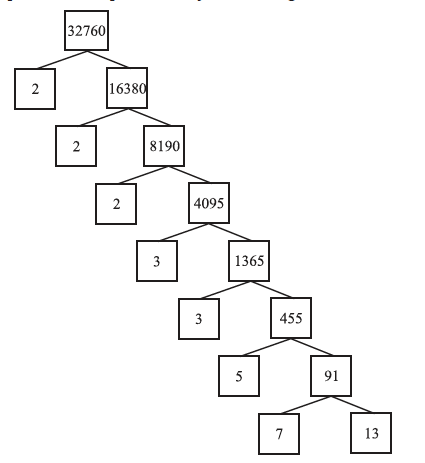
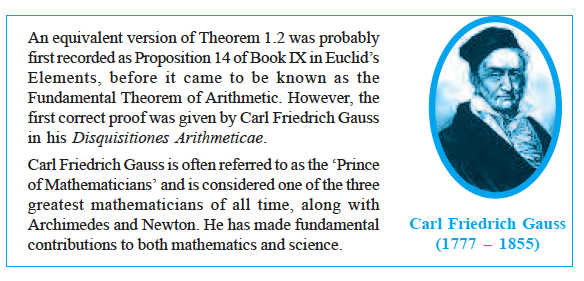

# 1.2 The Fundamental Theorem of Arithmetic

In your earlier classes, you have seen that any natural number can be written as a
product of its prime factors. For instance, $2 = 2$, $4 = 2 \times 2$, $253 = 11 \times 23$, and so on.

Now, let us try and look at natural numbers from the other direction. That is, can any
natural number be obtained by multiplying prime numbers? Let us see.

Take any collection of prime numbers, say $2, 3, 7, 11$ and $23$. If we multiply
some or all of these numbers, allowing them to repeat as many times as we wish,
we can produce a large collection of positive integers (in fact, infinitely many).
Let us list a few:

- $7 \times 11 \times 23 = 1771$
- $3 \times 7 \times 11 \times 23 = 5313$
- $2 \times 3 \times 7 \times 11 \times 23 = 10626$
- $23 \times 3 \times 7^3 = 8232$
- $2^2 \times 3 \times 7 \times 11 \times 23 = 21252$

Before we answer this, let us factorise positive integers (i.e. do the opposite of what we
have done so far). We are going to use the factor tree.

Let us take some large number, say 32760, and factorise it as shown in the PDF.

So we have factorised 32760 as $2 \times 2 \times 2 \times 3 \times 3 \times 5 \times 7 \times 13$ as a product of
primes, i.e. $32760 = 2^3 \times 3^2 \times 5 \times 7 \times 13$ as a product of powers of primes.

This leads us to a conjecture that every composite number can be written as the product
of powers of primes. In fact, this statement is true, and is called the Fundamental
Theorem of Arithmetic because of its basic crucial importance to the study of integers.

### Theorem 1.1 (Fundamental Theorem of Arithmetic)

Every composite number can be expressed (factorised) as a product of primes, and this
factorisation is unique, apart from the order in which the prime factors occur.

The Fundamental Theorem of Arithmetic says more: given any composite number, there
is one and only one way to write it as a product of primes, as long as we are not
particular about the order in which the primes occur.

In general, given a composite number $x$, we factorise it as $x = p_1 p_2 \dots p_n$, where
$p_1, p_2, \dots, p_n$ are primes written in ascending order. If we combine the same
primes, we will get powers of primes. For example:

$32760 = 2 \times 2 \times 2 \times 3 \times 3 \times 5 \times 7 \times 13 = 2^3 \times 3^2 \times 5 \times 7 \times 13$

### Example 1

**Solution:** If the number $4^n$, for any $n$, were to end with the digit zero, then it would be
divisible by 5. That is, the prime factorisation of $4^n$ would contain the prime 5. This is
not possible because $4^n = (2)^{2n}$; so the only prime in the factorisation of $4^n$ is 2.

### Example 2

Find the LCM and HCF of 6 and 20 by the prime factorisation method.

**Solution:** $6 = 2 \times 3$ and $20 = 2^2 \times 5$.

$\mathrm{HCF}(6, 20) = 2$ and $\mathrm{LCM}(6, 20) = 2^2 \times 3 \times 5 = 60$.

Note that:

- HCF is the product of the smallest powers of each common prime factor.
- LCM is the product of the greatest powers of each prime factor involved.

From the example above, you might have noticed that:

\[
\mathrm{HCF}(a,b) \times \mathrm{LCM}(a,b) = a \times b
\]

for any two positive integers $a$ and $b$.

### Example 3

Find the HCF of 96 and 404 by the prime factorisation method. Hence, find their LCM.

**Solution:** $96 = 2^5 \times 3$, $404 = 2^2 \times 101$.

So $\mathrm{HCF}(96, 404) = 2^2 = 4$.

Then:

\[
\mathrm{LCM}(96,404) = \\frac{96 \\times 404}{\\mathrm{HCF}(96,404)} = 9696
\]

### Example 4

Find the HCF and LCM of 6, 72 and 120, using the prime factorisation method.

**Solution:** $6 = 2 \times 3$, $72 = 2^3 \times 3^2$, $120 = 2^3 \times 3 \times 5$.

$\mathrm{HCF}(6, 72, 120) = 2^1 \times 3^1 = 6$

$\mathrm{LCM}(6, 72, 120) = 2^3 \times 3^2 \times 5^1 = 360$

**Remark:** $6 \times 72 \times 120 \ne \mathrm{HCF}(6,72,120) \times \mathrm{LCM}(6,72,120)$.

## Source
- [NCERT PDF (Real Numbers)](../content/jemh101-real-numbers.pdf)

