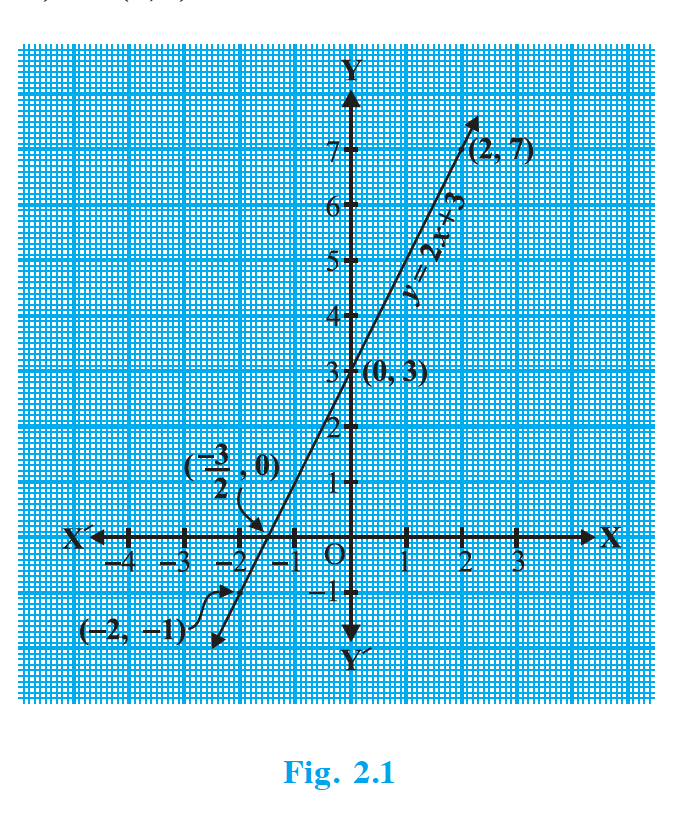
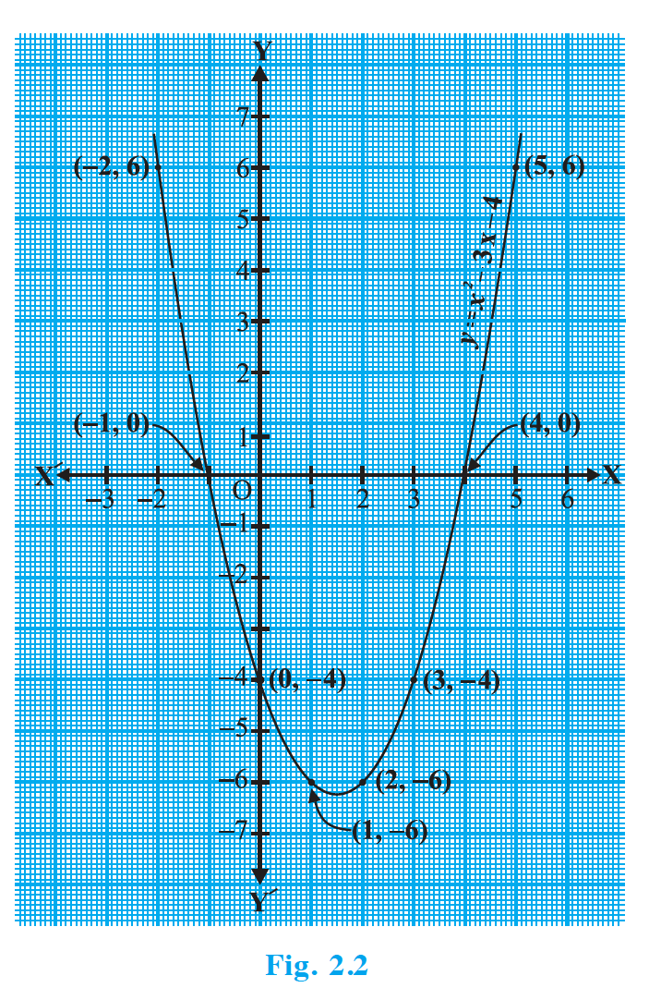
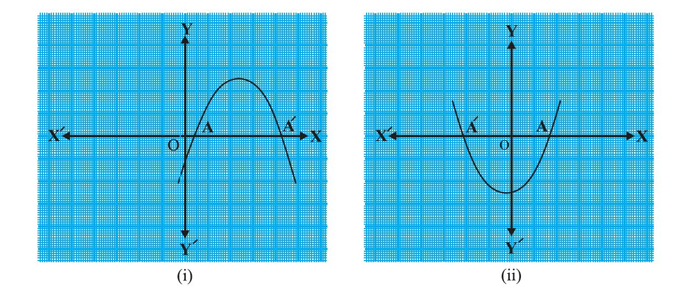
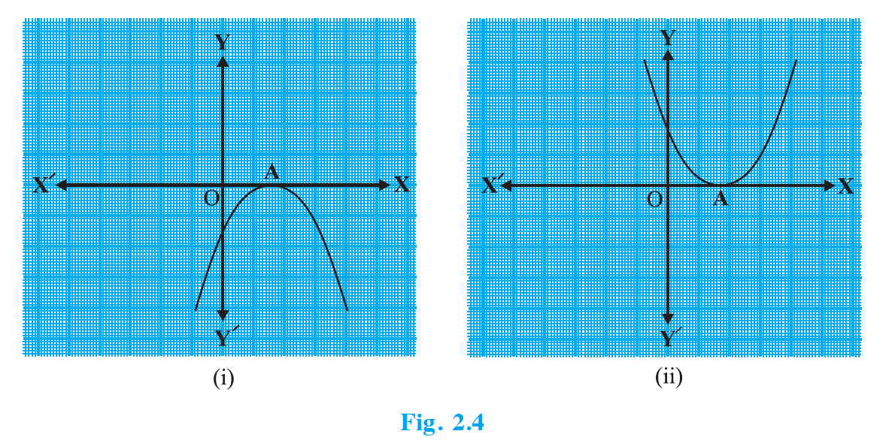
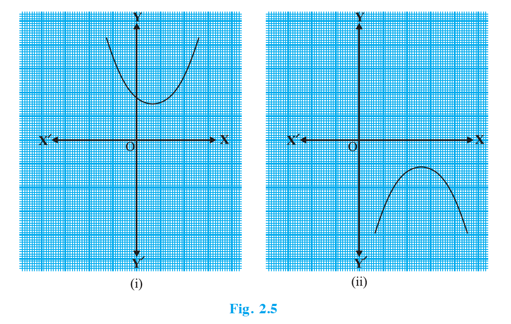
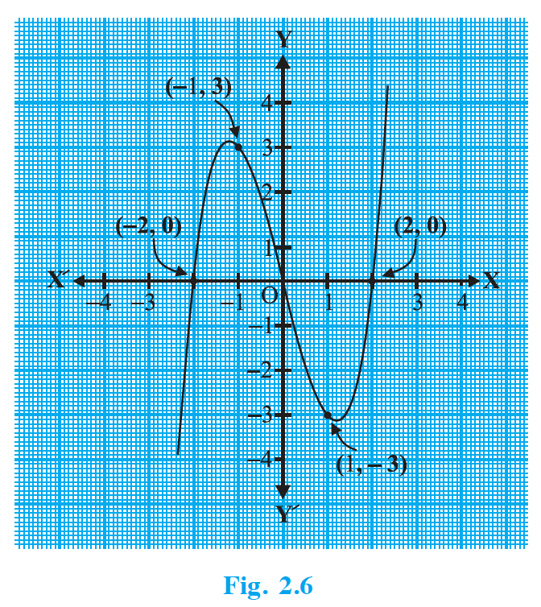
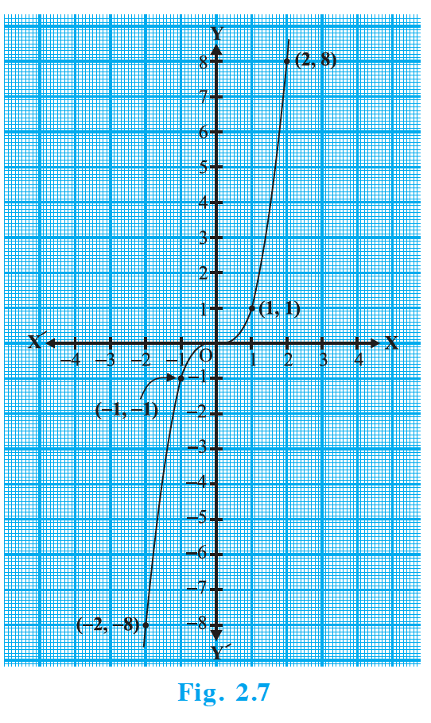
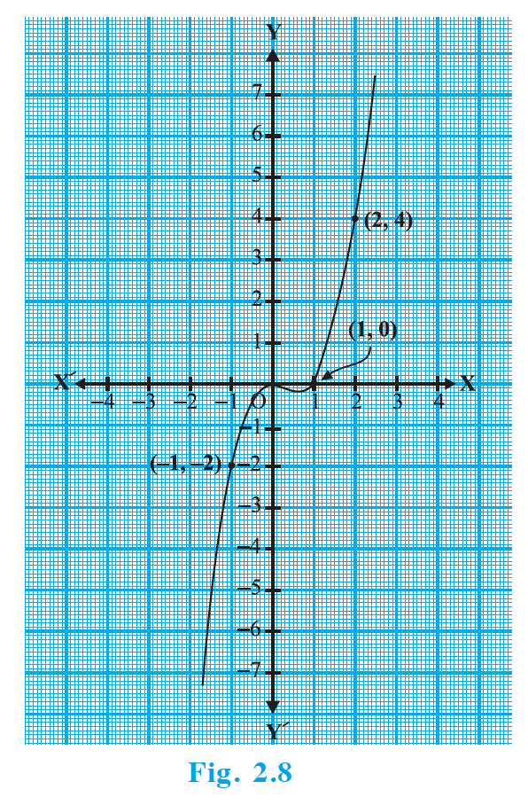
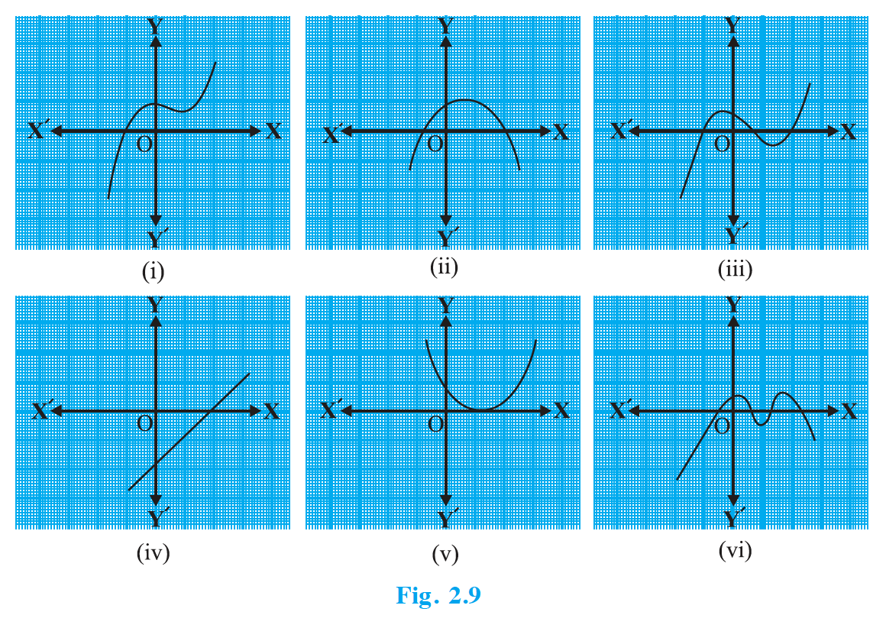

## 2.2 Geometrical Meaning of the Zeroes of a Polynomial

You know that a real number $k$ is a zero of the polynomial $p(x)$ if $p(k)=0$. But why are the zeroes of a polynomial so important? To answer this, first we will see the geometrical representations of linear and quadratic polynomials and the geometrical meaning of their zeroes.

Consider first a linear polynomial $ax+b$, $a\ne 0$. You have studied in Class IX that the graph of $y=ax+b$ is a straight line. For example, the graph of $y=2x+3$ is a straight line passing through the points $(-2,-1)$ and $(2,7)$.

{: width="50%" }

From Fig. 2.1, you can see that the graph of $y=2x+3$ intersects the $x$-axis mid-way between $x=-1$ and $x=-2$, that is, at the point $\left(-\dfrac{3}{2},0\right)$. You also know that the zero of $2x+3$ is $-\dfrac{3}{2}$. Thus, the zero of the polynomial $2x+3$ is the $x$-coordinate of the point where the graph of $y=2x+3$ intersects the $x$-axis.

In general, for a linear polynomial $ax+b$, $a\ne 0$, the graph of $y=ax+b$ is a straight line which intersects the $x$-axis at exactly one point, namely, $\left(-\dfrac{b}{a},0\right)$. Therefore, the linear polynomial $ax+b$, $a\ne 0$, has exactly one zero, namely, the $x$-coordinate of the point where the graph of $y=ax+b$ intersects the $x$-axis.

Now, let us look for the geometrical meaning of a zero of a quadratic polynomial. Consider the quadratic polynomial $x^2-3x-4$. Let us see what the graph of $y=x^2-3x-4$ looks like. Let us list a few values of $y=x^2-3x-4$ corresponding to a few values for $x$ as given in Table 2.1.

**Note:** Plotting of graphs of quadratic or cubic polynomials is not meant to be done by the students, nor is to be evaluated.

| $x$ | $-2$ | $-1$ | $0$ | $1$ | $2$ | $3$ | $4$ | $5$ |
| --- | ---: | ---: | ---: | ---: | ---: | ---: | ---: | ---: |
| $y=x^2-3x-4$ | $6$ | $0$ | $-4$ | $-6$ | $-6$ | $-4$ | $0$ | $6$ |

If we locate the points listed above on a graph paper and draw the graph, it will actually look like the one given in Fig. 2.2.

{: width="50%" }

In fact, for any quadratic polynomial $ax^2+bx+c$, $a\ne 0$, the graph of the corresponding equation $y=ax^2+bx+c$ has one of the two shapes either open upwards or open downwards depending on whether $a>0$ or $a<0$. (These curves are called parabolas.)

You can see from Table 2.1 that $-1$ and $4$ are zeroes of the quadratic polynomial. Also note from Fig. 2.2 that $-1$ and $4$ are the $x$-coordinates of the points where the graph of $y=x^2-3x-4$ intersects the $x$-axis. Thus, the zeroes of the quadratic polynomial $x^2-3x-4$ are $x$-coordinates of the points where the graph of $y=x^2-3x-4$ intersects the $x$-axis.

This fact is true for any quadratic polynomial, i.e., the zeroes of a quadratic polynomial $ax^2+bx+c$, $a\ne 0$, are precisely the $x$-coordinates of the points where the parabola representing $y=ax^2+bx+c$ intersects the $x$-axis.

From our observation earlier about the shape of the graph of $y=ax^2+bx+c$, the following three cases can happen:

- **Case (i)**: Here, the graph cuts $x$-axis at two distinct points $A$ and $A'$. The $x$-coordinates of $A$ and $A'$ are the two zeroes of the quadratic polynomial $ax^2+bx+c$ in this case (see Fig. 2.3).
- **Case (ii)**: Here, the graph cuts the $x$-axis at exactly one point, i.e., at two coincident points. So, the two points $A$ and $A'$ of Case (i) coincide here to become one point $A$ (see Fig. 2.4). The $x$-coordinate of $A$ is the only zero for the quadratic polynomial $ax^2+bx+c$ in this case.
- **Case (iii)**: Here, the graph is either completely above the $x$-axis or completely below the $x$-axis. So, it does not cut the $x$-axis at any point (see Fig. 2.5). So, the quadratic polynomial $ax^2+bx+c$ has no zero in this case.

{: width="80%" }

{: width="80%" }

{: width="80%" }

So, you can see geometrically that a quadratic polynomial can have either two distinct zeroes or two equal zeroes (i.e., one zero), or no zero. This also means that a polynomial of degree 2 has at most two zeroes.

Now, what do you expect the geometrical meaning of the zeroes of a cubic polynomial to be? Let us find out. Consider the cubic polynomial $x^3-4x$. To see what the graph of $y=x^3-4x$ looks like, let us list a few values of $y$ corresponding to a few values for $x$ as shown in Table 2.2.

| $x$ | $-2$ | $-1$ | $0$ | $1$ | $2$ |
| --- | ---: | ---: | ---: | ---: | ---: |
| $y=x^3-4x$ | $0$ | $3$ | $0$ | $-3$ | $0$ |

Locating the points of the table on a graph paper and drawing the graph, we see that the graph of $y=x^3-4x$ actually looks like the one given in Fig. 2.6.

{: width="50%" }

We see from the table above that $-2$, $0$ and $2$ are zeroes of the cubic polynomial $x^3-4x$. Observe that $-2$, $0$ and $2$ are, in fact, the $x$-coordinates of the only points where the graph of $y=x^3-4x$ intersects the $x$-axis. Since the curve meets the $x$-axis in only these 3 points, their $x$-coordinates are the only zeroes of the polynomial.

Let us take a few more examples. Consider the cubic polynomials $x^3$ and $x^3-x^2$. We draw the graphs of $y=x^3$ and $y=x^3-x^2$ in Fig. 2.7 and Fig. 2.8 respectively.

{: width="50%" }

{: width="50%" }

Note that $0$ is the only zero of the polynomial $x^3$. Also, from Fig. 2.7, you can see that $0$ is the $x$-coordinate of the only point where the graph of $y=x^3$ intersects the $x$-axis. Similarly, since $x^3-x^2=x^2(x-1)$, $0$ and $1$ are the only zeroes of the polynomial $x^3-x^2$. Also, from Fig. 2.8, these values are the $x$-coordinates of the only points where the graph of $y=x^3-x^2$ intersects the $x$-axis.

From the examples above, we see that there are at most 3 zeroes for any cubic polynomial. In other words, any polynomial of degree 3 can have at most three zeroes.

**Remark:** In general, given a polynomial $p(x)$ of degree $n$, the graph of $y=p(x)$ intersects the $x$-axis at at most $n$ points. Therefore, a polynomial $p(x)$ of degree $n$ has at most $n$ zeroes.

### Example 1

Look at the graphs in Fig. 2.9 given below. Each is the graph of $y=p(x)$, where $p(x)$ is a polynomial. For each of the graphs, find the number of zeroes of $p(x)$.

{: width="100%" }

### Solution

(i) The number of zeroes is 1 as the graph intersects the $x$-axis at one point only.

(ii) The number of zeroes is 2 as the graph intersects the $x$-axis at two points.

(iii) The number of zeroes is 3. (Why?)

(iv) The number of zeroes is 1. (Why?)

(v) The number of zeroes is 1. (Why?)

(vi) The number of zeroes is 4. (Why?)
