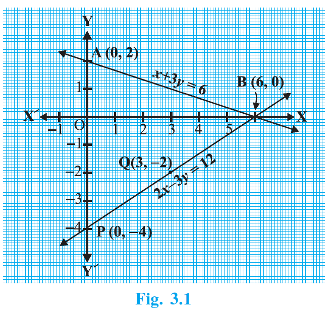
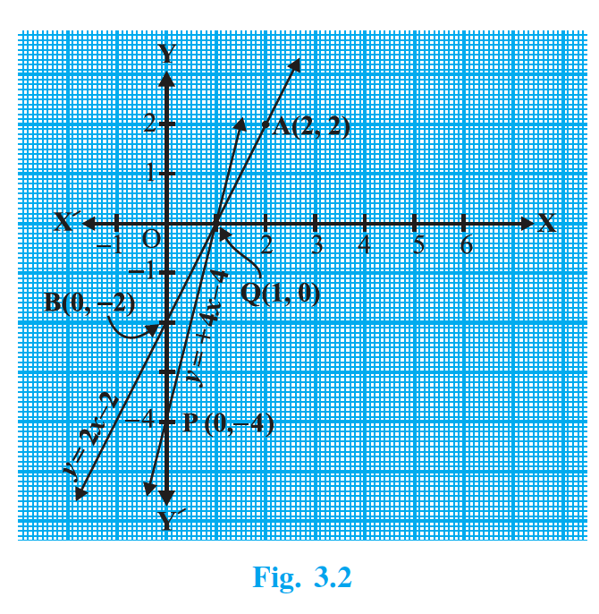

## 3.2 Graphical Method of Solution of a Pair of Linear Equations

A pair of linear equations which has no solution, is called an inconsistent pair of linear equations. A pair of linear equations in two variables, which has a solution, is called a consistent pair of linear equations. A pair of linear equations which are equivalent has infinitely many distinct common solutions. Such a pair is called a dependent pair of linear equations in two variables. Note that a dependent pair of linear equations is always consistent.

> We can now summarise the behaviour of lines representing a pair of linear equations in two variables and the existence of solutions as follows:
>
> (i) the lines may intersect in a single point. In this case, the pair of equations has a unique solution (consistent pair of equations).
>
> (ii) the lines may be parallel. In this case, the equations have no solution (inconsistent pair of equations).
>
> (iii) the lines may be coincident. In this case, the equations have infinitely many solutions [dependent (consistent) pair of equations].
{: .key-points }

Consider the following three pairs of equations.

(i) $x-2y=0$ and $3x+4y-20=0$  (The lines intersect)

(ii) $2x+3y-9=0$ and $4x+6y-18=0$  (The lines coincide)

(iii) $x+2y-4=0$ and $2x+4y-12=0$  (The lines are parallel)

Let us now write down, and compare, the values of $\dfrac{a_1}{a_2}$, $\dfrac{b_1}{b_2}$ and $\dfrac{c_1}{c_2}$ in all the three examples. Here, $a_1$, $b_1$, $c_1$ and $a_2$, $b_2$, $c_2$ denote the coefficents of equations given in the general form.

### Table 3.1

| Sl No. | Pair of lines | $\dfrac{a_1}{a_2}$ | $\dfrac{b_1}{b_2}$ | $\dfrac{c_1}{c_2}$ | Compare the ratios | Graphical representation | Algebraic interpretation |
| ---: | --- | ---: | ---: | ---: | --- | --- | --- |
| 1. | $x-2y=0$; $3x+4y-20=0$ | $\dfrac{1}{3}$ | $\dfrac{-2}{4}$ | $\dfrac{0}{-20}$ | $\dfrac{a_1}{a_2}\ne\dfrac{b_1}{b_2}$ | Intersecting lines | Exactly one solution (unique) |
| 2. | $2x+3y-9=0$; $4x+6y-18=0$ | $\dfrac{2}{4}$ | $\dfrac{3}{6}$ | $\dfrac{-9}{-18}$ | $\dfrac{a_1}{a_2}=\dfrac{b_1}{b_2}=\dfrac{c_1}{c_2}$ | Coincident lines | Infinitely many solutions |
| 3. | $x+2y-4=0$; $2x+4y-12=0$ | $\dfrac{1}{2}$ | $\dfrac{2}{4}$ | $\dfrac{-4}{-12}$ | $\dfrac{a_1}{a_2}=\dfrac{b_1}{b_2}\ne\dfrac{c_1}{c_2}$ | Parallel lines | No solution |

From the table above, you can observe that if the lines represented by the equation $a_1x+b_1y+c_1=0$ and $a_2x+b_2y+c_2=0$ are:

(i) intersecting, then $\dfrac{a_1}{a_2}\ne\dfrac{b_1}{b_2}$.

(ii) coincident, then $\dfrac{a_1}{a_2}=\dfrac{b_1}{b_2}=\dfrac{c_1}{c_2}$.

(iii) parallel, then $\dfrac{a_1}{a_2}=\dfrac{b_1}{b_2}\ne\dfrac{c_1}{c_2}$.

In fact, the converse is also true for any pair of lines. You can verify them by considering some more examples by yourself.

Let us now consider some more examples to illustrate it.

### Example 1

Check graphically whether the pair of equations

(1) $x+3y=6$

and (2) $2x-3y=12$

is consistent. If so, solve them graphically.

### Solution (Example 1)

Let us draw the graphs of the Equations (1) and (2). For this, we find two solutions of each of the equations, which are given in Table 3.2

### Table 3.2

| Equation | $x$ | $y$ |
| --- | ---: | ---: |
| $x+3y=6$ | 0 | 2 |
| | 6 | 0 |
| $2x-3y=12$ | 0 | $-4$ |
| | 3 | $-2$ |

Plot the points $A(0,2)$, $B(6,0)$, $P(0,-4)$ and $Q(3,-2)$ on graph paper, and join the points to form the lines $AB$ and $PQ$ as shown in Fig. 3.1.

{: width="50%" }

We observe that there is a point $B(6,0)$ common to both the lines $AB$ and $PQ$. So, the solution of the pair of linear equations is $x=6$ and $y=0$, i.e., the given pair of equations is consistent.

### Example 2

Graphically, find whether the following pair of equations has no solution, unique solution or infinitely many solutions:

(1) $5x-8y+1=0$

(2) $3x-\dfrac{24}{5}y+\dfrac{3}{5}=0$

### Solution (Example 2)

Multiplying Equation (2) by $\dfrac{5}{3}$, we get

$$
5x-8y+1=0
$$

But, this is the same as Equation (1). Hence the lines represented by Equations (1) and (2) are coincident. Therefore, Equations (1) and (2) have infinitely many solutions.

Plot few points on the graph and verify it yourself.

### Example 3

Champa went to a ‘Sale’ to purchase some pants and skirts. When her friends asked her how many of each she had bought, she answered, “The number of skirts is two less than twice the number of pants purchased. Also, the number of skirts is four less than four times the number of pants purchased”. Help her friends to find how many pants and skirts Champa bought.

### Solution (Example 3)

Let us denote the number of pants by $x$ and the number of skirts by $y$. Then the equations formed are:

(1) $y=2x-2$

and (2) $y=4x-4$

Let us draw the graphs of Equations (1) and (2) by finding two solutions for each of the equations. They are given in Table 3.3.

### Table 3.3

| Equation | $x$ | $y$ |
| --- | ---: | ---: |
| $y=2x-2$ | 2 | 2 |
| | 0 | $-2$ |
| $y=4x-4$ | 0 | $-4$ |
| | 1 | 0 |

{: width="50%" }

Plot the points and draw the lines passing through them to represent the equations, as shown in Fig. 3.2.

The two lines intersect at the point $(1,0)$. So, $x=1$, $y=0$ is the required solution of the pair of linear equations, i.e., the number of pants she purchased is 1 and she did not buy any skirt.

Verify the answer by checking whether it satisfies the conditions of the given problem.
