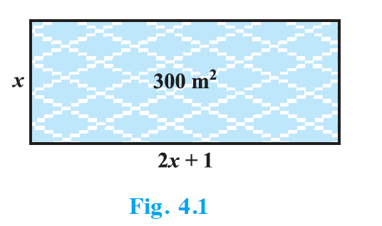

## 4.1 Introduction

In Chapter 2, you have studied different types of polynomials. One type was the quadratic polynomial of the form $ax^2 + bx + c$, $a \neq 0$. When we equate this polynomial to zero, we get a quadratic equation. Quadratic equations come up when we deal with many real-life situations. For instance, suppose a charity trust decides to build a prayer hall having a carpet area of 300 square metres with its length one metre more than twice its breadth. What should be the length and breadth of the hall?

Suppose the breadth of the hall is $x$ metres. Then, its length should be $(2x + 1)$ metres. We can depict this information pictorially as shown in Fig. 4.1.

{: width="40%" }

Now, area of the hall = $(2x + 1) \cdot x \text{ m}^2 = (2x^2 + x) \text{ m}^2$

So, $2x^2 + x = 300$ (Given)

Therefore, $2x^2 + x - 300 = 0$

So, the breadth of the hall should satisfy the equation $2x^2 + x - 300 = 0$ which is a quadratic equation.

Many people believe that Babylonians were the first to solve quadratic equations. For instance, they knew how to find two positive numbers with a given positive sum and a given positive product, and this problem is equivalent to solving a quadratic equation of the form $x^2 - px + q = 0$. Greek mathematician Euclid developed a geometrical approach for finding out lengths which, in our present day terminology, are solutions of quadratic equations. Solving of quadratic equations, in general form, is often credited to ancient Indian mathematicians. In fact, Brahmagupta (C.E. 598–665) gave an explicit formula to solve a quadratic equation of the form $ax^2 + bx = c$. Later, Sridharacharya (C.E. 1025) derived a formula, now known as the quadratic formula, (as quoted by Bhaskara II) for solving a quadratic equation by the method of completing the square. An Arab mathematician Al-Khwarizmi (about C.E. 800) also studied quadratic equations of different types. Abraham bar Hiyya Ha-Nasi, in his book 'Liber embadorum' published in Europe in C.E. 1145 gave complete solutions of different quadratic equations.

In this chapter, you will study quadratic equations, and various ways of finding their roots. You will also see some applications of quadratic equations in daily life situations.
