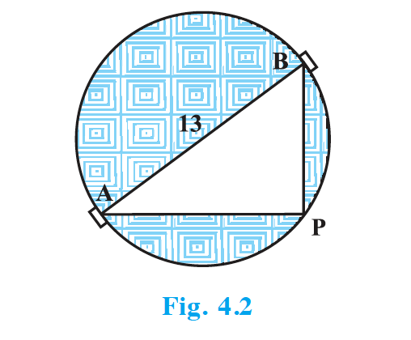

## 4.4 Nature of Roots

The roots of the equation $ax^2 + bx + c = 0$ are given by

$$x = \frac{-b \pm \sqrt{b^2 - 4ac}}{2a}$$

If $b^2 - 4ac > 0$, we get two distinct real roots. If $b^2 - 4ac = 0$, then $x = -\dfrac{b}{2a}$ (both roots equal). So the quadratic equation has **two equal real roots**. If $b^2 - 4ac < 0$, there is no real number whose square is $b^2 - 4ac$, so there are **no real roots**.

Since $b^2 - 4ac$ determines whether the equation has real roots or not, it is called the **discriminant** of the quadratic equation $ax^2 + bx + c = 0$.

A quadratic equation $ax^2 + bx + c = 0$ has: (i) **two distinct real roots** if $b^2 - 4ac > 0$, (ii) **two equal real roots** if $b^2 - 4ac = 0$, (iii) **no real roots** if $b^2 - 4ac < 0$.

### Example 7

Find the discriminant of $2x^2 - 4x + 3 = 0$, and hence find the nature of its roots.

**Solution :** Here $a = 2$, $b = -4$, $c = 3$. Discriminant $b^2 - 4ac = 16 - 24 = -8 < 0$. So the equation has no real roots.

### Example 8

A pole has to be erected on the boundary of a circular park of diameter 13 m such that the difference of its distances from two diametrically opposite gates A and B is 7 m. Is it possible? If yes, at what distances from the two gates?

**Solution :** Let the distance of the pole from gate B be $x$ m. Then AP = $(x + 7)$ m.

{: width="40%" }

Since AB is a diameter, $\angle$ APB = $90^\circ$. By Pythagoras, $(x+7)^2 + x^2 = 13^2$, giving $x^2 + 7x - 60 = 0$. Discriminant $= 49 + 240 = 289 > 0$, so real roots exist. Solving, $x = \dfrac{-7 \pm 17}{2}$, so $x = 5$ or $x = -12$. As $x$ is distance, $x = 5$. So the pole is 5 m from B and 12 m from A.

### Example 9

Find the discriminant of $3x^2 - 2x + \dfrac{1}{3} = 0$ and the nature of its roots. Find the roots if real.

**Solution :** $a = 3$, $b = -2$, $c = \dfrac{1}{3}$. Discriminant $= 4 - 4 = 0$. So two equal real roots. Roots are $-\dfrac{b}{2a} = \dfrac{1}{3}$, $\dfrac{1}{3}$.

