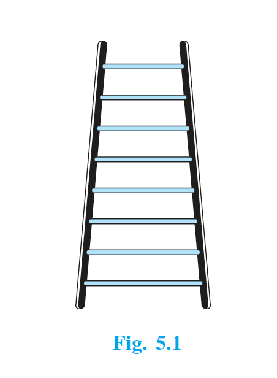
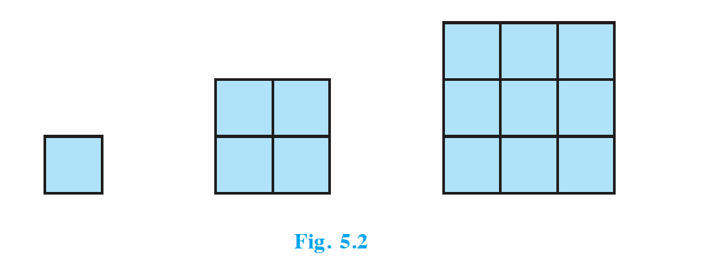
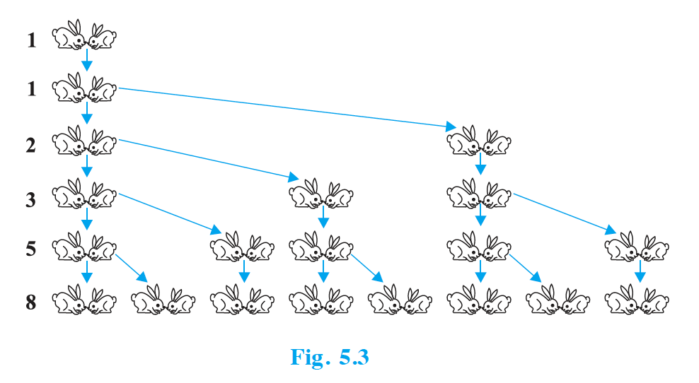

## 5.1 Introduction

You must have observed that in nature, many things follow a certain pattern, such as the petals of a sunflower, the holes of a honeycomb, the grains on a maize cob, the spirals on a pineapple and on a pine cone, etc.

We now look for some patterns which occur in our day-to-day life. Some such examples are :

**(i)** Reena applied for a job and got selected. She has been offered a job with a starting monthly salary of ₹ 8000, with an annual increment of ₹ 500 in her salary. Her salary (in ₹) for the 1st, 2nd, 3rd, . . . years will be, respectively  
8000, 8500, 9000, . . . .

**(ii)** The lengths of the rungs of a ladder decrease uniformly by 2 cm from bottom to top (see Fig. 5.1). The bottom rung is 45 cm in length. The lengths (in cm) of the 1st, 2nd, 3rd, . . ., 8th rung from the bottom to the top are, respectively  
45, 43, 41, 39, 37, 35, 33, 31

{: width="30%" }

**(iii)** In a savings scheme, the amount becomes $\frac{5}{4}$ times of itself after every 3 years. The maturity amount (in ₹) of an investment of ₹ 8000 after 3, 6, 9 and 12 years will be, respectively :  
10000, 12500, 15625, 19531.25

**(iv)** The number of unit squares in squares with side 1, 2, 3, . . . units (see Fig. 5.2) are, respectively  
$1^2$, $2^2$, $3^2$, . . . .

{: width="40%" }

**(v)** Shakila puts ₹ 100 into her daughter's money box when she was one year old and increased the amount by ₹ 50 every year. The amounts of money (in ₹) in the box on the 1st, 2nd, 3rd, 4th, . . . birthday were  
100, 150, 200, 250, . . ., respectively.

**(vi)** A pair of rabbits are too young to produce in their first month. In the second, and every subsequent month, they produce a new pair. Each new pair of rabbits produce a new pair in their second month and in every subsequent month (see Fig. 5.3). Assuming no rabbit dies, the number of pairs of rabbits at the start of the 1st, 2nd, 3rd, . . ., 6th month, respectively are :  
1, 1, 2, 3, 5, 8

{: width="50%" }

In the examples above, we observe some patterns. In some, we find that the succeeding terms are obtained by adding a fixed number, in other by multiplying with a fixed number, in another we find that they are squares of consecutive numbers, and so on.

In this chapter, we shall discuss one of these patterns in which succeeding terms are obtained by adding a fixed number to the preceding terms. We shall also see how to find their nth terms and the sum of $n$ consecutive terms, and use this knowledge in solving some daily life problems.
