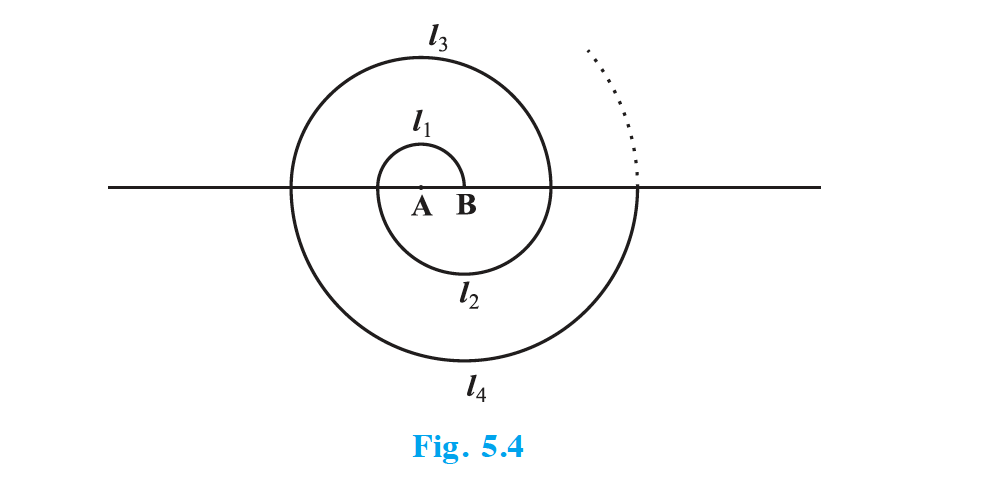
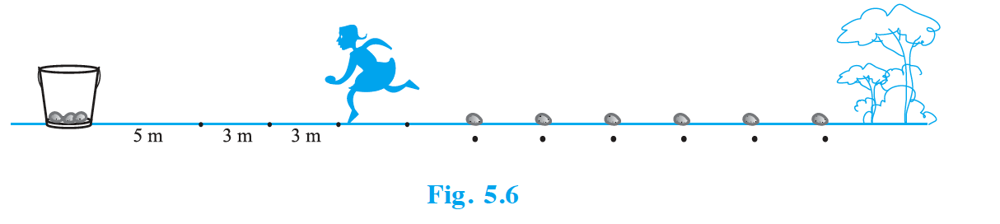
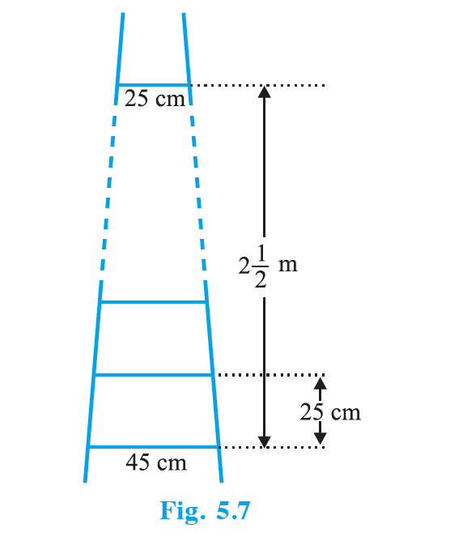
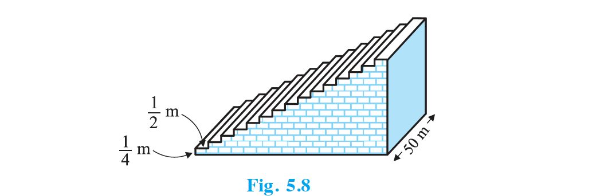

## 5.4 Sum of First n Terms of an AP

Let us consider the situation again given in Section 5.1 in which Shakila put ₹ 100 into her daughter's money box when she was one year old, ₹ 150 on her second birthday, ₹ 200 on her third birthday and will continue in the same way. How much money will be collected in the money box by the time her daughter is 21 years old?

Here, the amount of money (in ₹) put in the money box on her first, second, third, fourth . . . birthday were respectively 100, 150, 200, 250, . . . till her 21st birthday. To find the total amount in the money box on her 21st birthday, we will have to write each of the 21 numbers in the list above and then add them up. Don't you think it would be a tedious and time consuming process? Can we make the process shorter? This would be possible if we can find a method for getting this sum. Let us see.

We consider the problem given to Gauss (about whom you read in Chapter 1), to solve when he was just 10 years old. He was asked to find the sum of the positive integers from 1 to 100. He immediately replied that the sum is 5050. Can you guess how did he do? He wrote :  
$S = 1 + 2 + 3 + \ldots + 99 + 100$  
And then, reversed the numbers to write  
$S = 100 + 99 + \ldots + 3 + 2 + 1$  
Adding these two, he got  
$2S = (100 + 1) + (99 + 2) + \ldots + (3 + 98) + (2 + 99) + (1 + 100) = 101 + 101 + \ldots + 101$ (100 times)  
So $S = \frac{100 × 101}{2} = 5050$, i.e., the sum = 5050.

We will now use the same technique to find the sum of the first $n$ terms of an AP : $a$, $a + d$, $a + 2d$, . . .

The $n$th term of this AP is $a + (n – 1)d$. Let $S$ denote the sum of the first $n$ terms of the AP. We have  
$$S = a + (a + d) + (a + 2d) + \ldots + [a + (n – 1)d] \quad \text{… (1)}$$  
Rewriting the terms in reverse order, we have  
$$S = [a + (n – 1)d] + [a + (n – 2)d] + \ldots + (a + d) + a \quad \text{… (2)}$$  
On adding (1) and (2), term-wise we get  
$2S = [2a + (n – 1)d] + [2a + (n – 1)d] + \ldots + [2a + (n – 1)d]$ ($n$ times)  
i.e., $2S = n[2a + (n – 1)d]$  
So  
$$S = \frac{n}{2}[2a + (n – 1)d].$$  
So, the **sum of the first $n$ terms** of an AP is given by  
$$S = \frac{n}{2}[2a + (n – 1)d].$$  
We can also write this as $S = \frac{n}{2}[a + a + (n – 1)d]$, i.e.,  
$$S = \frac{n}{2}(a + a_n). \quad \text{… (3)}$$  

Now, if there are only $n$ terms in an AP, then $a_n = l$, the last term. From (3),  
$$S = \frac{n}{2}(a + l). \quad \text{… (4)}$$  
This form of the result is useful when the first and the last terms of an AP are given and the common difference is not given.

Now we return to the question that was posed to us in the beginning. The amount of money (in ₹) in the money box of Shakila's daughter on 1st, 2nd, 3rd, 4th birthday, . . ., were 100, 150, 200, 250, . . ., respectively. This is an AP. We have to find the total money collected on her 21st birthday, i.e., the sum of the first 21 terms of this AP. Here $a = 100$, $d = 50$ and $n = 21$. Using the formula $S = \frac{n}{2}[2a + (n – 1)d]$, we have  
$S = \frac{21}{2}[2 × 100 + (21 – 1) × 50] = \frac{21}{2}[200 + 1000] = \frac{21}{2} × 1200 = 12600$.  
So, the amount of money collected on her 21st birthday is ₹ 12600.

We also use $S_n$ in place of $S$ to denote the sum of first $n$ terms of the AP. We write $S_{20}$ to denote the sum of the first 20 terms of an AP. The formula for the sum of the first $n$ terms involves four quantities $S$, $a$, $d$ and $n$. If we know any three of them, we can find the fourth.

**Remark :** The $n$th term of an AP is the difference of the sum to first $n$ terms and the sum to first $(n – 1)$ terms of it, i.e., $a_n = S_n – S_{n–1}$.

Let us consider some examples.

### Example 11

Find the sum of the first 22 terms of the AP : 8, 3, –2, . . .

**Solution :** Here, $a = 8$, $d = 3 – 8 = –5$, $n = 22$. We know that $S = \frac{n}{2}[2a + (n – 1)d]$. Therefore $S = \frac{22}{2}[16 + 21(–5)] = 11(16 – 105) = 11(–89) = –979$. So, the sum of the first 22 terms of the AP is – 979.

### Example 12

If the sum of the first 14 terms of an AP is 1050 and its first term is 10, find the 20th term.

**Solution :** Here, $S_{14} = 1050$, $n = 14$, $a = 10$. As $S_n = \frac{n}{2}[2a + (n – 1)d]$, so $1050 = \frac{14}{2}[20 + 13d] = 140 + 91d$, i.e., 910 = 91d, so $d = 10$. Therefore $a_{20} = 10 + (20 – 1) × 10 = 200$, i.e. 20th term is 200.

### Example 13

How many terms of the AP : 24, 21, 18, . . . must be taken so that their sum is 78?

**Solution :** Here $a = 24$, $d = 21 – 24 = –3$, $S_n = 78$. We need to find $n$. We know that $S_n = \frac{n}{2}[2a + (n – 1)d]$. So $78 = \frac{n}{2}[48 + (n – 1)(–3)] = \frac{n}{2}[51 – 3n]$, or $3n^2 – 51n + 156 = 0$, or $n^2 – 17n + 52 = 0$, or $(n – 4)(n – 13) = 0$, so $n = 4$ or 13. Both values of $n$ are admissible. So, the number of terms is either 4 or 13.

**Remarks :** (1) In this case, the sum of the first 4 terms = the sum of the first 13 terms = 78. (2) Two answers are possible because the sum of the terms from 5th to 13th will be zero. This is because $a$ is positive and $d$ is negative, so that some terms will be positive and some others negative, and will cancel out each other.

### Example 14

Find the sum of : (i) the first 1000 positive integers (ii) the first $n$ positive integers

**Solution :**  
**(i)** Let $S = 1 + 2 + 3 + \ldots + 1000$. Using the formula $S_n = \frac{n}{2}(a + l)$ for the sum of the first $n$ terms of an AP, we have $S_{1000} = \frac{1000}{2}(1 + 1000) = 500 × 1001 = 500500$. So, the sum of the first 1000 positive integers is 500500.

**(ii)** Let $S_n = 1 + 2 + 3 + \ldots + n$. Here $a = 1$ and the last term $l$ is $n$. Therefore $S_n = \frac{n(1 + n)}{2}$ or $S_n = \frac{n(n + 1)}{2}$. So, the sum of first $n$ positive integers is given by  
$$S_n = \frac{n(n + 1)}{2}.$$

### Example 15

Find the sum of first 24 terms of the list of numbers whose $n$th term is given by $a_n = 3 + 2n$.

**Solution :** As $a_n = 3 + 2n$, we get $a_1 = 5$, $a_2 = 7$, $a_3 = 9$, … List of numbers becomes 5, 7, 9, 11, . . . Here $7 – 5 = 9 – 7 = 11 – 9 = 2$, so it forms an AP with $d = 2$. To find $S_{24}$, we have $n = 24$, $a = 5$, $d = 2$. Therefore $S_{24} = \frac{24}{2}[2 × 5 + (24 – 1) × 2] = 12[10 + 46] = 672$. So, sum of first 24 terms of the list of numbers is 672.

### Example 16

A manufacturer of TV sets produced 600 sets in the third year and 700 sets in the seventh year. Assuming that the production increases uniformly by a fixed number every year, find : (i) the production in the 1st year (ii) the production in the 10th year (iii) the total production in first 7 years

**Solution :** (i) Since the production increases uniformly by a fixed number every year, the number of TV sets manufactured in 1st, 2nd, 3rd, . . ., years will form an AP. Let us denote the number of TV sets manufactured in the $n$th year by $a_n$. Then $a_3 = 600$ and $a_7 = 700$. So $a + 2d = 600$ and $a + 6d = 700$. Solving these equations, we get $d = 25$ and $a = 550$. Therefore, production of TV sets in the first year is 550.

(ii) $a_{10} = a + 9d = 550 + 9 × 25 = 775$. So, production of TV sets in the 10th year is 775.

(iii) $S_7 = \frac{7}{2}[2 × 550 + (7 – 1) × 25] = \frac{7}{2}[1100 + 150] = 4375$. Thus, the total production of TV sets in first 7 years is 4375.

---

## EXERCISE 5.3 {#exercise-53}

1. Find the sum of the following APs:
   - **(i)** 2, 7, 12, . . ., to 10 terms
   - **(ii)** –37, –33, –29, . . ., to 12 terms
   - **(iii)** 0.6, 1.7, 2.8, . . ., to 100 terms
   - **(iv)** $\frac{1}{15},\; \frac{1}{12},\; \frac{1}{10},\; \ldots$, to 11 terms

2. Find the sums given below :
   - **(i)** $7 + 10\frac{1}{2} + 14 + \ldots + 84$
   - **(ii)** 34 + 32 + 30 + . . . + 10
   - **(iii)** –5 + (–8) + (–11) + . . . + (–230)

3. In an AP:
   - **(i)** given $a = 5$, $d = 3$, $a_n = 50$, find $n$ and $S_n$
   - **(ii)** given $a = 7$, $a_{13} = 35$, find $d$ and $S_{13}$
   - **(iii)** given $a_{12} = 37$, $d = 3$, find $a$ and $S_{12}$
   - **(iv)** given $a_3 = 15$, $S_{10} = 125$, find $d$ and $a_{10}$
   - **(v)** given $d = 5$, $S_9 = 75$, find $a$ and $a_9$
   - **(vi)** given $a = 2$, $d = 8$, $S_n = 90$, find $n$ and $a_n$
   - **(vii)** given $a = 8$, $a_n = 62$, $S_n = 210$, find $n$ and $d$
   - **(viii)** given $a_n = 4$, $d = 2$, $S_n = –14$, find $n$ and $a$
   - **(ix)** given $a = 3$, $n = 8$, $S = 192$, find $d$
   - **(x)** given $l = 28$, $S = 144$, and there are total 9 terms. Find $a$.

4. How many terms of the AP : 9, 17, 25, . . . must be taken to give a sum of 636?

5. The first term of an AP is 5, the last term is 45 and the sum is 400. Find the number of terms and the common difference.

6. The first and the last terms of an AP are 17 and 350 respectively. If the common difference is 9, how many terms are there and what is their sum?

7. Find the sum of first 22 terms of an AP in which $d = 7$ and 22nd term is 149.

8. Find the sum of first 51 terms of an AP whose second and third terms are 14 and 18 respectively.

9. If the sum of first 7 terms of an AP is 49 and that of 17 terms is 289, find the sum of first $n$ terms.

10. Show that $a_1$, $a_2$, . . ., $a_n$, . . . form an AP where $a_n$ is defined as below. Also find the sum of the first 15 terms in each case.
    - **(i)** $a_n = 3 + 4n$
    - **(ii)** $a_n = 9 – 5n$

11. If the sum of the first $n$ terms of an AP is $4n – n^2$, what is the first term (that is $S_1$)? What is the sum of first two terms? What is the second term? Similarly, find the 3rd, the 10th and the $n$th terms.

12. Find the sum of the first 40 positive integers divisible by 6.

13. Find the sum of the first 15 multiples of 8.

14. Find the sum of the odd numbers between 0 and 50.

15. A contract on construction job specifies a penalty for delay of completion beyond a certain date as follows: ₹ 200 for the first day, ₹ 250 for the second day, ₹ 300 for the third day, etc., the penalty for each succeeding day being ₹ 50 more than for the preceding day. How much money the contractor has to pay as penalty, if he has delayed the work by 30 days?

16. A sum of ₹ 700 is to be used to give seven cash prizes to students of a school for their overall academic performance. If each prize is ₹ 20 less than its preceding prize, find the value of each of the prizes.

17. In a school, students thought of planting trees in and around the school to reduce air pollution. It was decided that the number of trees, that each section of each class will plant, will be the same as the class, in which they are studying, e.g., a section of Class I will plant 1 tree, a section of Class II will plant 2 trees and so on till Class XII. There are three sections of each class. How many trees will be planted by the students?

18. A spiral is made up of successive semicircles, with centres alternately at A and B, starting with centre at A, of radii 0.5 cm, 1.0 cm, 1.5 cm, 2.0 cm, . . . as shown in Fig. 5.4. What is the total length of such a spiral made up of thirteen consecutive semicircles? (Take $\pi = \frac{22}{7}$)

{: width="58%" }

*[Hint : Length of successive semicircles is $l_1$, $l_2$, $l_3$, $l_4$, . . . with centres at A, B, A, B, . . ., respectively.]*

**19.** 200 logs are stacked in the following manner: 20 logs in the bottom row, 19 in the next row, 18 in the row next to it and so on (see Fig. 5.5). In how many rows are the 200 logs placed and how many logs are in the top row?

{: width="58%" }

**20.** In a potato race, a bucket is placed at the starting point, which is 5 m from the first potato, and the other potatoes are placed 3 m apart in a straight line. There are ten potatoes in the line (see Fig. 5.6).

{: width="58%" }

A competitor starts from the bucket, picks up the nearest potato, runs back with it, drops it in the bucket, runs back to pick up the next potato, runs to the bucket to drop it in, and she continues in the same way until all the potatoes are in the bucket. What is the total distance the competitor has to run?

*[Hint : To pick up the first potato and the second potato, the total distance (in metres) run by a competitor is $2 × 5 + 2 × (5 + 3)$]*

---

## EXERCISE 5.4 (Optional) {#exercise-54-optional}

*These exercises are not from the examination point of view.*

1. Which term of the AP : 121, 117, 113, . . ., is its first negative term?  
   *[Hint : Find $n$ for $a_n < 0$]*

2. The sum of the third and the seventh terms of an AP is 6 and their product is 8. Find the sum of first sixteen terms of the AP.

3. A ladder has rungs 25 cm apart (see Fig. 5.7). The rungs decrease uniformly in length from 45 cm at the bottom to 25 cm at the top. If the top and the bottom rungs are $2\frac{1}{2}$ m apart, what is the length of the wood required for the rungs?

{: width="58%" }

*[Hint : Number of rungs = $\frac{250}{25} + 1$]*

4. The houses of a row are numbered consecutively from 1 to 49. Show that there is a value of $x$ such that the sum of the numbers of the houses preceding the house numbered $x$ is equal to the sum of the numbers of the houses following it. Find this value of $x$.  
   *[Hint : $S_{x–1} = S_{49} – S_x$]*

5. A small terrace at a football ground comprises of 15 steps each of which is 50 m long and built of solid concrete. Each step has a rise of $\frac{1}{4}$ m and a tread of $\frac{1}{2}$ m (see Fig. 5.8). Calculate the total volume of concrete required to build the terrace.

{: width="58%" }

*[Hint : Volume of concrete required to build the first step = $\frac{1}{4} × \frac{1}{2} × 50$ m³]*
