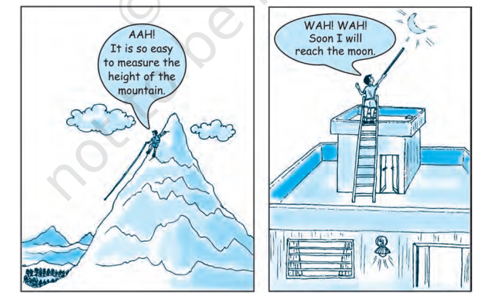
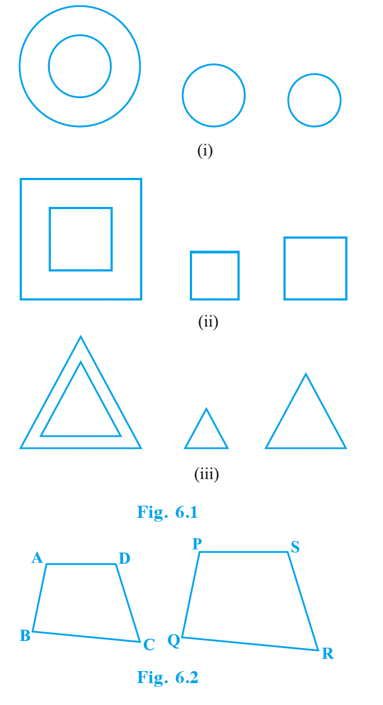
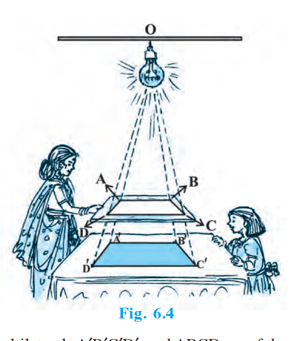
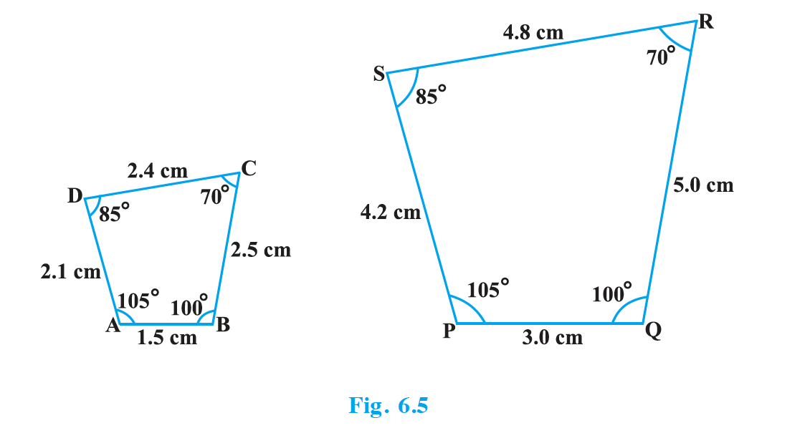
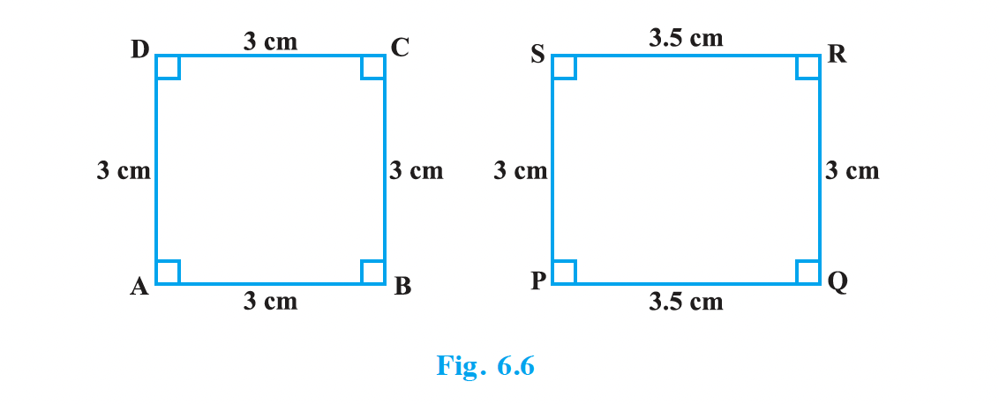
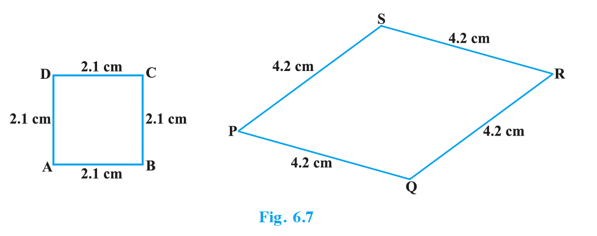
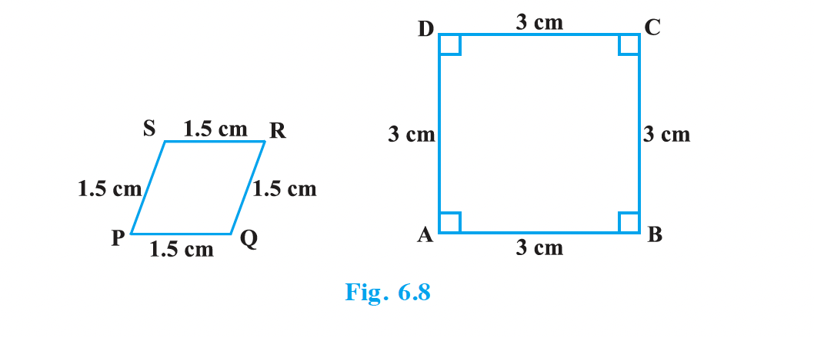

# 6.2 Similar Figures

In Class IX, you have seen that all circles with the same radii are congruent, all squares with the same side lengths are congruent and all equilateral triangles with the same side lengths are congruent.

Two similar figures have the same shape but not necessarily the same size. Therefore, all circles are similar. Similarly, all squares are similar and all equilateral triangles are similar.

From the above, we can say that **all congruent figures are similar but the similar figures need not be congruent**.

Two polygons of the same number of sides are similar, if:
1. their corresponding angles are equal and
2. their corresponding sides are in the same ratio (or proportion).

Note that the same ratio of the corresponding sides is referred to as the **scale factor** (or the Representative Fraction) for the polygons.

In order to understand similarity of figures more clearly, let us perform the following activity:

**Activity 1:** Place a lighted bulb at a point O on the ceiling and directly below it a table in your classroom. Let us cut a polygon, say a quadrilateral ABCD, from a plane cardboard and place this cardboard parallel to the ground between the lighted bulb and the table. Then a shadow of ABCD is cast on the table. Mark the outline of this shadow as A'B'C'D' (see Fig. 6.4).

From the above, you can easily say that quadrilaterals ABCD and PQRS of Fig. 6.5 are similar.

---

## EXERCISE 6.1

1. Fill in the blanks using the correct word given in brackets:

   (i) All circles are \_\_\_\_\_\_\_. (congruent, similar)

   (ii) All squares are \_\_\_\_\_\_\_. (similar, congruent)

   (iii) All \_\_\_\_\_\_\_ triangles are similar. (isosceles, equilateral)

   (iv) Two polygons of the same number of sides are similar, if (a) their corresponding angles are \_\_\_\_\_\_\_ and (b) their corresponding sides are \_\_\_\_\_\_\_. (equal, proportional)

2. Give two different examples of pair of:

   (i) similar figures.

   (ii) non-similar figures.

3. State whether the following quadrilaterals are similar or not:

